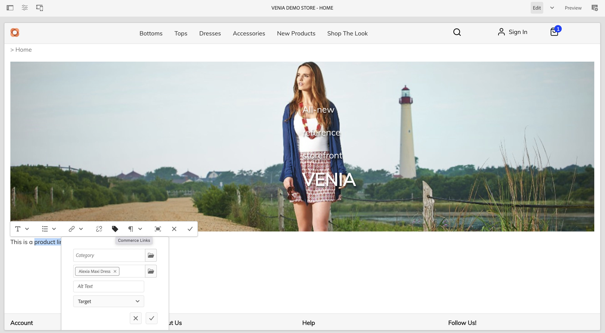
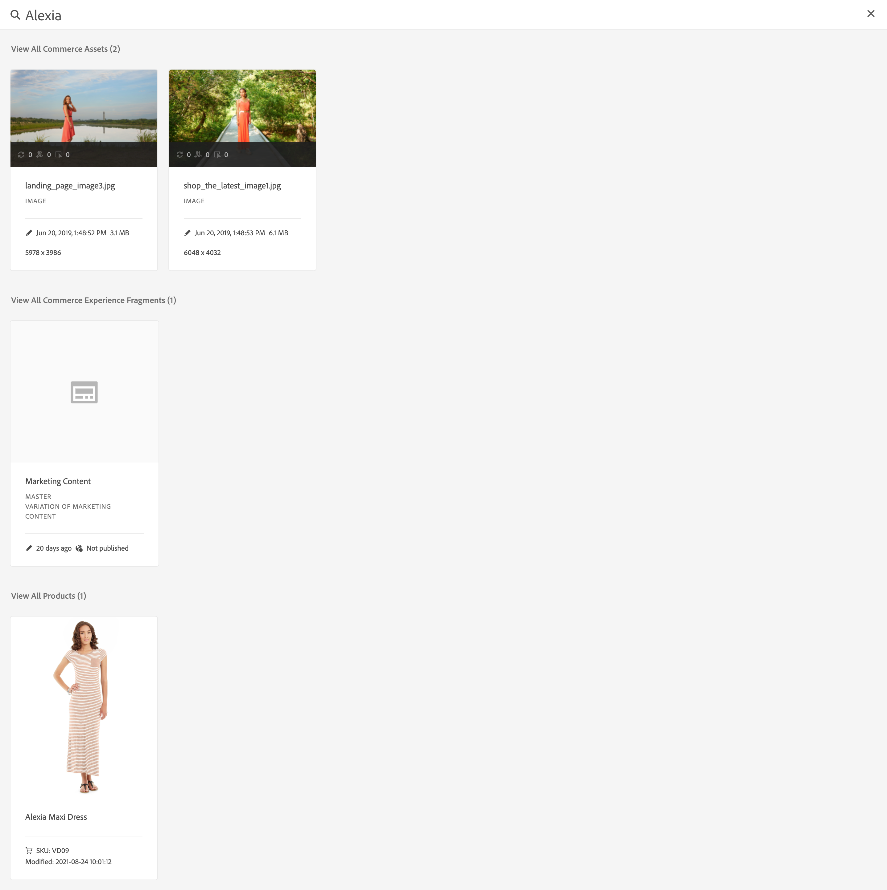

# Criação de experiências de comércio {#authoring-commerce-experiences}

## Visão geral {#overview}

O complemento CIF estende a criação de AEM com recursos específicos de comércio. Isso permite que os autores criem e gerenciem experiências relacionadas ao comércio com eficiência, obtendo acesso aos dados e ao conteúdo do produto sem sair do contexto.

## Seletores {#pickers}

Os seletores de produto e categoria são caixas de diálogo da interface modal que oferecem uma maneira confortável para os autores de AEM encontrarem e selecionarem produtos ou categorias quando necessário. Os Componentes principais, a associação de conteúdo e os modelos de produto são as áreas típicas com configurações que exigem dados do catálogo de produtos. Os seletores são compatíveis com várias opções de configuração, como várias seleções, seleção de variação e pré-seleção de valores.

### Seletor de produtos {#product-picker}

Esse seletor oferece navegação pela estrutura do catálogo ou pesquisa de texto completo para encontrar o produto. Os produtos com variação oferecem um ícone de pasta na coluna &quot;Tipo&quot;. Clicar no ícone de pasta abre as variações do produto selecionado.

Clicar na categoria principal levará o autor de volta ao nível do produto.

**Exemplo de teaser do produto**

A caixa de diálogo de configuração deste componente requer um produto. A CIF usa o SKU como o identificador do produto. Os autores podem inserir o SKU manualmente ou clicar no ícone de pasta para abrir o seletor de produtos. Após selecionar e fechar o seletor, a caixa de diálogo de componentes mostra o nome do produto selecionado

### Seletor de Categoria {#category-picker}

Esse seletor oferece navegação pela estrutura do catálogo para localizar a categoria.

**Exemplo de carrossel de categorias**

A caixa de diálogo de configuração deste componente requer categorias 1 : n. A CIF usa UID/ID como o identificador da categoria. Os autores podem inserir o UID manualmente ou clicar no ícone de pasta para abrir o seletor de categorias. Depois de selecionar e fechar o seletor, a caixa de diálogo de componentes mostra o nome da categoria selecionada.

## Editor universal {#universal-editor}

O Universal Editor é estendido com recursos para acessar os dados do produto em tempo real e o conteúdo do produto associado.

### Acesso aos dados do produto {#access-product-data}

A guia &quot;Ativos&quot; no painel lateral do editor oferece acesso aos dados do produto selecionando o tipo &quot;Produtos&quot;. Os dados são obtidos em tempo real do endpoint de comércio configurado. O filtro é uma pesquisa de texto completo no endpoint de comércio para encontrar produtos específicos.

Analogamente aos ativos, os produtos podem ser colocados em uma página (o que cria um componente de teaser de produto como padrão) ou em componentes (atualmente compatíveis são o teaser de produto e o carrossel de produto).

### Adição de links em campos de texto usando o RTE {#rte}

As páginas do catálogo de produtos da CIF são páginas virtuais que são renderizadas em tempo real. Assim, não é possível incorporar hiperlinks como para páginas AEM comuns. A CIF adiciona uma nova ação &quot;Links de comércio&quot; ao RTE (editor de rich text). Essa ação funciona exatamente como a ação normal de &quot;Hiperlink&quot;, mas permite que os autores selecionem um produto ou categoria usando os seletores.

    >[!NOTE]
    >
    > Se a categoria e o produto forem selecionados, o produto será retirado.

Isso cria um link de espaço reservado que é substituído por um link real quando a página é renderizada.

### Acesso ao conteúdo de produto associado {#associated-content}

Se o Editor universal reconhecer produtos 1:n em uma página, o painel lateral mostrará automaticamente a guia &quot;Conteúdo de comércio associado&quot;. Essa guia permite que os autores acessem rapidamente o conteúdo de AEM que foi marcado com o produto (Consulte [enriquecer os dados do produto com o conteúdo de AEM associado](./enrich-product-associated-content.md) para obter mais informações). Essa guia oferece menus suspensos para filtrar por tipo de conteúdo e produtos específicos se vários produtos estiverem na página. O uso do conteúdo funciona exatamente como o uso do conteúdo da guia &quot;Ativos&quot;.

### Pré-visualizar dados do produto preparados {#staged-data}

O modo Timewarp no editor permite que os autores visualizem e naveguem em uma experiência de AEM com dados de catálogo de produtos preparados com base na data do Timewarp.

Os componentes mostrarão um indicador visual se a data usada for preparada.

## Omnisearch {#omnisearch}

Usar o Omnisearch é uma maneira fácil para os profissionais encontrarem dados de conteúdo e catálogo de produtos do AEM usando a pesquisa de texto completo. O Omnisearch executará uma pesquisa de texto completo no AEM e no back-end de comércio para encontrar objetos de catálogo de produtos no back-end de comércio e conteúdo do AEM. Os resultados do AEM também incluem conteúdo que foi marcado com dados de produto/categoria.

O resultado é agrupado por tipo.

>[!NOTE]
>
> A pesquisa de texto completo no Omnisearch não é compatível com Fragmentos de conteúdo associados. Use SKU ou UID para localizar fragmentos de conteúdo associados.
