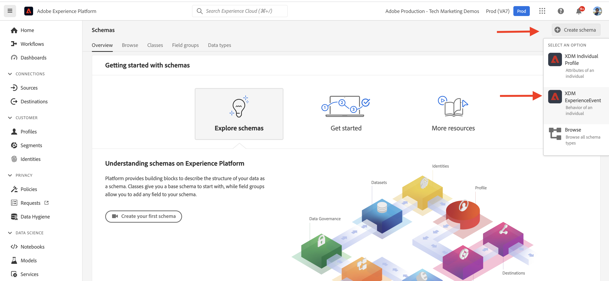
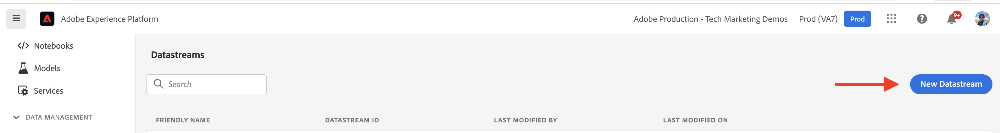

# Componentes principais do AEM-CIF e integração com o Adobe Experience Platform {#aem-cif-aep-integration}

Os componentes principais do [Commerce integration framework (CIF)](https://github.com/adobe/aem-core-cif-components) fornecem integração perfeita com o [Adobe Experience Platform](https://experienceleague.adobe.com/docs/experience-platform/landing/platform-overview.html) para encaminhar eventos de vitrine e seus dados de interações do lado do cliente, como __adicionar ao carrinho__.

O projeto [Componentes principais do AEM CIF](https://github.com/adobe/aem-core-cif-components) fornece uma biblioteca do JavaScript chamada [conector do Adobe Experience Platform para o Adobe Commerce](https://github.com/adobe/aem-core-cif-components/tree/master/extensions/experience-platform-connector) para coletar dados do evento da loja da Commerce. Esses dados do evento são enviados para a Experience Platform, onde são usados em outros produtos da Adobe Experience Cloud, como o Adobe Analytics e o Adobe Target, para criar um perfil de 360 graus que cobre uma jornada do cliente. Conectando os dados do Commerce a outros produtos na Adobe Experience Cloud, você pode executar tarefas como analisar o comportamento do usuário em seu site, executar testes AB e criar campanhas personalizadas.

Saiba mais sobre o conjunto de tecnologias da [Coleção de dados da Experience Platform](https://experienceleague.adobe.com/docs/experience-platform/collection/home.html) que permite coletar dados de experiência do cliente de fontes do lado do cliente.

## Enviar dados do evento `addToCart` para o Experience Platform {#send-addtocart-to-aep}

As etapas a seguir mostram como enviar os dados do evento `addToCart` de páginas de produto renderizadas pela AEM para a Experience Platform usando o Conector CIF - Experience Platform. Usando a extensão do navegador Adobe Experience Platform Debugger, você pode testar e revisar os dados enviados.


## Pré-requisitos {#prerequisites}

Use um ambiente de desenvolvimento local para concluir esta demonstração. Isso inclui uma instância do AEM em execução configurada e conectada a uma instância do Adobe Commerce. Revise os requisitos e as etapas para [configurar o desenvolvimento local com o AEM as a Cloud Service SDK.](/help/commerce-cloud/cif-storefront/develop.md)

Você também precisa de acesso ao [Adobe Experience Platform](https://experienceleague.adobe.com/docs/experience-platform/landing/platform-ui/ui-guide.html) e de permissões para criar o esquema, o conjunto de dados e as sequências de dados para a coleta de dados. Para obter mais informações, consulte [Gerenciamento de permissões.](https://experienceleague.adobe.com/docs/experience-platform/collection/permissions.html)

## Configuração do AEM Commerce as a Cloud Service {#aem-setup}

Para ter um ambiente local de trabalho do __AEM Commerce as a Cloud Service__ com o código e a configuração necessários, conclua as etapas a seguir.

### Configuração local

Siga as etapas da [Configuração Local](/help/commerce-cloud/cif-storefront/develop.md#local-setup) para ter um ambiente de trabalho do AEM Commerce as a Cloud Service.

### Configuração do projeto

Siga as etapas do [Arquétipo de projeto do AEM](/help/commerce-cloud/cif-storefront/develop.md#project) para criar um novo projeto do AEM Commerce (CIF).

>[!TIP]
>
>No exemplo a seguir, o projeto do AEM Commerce é nomeado como: `My Demo Storefront`, entretanto, você pode escolher seu próprio nome de projeto.


Crie e implante o projeto AEM Commerce criado no AEM SDK local executando o seguinte comando no diretório raiz do projeto.

```bash
$ mvn clean install -PautoInstallSinglePackage
```

O site de comércio `My Demo StoreFront` implantado localmente com código e conteúdo padrão é semelhante ao seguinte:


### Instalar dependências do conector Peregrine e CIF-AEP

Para coletar e enviar os dados do evento das páginas de categoria e produto deste site do AEM Commerce, instale os pacotes de chaves `npm` no módulo `ui.frontend` do projeto do AEM Commerce.

Navegue até o módulo `ui.frontend` e instale os pacotes necessários executando os seguintes comandos na linha de comando.

```bash
npm i --save lodash.get@^4.4.2 lodash.set@^4.3.2
npm i --save apollo-cache-persist@^0.1.1
npm i --save redux-thunk@~2.3.0
npm i --save @adobe/apollo-link-mutation-queue@~1.1.0
npm i --save @magento/peregrine@~12.5.0
npm i --save @adobe/aem-core-cif-react-components --force
npm i --save-dev @magento/babel-preset-peregrine@~1.2.1
npm i --save @adobe/aem-core-cif-experience-platform-connector --force
```

>[!IMPORTANT]
>
>O argumento `--force` às vezes é necessário, pois [PWA Studio](https://developer.adobe.com/commerce/pwa-studio/) é restritivo com as dependências pares com suporte. Normalmente, isso não deve causar problemas.


### Configurar Maven para usar o argumento `--force`

Como parte do processo de compilação do Maven, a instalação limpa do npm (usando `npm ci`) é acionada. Isso também requer o argumento `--force`.

Navegue até o arquivo POM raiz do projeto `pom.xml` e localize o bloco de execução `<id>npm ci</id>`. Atualize o bloco para que tenha a seguinte aparência:

```xml
<execution>
    <id>npm ci</id>
    <goals>
    <goal>npm</goal>
    </goals>
    <configuration>
    <arguments>ci --force</arguments>
    </configuration>
</execution>
```

### Alterar formato de configuração do Babel

Alternar do formato de arquivo de configuração relativo de arquivo padrão `.babelrc` para o formato `babel.config.js`. Este é um formato de configuração para todo o projeto e permite que plug-ins e predefinições sejam aplicados ao `node_module` com maior controle.

1. Navegue até o módulo `ui.frontend` e exclua o arquivo `.babelrc` existente.

1. Crie um arquivo `babel.config.js` que use a predefinição `peregrine`.

   ```javascript
   const peregrine = require('@magento/babel-preset-peregrine');
   
   module.exports = (api, opts = {}) => {
       const config = {
           ...peregrine(api, opts),
           sourceType: 'unambiguous'
       } 
   
       config.plugins = config.plugins.filter(plugin => plugin !== 'react-refresh/babel');
   
       return config;
   }
   ```

### Configurar o webpack para usar o Babel

Para transcompilar os arquivos JavaScript usando o carregador Babel (`babel-loader`) e o webpack, edite o arquivo `webpack.common.js`.

Navegue até o módulo `ui.frontend` e atualize o arquivo `webpack.common.js` para que você possa ter a seguinte regra dentro do valor da propriedade `module`:

```javascript
{
    test: /\.jsx?$/,
    exclude: /node_modules\/(?!@magento\/)/,
    loader: 'babel-loader'
}
```

### Configurar cliente Apollo

O [Cliente Apollo](https://www.apollographql.com/docs/react/) é usado para gerenciar dados locais e remotos com o GraphQL. Ele também armazena os resultados de consultas do GraphQL em um cache local normalizado na memória.

Para que [`InMemoryCache`](https://www.apollographql.com/docs/react/caching/cache-configuration/) funcione efetivamente, você precisa de um arquivo `possibleTypes.js`. Para gerar este arquivo, consulte [Gerando possibleTypes automaticamente.](https://www.apollographql.com/docs/react/data/fragments/#generating-possibletypes-automatically)

Além disso, consulte a [implementação de referência do PWA Studio](https://github.com/magento/pwa-studio/blob/1977f38305ff6c0e2b23a9da7beb0b2f69758bed/packages/pwa-buildpack/lib/Utilities/graphQL.js#L106-L120) e um exemplo de um arquivo [`possibleTypes.js`](../assets/aep-integration/possibleTypes.js).

1. Navegue até o módulo `ui.frontend` e salve o arquivo como `./src/main/possibleTypes.js`

1. Atualize a seção `webpack.common.js` do arquivo `DefinePlugin` para que você possa substituir as variáveis estáticas necessárias durante o tempo de compilação.

   ```javascript
   const { DefinePlugin } = require('webpack');
   const { POSSIBLE_TYPES } = require('./src/main/possibleTypes');
   
   ...
   
   plugins: [
       ...
       new DefinePlugin({
           'process.env.USE_STORE_CODE_IN_URL': false,
           POSSIBLE_TYPES
       })
   ]
   ```

### Inicializar os componentes principais do Peregrine e do CIF

Para inicializar os componentes principais do React-based Peregrine e do CIF, crie os arquivos de configuração e JavaScript necessários.

1. Navegue até o módulo `ui.frontend` e crie a seguinte pasta: `src/main/webpack/components/commerce/App`

1. Criar um arquivo `config.js` com o seguinte conteúdo:

   ```javascript
   // get and parse the CIF store configuration from the <head>
   const storeConfigEl = document.querySelector('meta[name="store-config"]');
   const storeConfig = storeConfigEl ? JSON.parse(storeConfigEl.content) : {};
   
   // the following global variables are needed for some of the peregrine features
   window.STORE_VIEW_CODE = storeConfig.storeView || 'default';
   window.AVAILABLE_STORE_VIEWS = [
       {
           code: window.STORE_VIEW_CODE,
           base_currency_code: 'USD',
           default_display_currency_code: 'USD',
           id: 1,
           locale: 'en',
           secure_base_media_url: '',
           store_name: 'My Demo StoreFront'
       }
   ];
   window.STORE_NAME = window.STORE_VIEW_CODE;
   window.DEFAULT_COUNTRY_CODE = 'en';
   
   export default {
       storeView: window.STORE_VIEW_CODE,
       graphqlEndpoint: storeConfig.graphqlEndpoint,
       // Can be GET or POST. When selecting GET, this applies to cache-able GraphQL query requests only.
       // Mutations will always be executed as POST requests.
       graphqlMethod: storeConfig.graphqlMethod,
       headers: storeConfig.headers,
   
       mountingPoints: {
           // TODO: define the application specific mount points as they may be used by <Portal> and <PortalPlacer>
       },
       pagePaths: {
           // TODO: define the application specific paths/urls as they may be used by the components
           baseUrl: storeConfig.storeRootUrl
       },
       eventsCollector: {
           eventForwarding: {
               acds: true,
               aep: false,
           }
       }
   };
   ```

   >[!IMPORTANT]
   >
   >Embora você já esteja familiarizado com o arquivo [`config.js`](https://github.com/adobe/aem-cif-guides-venia/blob/main/ui.frontend/src/main/components/App/config.js) do __AEM Guides - Projeto CIF Venia__, há algumas alterações que você deve fazer nesse arquivo. Primeiro, revise quaisquer comentários de __TODO__. Em seguida, dentro da propriedade `eventsCollector`, localize o objeto `eventsCollector > aep` e atualize as propriedades `orgId` e `datastreamId` para os valores corretos. [Saiba mais.](#add-aep-values-to-aem)

1. Crie um arquivo `App.js` com o conteúdo a seguir. Esse arquivo se parece com um arquivo de ponto de partida típico do aplicativo React e contém ganchos React e personalizados e o uso de Contexto React para facilitar a integração com o Experience Platform.

   ```javascript
   import config from './config';
   
   import React, { useEffect } from 'react';
   import ReactDOM from 'react-dom';
   import { IntlProvider } from 'react-intl';
   import { BrowserRouter as Router } from 'react-router-dom';
   import { combineReducers, createStore } from 'redux';
   import { Provider as ReduxProvider } from 'react-redux';
   import { createHttpLink, ApolloProvider } from '@apollo/client';
   import { ConfigContextProvider, useCustomUrlEvent, useReferrerEvent, usePageEvent, useDataLayerEvents, useAddToCartEvent } from '@adobe/aem-core-cif-react-components';
   import { EventCollectorContextProvider, useEventCollectorContext } from '@adobe/aem-core-cif-experience-platform-connector';
   import { useAdapter } from '@magento/peregrine/lib/talons/Adapter/useAdapter';
   import { customFetchToShrinkQuery } from '@magento/peregrine/lib/Apollo/links';
   import { BrowserPersistence } from '@magento/peregrine/lib/util';
   import { default as PeregrineContextProvider } from '@magento/peregrine/lib/PeregrineContextProvider';
   import { enhancer, reducers } from '@magento/peregrine/lib/store';
   
   const storage = new BrowserPersistence();
   const store = createStore(combineReducers(reducers), enhancer);
   
   storage.setItem('store_view_code', config.storeView);
   
   const App = () => {
       const [{ sdk: mse }] = useEventCollectorContext();
   
       // trigger page-level events
       useCustomUrlEvent({ mse });
       useReferrerEvent({ mse });
       usePageEvent({ mse });
       // listen for add-to-cart events and enable forwarding to the magento storefront events sdk
       useAddToCartEvent(({ mse }));
       // enable CIF specific event forwarding to the Adobe Client Data Layer
       useDataLayerEvents();
   
       useEffect(() => {
           // implement a proper marketing opt-in, for demo purpose you hard-set the consent cookie
           if (document.cookie.indexOf('mg_dnt') < 0) {
               document.cookie += '; mg_dnt=track';
           }
       }, []);
   
       // TODO: use the App to create Portals and PortalPlaceholders to mount the CIF / Peregrine components to the server side rendered markup
       return <></>;
   };
   
   const AppContext = ({ children }) => {
       const { storeView, graphqlEndpoint, graphqlMethod = 'POST', headers = {}, eventsCollector } = config;
       const { apolloProps } = useAdapter({
           apiUrl: new URL(graphqlEndpoint, window.location.origin).toString(),
           configureLinks: (links, apiBase) =>
               // reconfigure the HTTP link to use the configured graphqlEndpoint, graphqlMethod and storeView header
   
               links.set('HTTP', createHttpLink({
                   fetch: customFetchToShrinkQuery,
                   useGETForQueries: graphqlMethod !== 'POST',
                   uri: apiBase,
                   headers: { ...headers, 'Store': storeView }
               }))
       });
   
       return (
           <ApolloProvider {...apolloProps}>
               <IntlProvider locale='en' messages={{}}>
                   <ConfigContextProvider config={config}>
                       <ReduxProvider store={store}>
                           <PeregrineContextProvider>
                               <EventCollectorContextProvider {...eventsCollector}>
                                   {children}
                               </EventCollectorContextProvider>
                           </PeregrineContextProvider>
                       </ReduxProvider>
                   </ConfigContextProvider>
               </IntlProvider>
           </ApolloProvider>
       );
   };
   
   window.onload = async () => {
       const root = document.createElement('div');
       document.body.appendChild(root);
   
       ReactDOM.render(
           <Router>
               <AppContext>
                   <App />
               </AppContext>
           </Router>,
           root
       );
   };
   ```

   O `EventCollectorContext` exporta o Contexto do React que:

   - carrega a biblioteca commerce-events-sdk e commerce-events-collector,
   - inicializa com uma determinada configuração para o Experience Platform e/ou ACDS
   - assina todos os eventos de Peregrine e os encaminha para a SDK de eventos

   Você pode revisar os detalhes de implementação de `EventCollectorContext`. Consulte [aem-core-CIF-components no GitHub.](https://github.com/adobe/aem-core-cif-components/blob/3d4e44d81fff2f398fd2376d24f7b7019f20b31b/extensions/experience-platform-connector/src/events-collector/EventCollectorContext.js)

### Criar e implantar o projeto do AEM atualizado {#build-and-deploy}

Para garantir que as alterações de instalação, código e configuração do pacote acima estejam corretas, recrie e implante o projeto atualizado do AEM Commerce usando o seguinte comando Maven: `$ mvn clean install -PautoInstallSinglePackage`.

## Configuração do Experience Platform {#aep-setup}

Para receber e armazenar os dados do evento provenientes das páginas do Commerce do AEM, como categoria e produto, conclua as seguintes etapas:

>[!AVAILABILITY]
>
>Verifique se você faz parte dos __Perfis de produto__ corretos em __Adobe Experience Platform__ e __Coleção de dados da Adobe Experience Platform__. Se necessário, peça ao administrador do sistema para criar, atualizar ou atribuir __Perfis de Produto__ no [Admin Console.](https://adminconsole.adobe.com/)

### Criar esquema com o grupo de campos Commerce {#create-schema}

Para definir a estrutura para dados de evento de comércio, você deve criar um esquema do Experience Data Model (XDM). Um esquema é um conjunto de regras que representam e validam a estrutura e o formato dos dados.

1. No navegador, navegue até a página inicial do produto __Adobe Experience Platform__. Por exemplo, <https://experience.adobe.com/#/@YOUR-ORG-NAME/sname:prod/platform/home>.

1. Localize o menu __Esquemas__ na seção de navegação esquerda, clique no botão __Criar Esquema__ na seção superior direita e selecione __XDM ExperienceEvent__.

   

1. Nomeie seu esquema usando o campo __Propriedades do esquema > Nome de exibição__ e adicione grupos de campos usando o botão __Composição > Grupos de campos > Adicionar__.

   

1. Na caixa de diálogo __Adicionar grupos de campos__, procure `Commerce`, marque a caixa de seleção __Detalhes do Commerce__ e clique em __Adicionar grupos de campos__.

   


>[!TIP]
>
>Consulte as [Noções básicas sobre a composição de esquema](https://experienceleague.adobe.com/docs/experience-platform/xdm/schema/composition.html) para obter mais informações.

### Criar conjunto de dados {#create-dataset}

Para armazenar os dados do evento, você deve criar um Conjunto de dados que esteja em conformidade com a definição do esquema. Um conjunto de dados é uma construção de armazenamento e gerenciamento para uma coleção de dados — normalmente uma tabela — que contém um esquema (colunas) e campos (linhas).

1. No navegador, navegue até a página inicial do produto __Adobe Experience Platform__. Por exemplo, <https://experience.adobe.com/#/@YOUR-ORG-NAME/sname:prod/platform/home>.

1. Localize o menu __Conjuntos de dados__ na seção de navegação esquerda e clique no botão __Criar conjunto de dados__ na seção superior direita.

   

1. Na nova página, selecione __Criar conjunto de dados do cartão de esquema__.

   

   Na nova página, __pesquise e selecione__ o esquema criado na etapa anterior e clique no botão __Avançar__.

   

1. Nomeie seu Conjunto de Dados usando o campo __Configurar conjunto de dados > Nome__ e clique no botão __Concluir__.

   

>[!TIP]
>
>Consulte a [Visão geral dos conjuntos de dados](https://experienceleague.adobe.com/docs/experience-platform/catalog/datasets/overview.html) para obter mais informações.


### Criar sequência de dados {#create-datastream}

Conclua as etapas a seguir para criar uma sequência de dados na Experience Platform.

1. No navegador, navegue até a página inicial do produto __Adobe Experience Platform__. Por exemplo, <https://experience.adobe.com/#/@YOUR-ORG-NAME/sname:prod/platform/home>.

1. Localize o menu __Datastreams__ na seção de navegação esquerda e clique no botão __Novo Datastream__ na seção superior direita.

   

1. Nomeie sua Sequência de Dados usando o campo obrigatório __Nome__. No campo __Esquema de evento__, selecione o esquema criado e clique em __Salvar__.

    da AEP

1. Abra a Sequência de Dados criada e clique em __Adicionar Serviço__.

   

1. No campo __Serviço__, selecione a opção __Adobe Experience Platform__. No campo __Conjunto de Dados do Evento__, selecione o nome do conjunto de dados na etapa anterior e clique em __Salvar__.

   

>[!TIP]
>
>Consulte a [Visão geral da sequência de dados](https://experienceleague.adobe.com/docs/experience-platform/datastreams/overview.html) para obter mais informações.

## Adicionar valor de sequência de dados à configuração do AEM Commerce {#add-aep-values-to-aem}

Após concluir a configuração do Experience Platform acima, você deve ter `datastreamId` no painel esquerdo dos detalhes da sequência de dados e `orgId` no canto superior direito do modal __Imagem de perfil > Informações da conta > Informações do usuário__.


1. No módulo `ui.frontend` do projeto AEM Commerce, atualize o arquivo `config.js` e especificamente as propriedades do objeto `eventsCollector > aep`.

1. Criar e implantar o projeto atualizado do AEM Commerce


## Acione o evento `addToCart` e verifique a coleta de dados {#event-trigger-verify}

As etapas acima concluem a configuração do AEM Commerce e do Experience Platform. Agora você pode acionar um evento `addToCart` e verificar a coleta de dados usando a extensão do Google Chrome _Inspetor do Snowplow_ e a opção __Métricas e gráficos__ do conjunto de dados na interface do usuário do produto.

Para acionar o evento, você pode usar o autor do AEM ou o serviço de publicação da configuração local. Neste exemplo, use o AEM author para fazer logon em sua conta.

1. Na página Sites, selecione a página __My Demo StoreFront > br > en__ e clique em __Editar__ na barra de ações superior.

1. Na barra de ações superior, clique em __Exibir como Publicado__ e, em seguida, clique em qualquer categoria preferencial na navegação da loja.

1. Clique em qualquer cartão de produto preferencial na __Página de Produto__ e selecione __cor, tamanho__ para habilitar o botão __Adicionar ao Carrinho__.

1. Abra a extensão __Inspetor do Snowplow__ no painel de extensão do navegador e selecione __Experience Platform Wed SDK__ no painel esquerdo.

1. Retorne à __Página do Produto__ e clique no botão __Adicionar ao Carrinho__. Isso envia dados para a Experience Platform. A extensão __Adobe Experience Platform Debugger__ mostra os detalhes do evento.

   

1. Na interface do usuário do produto Experience Platform, navegue até __Conjuntos de dados > My Demo StoreFront__, na guia __Atividade do conjunto de dados__. Se __Métricas e gráficos__ estiverem habilitados, as estatísticas de dados de evento serão exibidas.

   

## Detalhes da implementação {#implementation-details}

O [CIF Experience Platform Connector](https://github.com/adobe/aem-core-cif-components/tree/master/extensions/experience-platform-connector) foi criado sobre a [Conexão de Dados para o Adobe Commerce](https://commercemarketplace.adobe.com/magento-experience-platform-connector.html), que faz parte do projeto [PWA Studio](https://developer.adobe.com/commerce/pwa-studio/).

O projeto do PWA Studio permite criar vitrines do Progressive Web Application (PWA) alimentadas pela Adobe Commerce ou Magento Open Source. O projeto também contém uma biblioteca de componentes chamada [Peregrin](https://developer.adobe.com/commerce/pwa-studio/api/peregrine/) para adicionar lógica aos componentes visuais. A [biblioteca Peregrin](https://developer.adobe.com/commerce/pwa-studio/api/peregrine/) também fornece os ganchos React personalizados usados pelo [CIF Experience Platform Connector](https://github.com/adobe/aem-core-cif-components/tree/master/extensions/experience-platform-connector) para integrar-se perfeitamente ao Experience Platform.

## Eventos suportados {#supported-events}

A partir de agora, os seguintes eventos serão compatíveis:

__Experiência de Eventos XDM :__

1. Adicionar ao carrinho (AEM)
1. Página Exibir (AEM)
1. Exibir produto (AEM)
1. Solicitação de pesquisa enviada (AEM)
1. Resposta de pesquisa recebida (AEM)

Quando [Componentes Peregrine](https://developer.adobe.com/commerce/pwa-studio/guides/packages/peregrine/) são reutilizados no projeto do AEM Commerce:

__Experiência de Eventos XDM :__

1. Remover do carrinho
1. Abrir carrinho
1. Exibir carrinho
1. Compra instantânea
1. Iniciar check-out
1. Concluir check-out

__Eventos XDM de Perfil :__

1. Fazer logon
1. Criar conta
1. Editar conta

## Recursos adicionais {#additional-resources}

Para obter mais informações, consulte os seguintes recursos:

- [PWA Studio](https://developer.adobe.com/commerce/pwa-studio/)
- [[!DNL Data Connection] visão geral](https://experienceleague.adobe.com/docs/commerce-merchant-services/data-connection/overview.html)
- [[!DNL Data Connection] Eventos](https://experienceleague.adobe.com/docs/commerce-merchant-services/data-connection/event-forwarding/events.html)
- [visão geral do Adobe Experience Platform](https://experienceleague.adobe.com/docs/experience-platform/landing/home.html)
