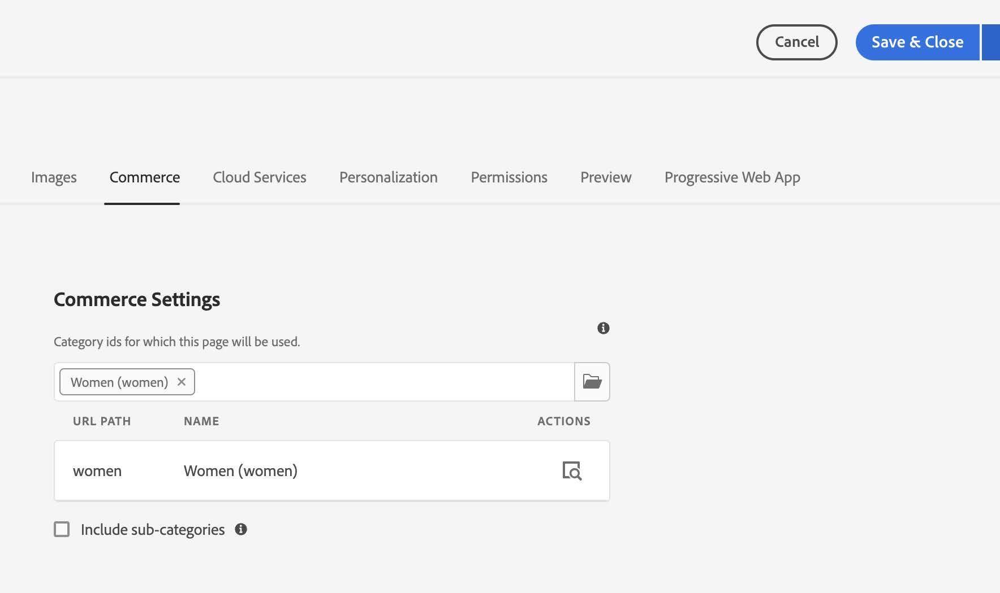

# Componente do CIF [!DNL Live Search] {#live-search-cif-component}

O Live Search for Adobe Commerce oferece uma experiência de pesquisa rápida, relevante e intuitiva sem custo adicional. O Live Search viabilizado pela IA do Adobe usa inteligência artificial e algoritmos de aprendizado de máquina para executar uma análise profunda dos dados agregados do visitante. Esses dados, quando combinados com seu catálogo do Adobe Commerce, resultam em experiências de compra relevantes e personalizadas.

Este tópico descreve como usar um componente CIF do AEM para implementar o widget PLP (Página de listagem de produtos) do [!DNL Live Search] no seu site do AEM.

## Pré-requisitos {#prerequisites}

Este tópico supõe que você tenha um [ambiente do AEM](https://experienceleague.adobe.com/docs/experience-manager-learn/foundation/development/set-up-a-local-aem-development-environment.html?lang=pt-BR) local configurado.

O componente PLP requer que o [[!DNL Live Search] componente Popover CIF](/help/commerce-cloud/cif-storefront/integrating/live-search-popover.md) seja instalado. O widget PLP requer uma variável de sessão do navegador gerada pelo popover.

## Atualizar compositor {#update-composer}

Adicionar módulos de evento a `ui.frontend/package.json`.

Na linha 27, altere:

```json
...
  },

  "devDependencies": {

    "@babel/core": "^7.3.4",
...
```

para:

```json
...
  },
  "type": "module",
  "devDependencies": {
    "@adobe/magento-storefront-event-collector": "^1.5.4",
    "@adobe/magento-storefront-events-sdk": "^1.5.4",
    "@babel/core": "^7.3.4",
...
```

## Alterações nos arquivos {#files-changes}

Vários arquivos devem ser atualizados para habilitar a funcionalidade [!DNL Live Search]. Edite os arquivos a seguir. Os números de linha podem ser um pouco diferentes dos mostrados aqui.

* `ui.apps/src/main/content/jcr_root/apps/venia/clientlibs/clientlib-cif/.content.xml`

  Acrescentar `core.cif.productlist.v1` à linha `embed`.

  ```text
  embed="[core.cif.components.common,core.cif.components.product.v3,core.cif.components.productcarousel.v1,core.cif.components.productcollection.v2,core.cif.components.productteaser.v1,core.cif.components.searchbar.v2,core.cif.components.header.v1,core.cif.components.carousel.v1,core.cif.components.categorycarousel.v1,core.cif.components.featuredcategorylist.v1,core.cif.components.storefront-events.v1,core.cif.components.extensions.product-recs.storefront-events-collector.v1,core.wcm.components.commons.site.link,core.cif.productlist.v1]"
  ```

* `ui.apps/src/main/content/jcr_root/apps/venia/components/commerce/productlist/clientlibs/.content.xml`

  Criar um arquivo `.content.xml`:

  ```xml
  <?xml version="1.0" encoding="UTF-8"?>
  <jcr:root xmlns:cq="http://www.day.com/jcr/cq/1.0" xmlns:jcr="http://www.jcp.org/jcr/1.0"
    jcr:primaryType="cq:ClientLibraryFolder"
    allowProxy="{Boolean}true"
    categories="[core.cif.productlist.v1]"
    jsProcessor="[default:none,min:none]"/>
  ```

* `ui.apps/src/main/content/jcr_root/apps/venia/components/commerce/productlist/clientlibs/css.txt`

  Criar o arquivo `css.txt`:

  ```text
  #base=css
  
  productlist.css
  ```

* `ui.apps/src/main/content/jcr_root/apps/venia/components/commerce/productlist/clientlibs/css/productlist.css`

  Criar o arquivo `productlist.css`

  ```css
    /* #search-plp-root */
  
  html {
    font-size: 62.5% !important;
  }
  
  body {
    font-size: 1.6rem;
  }
  
  .root.container {
    max-width: inherit;
  }
  
  .container {
    margin-left: auto;
    margin-right: auto;
  }
  
  div.ds-sdk-sort-dropdown {
    z-index: 9;
  }
  ```

* `ui.apps/src/main/content/jcr_root/apps/venia/components/commerce/productlist/clientlibs/js.txt`

  Criar o arquivo `js.txt`:

  ```text
  js/productlist.js
  ```

* `ui.apps/src/main/content/jcr_root/apps/venia/components/commerce/productlist/clientlibs/js/productlist.js`

  Criar o arquivo `productlist.js`:

  ```javascript
  /*~~~~~~~~~~~~~~~~~~~~~~~~~~~~~~~~~~~~~~~~~~~~~~~~~~~~~~~~~~~~~~~~~~~~~~~~~~~~~~
  ~ Copyright 2023 Adobe
  ~
  ~ Licensed under the Apache License, Version 2.0 (the "License");
  ~ you may not use this file except in compliance with the License.
  ~ You may obtain a copy of the License at
  ~
  ~     http://www.apache.org/licenses/LICENSE-2.0
  ~
  ~ Unless required by applicable law or agreed to in writing, software
  ~ distributed under the License is distributed on an "AS IS" BASIS,
  ~ WITHOUT WARRANTIES OR CONDITIONS OF ANY KIND, either express or implied.
  ~ See the License for the specific language governing permissions and
  ~ limitations under the License.
  ~~~~~~~~~~~~~~~~~~~~~~~~~~~~~~~~~~~~~~~~~~~~~~~~~~~~~~~~~~~~~~~~~~~~~~~~~~~~~*/
  "use strict";
  
  class ProductList {
    constructor() {
      const stateObject = {
        categoryName: null,
        currentCategoryUrlPath: null,
      };
      this._state = stateObject;
      this._init();
    }
  
    _init() {
      this._initWidgetPLP();
    }
  
    _injectStoreScript(src) {
      const script = document.createElement("script");
      script.type = "text/javascript";
      script.src = src;
  
      document.head.appendChild(script);
    }
  
    async _getStoreData() {
      // get from session storage
      const sessionData = sessionStorage.getItem(
        "WIDGET_STOREFRONT_INSTANCE_CONTEXT"
      );
      // WIDGET_STOREFRONT_INSTANCE_CONTEXT is set from searchbar/clientlibs/js/searchbar.js
      // if not, we will need to retrieve from graphql separately here.
  
      if (sessionData) {
        this._state.dataServicesSessionContext = JSON.parse(sessionData);
        return;
      }
    }
  
    getStoreConfigMetadata() {
      const storeConfig = JSON.parse(
        document
          .querySelector("meta[name='store-config']")
          .getAttribute("content")
      );
  
      const { storeRootUrl } = storeConfig;
      const redirectUrl = storeRootUrl.split(".html")[0];
      return { storeConfig, redirectUrl };
    }
  
    async _initWidgetPLP() {
      if (!window.LiveSearchPLP) {
        const liveSearchPlpSrc =
          "https://plp-widgets-ui.magento-ds.com/v1/search.js";
        this._injectStoreScript(liveSearchPlpSrc);
        // wait until script is loaded
        await new Promise((resolve) => {
          const interval = setInterval(() => {
            if (window.LiveSearchPLP && window.LiveSearchAutocomplete) {
              // Widget expects LiveSearchAutocomplete already loaded to rely on data-service-graphql
              clearInterval(interval);
              resolve();
            }
          }, 200);
        });
      }
      await this._getStoreData();
      const { dataServicesSessionContext } = this._state;
      if (!dataServicesSessionContext) {
        console.log("no dataServicesSessionContext");
        return;
      }
  
      const root = document.getElementById("search-plp-root");
      if (!root) {
        console.log("plp root not found.");
        return;
      }
      // get dataset from root
      const categoryUrlPath = root.getAttribute("data-plp-urlPath") || "";
      const categoryName = root.getAttribute("data-plp-title") || "";
      const storeDetails = {
        environmentId: dataServicesSessionContext.environment_id,
        environmentType: dataServicesSessionContext.environment,
        apiKey: dataServicesSessionContext.api_key,
        websiteCode: dataServicesSessionContext.website_code,
        storeCode: dataServicesSessionContext.store_code,
        storeViewCode: dataServicesSessionContext.store_view_code,
        config: {
          pageSize: dataServicesSessionContext.page_size,
          perPageConfig: {
            pageSizeOptions: dataServicesSessionContext.page_size_options,
            defaultPageSizeOption:
              dataServicesSessionContext.default_page_size_option,
          },
          minQueryLength: dataServicesSessionContext.min_query_length,
          currencySymbol: dataServicesSessionContext.currency_symbol,
          currencyRate: dataServicesSessionContext.currency_rate,
          displayOutOfStock: dataServicesSessionContext.display_out_of_stock,
          allowAllProducts: dataServicesSessionContext.allow_all_products,
          locale: dataServicesSessionContext.locale,
          currentCategoryUrlPath: categoryUrlPath,
          categoryName,
          displayMode: "", // "" for plp || "PAGE" for category/catalog
        },
        context: {
          customerGroup: dataServicesSessionContext.customer_group,
        },
        route: ({ sku }) => {
          return `${
            this.getStoreConfigMetadata().redirectUrl
          }.cifproductredirect.html/${sku}`;
        },
        searchQuery: "search_query",
      };
      setTimeout(() => {
        console.log("init PLP");
        window.LiveSearchPLP({ storeDetails, root });
      }, 0);
    }
  }
  
  (function () {
    function onDocumentReady() {
      new ProductList({});
    }
  
    if (document.readyState !== "loading") {
      onDocumentReady();
    } else {
      document.addEventListener("DOMContentLoaded", onDocumentReady);
    }
  })();
  ```

* `ui.apps/src/main/content/jcr_root/apps/venia/components/commerce/productlist/productlist.html`

  Criar arquivo `productlist.html`:

  ```html
  <div
  data-sly-use.productList="com.adobe.cq.commerce.core.components.models.productlist.ProductList"
  id="search-plp-root"
  class="productlist__root"
  data-plp-urlPath="${productList.storefrontContext.urlPath}"
  data-plp-title="${productList.title}">
  </div>
  ```

* `ui.apps/src/main/content/jcr_root/apps/venia/components/commerce/searchresults/.content.xml`

  Editar `.content.xml` na Linha 6:

  ```xml
  sling:resourceSuperType="venia/components/commerce/productlist"
  ```

* `ui.content/src/main/content/jcr_root/content/venia/language-masters/en/search/.content.xml`

  Editar `.content.xml` na linha 21-22:

  ```xml
  sling:resourceType="venia/components/commerce/productlist"
  ```

* `ui.content/src/main/content/jcr_root/content/venia/us/en/search/.content.xml`

  Editar `.content.xml` na Linha 26:

  ```xml
  sling:resourceType="venia/components/commerce/productlist"
  ```

* `ui.frontend/src/main/components/App/App.js`

  Edite `App.js` na Linha 47, logo acima de `../../site/main.scss`:

  ```javascript
  import '@adobe/magento-storefront-event-collector';
  ```

* `ui.tests/test-module/specs/venia/productlist-dialog.js`

  Editar `productlist-dialog.js` e alterar `describe` para `describe.skip` na Linha 20:

  ```javascript
  describe.skip('Product List Component Dialog', function () {
  ```

## Páginas não PLP {#non-plp-pages}

Pode haver algumas categorias em que a página de categoria ou catálogo padrão é desejada, em vez de usar o widget PLP. No AEM, essas páginas de categoria devem ser configuradas manualmente.

1. Na página Autor, selecione um modelo de página de categoria. _Loja Venia - Página inicial_ > _Página de catálogo_ > _Loja Venia - Página de categoria_ e selecione &quot;Comprar a aparência&quot; ou crie um novo modelo de página.


1. Clique na seção _Propriedades_ e selecione a guia _Commerce_.


1. Escolha a categoria que deseja exibir com o modelo de página de categoria selecionado.


