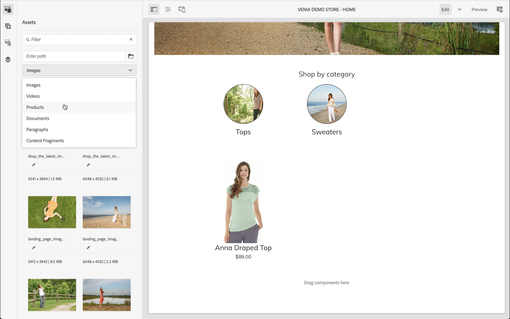
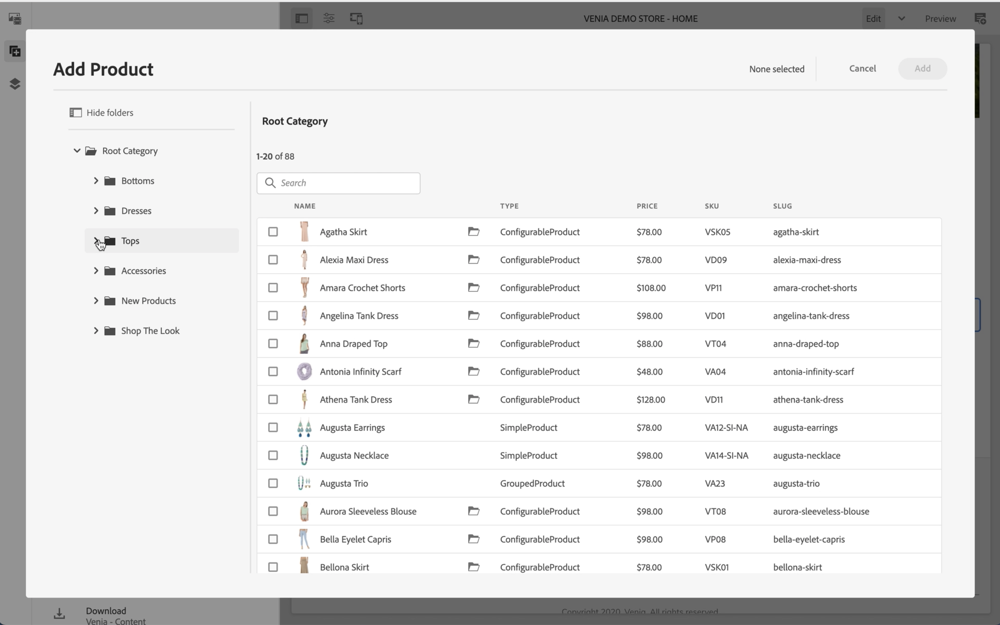
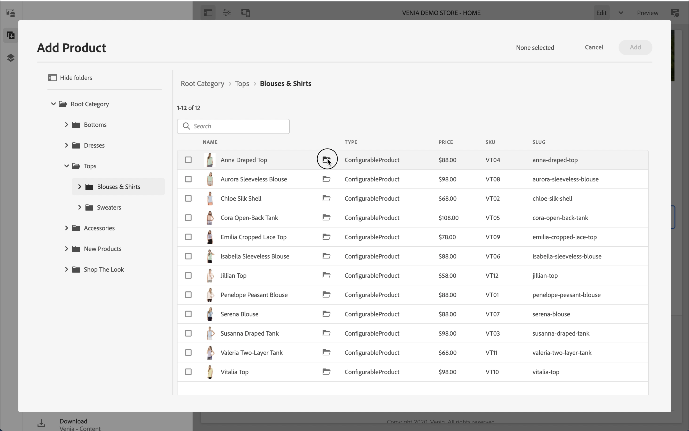
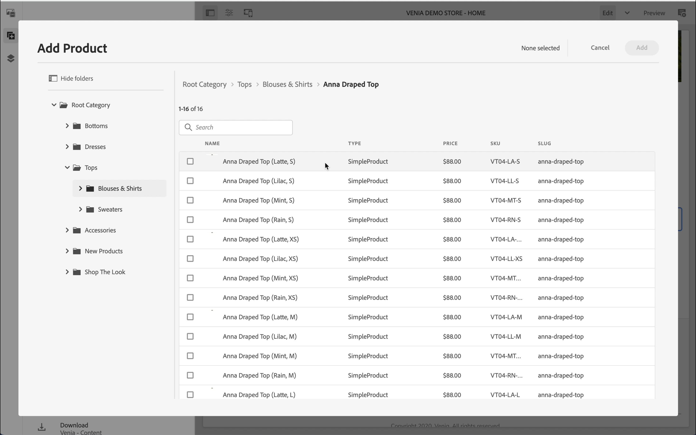
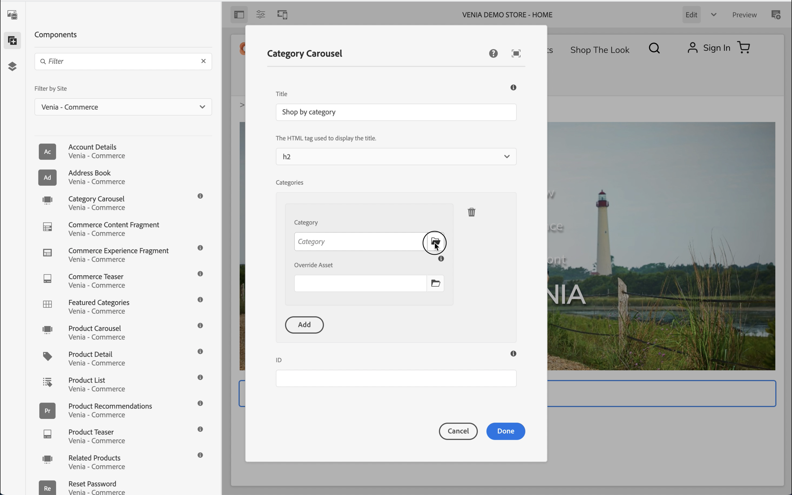

# Introdução à criação da CIF do AEM {#getting-started}

Conheça a criação da CIF de AEM.

## A história até agora {#story-so-far}

No documento anterior desta jornada de Conteúdo e Comércio do AEM, [Saiba mais sobre o conteúdo e o comércio do AEM](/help/commerce-cloud/introduction.md)No entanto, você aprendeu a teoria básica do que é um CMS headless e agora deve entender os conceitos básicos de Conteúdo e Comércio AEM.

Este artigo se baseia nesses fundamentos.

## Objetivo {#objective}

Este documento ajuda você a entender como usar a CIF para criação específica de conteúdo e comércio. Depois de ler, você deve:

* Entenda os conceitos de criação da CIF usando o editor universal
* Como acessar dados do catálogo de produtos no AEM usando seletores de produto e categoria
* Como acessar dados de conteúdo e comércio usando o cockpit do produto e o AEM Omnisearch

## Criação da CIF no editor universal {#cif-authoring}

A CIF estende o Editor universal com recursos para acessar os dados do produto em tempo real sem sair do contexto:

Abra o painel lateral e selecione &quot;Produtos&quot; na lista suspensa.

Você pode navegar pelo catálogo de produtos ou usar o campo de pesquisa de texto completo para localizar produtos.

Os produtos podem ser soltos em componentes que oferecem suporte a quedas de produtos (por exemplo, teaser de produto, carrossel de produto) diretamente na página que cria automaticamente um componente de teaser de produto.

## Seletores de categoria e produto {#pickers}

Se os dados de produto e categoria forem necessários em componentes de comércio ou diálogos de back-office do AEM, os autores do AEM poderão usar seletores que são elementos da interface do usuário para pesquisar e selecionar confortavelmente os dados do catálogo de produtos.

### Seletor de produtos

Clicar no ícone de pasta abrirá a interface modal do seletor (por exemplo, teaser do produto)

Os produtos podem ser encontrados navegando pela estrutura do catálogo à esquerda ou pesquisando. A pesquisa de texto completo respeitará a categoria selecionada e limitará os resultados da pesquisa a essa categoria.

Os produtos com variações são marcados com um ícone de pasta que pode ser clicado para mostrar todas as variações.

### Seletor de Categoria

Funciona como um seletor de produtos. Clicar no ícone de pasta abrirá a interface modal do seletor (por exemplo, carrossel de categorias)

Navegue pela estrutura do catálogo à esquerda e selecione a categoria.

## Cockpit do produto {#cockpit}

O cockpit de produtos é um local central para acessar rapidamente o catálogo de produtos com todo o seu conteúdo enriquecido. Você aprenderá em um dos próximos módulos a enriquecer dados do produto com conteúdo. Por enquanto, vamos nos concentrar no acesso aos dados do produto.

No menu principal, clique em commerce para ver uma lista de todos os catálogos de produtos anexados.

Isso mostra uma lista de todos os catálogos de produtos do Connect.

O catálogo de produtos mostra, por padrão, todas as categorias de primeiro nível com todos os produtos. Clicar em uma categoria abrirá essa categoria com todos os produtos e subcategorias relacionados, incluindo seus produtos.

Você pode abrir as propriedades do produto clicando no ícone de propriedade. O ícone é exibido ao passar o mouse sobre um bloco de produto.

Todas as propriedades do produto são somente leitura porque os dados são carregados em tempo real do back-end conectado. A alteração das propriedades do produto deve ser feita no sistema de back-end, que é o sistema de registro. A guia **Variantes** só aparecerão se o produto tiver variações. Clicar na guia exibirá todas as variações com seus atributos.

As guias restantes mostram todo o conteúdo de AEM associado ao produto. Abordaremos essas guias em um dos próximos módulos.

## AEM Omnisearch {#omnisearch}

Usar o Omnisearch é uma maneira fácil de encontrar conteúdo AEM usando a pesquisa de texto completo. A CIF estende o Omnisearch com pesquisa em texto completo de catálogos de produtos com seu conteúdo AEM associado.

O Omnisearch executará uma pesquisa de texto completo no back-end de comércio para encontrar todos os produtos relacionados. O resultado está listado em **Ver todos os produtos**. O Omnisearch também pesquisará o conteúdo do AEM associado ao produto pesquisado. Os resultados estão listados nas respectivas categorias de AEM. Neste exemplo, um fragmento de conteúdo está relacionado ao produto.

## O que vem a seguir {#what-is-next}

Agora que concluiu esta parte do jornada, você deve:

* Entenda os conceitos de criação da CIF usando o editor universal
* Como acessar o catálogo de produtos no AEM usando seletores de produto e categoria
* Como acessar dados de conteúdo e comércio usando o cockpit do produto e o AEM Omnisearch

Desenvolva esse conhecimento e continue sua jornada revisando o documento a seguir [Gerenciar páginas e modelos do catálogo de produtos](catalog-templates.md), onde você aprenderá a criar e personalizar sua primeira experiência de catálogo de produtos.

## Recursos adicionais {#additional-resources}

Embora seja recomendável seguir para a próxima parte da jornada revisando o documento [Gerenciar páginas e modelos do catálogo de produtos](catalog-templates.md), a seguir estão alguns recursos adicionais e opcionais que aprofundam alguns conceitos mencionados neste documento, mas não são necessários para continuar na jornada.

* [Configurando lojas e catálogos](/help/commerce-cloud/getting-started.md#catalog)
