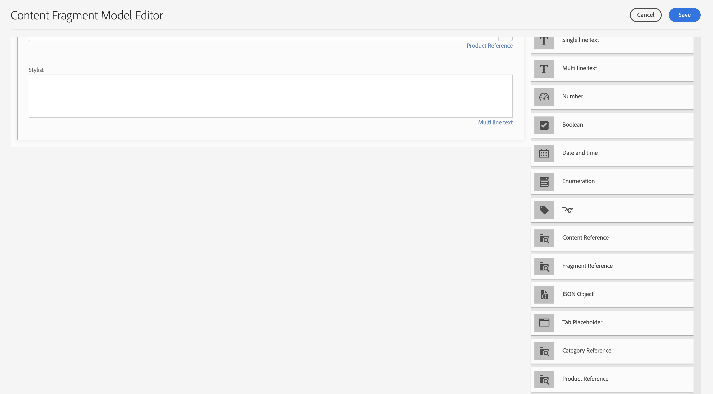
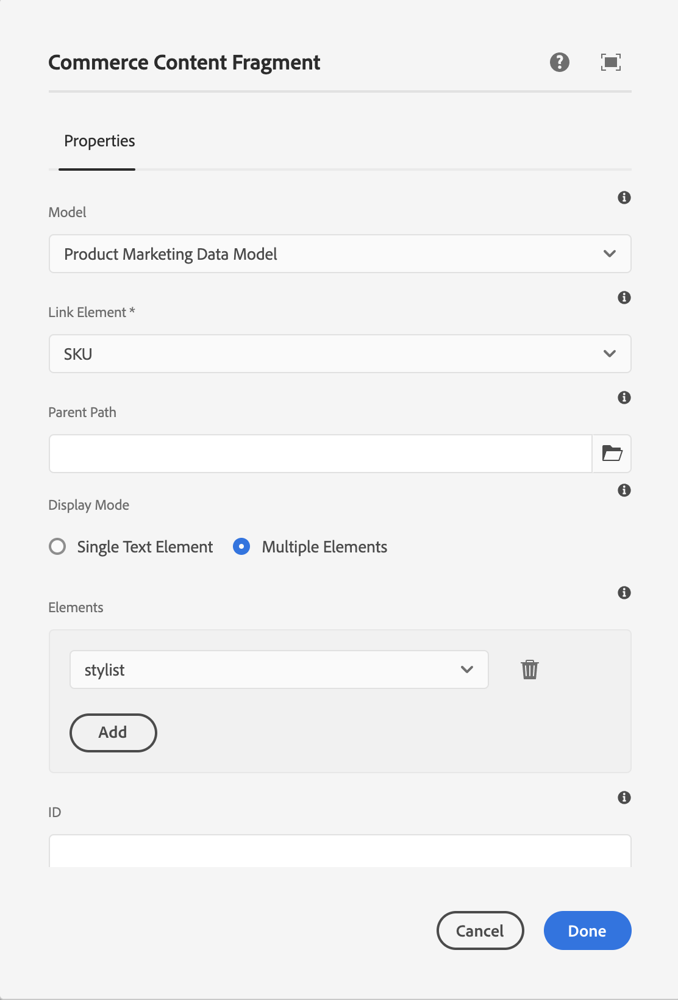

# Criação de experiências de produto {#building-experiences}

Saiba como gerenciar experiências de produtos.

## A história até agora {#story-so-far}

No documento anterior da jornada de Conteúdo e Commerce do Adobe Experience Manager (AEM), [Gerenciar experiências de catálogo de produtos em etapas](staged-catalog.md), você aprendeu a gerenciar experiências de catálogo de produtos em etapas.

## Objetivo {#objective}

Este documento ajuda você a entender como criar conteúdo e experiências de produto.

## Gerenciamento da experiência do produto {#management}

O Gerenciamento de experiência do produto é a disciplina para decorar dados do produto (que pertence a um PIM ou uma solução comercial) com conteúdo de marketing no AEM. Esses dados de produto enriquecidos com conteúdo podem ser usados em vários canais para criar uma experiência de compra imersiva.

No AEM, você pode criar vários tipos de conteúdo e vinculá-los ao catálogo de produtos. O conteúdo associado pode ser facilmente descoberto e usado, o que resulta em alta produtividade.

### Ativos {#assets}

Em um alto nível, há dois tipos de ativos relacionados aos produtos: produto e marketing. Os ativos do produto são gerenciados pelos comerciantes e se concentram em mostrar o produto (principalmente na frente de um fundo neutro). Os ativos são gerenciados na solução de comércio ou no AEM Assets (com uma integração do Assets com a solução de comércio/pim).

Os ativos de marketing estão relacionados à promoção e ao uso do produto de propriedade do marketing. Exemplos são: exibição de vários produtos (&quot;comprar a aparência&quot;), em um contexto específico (&quot;coleção de outono ao ar livre&quot;) ou pdfs de instruções. O CIF fornece uma maneira fácil de vincular qualquer ativo do AEM a um objeto de catálogo de produtos.

Abra as propriedades do ativo e alterne para a guia **Commerce**. Essa guia permite gerenciar a associação com produtos. A tabela abaixo do seletor fornece informações adicionais para os objetos vinculados (visíveis apenas com uma seleção). Clique no ícone de detalhes para obter uma exibição completa na ferramenta cockpit do produto. Para associar um novo objeto, clique no ícone do seletor de produtos (ícone de pasta), selecione um objeto e feche o seletor.

### Fragmentos de experiência {#experience-fragments}

Fragmentos de experiência são uma ótima maneira de criar conteúdo de produto reutilizável ou individual em escala. A associação funciona de forma semelhante a um ativo. Abra as propriedades e alterne para a guia **Commerce**. Essa guia permite gerenciar a associação com produtos e categorias. As tabelas abaixo dos seletores fornecem informações adicionais para os objetos vinculados (visíveis apenas com uma seleção). Clique no ícone de detalhes para obter uma exibição completa na ferramenta cockpit do produto. Para associar um novo objeto, clique no ícone do seletor de produtos (ícone de pasta), selecione um objeto e feche o seletor.

### Fragmentos de conteúdo {#content-fragments}

Fragmentos de conteúdo são o melhor tipo de conteúdo para qualquer conteúdo estruturado. Isso pode ser usado para aumentar os dados externos do produto com dados de marketing adicionais ou para criar conteúdo de forma headless. A associação de um fragmento de conteúdo a um objeto de catálogo de produtos ocorre por meio dos tipos de referência de produto ou categoria no Editor de modelos de fragmento de conteúdo. Basta arrastar e soltar o tipo de referência correto no modelo e configurar o campo. Esses tipos oferecem suporte para seleção única ou múltipla.

Se você criar um fragmento de conteúdo com base nesse modelo, esses tipos de referência fornecerão uma maneira fácil de selecionar o objeto correto usando o respectivo seletor.

### Cockpit do produto {#product-cockpit}

Você foi apresentado ao cockpit (ou console) do produto em um dos módulos anteriores. O cockpit é uma maneira fácil não apenas de navegar no catálogo de produtos, mas também de ver todo o conteúdo AEM associado em um único local. Vá para o console do produto e abra as propriedades de um produto com conteúdo associado. Alterne para a respectiva guia para ver o conteúdo associado.

Clicar no ícone de ação abre esse conteúdo em uma nova guia do navegador.

## Enriquecimento de páginas de produto e categoria individuais {#enrich}

Nos módulos anteriores, você aprendeu a trabalhar com vários modelos de catálogo de produtos. Vários modelos são uma ótima maneira de criar modelos diferentes, mas geralmente não são necessários. Geralmente, o mesmo modelo pode ser usado com espaços reservados para conteúdo individual. O CIF oferece suporte a espaços reservados para Fragmentos de conteúdo e Fragmentos de experiência.

Vamos começar com o espaço reservado para Fragmento de experiência. Abra um modelo de produto no Editor do AEM. Arraste e solte o componente **Fragmento de experiência do Commerce** no modelo e abra a caixa de diálogo de configuração.

Abra a caixa de diálogo do componente e insira um nome para esse espaço reservado. Um nome de espaço reservado é necessário e permite adicionar quantos espaços reservados forem necessários.

Abra o Fragmento de experiência que você associou a um produto na etapa anterior. Abra as propriedades e alterne para a guia comércio. Insira o mesmo nome de espaço reservado no **Local de espaço reservado do catálogo**.

Agora arraste e solte o componente **Fragmento de conteúdo do Commerce** no modelo e abra a caixa de diálogo de configuração.

Essa caixa de diálogo reutiliza a caixa de diálogo Fragmento de conteúdo, dos Componentes principais. Encontre mais informações em recursos adicionais. A única diferença é a propriedade **Elemento de link**, que configura o campo de identificador (SKU do produto ou UID da categoria) no modelo de Fragmento de conteúdo.

Visualize agora uma página de produto que tem um Fragmento de conteúdo e/ou Fragmento de experiência associado. Quando o AEM renderiza uma página, ele faz uma pesquisa por cada espaço reservado com base no tipo (Conteúdo ou Fragmento de experiência), identificador e nome do espaço reservado para Fragmentos de experiência. O AEM usa um resolvedor de URL para obter o identificador (SKU para produtos, UID para categorias). Se um Fragmento de experiência ou conteúdo for retornado, ele será renderizado no local do espaço reservado, caso contrário, o espaço reservado será ignorado.

## Tornar o conteúdo shoppable {#making-shoppable}

Também é possível fazer com que uma página AEM comum possa ser comprada adicionando componentes comerciais. Crie uma página de conteúdo no AEM e abra a página vazia no editor.

Primeiro, arraste e solte um componente de detalhes do produto na página. Em seguida, alterne para a barra lateral do Assets, alterne para produtos e selecione um produto. Arraste e solte esse produto no componente do produto. Isso mostra um componente de produto regular em uma página de conteúdo.

Se você tiver criado conteúdo associado para esse produto, alterne na barra lateral do Assets para **Conteúdo de Commerce Associado**. Esta guia mostra todo o conteúdo do AEM que foi associado a este produto. Isso permite que você embeleze rapidamente as páginas com qualquer conteúdo associado.

## Fim da jornada? {#end-of-journey}

Parabéns! Você concluiu a jornada do desenvolvedor do Commerce e de conteúdo do AEM! Agora você deve:

* entenda como associar qualquer conteúdo do AEM a objetos de catálogo de produtos
* usar espaços reservados para enriquecer individualmente as páginas de produto e categoria
* saber como tornar o conteúdo comprável e usar a guia conteúdo associado

Agora você está pronto para gerenciar experiências de produto usando o AEM Content e o Commerce. No entanto, o AEM Content e o Commerce têm muitas opções adicionais disponíveis. Confira alguns dos recursos adicionais disponíveis na [seção Recursos adicionais](#additional-resources), onde você pode saber mais sobre os recursos que viu nesta jornada.

## Recursos adicionais {#additional-resources}

* [Criação de experiências no Commerce](/help/commerce-cloud/authoring/authoring-commerce-experiences.md)
* [Cockpit do produto](/help/commerce-cloud/authoring/product-cockpit.md)
* [Componente do Fragmento de conteúdo](https://experienceleague.adobe.com/docs/experience-manager-core-components/using/wcm-components/content-fragment-component.html?lang=en)
