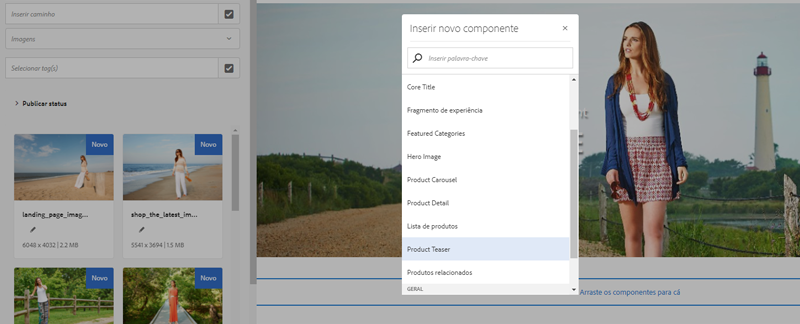
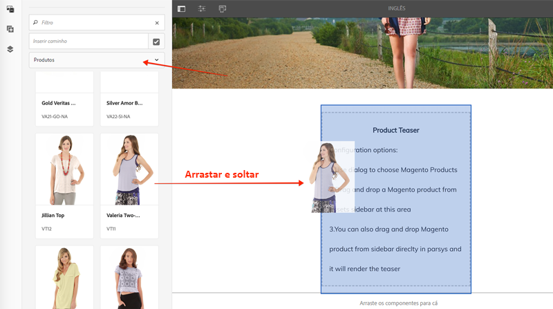
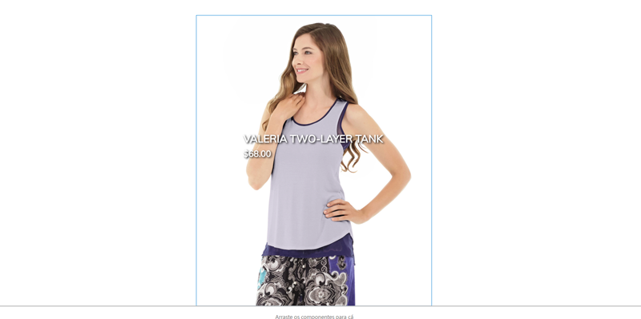
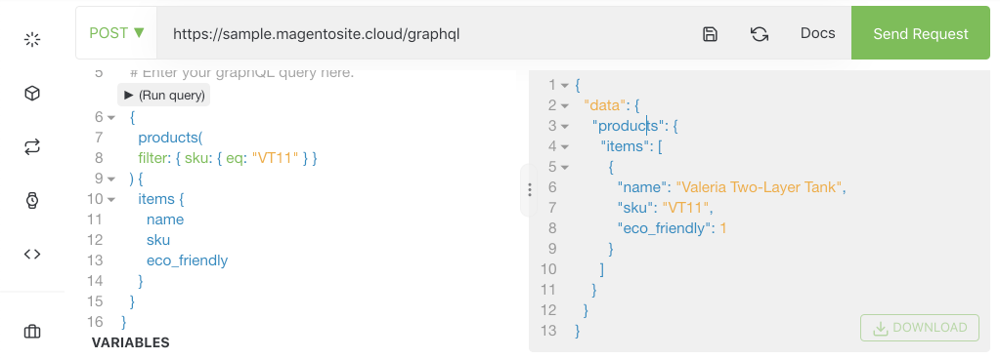

# AEM Personalizar os componentes principais do CIF {#customize-cif-components}

O [Projeto CIF Venia](https://github.com/adobe/aem-cif-guides-venia) é uma base de código de referência para o uso de [Componentes principais do CIF](https://github.com/adobe/aem-core-cif-components). Neste tutorial, você estende ainda mais o componente [Teaser do produto](https://github.com/adobe/aem-core-cif-components/tree/master/ui.apps/src/main/content/jcr_root/apps/core/cif/components/commerce/productteaser/v1/productteaser) para exibir um atributo personalizado do Adobe Commerce. Você também aprenderá mais sobre a integração do GraphQL entre AEM e o Adobe Commerce e os ganchos de extensão fornecidos pelos Componentes principais do CIF.

>[!TIP]
>
> Use o [Arquétipo de projeto do AEM](https://github.com/adobe/aem-project-archetype) ao iniciar sua própria implementação comercial.

## O que você vai criar

Recentemente, a marca Venia começou a fabricar alguns produtos usando materiais sustentáveis, e a empresa gostaria de exibir uma medalha **Eco Friendly** como parte do Teaser do produto. Um novo atributo personalizado é criado no Adobe Commerce para indicar se um produto usa o material **Eco friendly**. Esse atributo personalizado é adicionado como parte da consulta do GraphQL e exibido no Teaser do produto de produtos especificados.


## Pré-requisitos {#prerequisites}

Um ambiente de desenvolvimento local é necessário para concluir este tutorial. Esse ambiente inclui uma instância do AEM em execução que está configurada e conectada a uma instância do Adobe Commerce. Revise os requisitos e as etapas para [configurar um desenvolvimento local com o SDK do AEM as a Cloud Service](../develop.md). Para seguir o tutorial completamente, você precisa de permissão para adicionar [Atributos a um Produto](https://docs.magento.com/user-guide/catalog/product-attributes-add.html) no Adobe Commerce.

Você também precisa do GraphQL IDE, como o [GraphiQL](https://github.com/graphql/graphiql), ou de uma extensão de navegador para executar amostras de código e tutoriais. Se você instalar uma extensão de navegador, verifique se ela pode definir cabeçalhos de solicitação. No Google Chrome, o _Cliente Altair GraphQL_ é uma extensão que pode realizar o trabalho.

## Clonar o projeto Venia {#clone-venia-project}

Clonar o [Projeto Venia](https://github.com/adobe/aem-cif-guides-venia) e substituir os estilos padrão.

>[!NOTE]
>
> **Você pode usar um projeto existente** (baseado no Arquétipo de Projeto AEM com CIF incluído) e ignorar esta seção.

1. Execute o seguinte comando do Git para clonar o projeto:

   ```shell
   $ git clone git@github.com:adobe/aem-cif-guides-venia.git
   ```

1. Crie e implante o projeto em uma instância local do AEM:

   ```shell
   $ cd aem-cif-guides-venia/
   $ mvn clean install -PautoInstallSinglePackage,cloud
   ```

1. Adicione as configurações OSGi necessárias para conectar a instância do AEM a uma instância do Adobe Commerce ou adicione as configurações ao projeto criado.

1. Nesse ponto, você deve ter uma versão funcional de uma loja conectada a uma instância do Adobe Commerce. Navegue até a página `US` > `Home` em: [http://localhost:4502/editor.html/content/venia/us/en.html](http://localhost:4502/editor.html/content/venia/us/en.html).

   Você verá que a loja está usando o tema Venia. Ao expandir o Menu principal da loja, você verá várias categorias, indicando que a conexão com o Adobe Commerce está funcionando.

   

## Criação do Teaser do produto {#author-product-teaser}

O Teaser do produto é apresentado em todo este tutorial. Como primeira etapa, adicione uma instância do Teaser do produto à página inicial para entender a funcionalidade da linha de base.

1. Acesse a **página inicial** do site: [http://localhost:4502/editor.html/content/acme/us/en.html](http://localhost:4502/editor.html/content/acme/us/en.html)

2. Insira um novo **Teaser do produto** no container do layout principal da página.

   

3. Expanda o painel lateral (se ainda não estiver sendo exibido) e alterne a lista suspensa do localizador de ativos para **Produtos**. Essa lista deve exibir uma lista de produtos disponíveis em uma instância conectada do Adobe Commerce. Selecione, **arraste e solte** um produto no **Teaser do produto** exibido na página.

   

   >[!NOTE]
   >
   > Observação: você também pode configurar o produto exibido definindo o componente na caixa de diálogo (clicando na _chave inglesa_).

4. Agora você já deve estar vendo um produto no teaser. O nome e o preço do produto são atributos exibidos por padrão.

   

## Adicionar um atributo personalizado no Adobe Commerce {#add-custom-attribute}

Os produtos e os dados do produto exibidos no AEM são armazenados no Adobe Commerce. Em seguida, adicione um atributo para **Eco Friendly** como parte do atributo de produto definido ao usar a interface do usuário do Adobe Commerce.

>[!TIP]
>
> Já tem um atributo personalizado **Sim/Não** como parte do conjunto de atributos do produto? Você pode usá-la e ignorar esta seção.

1. Faça logon na sua instância do Adobe Commerce.
1. Navegue até **Catálogo** > **Produtos**.
1. Atualize o filtro de pesquisa para encontrar o **Produto Configurável** usado quando adicionado ao componente Teaser no exercício anterior. Abra o produto no modo de edição.

   

1. Na exibição do produto, clique em **Adicionar atributo** > **Criar novo atributo**.
1. Preencha o formulário **Novo Atributo** com os seguintes valores (deixe as configurações padrão para outros valores)

   | Conjunto de campos | Rótulo do campo | Valor |
   | ----------------------------- | ------------------ | ---------------- |
   | Propriedades do atributo | Rótulo do atributo | **Amigável(A) Com Eco** |
   | Propriedades do atributo | Tipo de entrada do catálogo | **Sim/Não** |
   | Propriedades Avançadas de Atributo | Código do atributo | **eco_friendly** |

   

   Clique em **Salvar atributo** quando terminar.

1. Role até a parte inferior do produto e expanda o cabeçalho **Atributos**. Você deve ver o novo campo **Eco-Friendly**. Alterne a opção para **Sim**.

   

   **Salve** as alterações no produto.

   >[!TIP]
   >
   > Mais detalhes sobre o gerenciamento dos [Atributos do produto podem ser encontrados no guia do usuário do Adobe Commerce](https://docs.magento.com/user-guide/catalog/attribute-best-practices.html).

1. Navegue até **Sistema** > **Ferramentas** > **Gerenciamento de Cache**. Como foi feita uma atualização no esquema de dados, você deve invalidar alguns dos Tipos de cache no Adobe Commerce.
1. Marque a caixa ao lado de **Configuração** e envie o tipo de cache para **Atualização**

   

   >[!TIP]
   >
   > Mais detalhes sobre o [Gerenciamento de Cache podem ser encontrados no guia do usuário do Adobe Commerce](https://docs.magento.com/user-guide/system/cache-management.html).

## Usar um GraphQL IDE para verificar o atributo {#use-graphql-ide}

Antes de entrar no código AEM, é útil explorar a [Visão geral do GraphQL](https://devdocs.magento.com/guides/v2.4/graphql/) usando um GraphQL IDE. A integração do Adobe Commerce com o AEM é feita principalmente por meio de uma série de queries do GraphQL. Entender e modificar as consultas do GraphQL é uma das principais maneiras de estender os Componentes principais do CIF.

Em seguida, use um GraphQL IDE para verificar se o atributo `eco_friendly` foi adicionado ao conjunto de atributos do produto. As capturas de tela deste tutorial estão usando a _extensão do Google Chrome para Cliente Altair GraphQL_.

1. Abra o GraphQL IDE e insira o URL `http://<commerce-server>/graphql` na barra de URL do IDE ou da extensão.
2. Adicione a seguinte [consulta de produtos](https://devdocs.magento.com/guides/v2.4/graphql/queries/products.html), onde `YOUR_SKU` é a **SKU** do produto usado no exercício anterior:

   ```json
     {
       products(
       filter: { sku: { eq: "YOUR_SKU" } }
       ) {
           items {
           name
           sku
           eco_friendly
           }
       }
   }
   ```

3. Execute a query e você receberá uma resposta como a seguinte:

   ```json
   {
     "data": {
       "products": {
         "items": [
           {
             "name": "Valeria Two-Layer Tank",
             "sku": "VT11",
             "eco_friendly": 1
           }
         ]
       }
     }
   }
   ```

   

   O valor de **Sim** é um inteiro de **1**. Esse valor é útil ao escrever a consulta do GraphQL em Java™.

   >[!TIP]
   >
   > Leia a documentação mais detalhada sobre o [Adobe Commerce GraphQL aqui](https://devdocs.magento.com/guides/v2.4/graphql/index.html).

## Atualizar o Modelo do Sling para o Teaser do produto {#updating-sling-model-product-teaser}

Em seguida, estenda a lógica de negócios do Teaser do produto implementando um Modelo do Sling. [Os Modelos do Sling](https://sling.apache.org/documentation/bundles/models.html) são objetos POJO (Plain Old Java™ Objects) orientados por anotações que implementam a lógica de negócios exigida pelo componente. Os Modelos do Sling são usados com os scripts HTL como parte do componente. Siga o [padrão de delegação para Modelos do Sling](https://github.com/adobe/aem-core-wcm-components/wiki/Delegation-Pattern-for-Sling-Models) para que você possa estender partes do modelo existente do Teaser do produto.

Os Modelos do Sling são implementados como Java™ e podem ser encontrados no módulo **core** do projeto gerado.

Use [o IDE de sua escolha](https://experienceleague.adobe.com/docs/experience-manager-learn/cloud-service/local-development-environment-set-up/development-tools.html#set-up-the-development-ide) para importar o projeto Venia. As capturas de tela usadas são do [Visual Studio Code IDE](https://experienceleague.adobe.com/docs/experience-manager-learn/cloud-service/local-development-environment-set-up/development-tools.html#microsoft-visual-studio-code).

1. No IDE, navegue no módulo **core** para: `core/src/main/java/com/venia/core/models/commerce/MyProductTeaser.java`.

   

   `MyProductTeaser.java` é uma interface Java™ que estende a interface CIF [ProductTeaser](https://github.com/adobe/aem-core-cif-components/blob/master/bundles/core/src/main/java/com/adobe/cq/commerce/core/components/models/productteaser/ProductTeaser.java).

   Já foi adicionado um novo método chamado `isShowBadge()` para exibir uma medalha se o produto for considerado &quot;Novo&quot;.

1. Adicionar `isEcoFriendly()` à interface:

   ```java
   @ProviderType
   public interface MyProductTeaser extends ProductTeaser {
       // Extend the existing interface with the additional properties which you
       // want to expose to the HTL template.
       public Boolean isShowBadge();
   
       public Boolean isEcoFriendly();
   }
   ```

   Este novo método é introduzido para encapsular a lógica para indicar se o produto tem o atributo `eco_friendly` definido como **Sim** ou **Não**.

1. Em seguida, inspecione o `MyProductTeaserImpl.java` em `core/src/main/java/com/venia/core/models/commerce/MyProductTeaserImpl.java`.

   O [padrão de delegação para Modelos do Sling](https://github.com/adobe/aem-core-wcm-components/wiki/Delegation-Pattern-for-Sling-Models) permite que `MyProductTeaserImpl` faça referência ao modelo `ProductTeaser` por meio da propriedade `sling:resourceSuperType`:

   ```java
   @Self
   @Via(type = ResourceSuperType.class)
   private ProductTeaser productTeaser;
   ```

   Para os métodos que você não deseja substituir ou alterar, você pode retornar o valor retornado por `ProductTeaser`. Por exemplo:

   ```java
   @Override
   public String getImage() {
       return productTeaser.getImage();
   }
   ```

   Este método minimiza a quantidade de código Java™ que uma implementação deve gravar.

1. AEM Um dos pontos de extensão adicionais fornecidos pelos Componentes Principais do CIF é o `AbstractProductRetriever`, que fornece acesso a atributos específicos do produto. Inspect o método `initModel()`:

   ```java
   import javax.annotation.PostConstruct;
   ...
   @Model(adaptables = SlingHttpServletRequest.class, adapters = MyProductTeaser.class, resourceType = MyProductTeaserImpl.RESOURCE_TYPE)
   public class MyProductTeaserImpl implements MyProductTeaser {
       ...
       private AbstractProductRetriever productRetriever;
   
       /* add this method to initialize the productRetriever */
       @PostConstruct
       public void initModel() {
           productRetriever = productTeaser.getProductRetriever();
   
           if (productRetriever != null) {
               productRetriever.extendProductQueryWith(p -> p.createdAt());
           }
   
       }
   ...
   ```

   A anotação `@PostConstruct` garante que esse método seja chamado quando o Modelo Sling for inicializado.

   Observe que a consulta GraphQL do produto já foi estendida usando o método `extendProductQueryWith` para recuperar o atributo `created_at` adicional. Este atributo é usado posteriormente como parte do método `isShowBadge()`.

1. Atualize a consulta GraphQL para incluir o atributo `eco_friendly` na consulta parcial:

   ```java
   //MyProductTeaserImpl.java
   
   private static final String ECO_FRIENDLY_ATTRIBUTE = "eco_friendly";
   
   @PostConstruct
   public void initModel() {
       productRetriever = productTeaser.getProductRetriever();
   
       if (productRetriever != null) {
           productRetriever.extendProductQueryWith(p -> p
               .createdAt()
               .addCustomSimpleField(ECO_FRIENDLY_ATTRIBUTE)
           );
       }
   }
   ```

   Adicionar ao método `extendProductQueryWith` é uma maneira eficiente de garantir que atributos de produto adicionais estejam disponíveis para o restante do modelo. Essa ação também minimiza o número de consultas executadas.

   No código acima, o `addCustomSimpleField` é usado para recuperar o atributo `eco_friendly`. Este atributo ilustra como você pode consultar qualquer atributo personalizado que faça parte do esquema do Adobe Commerce.

   >[!NOTE]
   >
   > O método `createdAt()` foi implementado como parte da [Interface do Produto](https://github.com/adobe/commerce-cif-magento-graphql/blob/master/src/main/java/com/adobe/cq/commerce/magento/graphql/ProductInterface.java). A maioria dos atributos de esquema encontrados com frequência foram implementados, portanto, use `addCustomSimpleField` somente para atributos verdadeiramente personalizados.

1. Adicione um agente de log para depurar o código Java™:

   ```java
   import org.slf4j.Logger;
   import org.slf4j.LoggerFactory;
   ...
   @Model(adaptables = SlingHttpServletRequest.class, adapters = MyProductTeaser.class, resourceType = MyProductTeaserImpl.RESOURCE_TYPE)
   public class MyProductTeaserImpl implements MyProductTeaser {
   
   private static final Logger LOGGER = LoggerFactory.getLogger(MyProductTeaserImpl.class);
   ```

1. Em seguida, implemente o método `isEcoFriendly()`:

   ```java
   @Override
   public Boolean isEcoFriendly() {
   
       Integer ecoFriendlyValue;
       try {
           ecoFriendlyValue = productRetriever.fetchProduct().getAsInteger(ECO_FRIENDLY_ATTRIBUTE);
           if(ecoFriendlyValue != null && ecoFriendlyValue.equals(Integer.valueOf(1))) {
               LOGGER.info("*** Product is Eco Friendly**");
               return true;
           }
       } catch (SchemaViolationError e) {
           LOGGER.error("Error retrieving eco friendly attribute");
       }
       LOGGER.info("*** Product is not Eco Friendly**");
       return false;
   }
   ```

   No método acima, o `productRetriever` é usado para buscar o produto e o método `getAsInteger()` é usado para obter o valor do atributo `eco_friendly`. Com base nas consultas GraphQL executadas anteriormente, você sabe que o valor esperado quando o atributo `eco_friendly` é definido como &quot;**Sim**&quot; é na verdade um inteiro de **1**.

   Agora que o Modelo do Sling foi atualizado, a marcação do Componente deve ser atualizada para realmente exibir um indicador de **Compatível com a tecnologia Eco** com base no Modelo do Sling.

## Personalização da marcação do Teaser do produto {#customize-markup-product-teaser}

Uma extensão comum de componentes do AEM é modificar a marcação gerada pelo componente. Essa edição é feita substituindo o [script HTL](https://experienceleague.adobe.com/docs/experience-manager-htl/content/overview.html?lang=pt-BR) que o componente usa para renderizar sua marcação. A Linguagem de modelo de HTML (HTL) é uma linguagem de modelo leve que os componentes AEM usam para renderizar dinamicamente a marcação com base no conteúdo criado, permitindo que os componentes sejam reutilizados. O Teaser do produto, por exemplo, pode ser reutilizado várias vezes para exibir produtos diferentes.

Nesse caso, renderize um banner sobre o teaser para indicar que o produto é &quot;Eco Friendly&quot; com base em um atributo personalizado. O padrão de design para [personalizar a marcação](https://experienceleague.adobe.com/docs/experience-manager-core-components/using/developing/customizing.html#customizing-the-markup) de um componente é padrão para todos os Componentes AEM AEM, não apenas para os Componentes Principais do CIF.

>[!NOTE]
>
> Se você personalizar um componente usando o produto CIF e os seletores de categoria, como este Teaser do produto ou o componente da página CIF, inclua a clientlib `cif.shell.picker` necessária para as caixas de diálogo do componente. Consulte [Uso do CIF e seletor de categoria de produto](use-cif-pickers.md) para obter detalhes.

1. No IDE, navegue e expanda o módulo `ui.apps` e expanda a hierarquia de pastas para: `ui.apps/src/main/content/jcr_root/apps/venia/components/commerce/productteaser` e inspecione o arquivo `.content.xml`.

   

   ```xml
   <?xml version="1.0" encoding="UTF-8"?>
   <jcr:root xmlns:sling="http://sling.apache.org/jcr/sling/1.0" xmlns:cq="http://www.day.com/jcr/cq/1.0" xmlns:jcr="http://www.jcp.org/jcr/1.0"
       jcr:description="Product Teaser Component"
       jcr:primaryType="cq:Component"
       jcr:title="Product Teaser"
       sling:resourceSuperType="core/cif/components/commerce/productteaser/v1/productteaser"
       componentGroup="Venia - Commerce"/>
   ```

   A definição de componente acima é para o Teaser do produto em seu projeto. Observe a propriedade `sling:resourceSuperType="core/cif/components/commerce/productteaser/v1/productteaser"`. Esta propriedade é um exemplo de criação de um [Componente proxy](https://experienceleague.adobe.com/docs/experience-manager-core-components/using/get-started/using.html#create-proxy-components). AEM Em vez de copiar e colar os scripts HTL do Teaser do produto dos Componentes principais do CIF, você pode usar o `sling:resourceSuperType` para herdar toda a funcionalidade.

1. Abra o arquivo `productteaser.html`. Este arquivo é uma cópia do arquivo `productteaser.html` do [Teaser do produto CIF](https://github.com/adobe/aem-core-cif-components/blob/master/ui.apps/src/main/content/jcr_root/apps/core/cif/components/commerce/productteaser/v1/productteaser/productteaser.html).

   ```html
   <!--/* productteaser.html */-->
   <sly
     data-sly-use.product="com.venia.core.models.commerce.MyProductTeaser"
     data-sly-use.templates="core/wcm/components/commons/v1/templates.html"
     data-sly-use.actionsTpl="actions.html"
     data-sly-test.isConfigured="${properties.selection}"
     data-sly-test.hasProduct="${product.url}"
   ></sly>
   ```

   Observe que o Modelo Sling para `MyProductTeaser` é usado e atribuído à variável `product`.

1. Modifique `productteaser.html` para poder chamar o método `isEcoFriendly` implementado no exercício anterior:

   ```html
   ...
   <div
     data-sly-test="${isConfigured && hasProduct}"
     class="item__root"
     data-cmp-is="productteaser"
     data-virtual="${product.virtualProduct}"
   >
     <div data-sly-test="${product.showBadge}" class="item__badge">
       <span>${properties.text || 'New'}</span>
     </div>
     <!--/* Insert call to Eco Friendly here */-->
     <div data-sly-test="${product.ecoFriendly}" class="item__eco">
       <span>Eco Friendly</span>
     </div>
     ...
   </div>
   ```

   Ao chamar um método Modelo do Sling no HTL, a parte `get` e `is` do método é descartada e a primeira letra é em minúsculas. Então `isShowBadge()` torna-se `.showBadge` e `isEcoFriendly` torna-se `.ecoFriendly`. Com base no valor booleano retornado de `.isEcoFriendly()`, determina se `<span>Eco Friendly</span>` é exibido.

   Mais informações sobre `data-sly-test` e outras [instruções em bloco do HTL podem ser encontradas aqui](https://experienceleague.adobe.com/docs/experience-manager-htl/content/specification.html).

1. Salve as alterações e implante as atualizações no AEM usando suas habilidades em Maven em um terminal de linha de comando:

   ```shell
   $ cd aem-cif-guides-venia/
   $ mvn clean install -PautoInstallSinglePackage,cloud
   ```

1. Abra uma nova janela do navegador e navegue até o AEM e o **console OSGi** > **Status** > **Modelos Sling**: [http://localhost:4502/system/console/status-slingmodels](http://localhost:4502/system/console/status-slingmodels)

1. Pesquise por `MyProductTeaserImpl` e você deverá ver uma linha como a seguinte:

   ```plain
   com.venia.core.models.commerce.MyProductTeaserImpl - venia/components/commerce/productteaser
   ```

   Essa linha indica que o modelo Sling foi corretamente implantado e mapeado para o componente correto.

1. Atualize para a **Página inicial Venia** em [http://localhost:4502/editor.html/content/venia/us/en.html](http://localhost:4502/editor.html/content/venia/us/en.html) onde o Teaser do produto foi adicionado.

   

   Se o produto tiver o atributo `eco_friendly` definido como **Sim**, você deverá ver o texto &quot;Eco Friendly&quot; na página. Tente alternar para produtos diferentes para ver a mudança de comportamento.

1. Em seguida, abra o AEM `error.log` para ver as instruções de log adicionadas. O `error.log` está em `<AEM SDK Install Location>/crx-quickstart/logs/error.log`.

   Pesquise nos logs de AEM para ver as instruções de log adicionadas no Modelo Sling:

   ```plain
   2020-08-28 12:57:03.114 INFO [com.venia.core.models.commerce.MyProductTeaserImpl] *** Product is Eco Friendly**
   ...
   2020-08-28 13:01:00.271 INFO [com.venia.core.models.commerce.MyProductTeaserImpl] *** Product is not Eco Friendly**
   ...
   ```

   >[!CAUTION]
   >
   > Você também pode ver alguns rastreamentos de pilha se o produto usado no teaser não tiver o atributo `eco_friendly` como parte de seu conjunto de atributos.

## Adicione estilos para o selo ecológico {#add-styles}

Neste ponto, a lógica de quando exibir o símbolo **Eco Friendly** está funcionando, no entanto, o texto sem formatação poderia usar alguns estilos. Em seguida, adicione um ícone e estilos ao módulo `ui.frontend` para concluir a implementação.

1. Baixe o arquivo [eco_friendly.svg](../assets/customize-cif-components/eco_friendly.svg). Este arquivo é usado como o selo **Eco Friendly**.
1. Retorne ao IDE e navegue até a pasta `ui.frontend`.
1. Adicionar o arquivo `eco_friendly.svg` à pasta `ui.frontend/src/main/resources/images`:

   

1. Abra o arquivo `productteaser.scss` em `ui.frontend/src/main/styles/commerce/_productteaser.scss`.
1. Adicionar as seguintes regras Sass dentro da classe `.productteaser`:

   ```scss
   .productteaser {
       ...
       .item__eco {
           width: 60px;
           height: 60px;
           left: 0px;
           overflow: hidden;
           position: absolute;
           padding: 5px;
   
       span {
           display: block;
           position: absolute;
           width: 45px;
           height: 45px;
           text-indent: -9999px;
           background: no-repeat center center url('../resources/images/eco_friendly.svg');
           }
       }
   ...
   }
   ```

   >[!NOTE]
   >
   > Confira os [Componentes principais do CIF de estilo](./style-cif-component.md) para obter mais detalhes sobre fluxos de trabalho de front-end.

1. Salve as alterações e implante as atualizações no AEM usando suas habilidades em Maven em um terminal de linha de comando:

   ```shell
   $ cd aem-cif-guides-venia/
   $ mvn clean install -PautoInstallSinglePackage,cloud
   ```

1. Atualize para a **Página inicial Venia** em [http://localhost:4502/editor.html/content/venia/us/en.html](http://localhost:4502/editor.html/content/venia/us/en.html) onde o Teaser do produto foi adicionado.

   

## Parabéns {#congratulations}

AEM Você personalizou seu primeiro componente CIF! Baixe os [arquivos de solução concluídos aqui](../assets/customize-cif-components/customize-cif-component-SOLUTION_FILES.zip).

## Desafio extra {#bonus-challenge}

Revise a funcionalidade do selo **Novo** que já foi implementado no Teaser do produto. Tente adicionar uma caixa de seleção extra para os autores controlarem quando o símbolo **Eco-Friendly** deverá ser exibido. Atualizar a caixa de diálogo do componente em `ui.apps/src/main/content/jcr_root/apps/venia/components/commerce/productteaser/_cq_dialog/.content.xml`.


## Recursos adicionais {#additional-resources}

- [Arquétipo do AEM](https://experienceleague.adobe.com/docs/experience-manager-core-components/using/developing/archetype/overview.html?lang=pt-BR)
- [Componentes principais da CIF do AEM](https://github.com/adobe/aem-core-cif-components)
- [Personalizar os Componentes principais da CIF do AEM](https://experienceleague.adobe.com/docs/experience-manager-cloud-service/content/content-and-commerce/storefront/developing/customize-cif-components.html)
- [Personalizar os Componentes principais](https://experienceleague.adobe.com/docs/experience-manager-core-components/using/developing/customizing.html?lang=pt-BR)
- [Introdução ao AEM Sites](https://experienceleague.adobe.com/docs/experience-manager-learn/getting-started-wknd-tutorial-develop/overview.html?lang=pt-BR)
- [Uso do seletor de categoria e produto para CIF](use-cif-pickers.md)
