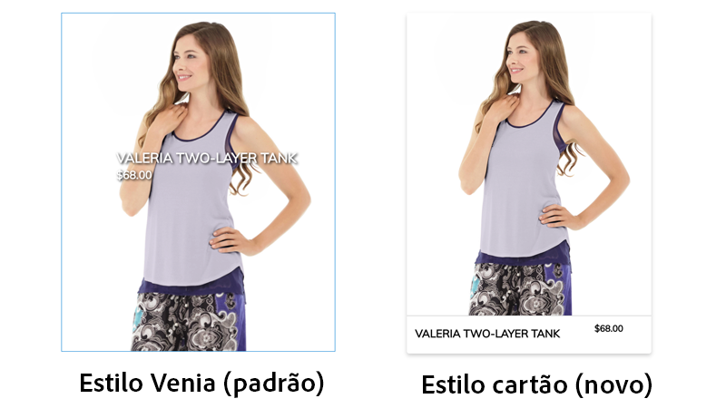
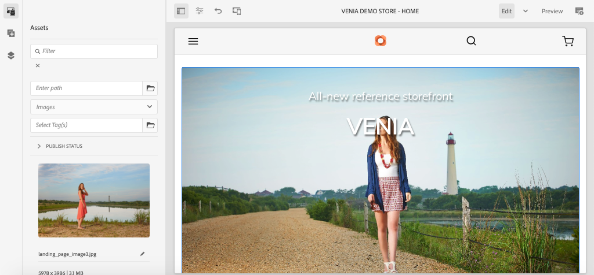
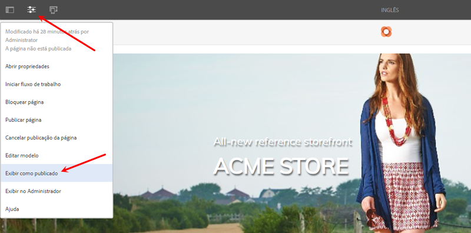
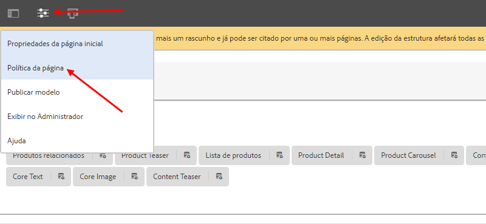
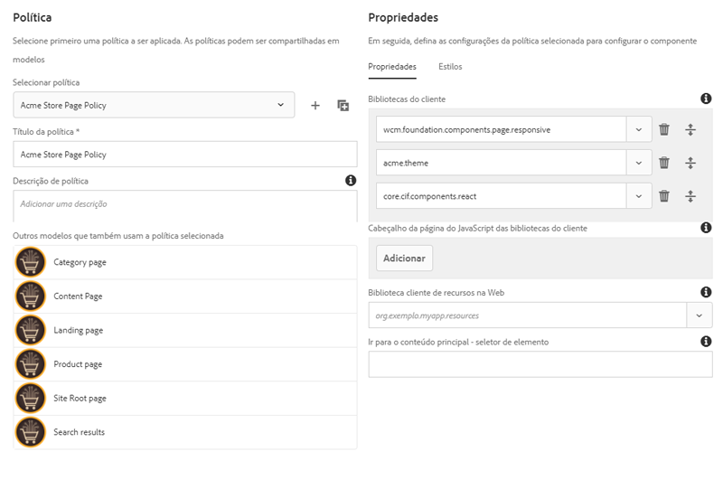
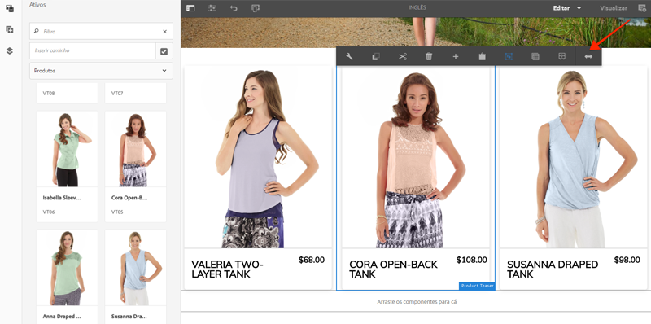
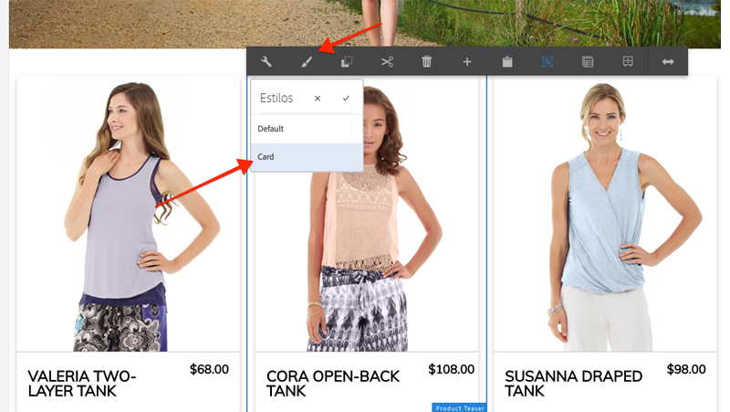

# Alterar estilo dos Componentes principais da CIF do AEM {#style-aem-cif-core-components}

A variável [Projeto CIF Venia](https://github.com/adobe/aem-cif-guides-venia) é uma base de código de referência para o uso de [Componentes principais da CIF](https://github.com/adobe/aem-core-cif-components). Neste tutorial, você vai inspecionar o projeto de referência Venia e entender como o CSS e o JavaScript usados pelos componentes principais CIF do AEM são organizados. Você também criará um novo estilo usando CSS para atualizar o estilo padrão do **Teaser do produto** componente.

>[!TIP]
>
> Use o [Arquétipo de projeto do AEM](https://github.com/adobe/aem-project-archetype) ao iniciar sua própria implementação comercial.

## O que você vai criar

Neste tutorial, um novo estilo é implementado para o Teaser do produto que se assemelha a um cartão. As lições aprendidas no tutorial podem ser aplicadas a outros Componentes principais da CIF.



## Pré-requisitos {#prerequisites}

Um ambiente de desenvolvimento local é necessário para concluir este tutorial. Isso inclui uma instância do AEM em execução que está configurada e conectada a uma instância do Adobe Commerce. Revise os requisitos e as etapas para [configurar um desenvolvimento local com o SDK as a Cloud Service do AEM](../develop.md).

## Clonar o projeto Venia {#clone-venia-project}

Vamos clonar o [Projeto Venia](https://github.com/adobe/aem-cif-guides-venia) e substitua os estilos padrão.

>[!NOTE]
>
> **Você pode usar um projeto existente** (com base no Arquétipo de projeto AEM incluído na CIF) e ignore esta seção.

1. Execute o seguinte comando git para clonar o projeto:

   ```shell
   $ git clone git@github.com:adobe/aem-cif-guides-venia.git
   ```

1. Crie e implante o projeto em uma instância local do AEM:

   ```shell
   $ cd aem-cif-guides-venia/
   $ mvn clean install -PautoInstallPackage,cloud
   ```

1. Adicione as configurações OSGi necessárias para conectar a instância do AEM a uma instância do Adobe Commerce ou adicione as configurações ao projeto recém-criado.

1. Neste ponto, você deve ter uma versão funcional de uma loja conectada a uma instância do Adobe Commerce. Navegue até a `US` > `Home` página em: [http://localhost:4502/editor.html/content/venia/us/en.html](http://localhost:4502/editor.html/content/venia/us/en.html).

   Você verá que a loja está usando o tema Venia. Ao expandir o Menu principal da loja, você verá várias categorias, indicando que a conexão com o Adobe Commerce está funcionando.

   

## Bibliotecas de clientes e módulo ui.frontend {#introduction-to-client-libraries}

O CSS e o JavaScript responsáveis pela renderização de temas/estilos da loja são gerenciados no AEM por uma [biblioteca do cliente](/help/implementing/developing/introduction/clientlibs.md) ou, abreviando, clientlibs. As bibliotecas de clientes fornecem um mecanismo para organizar o CSS e o Javascript no código de um projeto e, em seguida, na página.

Estilos específicos da marca podem ser aplicados aos Componentes principais da CIF do AEM adicionando e substituindo o CSS gerenciado por essas bibliotecas de clientes. Entender como as bibliotecas de clientes são estruturadas e incluídas na página é essencial.

A variável [ui.frontend](https://experienceleague.adobe.com/docs/experience-manager-core-components/using/developing/archetype/uifrontend.html) é uma dedicada [webpack](https://webpack.js.org/) projeto para gerenciar todos os ativos de front-end de um projeto. Isso permite que desenvolvedores de front-end usem qualquer número de linguagens e tecnologias, como [TypeScript](https://www.typescriptlang.org/), [Sass](https://sass-lang.com/) e muito mais.

A variável `ui.frontend` também é um módulo Maven e integrado ao projeto maior por meio do uso de um módulo NPM, o [aem-clientlib-generator](https://github.com/wcm-io-frontend/aem-clientlib-generator). Durante uma criação, a variável `aem-clientlib-generator` copia os arquivos CSS e JavaScript compilados para uma Biblioteca do cliente na `ui.apps` módulo.


*O CSS compilado e o Javascript são copiados do `ui.frontend` módulo no `ui.apps` módulo como uma biblioteca do cliente durante uma compilação Maven*

## Atualizar o estilo do teaser {#ui-frontend-module}

Em seguida, faça uma pequena alteração no estilo de Teaser para ver como `ui.frontend` as bibliotecas de módulo e cliente funcionam. Uso [o IDE de sua escolha](https://experienceleague.adobe.com/docs/experience-manager-learn/cloud-service/local-development-environment-set-up/development-tools.html#set-up-the-development-ide) para importar o projeto Venia. As capturas de tela usadas são do [IDE do Visual Studio Code](https://experienceleague.adobe.com/docs/experience-manager-learn/cloud-service/local-development-environment-set-up/development-tools.html#microsoft-visual-studio-code).

1. Navegue e expanda a variável **ui.frontend** e expandir a hierarquia de pastas para: `ui.frontend/src/main/styles/commerce`:

   

   Observe que há vários Sass (`.scss`) arquivos abaixo da pasta. Esses são os estilos específicos do Commerce para cada um dos componentes do Commerce.

1. Abra o arquivo `_productteaser.scss`.

1. Atualize o `.item__image` e modifique a regra de borda:

   ```scss
   .item__image {
       border: #ea00ff 8px solid; /* <-- modify this rule */
       display: block;
       grid-area: main;
       height: auto;
       opacity: 1;
       transition-duration: 512ms;
       transition-property: opacity, visibility;
       transition-timing-function: ease-out;
       visibility: visible;
       width: 100%;
   }
   ```

   A regra acima deve adicionar uma borda rosa muito arrojada ao Teaser do produto.

1. Abra uma nova janela de terminal e navegue até a `ui.frontend` pasta:

   ```shell
   $ cd <project-location>/aem-cif-guides-venia/ui.frontend
   ```

1. Execute o seguinte comando Maven:

   ```shell
   $ mvn clean install
   ...
   [INFO] ------------------------------------------------------------------------
   [INFO] BUILD SUCCESS
   [INFO] ------------------------------------------------------------------------
   [INFO] Total time:  29.497 s
   [INFO] Finished at: 2020-08-25T14:30:44-07:00
   [INFO] ------------------------------------------------------------------------
   ```

   Inspect a saída do terminal. Você verá que o comando Maven executou vários scripts NPM, incluindo `npm run build`. A variável `npm run build` é definido na variável `package.json` e tem o efeito de compilar o projeto do webpack e acionar a geração da biblioteca do cliente.

1. Inspect o arquivo `ui.frontend/dist/clientlib-site/site.css`:

   

   O arquivo é a versão compilada e minificada de todos os arquivos Sass no projeto.

   >[!NOTE]
   >
   > Arquivos como esse são ignorados do controle do código-fonte, pois devem ser gerados durante o tempo de compilação.

1. Inspect o arquivo `ui.frontend/clientlib.config.js`.

   ```js
   /* clientlib.config.js*/
   ...
   // Config for `aem-clientlib-generator`
   module.exports = {
       context: BUILD_DIR,
       clientLibRoot: CLIENTLIB_DIR,
       libs: [
           {
               ...libsBaseConfig,
               name: 'clientlib-site',
               categories: ['venia.site'],
               dependencies: ['venia.dependencies', 'aem-core-cif-react-components'],
               assets: {
   ...
   ```

   Este é o arquivo de configuração para [aem-clientlib-generator](https://github.com/wcm-io-frontend/aem-clientlib-generator) e determina onde e como o CSS compilado e o JavaScript serão transformados em uma biblioteca cliente AEM.

1. No `ui.apps` módulo inspecione o arquivo: `ui.apps/src/main/content/jcr_root/apps/venia/clientlibs/clientlib-site/css/site.css`:

   

   Isso é o `site.css` arquivo na `ui.apps` projeto. Agora ele faz parte de uma biblioteca de clientes chamada `clientlib-site` com uma categoria de `venia.site`. Quando o arquivo fizer parte da variável `ui.apps` pode ser implantado no AEM.

   >[!NOTE]
   >
   > Arquivos como esse também são ignorados do controle do código-fonte, pois devem ser gerados durante o tempo de compilação.

1. Em seguida, verifique as outras bibliotecas de clientes geradas pelo projeto:

   

   Essas bibliotecas de clientes não são gerenciadas pelo `ui.frontend` módulo. Em vez disso, essas bibliotecas de clientes incluem as dependências de CSS e JavaScript fornecidas pelo Adobe. A definição dessas bibliotecas de clientes está na `.content.xml` arquivo abaixo de cada pasta.

   **clientlib-base** — É uma biblioteca do cliente vazia que simplesmente incorpora as dependências necessárias dos [Componentes principais do AEM](https://experienceleague.adobe.com/docs/experience-manager-core-components/using/introduction.html?lang=pt-BR) A categoria é `venia.base`.

   **clientlib-cif** - Essa também é uma biblioteca do cliente vazia que simplesmente incorpora as dependências necessárias do [Componentes principais da CIF do AEM](https://github.com/adobe/aem-core-cif-components). A categoria é `venia.cif`.

   **clientlib-grid** - Isso inclui o CSS necessário para ativar o recurso de Grade responsiva AEM. O uso da grade AEM habilita [Modo de layout](/help/sites-cloud/authoring/features/responsive-layout.md) no editor de AEM e dá aos autores de conteúdo a capacidade de redimensionar componentes. A categoria é `venia.grid` e está incorporado na `venia.base` biblioteca.

1. Inspect os arquivos `customheaderlibs.html` e `customfooterlibs.html` debaixo `ui.apps/src/main/content/jcr_root/apps/venia/components/page`:

   

   Esses scripts incluem **venia.base** e **venia.cif** bibliotecas como parte de todas as páginas.

   >[!NOTE]
   >
   > Somente as bibliotecas base são &quot;codificadas&quot; como parte dos scripts da página. `venia.site` O não está incluído nesses arquivos e, em vez disso, é incluído como parte do modelo de página para obter mais flexibilidade. Esse processo é inspecionado posteriormente.

1. No terminal, crie e implante todo o projeto em uma instância local do AEM:

   ```shell
   $ cd aem-cif-guides-venia/
   $ mvn clean install -PautoInstallPackage,cloud
   ```

## Criar um Teaser do produto {#author-product-teaser}

Agora que as atualizações de código foram implantadas, adicione uma nova instância do Teaser do produto à página inicial do site usando as ferramentas de criação do AEM. Isso nos permitirá visualizar os estilos atualizados.

1. Abra uma nova guia do navegador e navegue até a **Página inicial** do site: [http://localhost:4502/editor.html/content/venia/us/en.html](http://localhost:4502/editor.html/content/venia/us/en.html).

1. Expanda o Localizador de ativos (o painel lateral) no **Editar** modo. Alternar o filtro de Ativo para **Produtos**.

   

1. Arraste e solte um novo Produto na página inicial no Contêiner de layout principal:

   

   Você verá que o Teaser do produto agora tem uma borda rosa brilhante com base na alteração de regra CSS criada anteriormente.

## Verificar bibliotecas de clientes na página {#verify-client-libraries}

Em seguida, verifique a inclusão das bibliotecas de clientes na página.

1. Navegue até a **Página inicial** do site: [http://localhost:4502/editor.html/content/venia/us/en.html](http://localhost:4502/editor.html/content/venia/us/en.html).

1. Selecione o menu **Informações da página** e clique em **Exibir como publicado**:

   

   A página será exibida sem carregar o javascript criado pelo autor no AEM, como seria exibido no site publicado. Observe que o URL tem o parâmetro de consulta `?wcmmode=disabled` anexado. Ao desenvolver o CSS e o Javascript, é recomendado usar esse parâmetro para simplificar a página sem nenhuma ação de seu autor no AEM.

1. Visualize a fonte da página e você poderá identificar que várias bibliotecas de clientes estão incluídas:

   ```html
   <!DOCTYPE html>
   <html lang="en-US">
   <head>
       ...
       <link rel="stylesheet" href="/etc.clientlibs/venia/clientlibs/clientlib-base.min.css" type="text/css">
       <link rel="stylesheet" href="/etc.clientlibs/venia/clientlibs/clientlib-site.min.css" type="text/css">
   </head>
   ...
       <script type="text/javascript" src="/etc.clientlibs/venia/clientlibs/clientlib-site.min.js"></script>
       <script type="text/javascript" src="/etc.clientlibs/core/wcm/components/commons/site/clientlibs/container.min.js"></script>
       <script type="text/javascript" src="/etc.clientlibs/venia/clientlibs/clientlib-base.min.js"></script>
   <script type="text/javascript" src="/etc.clientlibs/core/cif/clientlibs/common.min.js"></script>
   <script type="text/javascript" src="/etc.clientlibs/venia/clientlibs/clientlib-cif.min.js"></script>
   </body>
   </html>
   ```

   As bibliotecas de clientes quando entregues à página recebem o prefixo `/etc.clientlibs` e são servidos por meio de um [proxy](/help/implementing/developing/introduction/clientlibs.md) para evitar expor itens sensíveis no `/apps` ou `/libs`.

   Aviso `venia/clientlibs/clientlib-site.min.css` e `venia/clientlibs/clientlib-site.min.js`. Esses são os arquivos CSS e Javascript compilados derivados do `ui.frontend` módulo.

## Inclusão da biblioteca do cliente com modelos de página {#client-library-inclusion-pagetemplates}

Há várias opções para incluir uma biblioteca do lado do cliente. Em seguida, verifique como o projeto gerado inclui a `clientlib-site` bibliotecas via [Modelos de página](/help/implementing/developing/components/templates.md).

1. Navegue até a **Página inicial** do site no Editor de AEM: [http://localhost:4502/editor.html/content/venia/us/en.html](http://localhost:4502/editor.html/content/venia/us/en.html).

1. Selecione o **Informações da página** e clique em **Editar modelo**:

   

   Isso abrirá o **Landing Page** modelo o **Início** página é baseada em.

   >[!NOTE]
   >
   > Para visualizar todos os modelos disponíveis na tela inicial do AEM, acesse **Ferramentas** > **Geral** > **Modelos**.

1. No canto superior esquerdo, selecione o ícone **Informações da página** e clique em **Política da página**.

   

1. Isso abrirá a Política da página para o modelo Página de aterrissagem:

   

   No lado direito, é possível ver uma lista de Bibliotecas de clientes **categorias** que estão incluídos em todas as páginas que usam esse modelo.

   * `venia.dependencies` - Fornece bibliotecas de fornecedores que `venia.site` depende do.
   * `venia.site` - Esta é a categoria para `clientlib-site` que o `ui.frontend` gerado pelo módulo.

   Observe que outros modelos utilizam a mesma política, **Página de conteúdo**, **Página de aterrissagem**, etc. Ao reutilizar a mesma política, podemos garantir que as mesmas bibliotecas de clientes sejam incluídas em todas as páginas.

   A vantagem de utilizar modelos e políticas de página para gerenciar a inclusão das bibliotecas de clientes é que você pode alterar a política de acordo com o modelo. Por exemplo, talvez você esteja gerenciando duas marcas diferentes na mesma instância do AEM. Cada marca tem seu próprio estilo ou *tema* mas as bibliotecas base e o código são os mesmos. Outro exemplo: se você quisesse que uma bibliotecas do cliente maior fosse exibida apenas em determinadas páginas, seria possível fazer uma política de página exclusiva para esse modelo.

## Desenvolvimento de Webpack local {#local-webpack-development}

No exercício anterior, foi feita uma atualização em um arquivo Sass na `ui.frontend` e, em seguida, após executar uma compilação Maven, as alterações são implantadas no AEM. Em seguida, analisaremos o uso de um webpack-dev-server para desenvolver rapidamente os estilos de front-end.

As imagens proxies webpack-dev-server e algumas das imagens CSS/JavaScript da instância local do AEM, mas permitem que o desenvolvedor modifique os estilos e o JavaScript no `ui.frontend` módulo.

1. No navegador, navegue até a janela **Início** página e **Exibir como publicado**: [http://localhost:4502/content/venia/us/en.html?wcmmode=disabled](http://localhost:4502/content/venia/us/en.html?wcmmode=disabled).

1. Visualize o código-fonte da página e as **copiar** o HTML bruto da página.

1. Retorne ao IDE de sua escolha abaixo de `ui.frontend` módulo abra o arquivo: `ui.frontend/src/main/static/index.html`

   

1. Substituir o conteúdo de `index.html` e **colar** o HTML copiado na etapa anterior.

1. Localizar as inclusões de `clientlib-site.min.css`, `clientlib-site.min.js` e **remover** as mesmas.

   ```html
   <head>
       <!-- remove this link -->
       <link rel="stylesheet" href="/etc.clientlibs/venia/clientlibs/clientlib-base.min.css" type="text/css">
       ...
   </head>
   <body>
       ...
        <!-- remove this link -->
       <script type="text/javascript" src="/etc.clientlibs/venia/clientlibs/clientlib-site.min.js"></script>
   </body>
   ```

   Eles são removidos porque representam a versão compilada do CSS e do JavaScript gerada pelo `ui.frontend` módulo. Deixe as outras bibliotecas de clientes como elas serão enviadas por proxy da instância do AEM em execução.

1. Abra uma nova janela de terminal e acesse o `ui.frontend` pasta. Execute o comando `npm start`:

   ```shell
   $ cd ui.frontend
   $ npm start
   ```

   Isso iniciará o webpack-dev-server em [http://localhost:8080/](http://localhost:8080/)

   >[!CAUTION]
   >
   > Se você receber um erro relacionado ao Sass, pare o servidor e execute o comando `npm rebuild node-sass` e repita as etapas acima. Isso pode ocorrer se tiver uma versão diferente do `npm` e `node` então especificado no projeto `aem-cif-guides-venia/pom.xml`.

1. Navegue até a [http://localhost:8080/](http://localhost:8080/) em uma nova guia com o mesmo navegador usado para fazer logon na instância do AEM. Você deve ver a página inicial do Venia por meio do webpack-dev-server:

   

   Deixe o webpack-dev-server em execução. É usado no próximo exercício.

## Implementar estilo de cartão para Teaser do produto {#update-css-product-teaser}

Em seguida, modifique os arquivos Sass na `ui.frontend` para implementar um Teaser do produto com estilo de cartão. O webpack-dev-server é usado para visualizar rapidamente as alterações.

Retorne ao IDE e ao projeto gerado.

1. No **ui.frontend** módulo reabra o arquivo `_productteaser.scss` em `ui.frontend/src/main/styles/commerce/_productteaser.scss`.

1. Faça as seguintes alterações na borda do Teaser do produto:

   ```diff
       .item__image {
   -       border: #ea00ff 8px solid;
   +       border-bottom: 1px solid #c0c0c0;
           display: block;
           grid-area: main;
           height: auto;
           opacity: 1;
           transition-duration: 512ms;
           transition-property: opacity, visibility;
           transition-timing-function: ease-out;
           visibility: visible;
           width: 100%;
       }
   ```

   Salve as alterações e o webpack-dev-server deve ser atualizado automaticamente com os novos estilos.

1. Adicione sombreado e pontas arredondadas ao Teaser do produto.

   ```scss
    .item__root {
        position: relative;
        box-shadow: 0 4px 8px 0 rgba(0,0,0,0.2);
        transition: 0.3s;
        border-radius: 5px;
        float: left;
        margin-left: 12px;
        margin-right: 12px;
   }
   
   .item__root:hover {
      box-shadow: 0 8px 16px 0 rgba(0,0,0,0.2);
   }
   ```

1. Atualize o nome do produto para que ele apareça na parte inferior do teaser e modifique a cor do texto.

   ```css
   .item__name {
       color: #000;
       display: block;
       float: left;
       font-size: 22px;
       font-weight: 900;
       line-height: 1em;
       padding: 0.75em;
       text-transform: uppercase;
       width: 75%;
   }
   ```

1. Atualize o preço do produto para que ele também apareça na parte inferior do teaser e modifique a cor do texto.

   ```css
   .price {
       color: #000;
       display: block;
       float: left;
       font-size: 18px;
       font-weight: 900;
       padding: 0.75em;
       padding-bottom: 2em;
       width: 25%;
   
       ...
   ```

1. Atualize a consulta de mídia na parte inferior para empilhar o nome e o preço em telas menores que **992 px**.

   ```css
   @media (max-width: 992px) {
       .productteaser .item__name {
           font-size: 18px;
           width: 100%;
       }
       .productteaser .item__price {
           font-size: 14px;
           width: 100%;
       }
   }
   ```

   Agora você deve ver o estilo do cartão refletido no webpack-dev-server:

   

   No entanto, as alterações ainda não foram implantadas no AEM. Você pode baixar o [arquivo de solução aqui](../assets/style-cif-component/_productteaser.scss).

1. Implante as atualizações do AEM usando suas habilidades em Maven em um terminal de linha de comando:

   ```shell
   $ cd aem-cif-guides-venia/
   $ mvn clean install -PautoInstallPackage,cloud
   ```

   >[!NOTE]
   >Há outras [Ferramentas e configurações do IDE](https://experienceleague.adobe.com/docs/experience-manager-learn/foundation/development/set-up-a-local-aem-development-environment.html#set-up-an-integrated-development-environment) que podem sincronizar arquivos de projeto diretamente em uma instância do AEM local sem precisar executar uma compilação completa de Maven.

## Exibir Teaser do produto atualizado {#view-updated-product-teaser}

Depois que o código do projeto for implantado no AEM, poderemos ver as alterações no Teaser do produto.

1. Retorne ao navegador e atualize a página inicial: [http://localhost:4502/editor.html/content/venia/us/en.html](http://localhost:4502/editor.html/content/venia/us/en.html). O estilo do teaser de produto já deve ter sido aplicado.

   

1. Tente adicionar outros teasers de produto. Use o Modo de layout para alterar a largura e a distância dos componentes para exibir vários teasers seguidos.

   

## Resolução de problemas {#troubleshooting}

Você pode verificar em [CRXDE-Lite](http://localhost:4502/crx/de/index.jsp) que o arquivo CSS atualizado foi implantado: [http://localhost:4502/crx/de/index.jsp#/apps/venia/clientlibs/clientlib-site/css/site.css](http://localhost:4502/crx/de/index.jsp#/apps/venia/clientlibs/clientlib-site/css/site.css)

Ao implantar novos arquivos CSS e/ou JavaScript também é importante garantir que o navegador não esteja fornecendo arquivos obsoletos. Você pode corrigir isso limpando o cache do navegador ou iniciando uma nova sessão do navegador.

O AEM também tenta armazenar as bibliotecas de clientes em cache para melhorar o desempenho. Ocasionalmente, após a implantação de um código, os arquivos mais antigos são enviados. Você pode invalidar manualmente o cache das bibliotecas de clientes do AEM utilizando a [ferramenta Recompilar bibliotecas de clientes](http://localhost:4502/libs/granite/ui/content/dumplibs.rebuild.html). *Invalidar caches é o método mais aconselhável se você suspeitar que o AEM armazenou em cache uma versão antiga de uma biblioteca do cliente. A ferramenta Recompilar bibliotecas é ineficaz e demorada.*

## Parabéns {#congratulations}

Você acabou de personalizar o seu primeiro Componente principal da CIF do AEM e usou um servidor de desenvolvimento de webpack!

## Desafio extra {#bonus-challenge}

Utilize o [Sistema de estilo do AEM](/help/sites-cloud/authoring/features/style-system.md) para criar dois estilos que podem ser ativados/desativados por um autor de conteúdo. Em [Desenvolvimento com o sistema de estilo](https://experienceleague.adobe.com/docs/experience-manager-learn/getting-started-wknd-tutorial-develop/style-system.html?lang=pt-BR) você encontra informações detalhadas com todas as etapas para fazê-lo.



## Recursos adicionais {#additional-resources}

* [Arquétipo de projeto do AEM](https://github.com/adobe/aem-project-archetype)
* [Componentes principais da CIF do AEM](https://github.com/adobe/aem-core-cif-components)
* [Configurar um Ambiente de desenvolvimento do AEM local](https://experienceleague.adobe.com/docs/experience-manager-learn/cloud-service/local-development-environment-set-up/overview.html?lang=pt-BR)
* [Bibliotecas do lado do cliente](/help/implementing/developing/introduction/clientlibs.md)
* [Introdução ao AEM Sites](https://experienceleague.adobe.com/docs/experience-manager-learn/getting-started-wknd-tutorial-develop/overview.html?lang=pt-BR)
* [Desenvolvimento com o sistema de estilo](https://experienceleague.adobe.com/docs/experience-manager-learn/getting-started-wknd-tutorial-develop/style-system.html?lang=pt-BR)
