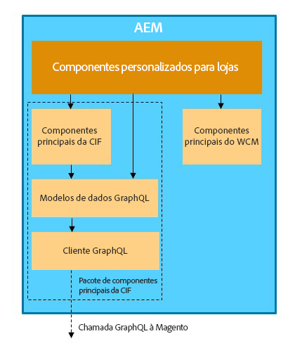

# Integração entre AEM e Adobe Commerce usando a Commerce Integration Framework {#aem-framework}

O Experience Manager e o Adobe Commerce são perfeitamente integrados usando a Commerce Integration Framework (CIF). A CIF permite que o AEM Adobe Commerce acesse e se comunique diretamente com a instância de comércio usando o [APIs do GraphQL](https://devdocs.magento.com/guides/v2.4/graphql/).

>[!NOTE]
>
> A versão mínima da API do GraphQL com suporte é 2.3.5. Alguns recursos são compatíveis somente com versões mais recentes ou apenas com a edição do Adobe Commerce.

>[!NOTE]
>
>O GraphQL é usado atualmente em dois cenários (separados) no Adobe Experience Manager (AEM) as a Cloud Service:
>
>* Nesse cenário, a CIF se comunica com o comércio via GraphQL.
>* [Fragmentos de conteúdo do AEM trabalham em conjunto com a API GraphQL do AEM (uma implementação personalizada, com base no GraphQL padrão), para fornecer conteúdo estruturado para uso em seus aplicativos](/help/headless/graphql-api/content-fragments.md).

## Visão geral da arquitetura {#overview}

Esta é a arquitetura geral:

Na CIF, há suporte para padrões de comunicação do lado do servidor e do lado do cliente.
As chamadas de APIs do lado do servidor são implementadas usando o modelo integrado e genérico [cliente do GraphQL](https://github.com/adobe/commerce-cif-graphql-client) em combinação com um [conjunto de modelos de dados gerados](https://github.com/adobe/commerce-cif-magento-graphql) para o esquema de comércio do GraphQL. Além disso, podem ser usados qualquer consulta ou mutação GraphQL no formato GQL.

Para os componentes do lado do cliente, que são criados usando [React](https://reactjs.org/), o [Cliente Apollo](https://www.apollographql.com/docs/react/) é usada.

## Arquitetura dos Componentes principais da CIF do AEM {#cif-core-components}

[Componentes principais da CIF do AEM](https://github.com/adobe/aem-core-cif-components) seguir padrões de design e práticas recomendadas muito semelhantes aos da [Componentes principais do WCM no AEM](https://github.com/adobe/aem-core-wcm-components).

A lógica de negócios e a comunicação de back-end com o Adobe Commerce para os Componentes principais da CIF do AEM são implementadas nos Modelos do Sling. Caso seja necessário personalizar essa lógica para atender aos requisitos específicos do projeto, o padrão de delegação para Modelos do Sling pode ser usado.

>[!TIP]
>
>A página [Personalizar os Componentes principais da CIF do AEM](../customizing/customize-cif-components.md) tem um exemplo detalhado e oferece as práticas recomendadas para personalizar os componentes principais da CIF.

Nos projetos, os Componentes principais da CIF do AEM e os componentes do projeto personalizado podem recuperar facilmente o cliente configurado para uma loja da Adobe Commerce associada a uma página do AEM por meio da configuração com reconhecimento de contexto do Sling.
