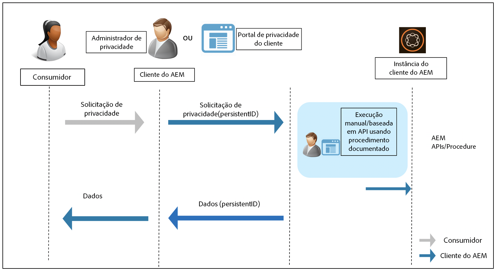

# Disponibilidade do Adobe Experience Manager as a Cloud Service para os Regulamentos de proteção e privacidade de dados {#aem-readiness-for-data-protection-and-data-privacy-regulations}

>[!WARNING]
>
>O conteúdo deste documento não constitui um aconselhamento jurídico e não se destina a substituir tal aconselhamento.
>
>Consulte o departamento jurídico da sua empresa para obter aconselhamento sobre as regulamentações de proteção e privacidade de dados.

>[!NOTE]
>
>Para obter mais informações sobre respostas do Adobe a problemas de privacidade e o que essas respostas significam para você como cliente do Adobe, consulte [Centro de privacidade do Adobe](https://www.adobe.com/br/privacy.html).

Para ajudar os clientes do Adobe a cumprir esses regulamentos, a Adobe está fornecendo documentação e procedimentos (com APIs, quando disponíveis) para os administradores de privacidade do cliente e administradores do AEM:

* A documentação ajuda os administradores a lidar com solicitações de proteção e privacidade de dados.
* Os procedimentos documentados permitem que os clientes executem as solicitações normativas manualmente ou façam chamadas de API, quando disponíveis, de um portal ou serviço externo.

>[!CAUTION]
>
>Os detalhes documentados aqui são restritos ao Adobe Experience Manager as a Cloud Service.
>
>Os dados de outro Adobe On-demand Service, juntamente com quaisquer solicitações de privacidade relacionadas, exigem que ações sejam tomadas nesse serviço.
>
>Para obter mais informações, consulte [Centro de privacidade do Adobe](https://www.adobe.com/br/privacy.html).

## Introdução {#introduction}

As instâncias do Adobe Experience Manager as a Cloud Service e os aplicativos executados nelas pertencem e são operadas por clientes do Adobe.

Como consequência, as regulamentações de proteção de dados, como GDPR, CCPA e outras, são em grande parte de responsabilidade dos clientes.

Como breve introdução, os regulamentos relativos à privacidade e proteção de dados incluem novas regras que devem ser seguidas pelas funções de:

* Entidades de Negócios (CCPA) e/ou Controladores de Dados (GDPR)

* Fornecedores de serviços (CCPA) e/ou Processadores de dados (GDPR)

As principais disposições desses regulamentos são as seguintes:

1. Definição ampliada de dados pessoais para incluir todas as IDs exclusivas; como nos dados direta e indiretamente identificáveis.

2. Requisitos de consentimento reforçados.

3. Aumento do foco nos direitos de exclusão (eliminação de dados).

4. Recusar a venda de dados.

Para o Adobe Experience Manager as a Cloud Service:

* As instâncias e os aplicativos que são executados nelas pertencem e são operadas pelo cliente.

   * A propriedade significa efetivamente que o cliente gerencia as funções normativas, incluindo Entidades de negócios e Provedor de serviços, Controlador de dados e Processador de dados, entre outras.

   * O Adobe Experience Platform Privacy Service não faz parte do fluxo de trabalho para AEM, conforme ilustrado no diagrama abaixo.

* O AEM inclui documentação e procedimentos para o administrador de privacidade do cliente e/ou o administrador AEM executarem as solicitações de regulamento de privacidade, seja manualmente ou por meio de APIs, quando disponível.

* Nenhum novo serviço ou interface foi adicionado.

   * Em vez disso, os procedimentos e as APIs estão documentados para uso pelas interfaces/portais do cliente que lidam com solicitações de regulamento de privacidade.

* O AEM não inclui ferramentas prontas para uso para suportar o fluxo de trabalho de solicitações de privacidade.

   * O Adobe fornece documentação e procedimentos para o administrador de privacidade do cliente, o administrador de AEM ou ambos, permitindo que eles executem manualmente solicitações relacionadas a regulamentos de privacidade.

O Adobe está fornecendo procedimentos para lidar com solicitações de privacidade relacionadas a Acesso, Exclusão e Não participação no Adobe Experience Manager as a Cloud Service. Para alguns casos, há APIs disponíveis que podem ser chamadas de um portal desenvolvido pelo cliente ou scripts para ajudar na automação.

O diagrama a seguir ilustra um fluxo de trabalho de solicitação de privacidade (ilustrado com o Adobe Experience Manager 6.5):

## Adobe Experience Manager as a Cloud Service e Disponibilidade regulamentar {#aem-as-a-cloud-service-and-regulatory-readiness}

Consulte as seções abaixo para obter a documentação regulamentar para as áreas de produtos do AEM as a Cloud Service.

## Adobe Experience Manager as a Cloud Service Foundation {#aem-foundation}

Consulte [Disponibilidade do AEM Foundation para Regulamentos de proteção e privacidade de dados](/help/compliance/data-privacy-and-protection-readiness/foundation-readiness.md).

## Sites do Adobe Experience Manager as a Cloud Service {#aem-sites}

Consulte [Disponibilidade do AEM Sites para Regulamentos de proteção e privacidade de dados](/help/compliance/data-privacy-and-protection-readiness/sites-readiness.md)

## Integração do Adobe Experience Manager as a Cloud Service com o Adobe Target e o Adobe Analytics {#aem-integration-with-adobe-target-adobe-analytics}

As integrações do Adobe Experience Manager as a Cloud Service com o Adobe Target e o Adobe Analytics são implementadas com serviços prontos de proteção e privacidade de dados (por exemplo, GDPR). Nenhum dado pessoal do Adobe Target ou Adobe Analytics é armazenado no AEM em relação às integrações.
Para obter mais informações, consulte:

* [Adobe Target - Visão geral sobre a privacidade](https://experienceleague.adobe.com/docs/target-dev/developer/implementation/privacy/cmp-privacy-and-general-data-protection-regulation.html)

* [Fluxo de trabalho da Privacidade de dados do Adobe Analytics](https://experienceleague.adobe.com/docs/analytics/admin/admin-tools/data-governance/an-gdpr-workflow.html)
