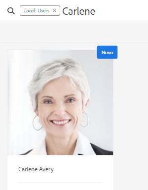

# Regulamentos de disponibilidade da base para proteção e privacidade de dados do Adobe Experience Manager as a Cloud Service {#aem-foundation-readiness-for-data-protection-and-data-privacy-regulations}

>[!WARNING]
>
>O conteúdo deste documento não constitui um aconselhamento jurídico e não se destina a substituir tal aconselhamento.
>
>Consulte o departamento jurídico da sua empresa para obter aconselhamento sobre as regras de proteção e privacidade de dados.

>[!NOTE]
>
>Para obter mais informações sobre resposta do Adobe a problemas de privacidade e o que isso significa para você como cliente de Adobe, consulte [Central de Privacidade do Adobe](https://www.adobe.com/privacy.html).

## Suporte para proteção e privacidade de dados da AEM Foundation {#aem-foundation-data-privacy-and-protection-support}

No nível da AEM Foundation, os dados pessoais armazenados são mantidos no Perfil de usuário. Portanto, as informações neste artigo abordam principalmente como acessar e excluir perfis de usuário, para tratar das solicitações de acesso e exclusão respectivamente.

## Acessar um perfil de usuário {#accessing-a-user-profile}

### Etapas manuais {#manual-steps}

1. Abra o console de Administração do Usuário, navegando até **[!UICONTROL Ferramentas - Segurança - Usuários]** ou navegando diretamente para `https://<serveraddress>:<serverport>/security/users.html`

<!--
   
-->

1. Em seguida, procure o usuário em questão digitando o nome na barra de pesquisa na parte superior da página:

   

1. Finalmente, abra o perfil do usuário clicando nele e marque na guia **[!UICONTROL Details]**.

   

### API HTTP {#http-api}

Como mencionado, o Adobe fornece APIs para acessar dados do usuário, a fim de facilitar a automação. Há vários tipos de APIs que você pode usar:

**API UserProperties**

```shell
curl -u user:password http://localhost:4502/libs/granite/security/search/profile.userproperties.json\?authId\=cavery
```

**API Sling**

**Descobrindo a página inicial do usuário:**

```xml
curl -g -u user:password 'http://localhost:4502/libs/granite/security/search/authorizables.json?query={"condition":[{"named":"cavery"}]}'
     {"authorizables":[{"type":"user","authorizableId_xss":"cavery","authorizableId":"cavery","name_xss":"Carlene Avery","name":"Carlene Avery","home":"/home/users/we-retail/DSCP-athB1NYLBXvdTuN"}],"total":1}
```

**Recuperando dados do usuário:**

Usando o caminho do nó da propriedade home da carga JSON retornada do comando acima:

```shell
curl -u user:password  'http://localhost:4502/home/users/we-retail/DSCP-athB1NYLBXvdTuN/profile.-1.json'
```

```shell
curl -u user:password  'http://localhost:4502/home/users/we-retail/DSCP-athB1NYLBXvdTuN/profiles.-1.json'
```

## Desativar um usuário e excluir os perfis associados {#disabling-a-user-and-deleting-the-associated-profiles}

### Desativar usuário {#disable-user}

1. Abra o console de Administração do Usuário e procure o usuário em questão, conforme descrito acima.
2. Passe o mouse sobre o usuário e clique no ícone de seleção. O perfil ficará cinza, indicando que está selecionado.

3. Pressione o botão **Disable** no menu superior para desativar o usuário:

   

4. Por último, confirme a ação.

   A interface do usuário indicará que a conta do usuário foi desativada ao esmaecer e adicionar um bloqueio à placa de perfil:

   

### Excluir informações do perfil do usuário {#delete-user-profile-information}

>[!NOTE]
>
>Para o AEM as a Cloud Service, não há nenhum procedimento manual disponível na interface do usuário para excluir um perfil de usuário, pois o CRXDE não está acessível.

### API HTTP {#http-api-1}

Os procedimentos a seguir usam a ferramenta de linha de comando `curl` para ilustrar como desativar o usuário com a **[!UICONTROL cavery]** `userId` e excluir seus perfis disponíveis no local padrão.

**Descobrindo a página inicial do usuário:**

```shell
curl -g -u user:password 'http://localhost:4502/libs/granite/security/search/authorizables.json?query={"condition":[{"named":"cavery"}]}'
     {"authorizables":[{"type":"user","authorizableId_xss":"cavery","authorizableId":"cavery","name_xss":"Carlene Avery","name":"Carlene Avery","home":"/home/users/we-retail/DSCP-athB1NYLBXvdTuN"}],"total":1}
```

**Desabilitando o usuário:**

Usando o caminho do nó da propriedade home da carga JSON retornada do comando acima:

```shell
curl -X POST -u user:password -FdisableUser="describe the reasons for disabling this user (Data Privacy in this case)" 'http://localhost:4502/home/users/we-retail/DSCP-athB1NYLBXvdTuN.rw.userprops.html'
```

**Excluindo perfis de usuário**

Usando o caminho de nó da propriedade home da carga JSON retornada do comando de descoberta de conta e os locais conhecidos do nó de perfil prontos para uso:

```shell
curl -X POST -u user:password -H "Accept: application/json,**/**;q=0.9" -d ':operation=delete' 'http://localhost:4502/home/users/we-retail/DSCP-athB1NYLBXvdTuN/profile'
```

```shell
curl -X POST -u user:password -H "Accept: application/json,**/**;q=0.9" -d ':operation=delete' 'http://localhost:4502/home/users/we-retail/DSCP-athB1NYLBXvdTuN/profile'
```
