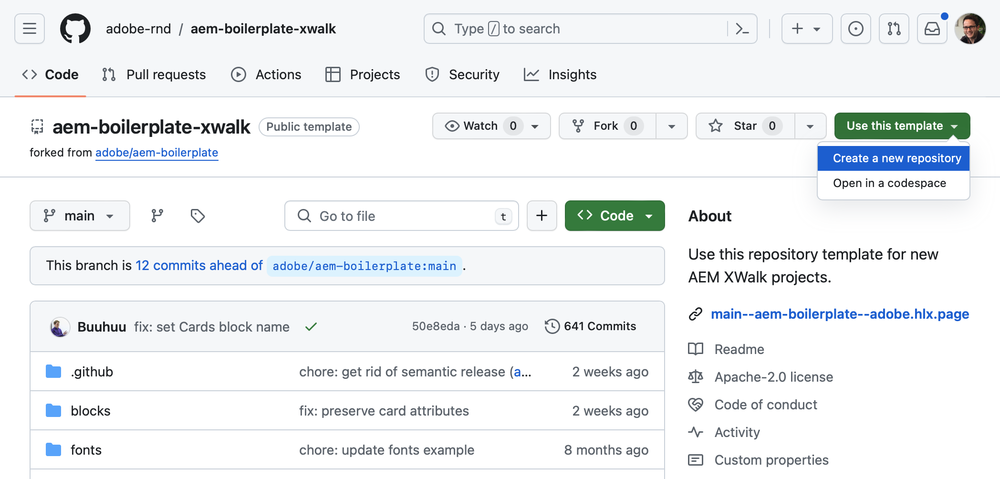
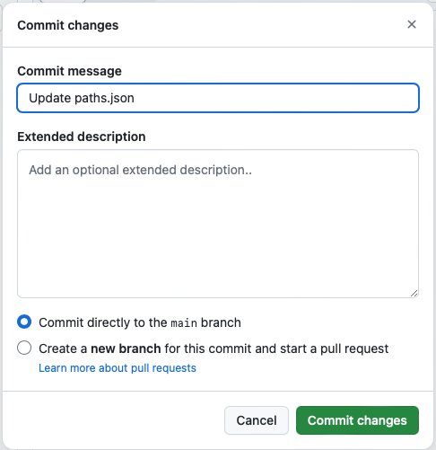
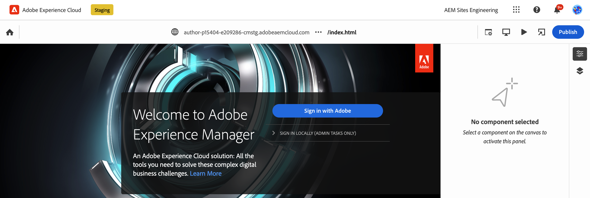
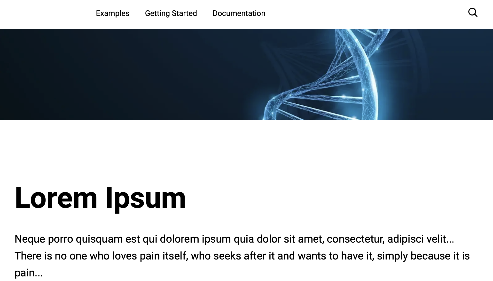

# Guia de introdução do desenvolvedor para criação de AEM com o Edge Delivery Services {#edge-dev-getting-started}

Este guia colocará você em funcionamento com um novo site do Adobe Experience Manager usando o Edge Delivery Services e o Editor universal para criação de conteúdo.

## Pré-requisitos {#prerequisites}

Antes de começar este guia, você já deve estar familiarizado com as noções básicas do e ter acesso ao Edge Delivery Services, incluindo:

* Você concluiu o [Tutorial do Edge Delivery Service.](/help/edge/developer/tutorial.md)
* Você tem acesso a um [sandbox AEM Cloud Service.](/help/implementing/cloud-manager/getting-access-to-aem-in-cloud/introduction-sandbox-programs.md)
* Você tem [ativou o Editor universal no mesmo ambiente de sandbox.](/help/implementing/universal-editor/getting-started.md)

## Escolha o editor direito {#editor-choice}

O AEM oferece dois editores de conteúdo diferentes e a escolha de qual usar depende da sua situação.

* **Editor universal** - Essa deve ser a opção padrão para novos sites.
* **Editor de página AEM** - Essa opção deve ser escolhida para uma migração existente do AEM Sites para o Edge Delivery Services.

Este guia tem como foco projetos AEM em Edge Delivery Services usando o Editor universal. Consulte o documento [Utilização de Edge Delivery Services com AEM](/help/edge/using.md) para obter mais detalhes sobre a escolha do editor correto e a migração dos sites de AEM existentes para o Edge Delivery Services.

## Conceitos principais ao desenvolver para Edge Delivery Services {#core-concepts}

O Edge Delivery Services é baseado em torno do conceito de blocos. O AEM vem com uma biblioteca abrangente de blocos predefinidos, que podem ser estendidos para atender às necessidades do seu projeto. O código para projetos Edge Delivery Services é gerenciado no GitHub.

### Blocos {#blocks}

Os blocos são a parte mais fundamental de uma página entregue pelo Edge Delivery Services. Um bloco encapsula o estilo e o código que direciona um componente lógico de uma página de conteúdo.

O AEM fornece blocos padrão como parte do produto dentro da placa do projeto. Esses blocos incluem cabeçalho, texto, imagens, links, listas, etc.

>[!TIP]
>
>Consulte a [Criar seção](/help/edge/developer/block-collection.md) da documentação do Edge Delivery Services para obter mais detalhes sobre blocos e como desenvolver para serviços de Entrega de borda.

### Edge Delivery Services e GitHub {#github-edge}

O Edge Delivery aproveita o GitHub para que você possa gerenciar e implantar o código diretamente do seu repositório GitHub.

Seus autores podem criar conteúdo usando a Criação baseada em documento ou conteúdo no AEM com o Universal Editor. Os desenvolvedores podem personalizar a funcionalidade do site usando CSS e JavaScript no GitHub, independentemente de como os autores criam seu conteúdo.

Os sites são criados automaticamente para cada uma de suas ramificações, da pré-visualização de conteúdo à produção. Todos os recursos que você coloca no repositório GitHub estão disponíveis no seu site sem um processo de criação.

>[!TIP]
>
>Consulte a [Criar seção](/help/edge/developer/block-collection.md) da documentação do Edge Delivery Services para obter mais detalhes sobre blocos e como desenvolver para serviços de Entrega de borda.

## Introdução à criação e ao Edge Delivery Services do AEM {#getting-started}

Depois de ter cumprido [os pré-requisitos](#prerequisites) e tenham feito [a opção de usar o Editor universal,](#editor-choice) você pode começar com seu próprio projeto.

### Criar seu projeto do GitHub {#create-github-project}

Primeiro, será necessário criar um novo projeto no GitHub, com base no modelo de Adobe.

1. Navegue até [`https://github.com/adobe-rnd/aem-boilerplate-xwalk`](https://github.com/adobe-rnd/aem-boilerplate-xwalk) e clique em **Usar este modelo** e selecione **Criar um novo repositório**.

   * Você precisará fazer logon no GitHub para ver essa opção.

   

1. Por padrão, o repositório será atribuído a você. Altere isso conforme necessário, forneça um nome de repositório e uma descrição e clique em **Criar repositório**.

   

1. Em uma nova guia no mesmo navegador, navegue até [`https://github.com/apps/aem-code-sync`](https://github.com/apps/aem-code-sync) e clique em **Configurar**.

   

1. Clique em **Configurar** para a organização em que você criou o novo repositório na etapa anterior.

   

1. Na página GitHub de sincronização de código do AEM, em **Acesso ao repositório**, selecione **Selecionar apenas repositórios**, selecione o repositório criado na etapa anterior e clique em **Salvar**.

   

1. Depois que a Sincronização de código AEM estiver instalada, você receberá uma tela de confirmação. Retorne à guia do navegador do novo repositório.

   

1. Clique em `fstab.yaml` para abri-lo e, em seguida, o **Editar este arquivo** ícone para editá-lo.

   

1. Edite o `fstab.yaml` arquivo para atualizar o ponto de montagem do projeto. Substitua o URL padrão dos documentos do Google pelo URL da sua instância de criação do AEM as a Cloud Service e clique em **Confirmar alterações...**.

   * `https://<aem-author>/bin/franklin.delivery/<owner>/<repository>/main`
   * Alterar o ponto de montagem informa ao Edge Delivery Services onde localizar o conteúdo do site.

   

1. Adicione uma mensagem de confirmação conforme desejado e clique em **Confirmar alterações**, comprometendo-os diretamente com a `main` filial.

   

1. Retorne à raiz do repositório e clique em `paths.json` e, em seguida, o **Editar este arquivo** ícone.

   

1. O mapeamento padrão usará o nome do repositório. Atualize o mapeamento padrão conforme necessário para seu projeto com `/content/<site-name>/:/` e clique em **Confirmar alterações...**.

   * Forneça o seu próprio `<site-name>`. Você precisará dele em uma etapa posterior.
   * Os mapeamentos informam ao Edge Delivery Services como mapear o conteúdo no repositório AEM para o URL do site.

   

1. Adicione uma mensagem de confirmação conforme desejado e clique em **Confirmar alterações**, comprometendo-os diretamente com a `main` filial.

   

### Criar e editar um novo site AEM {#create-aem-site}

Agora que você tem um projeto GitHub, deve criar um novo site AEM que o projeto possa usar.

>[!NOTE]
>
>Para editar o site usando o Editor universal, é necessário usar um navegador com base em Chromium.

1. Baixe a criação de AEM mais recente com o modelo de site Edge Delivery Services do GitHub em [`https://github.com/adobe-rnd/aem-boilerplate-xwalk/releases`](https://github.com/adobe-rnd/aem-boilerplate-xwalk/releases).

1. Faça logon na instância de criação do AEM as a Cloud Service e navegue até o console Sites e toque ou clique **Criar** -> **Site do modelo**.

   

1. No **Selecionar um modelo de site** do assistente criar site, clique na guia **Importar** botão para importar um novo template.

   

1. Carregue a criação de AEM com o modelo de site Edge Delivery Services que você baixou do GitHub.

   * O template deve ser carregado apenas uma vez. Depois de carregado, ele pode ser reutilizado para criar sites adicionais.

1. Depois que o modelo for importado, ele aparecerá no assistente. Toque ou clique para selecioná-lo e, em seguida, toque ou clique **Próxima**.

   

1. Forneça os seguintes campos e toque ou clique **Criar**.

   * **Título do site** - Adicione um título descritivo para o site.
   * **Título do site** - Use o `<site-name>` definido na variável [etapa anterior.](#create-github-project)
   * **URL do GitHub** - Use o URL do projeto GitHub criado na etapa anterior.

   

1. O AEM confirma a criação do site com uma caixa de diálogo. Toque ou clique **OK** de indeferimento.

   

1. No console Sites, navegue até a `index.html` do site recém-criado e toque ou clique **Editar** na barra de ferramentas.

   

1. O Editor universal é aberto em uma nova guia. Talvez seja necessário tocar ou clicar **Entrar com o Adobe** para autenticar e editar sua página.

   

Agora você pode editar seu site usando o Editor universal. Consulte a [Documentação do Universal Editor](/help/sites-cloud/authoring/universal-editor/authoring.md) para obter mais informações.

### Publicar seu novo site {#publishing}

Quando terminar de editar o novo site usando o Editor universal, você poderá publicar o conteúdo.

1. No console Sites, selecione todas as páginas criadas para o novo site e toque ou clique **Publicação rápida** na barra de ferramentas.

   

1. Toque ou clique **Publish** no diálogo de confirmação para iniciar o processo.

   

1. Abra uma nova guia no mesmo navegador e navegue até o URL do novo site.

   * `https://main--<repository-name>--<owner>.hlx.page`

1. Veja seu conteúdo publicado.

   

## Próximas etapas {#next-steps}

Agora que você tem um projeto AEM em funcionamento com Edge Delivery Services, pode começar a criar e estilizar seus próprios blocos.

Consulte o guia [Criação de blocos instrumentados para uso com o editor universal](/help/edge/aem-authoring/create-block.md) para obter mais informações.

>[!TIP]
>
>Para uma apresentação completa da criação de um novo projeto Edge Delivery Services habilitado para a criação de AEM com AEM as a Cloud Service como fonte de conteúdo, visualize [este webinário de GEMs AEM.](https://experienceleague.adobe.com/en/docs/events/experience-manager-gems-recordings/gems2024/aem-authoring-and-edge-delivery)

