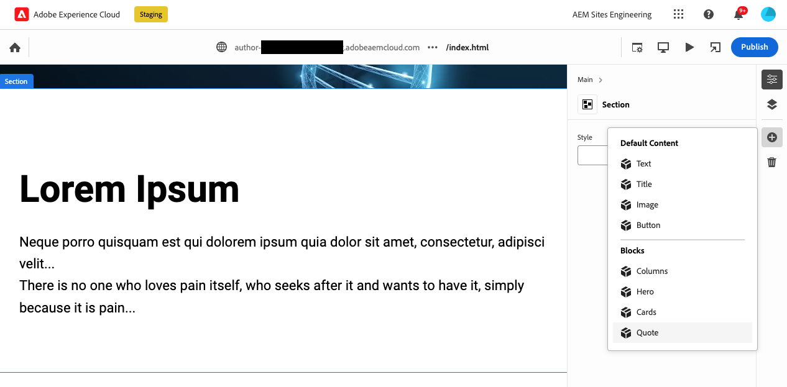
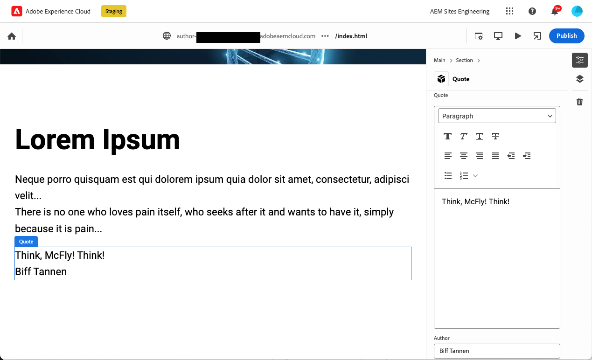

# Criação de blocos instrumentados para uso com o editor universal {#create-block}

Saiba como criar blocos instrumentados para uso com o Editor universal em criação de AEM com projetos Edge Delivery Services.

{{aem-authoring-edge-early-access}}

## Pré-requisitos {#prerequisites}

Este guia fornece instruções passo a passo sobre como criar blocos instrumentados para o Editor universal na criação de AEM com projetos Edge Delivery Services. Ela abrange a adição de componentes, o carregamento de definições de componentes no Universal Editor, a publicação de páginas, a implementação de decoração e estilos de blocos, a introdução das alterações na produção e a verificação delas. Ao concluir este guia, você pode criar e implantar um novo bloco para seu próprio projeto.

Este guia requer necessariamente conhecimento existente de criação de AEM com projetos Edge Delivery Services, bem como o editor universal. Antes de começar este guia, você já deve ter acesso aos Edge Delivery Services e estar familiarizado com as suas noções básicas, incluindo:

Você concluiu o [Tutorial do Edge Delivery Service.](/help/edge/developer/tutorial.md)
* Você tem acesso a um [sandbox AEM Cloud Service.](/help/implementing/cloud-manager/getting-access-to-aem-in-cloud/introduction-sandbox-programs.md)
* Você tem [ativou o Editor universal no mesmo ambiente de sandbox.](/help/implementing/universal-editor/getting-started.md)
* Você concluiu o [Guia de introdução do desenvolvedor para criação de AEM com o Edge Delivery Services](/help/edge/edge-dev-getting-started.md) guia.

Este guia tem como base o trabalho realizado na [Guia de introdução do desenvolvedor para criação de AEM com o Edge Delivery Services](/help/edge/edge-dev-getting-started.md) guia.

## Adicionar um novo bloco ao seu projeto {#add-block}

Neste guia, você criará um bloco para renderizar uma cotação memorável em sua página.

Para simplificar este exemplo, todas as alterações são feitas no `main` ramificação do repositório do projeto. É claro que para o seu projeto real, [você deve seguir as práticas recomendadas de desenvolvimento](https://www.aem.live/docs/dev-collab-and-good-practices) desenvolvendo em uma ramificação diferente e revisando todas as alterações por meio de uma solicitação de pull antes de mesclar com `main`.

A Adobe recomenda que você desenvolva blocos em uma abordagem de três fases:

1. Crie a definição e o modelo do bloco, revise-o e leve-o para produção.
1. Crie conteúdo com o novo bloco.
1. Implemente a decoração e os estilos do novo bloco.

O exemplo de bloco de citação a seguir segue essa abordagem.

### Criar Definição e Modelo de Bloco {#create-block-model}

1. Clonar o projeto GitHub localmente que você criou na [Guia de introdução do desenvolvedor para criação de AEM com o Edge Delivery Services](/help/edge/edge-dev-getting-started.md) guia e abra-o em um editor de sua escolha.

   * O código Microsoft é usado aqui para fins ilustrativos.

   

1. Edite o `component-definition.json` arquivo na raiz do projeto, adicione a seguinte definição para o novo bloco de cotação e salve o arquivo.

   ```json
   {
     "title": "Quote",
     "id": "quote",
     "plugins": {
       "xwalk": {
         "page": {
           "resourceType": "core/franklin/components/block/v1/block",
           "template": {
             "name": "Quote",
             "model": "quote",
             "quote": "<p>Think, McFly! Think!</p>",
             "author": "Biff Tannen"
           }
         }
       }
     }
   }
   ```

   

1. Edite o `component-models.json` na raiz do projeto e adicione o seguinte [definição de modelo](/help/implementing/universal-editor/field-types.md#model-structure) para o novo bloco de cotação e salve o arquivo.

   * Consulte o documento [Modelagem de conteúdo para criação no AEM com projetos Edge Delivery Services](/help/edge/content-modeling.md) para obter mais informações sobre o que é importante considerar ao criar modelos de conteúdo.

   ```json
   {
     "id": "quote",
     "fields": [
        {
          "component": "text-area",
          "name": "quote",
          "value": "",
          "label": "Quote",
          "valueType": "string"
        },
        {
          "component": "text-input",
          "valueType": "string",
          "name": "author",
          "label": "Author",
          "value": ""
        }
      ]
   }
   ```

   

1. Edite o `component-filters.json` arquivo na raiz do projeto e adicione o bloco de orçamento à [definição de filtro](/help/implementing/universal-editor/customizing.md#filtering-components) para permitir que o bloco seja adicionado a qualquer seção e salve o arquivo.

   ```json
   {
     "id": "section",
     "components": [
       "text",
       "image",
       "button",
       "title",
       "hero",
       "cards",
       "columns",
       "quote"
      ]
   }
   ```

   

1. Usando o Git, confirme essas alterações no `main` filial.

   * Submetendo a `main` é apenas para fins ilustrativos. [Seguir as práticas recomendadas](https://www.aem.live/docs/dev-collab-and-good-practices) e use uma solicitação de pull para o trabalho real do projeto.

### Criar conteúdo com o bloco {#create-content}

Agora que o bloco de cotação básico está definido e comprometido com o projeto de amostra, é possível adicionar um bloco de cotação a uma página existente.

1. Em um navegador, entre no AEM as a Cloud Service. [Usando o console Sites,](/help/sites-cloud/authoring/basic-handling.md) navegue até o site que você criou na [Guia de introdução do desenvolvedor para criação de AEM com o Edge Delivery Services](/help/edge/edge-dev-getting-started.md) e selecione uma página.

   * Nesse caso, `index` é utilizada para fins ilustrativos.

   

1. Toque ou clique **Editar** na barra de ferramentas do console e no Editor universal se abre.

   * Para carregar a página, talvez seja necessário tocar ou clicar em **Entrar com o Adobe** para autenticar no AEM no Editor universal.

1. No Editor universal, selecione uma seção. No painel de propriedades, toque ou clique no **Adicionar** e selecione o novo **Aspas** bloquear no menu.

   * A variável **Adicionar** O ícone é um símbolo de mais.
   * Você sabe que selecionou uma seção se o contorno azul do objeto selecionado tiver uma guia rotulada **Seção**.
   * Neste exemplo, tocar ou clicar um pouco acima do **Lorem Ipsum** cabeçalho seleciona uma seção que contém o cabeçalho e o texto lorem ipsum.

   

1. A página é recarregada e o bloco de aspas é adicionado à parte inferior da seção selecionada com o conteúdo padrão especificado no `component-definitions.json` arquivo.

   * O bloco de aspas pode ser selecionado e editado como qualquer outro bloco no local ou no painel de propriedades.
   * O estilo será aplicado em outra etapa.

   

1. Quando estiver satisfeito com o conteúdo da sua cotação, você poderá publicar a página tocando ou clicando no **Publish** na barra de ferramentas do Editor universal.

1. Verifique se o conteúdo foi publicado navegando até a página publicada. O link será semelhante a `https://<branch>--<repo>--<owner>.hlx.page`

   

### Estilo do Bloco {#style-block}

Agora que você tem um bloco de cotação de trabalho, é possível aplicar o estilo a ele.

1. Retorne ao editor do projeto.

1. Criar um `quote` pasta sob o `blocks` pasta.

   

1. No novo `quote` pasta, adicione um `quote.js` arquivo para implementar a decoração de blocos, adicionando o seguinte JavaScript e salvando o arquivo.

   ```javascript
   export default function decorate(block) {
     const [quoteWrapper] = block.children;
   
     const blockquote = document.createElement('blockquote');
     blockquote.textContent = quoteWrapper.textContent.trim();
     quoteWrapper.replaceChildren(blockquote);
   }
   ```

   


1. No `quote` pasta, adicione um `quote.css` arquivo para definir o estilo do bloco, adicionando o seguinte código CSS e salvando o arquivo.

   ```css
   .block.quote {
       background-color: #ccc;
       padding: 0 0 24px;
       display: flex;
       flex-direction: column;
       margin: 1rem 0;
   }
   
   .block.quote blockquote {
       margin: 16px;
       text-indent: 0;
   }
   
   .block.quote > div:last-child > div {
       margin: 0 16px;
       font-size: small;
       font-style: italic;
       position: relative;
   }
   
   .block.quote > div:last-child > div::after {
       content: "";
       display: block;
       position: absolute;
       left: 0;
       bottom: -8px;
       height: 5px;
       width: 30px;
       background-color: darkgray;
   }
   ```

   

1. Usando o Git, confirme essas alterações no `main` filial.

   * Submetendo a `main` é apenas para fins ilustrativos. [Seguir as práticas recomendadas](https://www.aem.live/docs/dev-collab-and-good-practices) e use uma solicitação de pull para o trabalho real do projeto.

1. Retorne à guia do navegador do Editor universal, onde você estava editando a página do projeto, e recarregue a página para exibir seu bloco estilizado.

1. Consulte o bloco de aspas agora estilizado na página.

   

1. Verifique se as alterações foram enviadas para produção navegando até a página publicada. O link será semelhante a `https://<branch>--<repo>--<owner>.hlx.page`

   

Parabéns! Agora você tem um bloco de cotação totalmente funcional e estilizado. Você pode usar este exemplo como base para criar seus próprios blocos específicos de projeto.

## Uso de outras ramificações de trabalho {#other-branches}

Este guia exigia que você se comprometesse diretamente com a `main` por simplicidade. Para experimentação em um repositório de amostra, isso geralmente não é um problema. Para trabalho real do projeto, [você deve seguir as práticas recomendadas de desenvolvimento](https://www.aem.live/docs/dev-collab-and-good-practices) desenvolvendo em uma ramificação diferente e revisando todas as alterações por meio de uma solicitação de pull antes de mesclar com `main`.

Quando você não estiver desenvolvendo no `main` ramificação, é possível anexar `?ref=<branch>` na barra de localização do Editor universal para carregar a página da sua ramificação. `<branch>` é o nome da ramificação como seria usado para a visualização do seu projeto ou URLs ativos, por exemplo, `https://<branch>--<repo>--<owner>.hlx.page`.

A publicação de conteúdo com um novo modelo só é permitida quando o modelo é mesclado com a variável `main` filial.
