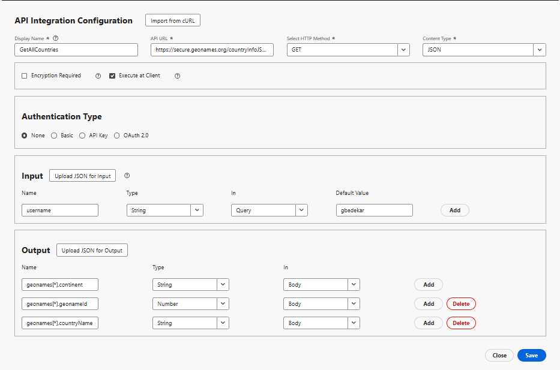

# Criar integração com a API

Neste tutorial, são criadas 2 integrações de API

- GetAllCountry retorna uma lista de países
- GetChildren - Retorna filhos imediatos do país ou estado representado por geonameId

## GetAllCountries - configuração de integração de API

- Configuração da integração da API

   - Nome de exibição: GetAllCountry → Um rótulo para esta API em seu sistema.

   - URL da API: `https://secure.geonames.org/countryInfoJSON` - o ponto de extremidade que você está chamando.

   - Método HTTP: GET - você está fazendo uma simples solicitação do GET.

   - Tipo de conteúdo: JSON - a resposta é esperada no formato JSON.

- Opções:

   - Criptografia necessária desmarcada - nenhuma camada de criptografia além de HTTPS.

   - Executar no cliente marcado - a chamada é executada do cliente/navegador, não do lado do servidor.
- Tipo de autenticação
   - Nenhum - já que a API GeoNames não requer chaves OAuth ou API em cabeçalhos
- Entrada:
   - A seção de entrada define o que é enviado para a API
   - **username** → type: String, enviado no Query, default: gbedekar.
   - Toda solicitação anexa ?username=gbedekar ao URL
- Saída
   - A saída define quais campos da resposta JSON devem ser extraídos e usados.
A resposta do GeoNames é semelhante a:

  
   - Dois campos mapeados de dentro da matriz geonames:

     geonames[*].geonameId → como um número

     geonames[*].countryName → como uma cadeia de caracteres

     O [*] significa que ele se repete em cada país da matriz.

## GetChildren

Ele solicita GeoNames para os filhos imediatos do local cujo geonamesId é passado como um parâmetro de consulta

- Configuração da integração da API

   - Nome de exibição: GetAllCountry → Um rótulo para esta API em seu sistema.

   - URL da API: `https://secure.geonames.org/children` → o ponto de extremidade que você está chamando.

   - Método HTTP: GET → você está fazendo uma simples solicitação do GET.

   - Tipo de conteúdo: JSON → A resposta é esperada no formato JSON.

- Opções:

   - Criptografia necessária desmarcada → nenhuma camada de criptografia além de HTTPS.

   - Executar no cliente marcado → a chamada é executada do cliente/navegador, não do lado do servidor.
- Tipo de autenticação
   - Nenhum - já que a API GeoNames não requer chaves OAuth ou API em cabeçalhos
- Entrada:
   - Define o que é enviado para a API
   - **username** → type: String, enviado no Query, default: gbedekar.
   - Toda solicitação anexa ?username=gbedekar ao URL
   - **geonameId** -> tipo: string. Retorna os filhos do país/estado representado pelo geonameId
   - **type** =>String. Configurar como json retorna a resposta no formato JSON.
- Saída
   - Define quais campos da resposta JSON devem ser extraídos e usados.
A resposta do GeoNames é semelhante a:

  
   - Dois campos mapeados de dentro da matriz geonames:

     geonames[*].geonameId → como um número

     geonames[*].name → como uma cadeia de caracteres

     O [*] significa que ele se repete em cada país da matriz.

