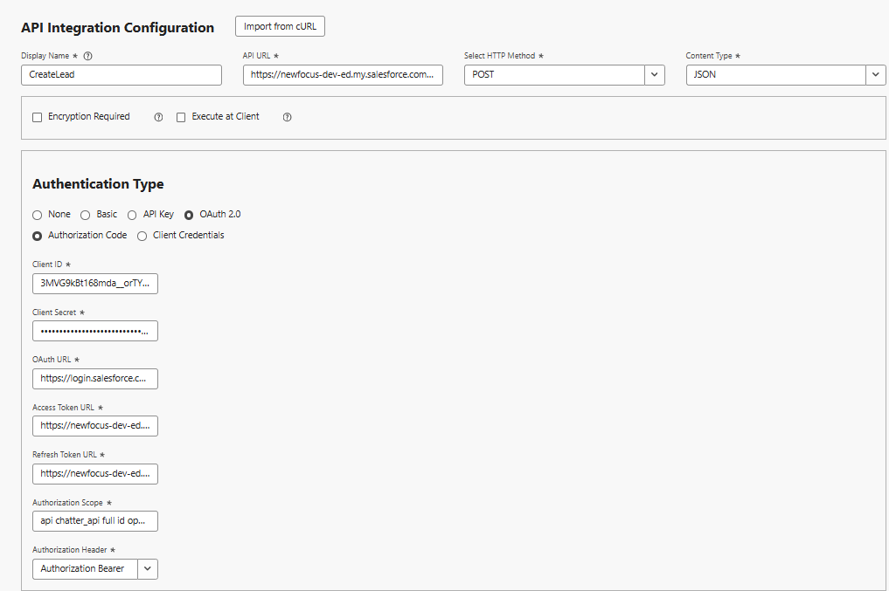
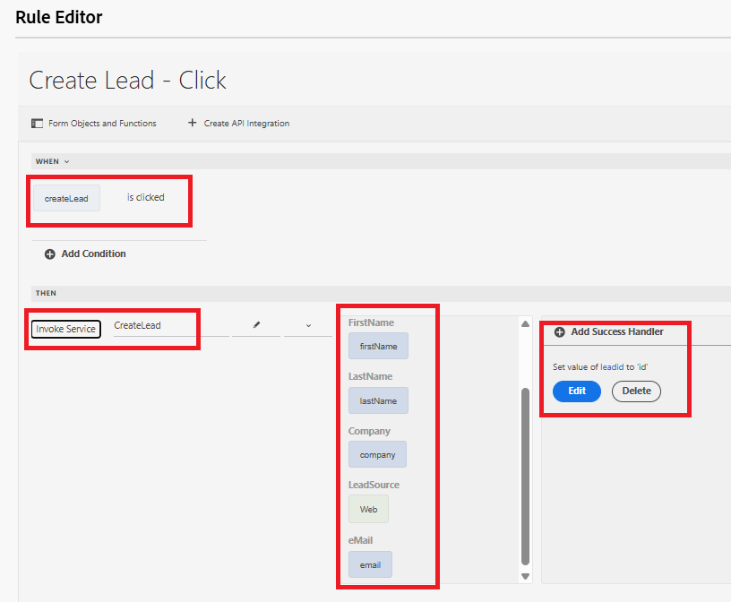

# Criar objeto de cliente potencial do Salesforce usando a integração de API

Este caso de uso mostra como criar um cliente potencial no Salesforce usando a Integração de API. Ao final do processo, você será capaz de:

Configure um [Aplicativo Conectado no Salesforce](https://help.salesforce.com/s/articleView?id=platform.ev_relay_create_connected_app.htm&type=5) para habilitar o acesso seguro à API.

Configure o CORS (Cross-Origin Resource Sharing, Compartilhamento de recursos entre origens) para permitir que o código (como o JavaScript) executado em um navegador da Web se comunique com o Salesforce de uma origem específica. Adicione a origem à lista de permissões, conforme mostrado abaixo


## Configurações do aplicativo conectado

As configurações a seguir são usadas no aplicativo conectado. Você pode atribuir os escopos OAuth dependendo de seus requisitos.


## Criar integração com a API

| Nome | Valor |
|--------------------------------|------------------|
| URL da API | https://`<your-domain>`d.my.salesforce.com/services/data/v32.0/sobjects/Lead |
| ID do cliente | Específico do aplicativo conectado |
| Segredo do cliente | Específico do aplicativo conectado |
| URL do OAuth | https://login.salesforce.com/services/oauth2/authorize |
| URL do token de acesso | https://`<your-domain>`/services/oauth2/token |
| URL do token de atualização | https://`<your-domain>`/services/oauth2/token |
| Escopo da autorização | api chatter_api id completa openid refresh_token visualforce web |
| Cabeçalho de autorização | Portador de autorização |



## Parâmetros de entrada e saída

Defina os parâmetros de entrada para a chamada de API e mapeie os parâmetros de saída usando o seguinte json

```json
{
    "id": "00QKY000001LyJR2A0",
    "success": true
}
```


## Criar um formulário

Crie um formulário adaptável simples usando o Editor universal para capturar os detalhes do objeto de cliente potencial como mostrado abaixo


Manipule o evento de clique na caixa de seleção Criar lead usando o editor de regras. Mapeie os parâmetros de entrada para os valores dos objetos de formulário apropriados, conforme mostrado abaixo. Exibir a ID do objeto Lead recém-criado no objeto TextField `leadid`


## Testar a integração

- Visualizar o formulário
- Insira alguns valores significativos
- Marque a caixa de seleção `Create Lead` para acionar a chamada de API
- A ID de Cliente Potencial do objeto de Cliente Potencial recém-criado é exibida no Campo de Texto `Lead ID`.
