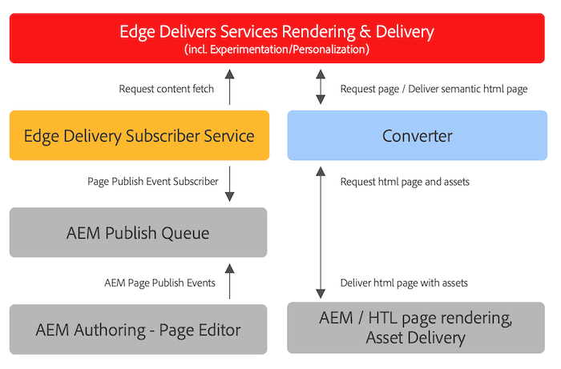

# Uso de Edge Delivery Services com projetos AEM existentes {#existing-projects}

Você não precisa esperar que um novo projeto AEM se beneficie dos Edge Delivery Services. Os Edge Delivery Services podem ser integrados ao projeto AEM existente para que você possa aproveitar seus ganhos de desempenho imediatamente.

## Limitações do editor de páginas AEM {#page-editor}

Antes do advento dos Edge Delivery Services, o conteúdo gerenciado no AEM era editado com o uso do AEM Page Editor. Se o projeto começou antes da introdução do Edge Delivery Services, é quase certo que você esteja usando o Editor de páginas.

O Editor de páginas AEM só funciona com [Componentes do AEM](/help/implementing/developing/components/overview.md) como o [Componentes principais.](https://experienceleague.adobe.com/docs/experience-manager-core-components/using/introduction.html?lang=pt-BR) Estes componentes são incompatíveis com o Edge Delivery Services. Por causa disso, são necessárias duas fases para introduzir Edge Delivery Services em um projeto existente de AEM:

* [Fase 1 - Substituir front-end](#replace-front-end)
* [Fase 2 - Alternar para o editor universal](#switch-ue)

## Fase 1 - Substituir front-end {#replace-front-end}

Na fase um, você pode continuar usando a estrutura do site AEM existente, os componentes e as ferramentas de criação. A renderização do site será reconstruída usando blocos com JavaScript e CSS e será entregue via Edge Delivery Services.

Consulte a [Criar seção](https://www.aem.live/docs/#build) da documentação do Edge Delivery Services para obter mais detalhes sobre blocos e como desenvolver para serviços de Entrega de borda.

Um conversor no App Builder será necessário para converter a saída de HTML renderizada por AEM e enviá-la para Edge Delivery Services.

A fase dois conclui o processo eliminando a sobreposição de tecnologia: Componentes principais do AEM com HTL e Java no AEM Author, Blocos baseados em JS na entrega da borda e um conversor baseado em nodeJS.

## Fase 2 - Alternar para o editor universal {#switch-ue}

Nesta fase, o Editor de páginas AEM é substituído pelo Editor universal. Como o Editor universal pode trabalhar diretamente com blocos, os Componentes principais e o conversor do AEM não serão mais necessários.

## Como começar {#how-to-get-started}

Entre em contato com o representante da Adobe para obter acesso a esse recurso.
