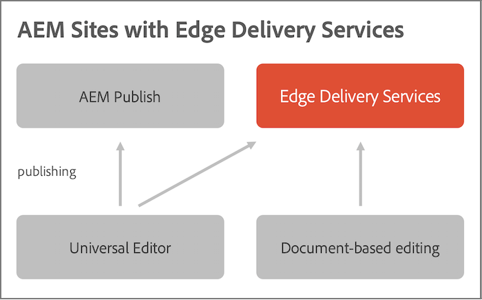

# Introdução ao AEM e Edge Delivery Services {#aem-edge}

Com o Edge Delivery Services, o AEM oferece experiências excepcionais que impulsionam o engajamento e as conversões. O AEM faz isso fornecendo experiências de alto impacto que são rápidas de serem criadas e desenvolvidas. É um conjunto combinável de serviços que permite um ambiente de desenvolvimento rápido, em que os autores podem atualizar e publicar rapidamente e novos sites são lançados rapidamente. Dessa forma, com os Edge Delivery Services você pode melhorar a conversão, reduzir custos e fornecer velocidade de conteúdo extrema.

Ao usar os Edge Delivery Services, é possível:

* Crie sites rápidos com uma pontuação Lighthouse perfeita e monitore continuamente o desempenho do site por meio do monitoramento de usuários reais (RUM).
* Aumente a eficiência da criação desvinculando as fontes de conteúdo. Pronto para uso, você pode usar a criação de AEM e a criação baseada em documentos. Dessa forma, você pode trabalhar com várias fontes de conteúdo no mesmo site.
* Use uma estrutura de experimentação integrada que permita a criação rápida de testes, a execução sem impacto no desempenho e a liberação rápida para a produção de um vencedor de testes.

## Visão geral do Edge Delivery Services {#edge-overview}

O diagrama a seguir ilustra como você pode editar conteúdo no Microsoft Word (edição baseada em documento) e publicar no Edge Delivery Services. Ela também mostra o método de publicação AEM usando o Editor universal.

Os serviços de entrega de borda são um conjunto combinável de serviços que permitem um alto grau de flexibilidade na maneira como você cria conteúdo no seu site. Como mencionado anteriormente, você pode usar ambos [Gestão de conteúdo AEM](https://experienceleague.adobe.com/docs/experience-manager-cloud-service/content/sites/authoring/getting-started/concepts.html) com [Criação no Editor universal](/help/implementing/universal-editor/introduction.md) bem como [criação baseada em documento.](https://www.aem.live/docs/authoring)

Por exemplo, você pode usar o conteúdo diretamente do Microsoft Word ou do Google Docs. Isso significa que os documentos dessas fontes podem se tornar páginas do site. Além disso, cabeçalhos, listas, imagens e elementos de fonte podem ser transferidos da fonte inicial para o site. O novo conteúdo é adicionado instantaneamente, sem um processo de reconstrução.

O Edge Delivery Services usa o GitHub para que os clientes possam gerenciar e implantar o código diretamente do repositório do GitHub. Por exemplo, você pode gravar conteúdo no Google Docs ou no Microsoft Word e a funcionalidade do site pode ser desenvolvida usando CSS e JavaScript no GitHub. Quando estiver pronto, você poderá usar a extensão do navegador Sidekick para visualizar e publicar atualizações de conteúdo.

Leitura adicional na documentação do Edge Delivery Services:

* Para obter detalhes sobre como começar a usar o Edge Delivery, consulte o [Criar seção.](https://www.aem.live/docs/#build)
* Para entender como criar e publicar conteúdo usando o Edge Delivery, consulte [Seção de publicação.](https://www.aem.live/docs/authoring)
* Para entender como iniciar corretamente o projeto do seu site, consulte [Lançar seção.](https://www.aem.live/docs/#launch)

## Edge Delivery Services e outros produtos da Adobe Experience Cloud {#edge-other-products}

Edge Delivery Services fazem parte do Adobe Experience Manager e, como tal, os sites Edge Delivery Services e AEM podem coexistir no mesmo domínio. Este é um caso de uso comum para sites maiores. Além disso, o conteúdo dos Edge Delivery Services pode ser facilmente consumido nas páginas do AEM Sites e vice-versa.

Consulte a [Guia de introdução do desenvolvedor para criação de AEM com o Edge Delivery Services](/help/edge/edge-dev-getting-started.md) para saber como iniciar seu próprio projeto para criar com AEM e Edge Delivery Services.

Você também pode usar Edge Delivery Services com o Adobe Target, o Analytics e o Launch.

## Acesso ao Edge Delivery Services {#getting-access}

É fácil começar a usar o Edge Delivery Services. Comece seguindo o [Introdução - Tutorial do desenvolvedor.](https://www.aem.live/developer/tutorial)

## Obtendo ajuda do Adobe {#adobe-gethelp}

É possível entrar em contato com as equipes de produtos Adobe por meio do canal de colaboração provisionado com produtos (veja abaixo os detalhes de acesso) para responder às perguntas sobre o uso de produtos ou práticas recomendadas. Não há SLT (Service Level Targets, metas de nível de serviço) associados às conversas por meio do canal de colaboração do produto. Se um problema do produto exigir investigação e solução de problemas adicionais e precisar atender aos SLTs de resposta, você poderá enviar um tíquete de suporte seguindo o [processo de suporte.](https://experienceleague.adobe.com/?support-tab=home&amp;lang=pt-BR#support)

O Adobe fornece três canais para ajudá-lo com Edge Delivery Services:

* Interagir com recursos da comunidade para consultas gerais
* Acesse o canal de colaboração do produto para perguntas específicas
* Registrar um tíquete de suporte para resolver problemas graves e críticos

### Acessar recursos da comunidade {#community-resource}

O Adobe tem o compromisso de capacitá-lo com o melhor envolvimento e suporte da comunidade para o Edge Delivery Services e a Criação baseada em documentos.

* Participar de [Comunidade Experience League](https://adobe.ly/3Q6kTKl) fazer perguntas, compartilhar feedback, iniciar discussões, buscar assistência de especialistas em Adobe e AEM Advisors/Champs, e conectar-se com indivíduos que pensam da mesma maneira em tempo real.
* Associe-se ao nosso [Canal de discórdia,](https://discord.gg/aem-live) uma plataforma mais casual para interações em tempo real e trocas rápidas de ideias.

### Como acessar o canal de colaboração do produto {#collab-channel}

Dado o valor do canal de comunicação direta com os clientes, todos os clientes de AEM no lançamento estabelecerão um canal Slack para velocidade, atualizações críticas e relatórios dimensionados sobre a qualidade da experiência. Você recebe um convite do Adobe para se associar a um canal de Slack específico da sua organização.

Para obter mais informações, consulte [Uso do Slack Bot](https://www.aem.live/docs/slack) para obter mais detalhes.

### Registrando um tíquete de suporte {#support-ticket}

Etapas para registrar um tíquete de suporte pela Admin Console:

1. [Seguindo o processo de suporte padrão,](https://experienceleague.adobe.com/?support-tab=home&amp;lang=pt-BR#support) criar um tíquete.
1. Adicionar **Entrega de borda** no título do ticket.
1. Na descrição, forneça os seguintes detalhes:

   * URL do site ativo. Por exemplo: `www.mydomain.com`.
   * URL do site de origem (`.hlx` URL).

## O que vem a seguir {#whats-next}

Introdução à revisão [Utilização de Edge Delivery Services](/help/edge/using.md).
