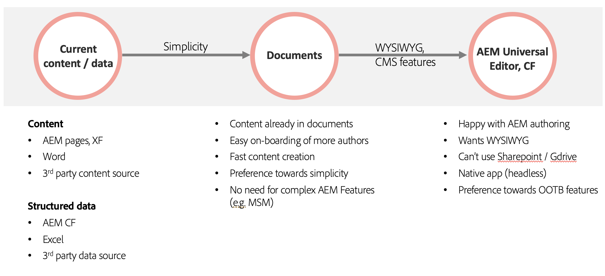

# Utilização de Edge Delivery Services com AEM {#using-edge}

O Edge Delivery Services é dissociado da fonte de conteúdo e pode assimilar conteúdo de diferentes fontes de conteúdo. Isso significa que você pode trabalhar com várias fontes de conteúdo no mesmo site com publicação contínua e simplificada, independentemente da fonte escolhida.

Com o Edge Delivery Services, é possível criar ambientes de desenvolvimento rápido em que os autores possam atualizar e publicar conteúdo rapidamente e novos sites possam ser iniciados rapidamente. Leva apenas alguns segundos para ir da edição ao conteúdo ativo na Internet.

A ingestão de várias fontes de conteúdo oferece flexibilidade máxima ao usuário. O Adobe oferece orientação para ajudá-lo a escolher quais fontes de conteúdo são as melhores para seu projeto.

Há casos em que a fonte de conteúdo é predefinida ou não é flexível (por exemplo, o projeto não pode usar o Sharepoint ou o Google Drive). Mas, em muitos casos, a ferramenta não é predeterminada e a escolha da ferramenta não é preto-e-branco.

O princípio orientador do Adobe é a simplicidade. Comece com a criação baseada em documentos e adicione complexidade quando necessário. Se for necessária uma mudança de ferramenta, a integração do AEM com o Edge Delivery Services abrange a migração de conteúdo.

## Criação   {#authoring-edge}

Com o Edge Delivery Services, a criação é fácil, rápida e flexível. Você pode optar por criar usando a criação com base em documento ou a criação no WYSIWYG usando o Editor universal.

Consulte o documento [Criação de conteúdo para Edge Delivery Services](/help/edge/wysiwyg-authoring/authoring.md) para obter mais informações.

## Publicação {#publishing-edge}

Com o Edge Delivery Services, a publicação de conteúdo é contínua, independentemente da sua fonte de conteúdo.

Consulte o documento [Publicando conteúdo para Edge Delivery Services](/help/edge/wysiwyg-authoring/publishing.md) para obter mais informações.

## Desenvolvimento {#developing-edge}

O Edge Delivery Services é baseado em torno do conceito de blocos. O AEM vem com uma biblioteca abrangente de blocos predefinidos, que podem ser estendidos para atender às necessidades do seu projeto. O código para projetos Edge Delivery Services é gerenciado no GitHub.

Consulte o documento [Guia de Introdução do Desenvolvedor para Criação no WYSIWYG com Edge Delivery Services](/help/edge/wysiwyg-authoring/edge-dev-getting-started.md) para obter mais informações.
