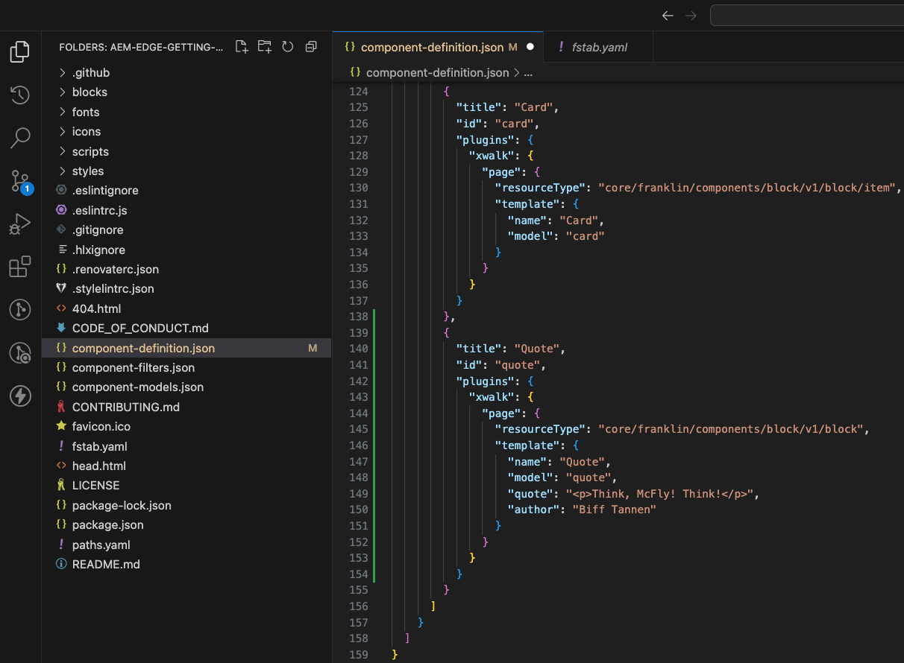

# Criação de blocos instrumentados para uso com o editor universal {#create-block}

Saiba como criar blocos instrumentados para uso com o Editor universal na criação de WYSIWYG com projetos do Edge Delivery Services.

## Pré-requisitos {#prerequisites}

Este guia fornece instruções passo a passo sobre como criar blocos instrumentados para o Editor universal na criação de projetos do WYSIWYG com o Edge Delivery Services. Ela abrange a adição de componentes, o carregamento de definições de componentes no Universal Editor, a publicação de páginas, a implementação de decoração e estilos de blocos, a introdução das alterações na produção e a verificação delas. Ao concluir este guia, você pode criar e implantar um novo bloco para seu próprio projeto.

Este guia requer necessariamente conhecimento existente sobre a criação de WYSIWYG com projetos Edge Delivery Services, bem como o Editor universal. Antes de começar este guia, você já deve ter acesso ao Edge Delivery Services e estar familiarizado com suas noções básicas, incluindo:

* Você concluiu o [tutorial do Edge Delivery Service](/help/edge/developer/tutorial.md).
* Você tem acesso a uma [sandbox do AEM Cloud Service](/help/implementing/cloud-manager/getting-access-to-aem-in-cloud/introduction-sandbox-programs.md).
* Você [habilitou o Editor Universal no mesmo ambiente de sandbox](/help/implementing/universal-editor/getting-started.md).
* Você concluiu o [Guia de Introdução do Desenvolvedor para criação no WYSIWYG com o guia do Edge Delivery Services](/help/edge/wysiwyg-authoring/edge-dev-getting-started.md).

Este guia se baseia no trabalho realizado no [Guia de Introdução do Desenvolvedor para a criação de WYSIWYG com o guia do Edge Delivery Services](/help/edge/wysiwyg-authoring/edge-dev-getting-started.md).

## Adicionar um novo bloco ao seu projeto {#add-block}

Neste guia, você criará um bloco para renderizar uma cotação memorável em sua página.

Para simplificar este exemplo, todas as alterações são feitas na ramificação `main` do repositório do projeto. É claro que, para seu projeto real, [você deve seguir as práticas recomendadas de desenvolvimento](https://www.aem.live/docs/dev-collab-and-good-practices) desenvolvendo em uma ramificação diferente e revisando todas as alterações por meio de uma solicitação de pull antes de mesclar com o `main`.

A Adobe recomenda desenvolver blocos em uma abordagem de três fases:

1. Crie a definição e o modelo do bloco, revise-o e leve-o para produção.
1. Crie conteúdo com o novo bloco.
1. Implemente a decoração e os estilos do novo bloco.

O exemplo de bloco de citação a seguir segue essa abordagem.

### Criar Definição e Modelo de Bloco {#create-block-model}

&#x200B;1. Clona localmente o projeto do GitHub que você criou no [Guia de Introdução do Desenvolvedor para criação no WYSIWYG com o guia do Edge Delivery Services](/help/edge/wysiwyg-authoring/edge-dev-getting-started.md) e o abre em um editor de sua escolha.

* O código Microsoft é usado aqui para fins ilustrativos.


2\ Edite o [`component-definition.json` arquivo](/help/implementing/universal-editor/component-definition.md) na raiz do projeto, adicione a seguinte definição para o novo bloco de cotações e salve o arquivo.

>[!BEGINTABS]

>[!TAB Exemplo de JSON]

```json
{
  "title": "Quote",
  "id": "quote",
  "plugins": {
    "xwalk": {
      "page": {
        "resourceType": "core/franklin/components/block/v1/block",
        "template": {
          "name": "Quote",
          "model": "quote",
          "quote": "<p>Think, McFly! Think!</p>",
          "author": "Biff Tannen"
        }
      }
    }
  }
}
```

>[!TAB Captura de tela]



>[!ENDTABS]

3 Edite o arquivo `component-models.json` na raiz do projeto e adicione a seguinte [definição de modelo](/help/implementing/universal-editor/field-types.md#model-structure) para o novo bloco de cotação e salve o arquivo.

* Consulte o documento [Modelagem de conteúdo para criação no WYSIWYG com projetos do Edge Delivery Services](/help/edge/wysiwyg-authoring/content-modeling.md) para obter mais informações sobre o que é importante considerar ao criar modelos de conteúdo.

>[!BEGINTABS]

>[!TAB Exemplo de JSON]

```json
{
  "id": "quote",
  "fields": [
     {
       "component": "richtext",
       "name": "quote",
       "value": "",
       "label": "Quote",
       "valueType": "string"
     },
     {
       "component": "text",
       "valueType": "string",
       "name": "author",
       "label": "Author",
       "value": ""
     }
   ]
}
```

>[!TAB Captura de tela]


>[!ENDTABS]

4\ Edite o [`component-filters.json` arquivo](/help/implementing/universal-editor/filtering.md) na raiz do projeto e adicione o bloco de aspas à [definição de filtro](/help/implementing/universal-editor/filtering.md) para permitir que o bloco seja adicionado a qualquer seção e salve o arquivo.

>[!BEGINTABS]

>[!TAB Exemplo de JSON]

```json
{
  "id": "section",
  "components": [
    "text",
    "image",
    "button",
    "title",
    "hero",
    "cards",
    "columns",
    "quote"
   ]
}
```

>[!TAB Captura de tela]


>[!ENDTABS]

5\ Usando o Git, confirme essas alterações na ramificação `main`.

* A confirmação de `main` é apenas para fins ilustrativos. [Siga as práticas recomendadas](https://www.aem.live/docs/dev-collab-and-good-practices) e use uma solicitação de pull para o trabalho real do projeto.

### Criar conteúdo com o bloco {#create-content}

Agora que o bloco de cotação básico está definido e comprometido com o projeto de amostra, é possível adicionar um bloco de cotação a uma página existente.

1. Em um navegador, faça logon no AEM as a Cloud Service. [Usando o console Sites](/help/sites-cloud/authoring/basic-handling.md), navegue até o site criado no [Guia de Introdução do Desenvolvedor para criação no WYSIWYG com o guia Edge Delivery Services](/help/edge/wysiwyg-authoring/edge-dev-getting-started.md) e selecione uma página.

   * Neste caso, `index` é usado para fins ilustrativos.

   

1. Toque ou clique em **Editar** na barra de ferramentas do console e o Editor universal será aberto.

   * Para carregar a página, talvez seja necessário tocar ou clicar em **Entrar com o Adobe** para autenticar no AEM no Editor Universal.

1. No Editor universal, selecione uma seção. No painel de propriedades, toque ou clique no ícone **Adicionar** e selecione o novo bloco **Cotação** no menu.

   * O ícone **Adicionar** é um símbolo de mais.
   * Você sabe que selecionou uma seção se o contorno azul do objeto selecionado tiver uma guia rotulada **Seção**.
   * Neste exemplo, tocar ou clicar um pouco acima do cabeçalho **Lorem Ipsum** seleciona uma seção que contém o cabeçalho e o texto lorem ipsum.

   

1. A página é recarregada e o bloco de aspas é adicionado à parte inferior da seção selecionada com o conteúdo padrão especificado no arquivo `component-definitions.json`.

   * O bloco de aspas pode ser selecionado e editado como qualquer outro bloco no local ou no painel de propriedades.
   * O estilo será aplicado em outra etapa.

   

1. Quando estiver satisfeito com o conteúdo da sua cotação, você poderá publicar a página tocando ou clicando no botão **Publicar** na barra de ferramentas do Editor Universal.

1. Verifique se o conteúdo foi publicado navegando até a página publicada. O link será semelhante a `https://<branch>--<repo>--<owner>.aem.page`

   

### Estilo do Bloco {#style-block}

Agora que você tem um bloco de cotação de trabalho, é possível aplicar o estilo a ele.

&#x200B;1. Retorne ao editor do projeto.

2\ Crie uma pasta `quote` na pasta `blocks`.


3 Na nova pasta `quote`, adicione um arquivo `quote.js` para implementar a decoração de blocos adicionando o seguinte JavaScript e salve o arquivo.

>[!BEGINTABS]

>[!TAB Exemplo de JavaScript]

```javascript
export default function decorate(block) {
  const [quoteWrapper] = block.children;
 
  const blockquote = document.createElement('blockquote');
  blockquote.textContent = quoteWrapper.textContent.trim();
  quoteWrapper.replaceChildren(blockquote);
}
```

>[!TAB Captura de tela]


>[!ENDTABS]

4\ Na pasta `quote`, adicione um arquivo `quote.css` para definir o estilo do bloco, adicionando o seguinte código CSS e salve o arquivo.

>[!BEGINTABS]

>[!TAB Exemplo de CSS]

```css
.block.quote {
    background-color: #ccc;
    padding: 0 0 24px;
    display: flex;
    flex-direction: column;
    margin: 1rem 0;
}
 
.block.quote blockquote {
    margin: 16px;
    text-indent: 0;
}
 
.block.quote > div:last-child > div {
    margin: 0 16px;
    font-size: small;
    font-style: italic;
    position: relative;
}
 
.block.quote > div:last-child > div::after {
    content: "";
    display: block;
    position: absolute;
    left: 0;
    bottom: -8px;
    height: 5px;
    width: 30px;
    background-color: darkgray;
}
```

>[!TAB Captura de tela]


>[!ENDTABS]

5\ Usando o Git, confirme essas alterações na ramificação `main`.

* A confirmação de `main` é apenas para fins ilustrativos. [Siga as práticas recomendadas](https://www.aem.live/docs/dev-collab-and-good-practices) e use uma solicitação de pull para o trabalho real do projeto.

6\. Retorne à guia do navegador do Editor universal, onde você estava editando a página do projeto, e recarregue a página para exibir seu bloco estilizado.

7\ Consulte o bloco de aspas agora estilizado na página.


8\ Verifique se as alterações foram enviadas para produção navegando até a página publicada. O link será semelhante a `https://<branch>--<repo>--<owner>.aem.page`


Parabéns! Agora você tem um bloco de cotação totalmente funcional e estilizado. Você pode usar este exemplo como base para criar seus próprios blocos específicos de projeto.

### Opções de bloco {#block-options}

Se você precisar de um bloco para ter aparência ou comportamento um pouco diferente com base em determinadas circunstâncias, mas não for diferente o suficiente para se tornar um novo bloco, poderá permitir que os autores escolham entre [opções de bloco](content-modeling.md#type-inference).

Ao adicionar uma propriedade `classes` ao bloco, a propriedade é renderizada no cabeçalho da tabela para blocos simples ou como lista de valores para itens em um bloco de contêiner.

```json
{
  "id": "simpleMarquee",
  "fields": [
    {
      "component": "text",
      "valueType": "string",
      "name": "marqueeText",
      "value": "",
      "label": "Marquee text",
      "description": "The text you want shown in your marquee"
    },
    {
      "component": "select",
      "name": "classes",
      "value": "",
      "label": "Background Color",
      "description": "The marquee background color",
      "valueType": "string",
      "options": [
        {
          "name": "Red",
          "value": "bg-red"
        },
        {
          "name": "Green",
          "value": "bg-green"
        },
        {
          "name": "Blue",
          "value": "bg-blue"
        }
      ]
    }
  ]
}
```

## Uso de outras ramificações de trabalho {#other-branches}

Por questões de simplicidade, este guia fez você confirmar diretamente na ramificação `main`. Para experimentação em um repositório de amostra, isso geralmente não é um problema. Para o trabalho real do projeto, [você deve seguir as práticas recomendadas de desenvolvimento](https://www.aem.live/docs/dev-collab-and-good-practices) desenvolvendo em uma ramificação diferente e revisando todas as alterações via solicitação de pull antes de mesclar com `main`.

Quando você não estiver desenvolvendo na ramificação `main`, poderá anexar `?ref=<branch>` na barra de localização do Editor Universal para carregar a página da ramificação. `<branch>` é o nome da ramificação como seria usado para a visualização do seu projeto ou URLs ativas, por exemplo, `https://<branch>--<repo>--<owner>.aem.page`.

## Reutilizar seus blocos para criação baseada em documento {#reusing-blocks}

Você pode usar os blocos criados para criação no WYSIWYG usando o Editor universal para criação baseada em documento se aderir ao mesmo modelo de conteúdo.

Consulte o documento [Blocos para WYSIWYG e Criação baseada em documento](/help/edge/wysiwyg-authoring/wysiwyg-doc-blocks.md) para obter mais informações.

## Próximas etapas {#next-steps}

Agora que você sabe como criar blocos, é essencial entender como modelar o conteúdo de uma maneira semântica para alcançar uma experiência simplificada do desenvolvedor.

Consulte o documento [Modelagem de conteúdo para criação no WYSIWYG com projetos do Edge Delivery Services](/help/edge/wysiwyg-authoring/content-modeling.md) para saber como funciona a modelagem de conteúdo para criação no WYSIWYG com projetos do Edge Delivery Services.

>[!TIP]
>
>Para obter uma apresentação completa da criação de um novo projeto do Edge Delivery Services habilitado para criação no WYSIWYG com o AEM as a Cloud Service como fonte de conteúdo, exiba [este webinário de GEMs do AEM](https://experienceleague.adobe.com/en/docs/events/experience-manager-gems-recordings/gems2024/aem-authoring-and-edge-delivery).
