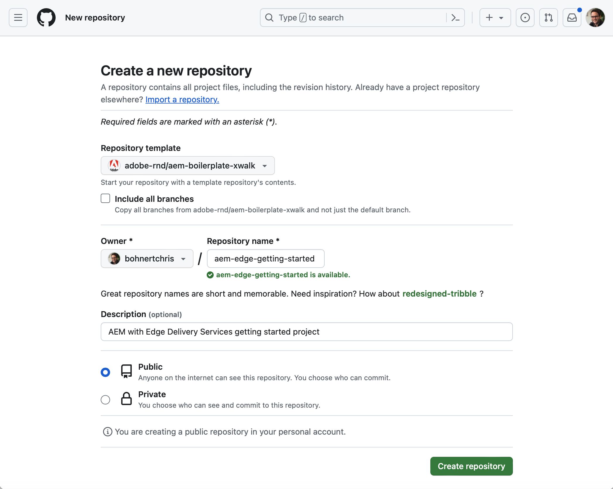

# Guia de introdução do desenvolvedor para criação no WYSIWYG com o Edge Delivery Services {#edge-dev-getting-started}

Este guia colocará você em funcionamento com um novo site do Adobe Experience Manager usando o Edge Delivery Services e o Editor universal para criação de conteúdo do WYSIWYG.

## Pré-requisitos {#prerequisites}

Antes de começar este guia, você já deve estar familiarizado com as noções básicas do e ter acesso ao Edge Delivery Services, incluindo:

* Você concluiu o [tutorial do Edge Delivery Service](/help/edge/developer/tutorial.md).
* Você tem acesso a uma [sandbox do AEM Cloud Service](/help/implementing/cloud-manager/getting-access-to-aem-in-cloud/introduction-sandbox-programs.md).
* Você [habilitou o Editor Universal no mesmo ambiente de sandbox](/help/implementing/universal-editor/getting-started.md).

## Conceitos principais ao desenvolver para o Edge Delivery Services {#core-concepts}

O Edge Delivery Services se baseia no conceito de blocos. O AEM vem com uma biblioteca abrangente de blocos predefinidos, que podem ser estendidos para atender às necessidades do seu projeto. O código para projetos do Edge Delivery Services é gerenciado no GitHub.

### Blocos {#blocks}

Os blocos são a parte mais fundamental de uma página entregue pelo Edge Delivery Services. Um bloco encapsula o estilo e o código que direciona um componente lógico de uma página de conteúdo.

A AEM fornece blocos padrão como parte do produto na placa do projeto. Esses blocos incluem cabeçalho, texto, imagens, links, listas, etc.

>[!TIP]
>
>Consulte a [seção Build](/help/edge/developer/block-collection.md) da documentação da Edge Delivery Services para obter mais detalhes sobre blocos e como desenvolver para serviços da Edge Delivery.

### Edge Delivery Services e GitHub {#github-edge}

O Edge Delivery usa o GitHub para que você possa gerenciar e implantar o código diretamente do seu repositório GitHub.

Seus autores podem criar conteúdo usando Criação baseada em documento ou conteúdo no AEM com o Editor universal. Os desenvolvedores podem personalizar a funcionalidade do site usando CSS e JavaScript no GitHub, independentemente de como os autores criam seu conteúdo.

Os sites são criados automaticamente para cada uma de suas ramificações, da pré-visualização de conteúdo à produção. Todos os recursos que você coloca no repositório GitHub estão disponíveis no seu site sem um processo de criação.

>[!TIP]
>
>Consulte a [seção Build](/help/edge/developer/block-collection.md) da documentação da Edge Delivery Services para obter mais detalhes sobre blocos e como desenvolver para serviços da Edge Delivery.

## Introdução à criação no WYSIWYG e no Edge Delivery Services {#getting-started}

Depois de atender aos [pré-requisitos](#prerequisites) e ter optado por [usar o Editor Universal](#editor-choice), você poderá começar a usar o seu próprio projeto.

### Criar seu projeto do GitHub {#create-github-project}

Primeiro, será necessário criar um novo projeto no GitHub, com base no modelo do Adobe.

1. Navegue até [`https://github.com/adobe-rnd/aem-boilerplate-xwalk`](https://github.com/adobe-rnd/aem-boilerplate-xwalk) e clique em **Usar este modelo** e selecione **Criar um novo repositório**.

   * Você precisará fazer logon no GitHub para ver essa opção.

   

1. Por padrão, o repositório será atribuído a você. Altere isso conforme necessário, forneça um nome e descrição do repositório e clique em **Criar repositório**.

   

1. Em uma nova guia no mesmo navegador, navegue até [`https://github.com/apps/aem-code-sync`](https://github.com/apps/aem-code-sync) e clique em **Configurar**.

   

1. Clique em **Configurar** para a organização em que você criou seu novo repositório na etapa anterior.

   

1. Na página GitHub da Sincronização de Código do AEM em **Acesso ao repositório**, selecione **Somente selecionar repositórios**, selecione o repositório criado na etapa anterior e clique em **Salvar**.

   

1. Depois que a Sincronização de código do AEM estiver instalada, você receberá uma tela de confirmação. Retorne à guia do navegador do novo repositório.

   

1. Clique no arquivo `fstab.yaml` para abri-lo e, em seguida, no ícone **Editar este arquivo** para editá-lo.

   

1. Edite o arquivo `fstab.yaml` para atualizar o ponto de montagem do projeto. Substitua a URL padrão do Google Docs pela URL da sua instância de criação do AEM as a Cloud Service e clique em **Confirmar alterações...**.

   * `https://<aem-author>/bin/franklin.delivery/<owner>/<repository>/main`
   * Alterar o ponto de montagem informa ao Edge Delivery Services onde localizar o conteúdo do site.

   

1. Adicione uma mensagem de confirmação conforme desejado e clique em **Confirmar alterações**, confirmando-as diretamente na ramificação `main`.

   

1. Retorne à raiz do seu repositório, clique em `paths.json` e depois no ícone **Editar este arquivo**.

   

1. O mapeamento padrão usará o nome do repositório. Atualize o mapeamento padrão conforme necessário para seu projeto com `/content/<site-name>/:/` e clique em **Confirmar alterações...**.

   * Forneça o seu próprio `<site-name>`. Você precisará dele em uma etapa posterior.
   * Os mapeamentos informam ao Edge Delivery Services como mapear o conteúdo no repositório do AEM para o URL do site.

   

1. Adicione uma mensagem de confirmação conforme desejado e clique em **Confirmar alterações**, confirmando-as diretamente na ramificação `main`.

   

>[!TIP]
>
>Para obter mais informações sobre mapeamentos de caminho, consulte o documento [Mapeamento de Caminho para Edge Delivery Services](/help/edge/wysiwyg-authoring/path-mapping.md).

### Criar e editar um novo site do AEM {#create-aem-site}

Agora que você tem um projeto GitHub, deve criar um novo site do AEM que o projeto possa usar.

>[!NOTE]
>
>Para editar o site usando o Editor universal, é necessário usar um navegador com base em Chromium.

1. Baixe a criação mais recente do WYSIWYG com o modelo de site do Edge Delivery Services do GitHub em [`https://github.com/adobe-rnd/aem-boilerplate-xwalk/releases`](https://github.com/adobe-rnd/aem-boilerplate-xwalk/releases).

1. Entre na sua instância de criação do AEM as a Cloud Service, navegue até o console Sites e clique em **Criar** > **Site a partir de modelo**.

   

1. Na guia **Selecionar um modelo de site** do assistente de criação de site, clique no botão **Importar** para importar um novo modelo.

   

1. Faça upload da criação do WYSIWYG com o modelo de site do Edge Delivery Services que você baixou do GitHub.

   * O template deve ser carregado apenas uma vez. Depois de carregado, ele pode ser reutilizado para criar sites adicionais.

1. Depois que o modelo for importado, ele aparecerá no assistente. Clique para selecioná-la e, em seguida, clique em **Avançar**.

   

1. Forneça os campos a seguir e toque ou clique em **Criar**.

   * **Título do site** - Adicione um título descritivo para o site.
   * **Título do site** - Use o `<site-name>` definido na [etapa anterior](#create-github-project).
   * **URL do GitHub** - Use a URL do projeto GitHub criado na etapa anterior.

   

1. O AEM confirma a criação do site com uma caixa de diálogo. Clique em **OK** para ignorar.

   

1. No console de sites, navegue até o `index.html` do site recém-criado e clique em **Editar** na barra de ferramentas.

   

1. O Editor universal é aberto em uma nova guia. Talvez seja necessário tocar ou clicar em **Entrar com o Adobe** para autenticar e editar sua página.

   

Agora você pode editar seu site usando o Editor universal. Consulte a [documentação do Universal Editor](/help/sites-cloud/authoring/universal-editor/authoring.md) para obter mais informações.

### Publicar seu novo site {#publishing}

Quando terminar de editar o novo site usando o Editor universal, você poderá publicar o conteúdo.

1. No console de sites, selecione todas as páginas criadas para o novo site e toque ou clique em **Publicação rápida** na barra de ferramentas.

   

1. Toque ou clique em **Publicar** na caixa de diálogo de confirmação para iniciar o processo.

   

1. Abra uma nova guia no mesmo navegador e navegue até o URL do novo site.

   * `https://main--<repository-name>--<owner>.aem.page`

1. Veja seu conteúdo publicado.

   

## Próximas etapas {#next-steps}

Agora que você tem um projeto de criação de WYSIWYG em funcionamento com o Edge Delivery Services, pode começar a criar e estilizar seus próprios blocos.

Consulte o guia [Criação de Blocos Instrumentados para uso com o Editor Universal](/help/edge/wysiwyg-authoring/create-block.md) para obter mais informações.

>[!TIP]
>
>Para obter uma apresentação completa da criação de um novo projeto do Edge Delivery Services habilitado para criação no WYSIWYG com o AEM as a Cloud Service como fonte de conteúdo, exiba [este webinário de GEMs do AEM](https://experienceleague.adobe.com/en/docs/events/experience-manager-gems-recordings/gems2024/aem-authoring-and-edge-delivery).
