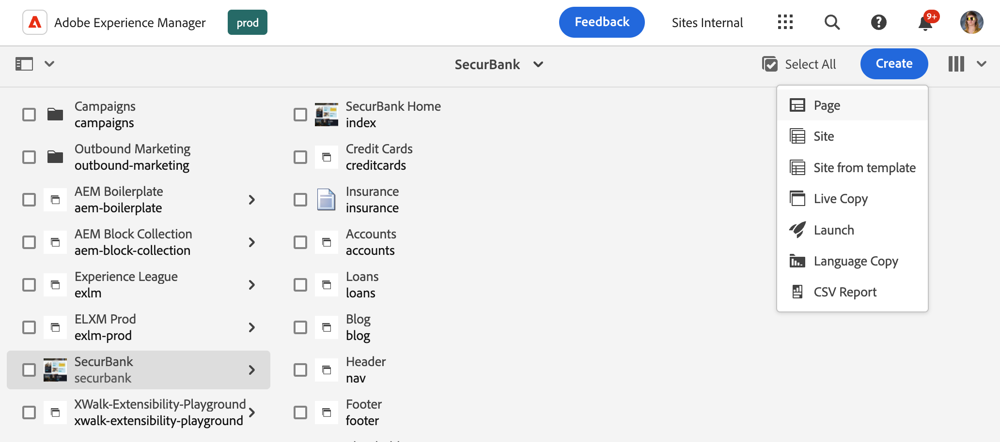
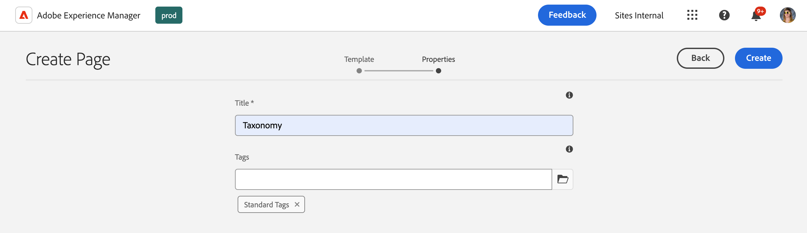

# Gerenciamento de dados de taxonomia {#managing-taxonomy-data}

Saiba como gerenciar dados de taxonomia para usar tags com sua AEM com sites da Edge Delivery Services.

## Introdução {#introduction}

A marcação é um recurso importante que ajuda a organizar e gerenciar suas páginas. [O Console de Marcação](/help/sites-cloud/administering/tags.md#tagging-console) da AEM permite criar uma taxonomia avançada de marcas para organizar suas páginas.

Essas tags são úteis não apenas para você e seus autores na organização do conteúdo, mas também podem ser úteis para seus leitores. As tags e sua taxonomia podem ser usadas em componentes na página para ajudar seus leitores a navegar pelo conteúdo.

O Universal Editor funciona somente com as IDs das suas tags. Ao criar uma página de taxonomia para o seu conteúdo, você expõe as descrições dessas tags em todos os idiomas para o Universal Editor para que ele possa usar essas informações ao renderizar o conteúdo.

>[!TIP]
>
>Consulte o documento [Definições de Modelo, Campos e Tipos de Componentes](/help/implementing/universal-editor/field-types.md) para obter mais informações sobre o campo Marca da AEM disponível para o Editor Universal, que pode funcionar com sua taxonomia.

## Criar uma página de taxonomia {#creating}

Uma taxonomia é criada como [qualquer outra página no AEM](/help/sites-cloud/authoring/sites-console/creating-pages.md).

1. Navegue até o console [**Sites**](/help/sites-cloud/authoring/sites-console/introduction.md).

1. Selecione o local onde deseja criar sua taxonomia.

1. Toque ou clique em **Criar** -> **Página**.

   

1. Na guia **Modelo** do assistente **Criar Página**, selecione o modelo **Taxonomia** e toque ou clique em **Avançar**.

   

1. Na guia **Propriedades** do assistente **Criar Página**, forneça um **Título** significativo para a página e, no campo **Marcas**, [use o seletor de marcas](/help/sites-cloud/authoring/sites-console/tags.md) para selecionar as marcas ou os namespaces que deseja incluir na taxonomia.

   

1. Toque ou clique em **Criar**.

A página de taxonomia é criada. Na caixa de diálogo **Êxito**, toque ou clique na caixa de diálogo **Concluído** para descartar a mensagem ou **Abrir** para editar a página no [Editor de Páginas](/help/sites-cloud/authoring/page-editor/introduction.md).

Anote o nome de página resultante da página de taxonomia para usar nas etapas a seguir.

## Editar uma página de taxonomia {#editing}

Você começa a editar uma página de taxonomia como qualquer outra página no AEM.

1. Navegue até o console [**Sites**](/help/sites-cloud/authoring/sites-console/introduction.md).

1. Selecione a taxonomia que deseja editar.

1. Toque ou clique em **Editar** na barra de ações.

1. O Editor de páginas é aberto, mostrando a taxonomia.

   * A página de taxonomia é somente leitura no Editor de páginas.

   

1. Toque ou clique no ícone **Informações da página** na barra de ferramentas e selecione **Abrir propriedades**.

   

1. Na janela **Propriedades da página**, você pode atualizar o nome da página e usar o seletor de tags para atualizar as tags e os namespaces incluídos em sua taxonomia.

   

1. Toque ou clique em **Salvar e fechar**.

A página exibida no Editor de páginas é somente leitura porque o conteúdo da taxonomia é gerado automaticamente a partir das tags e dos namespaces selecionados. Eles atuam como uma espécie de filtro para gerar automaticamente o conteúdo da taxonomia. Portanto, não há motivo para editar diretamente a página no editor.

O AEM atualiza automaticamente o conteúdo da página de taxonomia ao atualizar as tags e os namespaces subjacentes. No entanto, você deve [republicar a taxonomia](#publishing) após qualquer alteração para disponibilizar essas alterações aos usuários.

## Atualizar paths.json para publicação de taxonomia {#paths-json}

Assim como no [gerenciamento e publicação de dados tabulares para o seu site do Edge Delivery Services](/help/edge/wysiwyg-authoring/tabular-data.md), é necessário atualizar o arquivo `paths.json` do seu projeto para permitir a publicação de seus dados de taxonomia.

1. Abra a raiz do seu projeto no GitHub.

1. Toque ou clique no arquivo `paths.json` para abrir seus detalhes e, em seguida, no ícone **Editar**.

   

1. Adicione uma linha para mapear sua nova página de taxonomia para um recurso `.json`.

   ```json
   {
     "mappings": [
      "/content/<site-name>/:/",
      "/content/<site-name>/<taxonomy-page-name>:/<taxonomy-json-name>.json"
     ]
   }
   ```

   * `<taxonomy-page-name>` deve corresponder ao nome da [página de taxonomia criada](#creating).
   * `<taxonomy-json-name>` pode ser qualquer nome válido que você escolher.

1. Clique em **Confirmar alterações...** para salvar as alterações em `main`.

   * Confirme com `main` ou crie uma solicitação pull de acordo com seu processo.

Esse processo só precisa ser feito uma vez por página de taxonomia. Depois de concluído, você pode publicar sua taxonomia.

>[!TIP]
>
>Para obter mais informações sobre mapeamentos de caminho, consulte o documento [Mapeamento de Caminho para Edge Delivery Services](/help/edge/wysiwyg-authoring/path-mapping.md).

## Publicar uma taxonomia {#publishing}

Uma taxonomia não estará disponível para o Editor universal ou seus usuários até que seja publicada.

As páginas de taxonomia são publicadas como qualquer outra página por [usando os ícones **Publicação Rápida** ou **Gerenciar Publicação** na barra de ferramentas](/help/sites-cloud/authoring/sites-console/publishing-pages.md).

Você deve republicar sua página de taxonomia sempre que:

* Edite a página de taxonomia.
* Edite ou adicione às tags e aos namespaces incluídos na página de taxonomia.

Se você criar uma nova página de taxonomia, primeiro [adicione um mapeamento a ela para o arquivo `paths.json` do seu projeto](#paths-json).

## Acesso às Informações de Taxonomia {#accessing}

Depois que a taxonomia é publicada, suas informações podem ser aproveitadas pelo Editor universal e tornadas visíveis para os usuários.

Você pode acessar a taxonomia como dados JSON no seguinte endereço.

`https://<branch>--<repository>--<owner>.aem.page/<taxonomy-json-name>.json`

Use o `<taxonomy-json-name>` que você definiu ao [mapear sua taxonomia para o arquivo `paths.json` em seu projeto](#paths-json). Os dados de taxonomia são retornados como dados JSON, como no exemplo a seguir.

```json
{
  "total": 3,
  "offset": 0,
  "limit": 3,
  "data": [
    {
      "tag": "default:",
      "title": "Standard Tags"
    },
    {
      "tag": "do-not-translate",
      "title": "Do Not Translate"
    },
    {
      "tag": "translate",
      "title": "Translate"
    }
  ],
  "columns": [
    "tag",
    "title"
  ],
  ":type": "sheet"
}
```

Esses dados JSON serão atualizados automaticamente à medida que você atualizar a taxonomia e publicá-la novamente. Seu aplicativo pode acessar programaticamente essas informações para seus usuários.

[Se você mantiver marcas em vários idiomas](/help/sites-cloud/administering/tags.md#managing-tags-in-different-languages), poderá acessar esses idiomas transmitindo o código de idioma ISO2 como o valor de um parâmetro `sheet=`.

## Exibição de propriedades de tag adicionais {#additional-properties}

Por padrão, sua taxonomia conterá `tag` e `title` valores como visto [no exemplo anterior](#accessing). É possível configurar a taxonomia para expor propriedades de tag adicionais. Neste exemplo, vamos expor a descrição da tag.

1. Use o console Sites para selecionar a taxonomia criada.
1. Toque ou clique no ícone **Propriedades** na barra de ferramentas.
1. Na seção **Propriedades Adicionais**, toque ou clique em **Adicionar** para adicionar um campo.
1. No novo campo, insira o nome da propriedade do JRC a ser exposto. Nesse caso, digite `jcr:description` para a descrição da marca.
1. Toque ou clique em **Salvar e fechar**.
1. Com a taxonomia ainda selecionada, toque ou clique em **Publicação rápida** na barra de ferramentas.

Agora [ao acessar sua taxonomia](#accessing), a descrição da marca (ou qualquer propriedade que você escolher expor) será incluída no JSON.

```json
{
  "total": 3,
  "offset": 0,
  "limit": 3,
  "data": [
    {
      "tag": "default:",
      "title": "Standard Tags",
      "jcr:description": "These are the standard tags"
    },
    {
      "tag": "do-not-translate",
      "title": "Do Not Translate",
      "jcr:description": "Tag to mark pages that should not be translated"
    },
    {
      "tag": "translate",
      "title": "Translate",
      "jcr:description": "Tag to mark pages that should be translated"
    }
  ],
  "columns": [
    "tag",
    "title",
    "jcr:description"
  ],
  ":type": "sheet"
}
```
