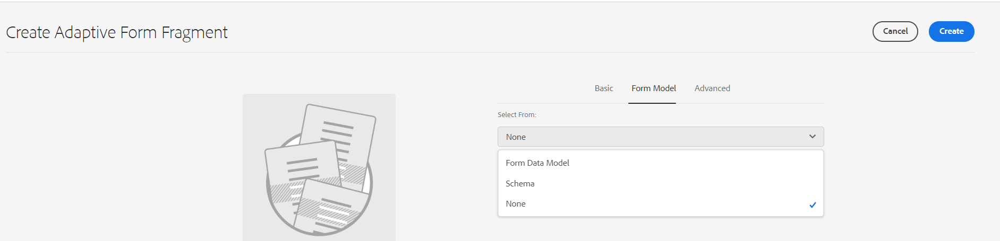

# Criar e usar fragmentos adaptáveis do Forms em um formulário adaptável com base nos Componentes principais {#adaptive-form-fragments}

| Versão | Link do artigo |
| -------- | ---------------------------- |
| AEM as a Cloud Service | Este artigo |
| AEM 6.5 | [Clique aqui](https://experienceleague.adobe.com/docs/experience-manager-65/forms/adaptive-forms-basic-authoring/adaptive-form-fragments.html) |

Embora cada formulário seja projetado para um propósito específico, há alguns segmentos comuns na maioria dos formulários, como o de fornecer detalhes pessoais, como nome e endereço, detalhes familiares e detalhes de renda. Os desenvolvedores de formulários são necessários para criar esses segmentos comuns sempre que um novo formulário for criado.

O Forms adaptável fornece um mecanismo conveniente para criar segmentos de formulário, como um painel ou um grupo de campos, somente uma vez e reutilizá-los no Forms adaptável. Esses segmentos reutilizáveis e independentes são chamados de fragmentos de formulário adaptável.

Os fragmentos de formulário se integram perfeitamente em vários formulários, simplificando a criação de formulários consistentes e com aparência profissional. Os fragmentos de formulário garantem a reutilização, a padronização e a consistência da marca por meio da funcionalidade &quot;alterar uma vez e refletir em todos os lugares&quot;. Experimente maior capacidade de manutenção e eficiência, já que as atualizações feitas em um local são propagadas automaticamente em todos os formulários que utilizam esses fragmentos.

Você pode adicionar um fragmento várias vezes a um documento e usar as propriedades de vinculação de dados de seus componentes para vinculá-lo a diferentes fontes de dados ou esquemas. Por exemplo, você pode usar o mesmo fragmento de endereço para endereço permanente, de comunicação e de faturamento e conectá-lo a diferentes campos de uma fonte de dados ou esquema.

>[!NOTE]
>
> É possível personalizar facilmente a experiência do fragmento para usuários com o [Caixa de diálogo de configuração e caixa de diálogo de design do componente Fragmento de formulário](https://experienceleague.adobe.com/docs/experience-manager-core-components/using/adaptive-forms/adaptive-forms-components/form-fragment.html).

## Criar um fragmento de formulário {#create-a-fragment}

Você pode criar um fragmento de formulário adaptável do zero ou salvar um painel em um formulário adaptável existente como fragmento. Para criar um fragmento de formulário:

1. Faça logon na sua instância do AEM Forms em https://[*hostname*]:[*porta*]/aem/forms.html.
1. Clique em **Criar > Fragmento de formulário adaptável**.
1. Especifique título, nome, descrição e tags para o fragmento. Certifique-se de especificar um nome exclusivo para o fragmento. Se outro fragmento existir com o mesmo nome, o fragmento não será criado.
1. Selecione um modelo de formulário. Você pode criar um fragmento de formulário para Componentes principais com base no Forms adaptável ou Componentes de base com base no Forms adaptável.
   * Para criar fragmento de formulário para formulários baseados em Componentes principais, selecione um modelo baseado em Componentes principais.
   * Para criar fragmento de formulário para formulários baseados em Componentes de base, selecione um modelo de Componentes de base. Por exemplo, /libs/fd/af/templateForFragment/defaultFragmentTemplate.

   Ao criar fragmento de formulário para formulários baseados em Componentes principais, use a opção Selecionar tema do formulário para selecionar um tema baseado em Componentes principais.

1. Clique para abrir a **Modelo de formulário** e na guia **Selecionar de** selecione um dos seguintes modelos para o fragmento:

   

   * **Nenhum**: especifica criar o fragmento do zero sem usar nenhum modelo de formulário.

     >[!NOTE]
     >
     > No Forms adaptável, é possível usar fragmento de formulário único (baseado em Componentes principais) várias vezes. Suporta fragmentos de formulário baseados em nenhum e schema.

   * **** Esquema: especifica a criação do fragmento usando um schema XML ou JSON carregado para AEM Forms. Você pode fazer upload ou selecionar dentre os esquemas XML ou JSON disponíveis como o modelo de formulário do fragmento. Ao selecionar um esquema XML, você também pode criar um fragmento de Formulário adaptável selecionando um complexType presente no esquema selecionado na **[!UICONTROL Tipo complexo de esquema XML]** lista suspensa. Ao selecionar um esquema JSON, você também pode criar um fragmento de Formulário adaptável selecionando uma definição de esquema presente no esquema selecionado da **[!UICONTROL Definições do esquema JSON]** lista suspensa.
   * **Modelo de dados do formulário**: especifica para criar o fragmento usando um modelo de dados de formulário. Você pode criar um fragmento de formulário adaptável com base em apenas um objeto de modelo de dados em um modelo de dados de formulário. Expanda a lista suspensa Definições do modelo de dados de formulário. Ele lista todos os objetos de modelo de dados no modelo de dados de formulário especificado. Selecione um objeto de modelo de dados no lista.

   

1. Clique **Criar** e em **Abrir** para abrir o fragmento, com um modelo padrão, no modo de edição. No modo de edição, é possível adicionar qualquer componente de Formulário adaptável ao fragmento.

<!-- For information about Adaptive Form components, see [Introduction to authoring Adaptive Forms](../../forms/using/introduction-forms-authoring.md). --> Além disso, se você selecionou um esquema XML ou modelo de formulário XDP como o modelo de formulário do fragmento, uma nova guia que exibe a hierarquia do modelo de formulário aparece no localizador de conteúdo. Ela permite arrastar e soltar elementos do modelo de formulário no fragmento. Os elementos de modelo de formulário adicionados são convertidos em componentes de formulário, ao mesmo tempo em que retêm as propriedades originais do XDP ou XSD associado.

Depois que o fragmento do formulário adaptável com base em um esquema ou modelo de dados de formulário é criado, o modelo de dados de formulário ou os elementos do esquema aparecem na guia Fontes de dados do navegador de conteúdo no editor de formulário adaptável. Você pode arrastar e soltar elementos do modelo de formulário no fragmento. Os elementos de modelo de formulário adicionados são convertidos em componentes de formulário, ao mesmo tempo em que retêm as propriedades originais do esquema associado.

## Adicionar um fragmento a um Formulário adaptável {#insert-a-fragment-in-an-adaptive-form}

Para adicionar um fragmento de formulário adaptável a um formulário adaptável:

1. Abra o formulário adaptável no modo de edição.
1. Adicione o **componente Fragmento** do formulário adaptável ao formulário.
1. Clique na **Assets** conteúdo navegador barra lateral. No ativos navegador, sob os caminhos, selecione a opção Fragmentos **do** formulário adaptável. Todos os fragmentos adaptáveis Forms disponíveis para o formulário, dependendo do modelo do formulário, são exibidos.

   

1. Arraste e solte um fragmento de Formulário adaptável na **Fragmento de formulário adaptável** em seu Formulário adaptável.

   >[!NOTE]
   >
   >O fragmento de Formulário adaptável não está ativado para criação no Formulário adaptável. Além disso, não é possível usar um fragmento baseado em XSD em um Formulário adaptável baseado em JSON e o oposto.

O fragmento de Formulário adaptável é adicionado por referência ao Formulário adaptável e permanece em sincronia com o fragmento de Formulário adaptável independente. Isso implica que quaisquer modificações feitas no fragmento do Formulário adaptável sejam espelhadas em todas as instâncias em que o fragmento é incorporado no Adaptive Forms.

### Incorpore um fragmento no formulário adaptável {#embed-a-fragment-in-adaptive-form}

Você pode optar por incorporar um fragmento de Formulário adaptável em um Formulário adaptável clicando no  ícone na barra de ferramentas do painel do fragmento adicionado

O fragmento incorporado não está mais vinculado ao fragmento independente. Você pode editar os componentes no fragmento incorporado a partir do Formulário adaptável.

<!-- 
## Configure fragment appearance {#configure-fragment-appearance}

Any fragment you insert in Adaptive Forms appears as a placeholder image. The placeholder displays titles of up to a maximum of ten child panels in the fragment. You can configure AEM Forms to show the complete fragment instead of the placeholder image.

Perform the following steps to show complete fragments in forms:

1. Go to AEM web console configuration page at https:[*host*]:[*port*]/system/console/configMgr.

1. Search and click **[!UICONTROL Adaptive Form and Interactive Communication Web Channel Configuration]** to open it in edit mode.
1. Disable **[!UICONTROL Enable Placeholder in place of Fragment]** checkbox to show complete fragments rather than the placeholder image.

-->

### Uso de fragmentos dentro de fragmentos {#using-fragments-within-fragments}

É possível criar fragmentos de formulário adaptável aninhados, o que significa que você pode arrastar e soltar um fragmento em outro fragmento e ter uma estrutura de fragmento aninhada.

### Uso de um fragmento de formulário várias vezes em um Formulário adaptável {#using-form-fragment-mutiple-times-in-af}

Você pode usar um fragmento de formulário com base em nenhum e em esquema várias vezes em um Formulário adaptável para salvar dados de forma exclusiva para cada campo de fragmentos de formulário. Por exemplo, você pode usar um fragmento de formulário de endereço para coletar detalhes de endereço para endereços permanentes, de comunicação e vivos presentes em um formulário de aplicativo de empréstimo.

## Mapeamento automático de fragmentos para associação de dados {#auto-mapping-of-fragments-for-data-binding}

Ao criar um fragmento de formulário adaptável usando um modelo de formulário XFA ou tipo complexo XSD e arrastar e soltar o fragmento em um formulário adaptável, o fragmento XFA ou o tipo complexo XSD é substituído automaticamente pelo fragmento de formulário adaptável correspondente cuja raiz do modelo de fragmento é mapeada ao fragmento XFA ou ao Tipo complexo XSD.

É possível alterar o ativo do fragmento e suas associações na caixa de diálogo Editar componente.

Você também pode arrastar e soltar um fragmento de formulário adaptável vinculado da biblioteca de fragmentos de formulário adaptável no localizador de conteúdo do AEM e fornecer a referência de vinculação correta na caixa de diálogo Editar componente do painel Fragmento de formulário adaptável.

## Gerenciar fragmentos {#manage-fragments}

É possível executar várias operações em fragmentos de formulário adaptável usando a interface do usuário do AEM Forms.

1. Acesse `https://[hostname]/aem/forms.html`.

1. Clique em **Selecionar** na barra de ferramentas da interface do usuário do AEM Forms e selecione um fragmento de Formulário adaptável. A barra de ferramentas exibe as seguintes operações que você pode executar no fragmento de Formulário adaptável selecionado.

<table>
 <tbody>
  <tr>
   <td>
<strong>Operação</strong>
 </td>
   <td>
<strong>Descrição</strong>
 </td>
  </tr>
  <tr>
   <td>
Editar
 </td>
   <td>
Abre o fragmento de formulário adaptável selecionado no modo de edição.    
 </td>
  </tr>
  <tr>
   <td>
Propriedades
 </td>
   <td>
Abre o painel Propriedades. No painel Propriedades, é possível visualizar e editar propriedades, gerar uma visualização e fazer upload de uma imagem em miniatura para o fragmento selecionado. Para obter mais informações, consulte <a>Gerenciamento de metadados</a>.    
 </td>
  </tr>
  <tr>
   <td>
Copiar
 </td>
   <td>
Copia o fragmento selecionado. O botão Colar aparece na barra de ferramentas.    
 </td>
  </tr>
  <tr>
   <td>
Download
 </td>
   <td>
Baixa o fragmento selecionado.    
 </td>
  </tr>
  <tr>
   <td>
Visualização
 </td>
   <td>
Fornece opções para visualizar o fragmento como um HTML ou uma visualização personalizada mesclando dados de um arquivo XML com o fragmento. Para obter mais informações, consulte <a>Pré-visualização de um formulário</a>.    
 </td>
  </tr>
  <tr>
   <td>
Iniciar revisão/Gerenciar revisão
 </td>
   <td>
Permite iniciar e gerenciar uma revisão do fragmento selecionado. Para obter mais informações, consulte <a>Criar e gerenciar revisões</a>.    
 </td>
  </tr>
  <tr>
   <td>
Adicionar Dicionário
 </td>
   <td>
Gera um dicionário para a localização do fragmento selecionado. Para obter mais informações, consulte <a>Localização de Forms</a> adaptativas.    
 </td>
  </tr>
  <tr>
   <td>
Publish / Cancelar publicação
 </td>
   <td>
Publica/cancela a publicação do fragmento selecionado.    
 </td>
  </tr>
  <tr>
   <td>
Excluir
 </td>
   <td>
Exclui o fragmento selecionado.    
 </td>
  </tr>
 </tbody>
</table>

## Pontos principais a serem lembrados ao trabalhar com fragmentos {#key-points-to-remember-when-working-with-fragments}

* Certifique-se de que o nome do fragmento seja exclusivo. O fragmento não é criado se houver um fragmento existente com o mesmo nome.
* Em um Formulário adaptável baseado em XDP, se você salvar um painel como fragmento que inclui outro fragmento XDP, o fragmento resultante será vinculado automaticamente ao fragmento XDP secundário. No caso de um Formulário adaptável baseado em XSD, o fragmento resultante será vinculado à raiz do esquema.
* Ao criar um fragmento de Formulário adaptável, um nó de fragmento é criado, o que é semelhante ao nó guideContainer de um Formulário adaptável, no CRXDE Lite.
* Um fragmento em um Formulário adaptável que usa um modelo de dados de formulário diferente não é compatível. Por exemplo, um fragmento baseado em XDP não é compatível com um Formulário adaptável baseado em XSD e vice-versa.
* Os fragmentos de formulário adaptável estão disponíveis para uso por meio da guia Fragmentos de formulário adaptável no localizador de conteúdo de AEM.
* Qualquer expressão, script ou estilo em um fragmento de Formulário adaptável independente é retido quando inserido por referência ou incorporado em um Formulário adaptável.
* Não é possível editar um fragmento de Formulário adaptável, que é inserido por referência, de um Formulário adaptável. Para editar, edite o fragmento independente do Formulário adaptável ou incorpore o fragmento no Formulário adaptável.
* Ao publicar um Formulário adaptável, é necessário publicar os fragmentos de Formulário adaptável independente inseridos pela referência no Formulário adaptável.
* Quando você republica um fragmento de Formulário adaptável atualizado, as alterações refletem nas instâncias publicadas do Formulário adaptável no qual o fragmento é usado.
* O formulário adaptável contendo o componente Verificar não é compatível com usuários anônimos. Além disso, não é repromendado para usar o componente Verificar em um fragmento de formulário adaptável.
* (**Somente** Mac) Para garantir que os fragmentos de formulário funcionalidade funciona perfeitamente em todos os cenários, adicione a seguinte entrada ao arquivo /private/etc/hosts:
  `127.0.0.1 <Host machine>` **Máquina host**: a máquina do Apple Mac na qual o AEM Forms é implantado.

## Fragmentos de referência {#reference-fragments}

Os fragmentos de formulário adaptável de referência que você pode usar para criar seu formulário estão disponíveis.
<!-- For more information, see [Reference Fragments](../../forms/using/reference-adaptive-form-fragments.md). -->

## Consulte também {#see-also}

{{see-also}}