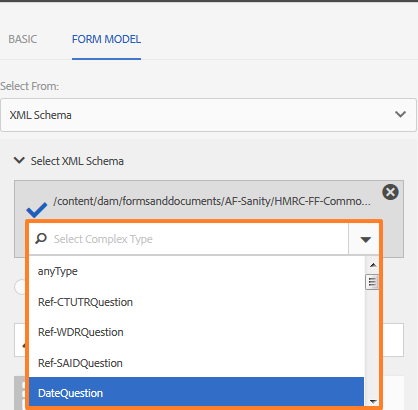

# Criar e usar fragmentos adaptáveis do Forms em um formulário adaptável  {#adaptive-form-fragments}

| Versão | Link do artigo |
| -------- | ---------------------------- |
| AEM as a Cloud Service (Componentes de base) | Este artigo |
| AEM as a Cloud Service (Componentes principais) | [Clique aqui](/help/forms/adaptive-form-fragments-core-components.md) |
| AEM 6.5 | [Clique aqui](https://experienceleague.adobe.com/docs/experience-manager-65/forms/adaptive-forms-basic-authoring/adaptive-form-fragments.html?lang=en) |

Embora cada formulário seja projetado para um propósito específico, existem alguns segmentos comuns na maioria dos formulários, como fornecer detalhes pessoais curtir nome e endereço, detalhes da família, detalhes de renda, entre outros. Os desenvolvedores de formulários são necessários para criar esses segmentos comuns sempre que um novo formulário for criado. A Forms adaptativa fornece um mecanismo conveniente para criar formulário segmento curtir um painel ou uma grupo de campos apenas uma vez e reutilizá-los em Forms adaptativos. Esses segmentos reutilizáveis e independentes são chamados de Fragmentos de formulário adaptáveis.

## Criar um fragmento {#create-a-fragment}

Você pode criar um fragmento de formulário adaptável do zero ou salvar um painel em um formulário adaptável existente como fragmento.

### Criar fragmento do zero {#create-fragment-from-scratch}

1. Faça logon no [!DNL AEM Forms] instância do autor em https://[*hostname*]:[*porta*]/aem/forms.html.
1. Clique **Criar > fragmento** de formulário adaptável.
1. Especifique o título, o nome, a descrição e as tags do fragmento.

   >[!NOTE]
   >
   >Certifique-se de especificar um nome exclusivo para o fragmento. Se já existir outro fragmento com o mesmo nome, o fragmento não será criado.

1. Clique para abrir a **Modelo de formulário** e na guia **Selecionar de** selecione um dos seguintes modelos para o fragmento:

   * **Nenhum**: especifica criar o fragmento do zero sem usar nenhum modelo de formulário.

     >[!NOTE]
     >
     > No Adaptive Forms, é possível usar um único fragmento de formulário (com base nos Componentes principais) várias vezes em um formulário. Ele oferece suporte a fragmentos de formulário baseados em nenhum e em esquema.

   * **Modelo de formulário**: especifica criar o fragmento usando um modelo XDP carregado no [!DNL AEM Forms]. Selecione o modelo XDP apropriado como o modelo de formulário para o fragmento.

   

   Os subformulários marcados como fragmentos no modelo de formulário selecionado também são exibidos. Você pode selecionar um subformulário para Fragmento de formulário adaptável na lista suspensa.

   

   Além disso, você pode criar um Fragmento de formulário adaptável usando subformulários que não estão marcados como fragmentos no modelo de formulário especificando a expressão SOM para o subformulário na caixa suspensa.

   * **Esquema XML**: Especifica como criar o fragmento usando um esquema XML carregado no [!DNL AEM Forms]. Você pode fazer upload ou selecionar dentre os esquemas XML disponíveis como o modelo de formulário do fragmento.

   

   Você também pode criar um fragmento de formulário adaptável selecionando um complexType presente no esquema selecionado na caixa suspensa.

   

1. Clique em **Criar** e clique em **Abertura** para abrir o fragmento, com um modelo padrão, no modo de edição.

No modo de edição, você pode arrastar e soltar qualquer componente de Formulário adaptável do sidekick do AEM no fragmento. <!-- For information about Adaptive Form components, see Introduction to authoring Adaptive Forms. -->

Além disso, se você selecionou um esquema XML ou modelo de formulário XDP como o modelo de formulário do fragmento, uma nova guia que exibe a hierarquia do modelo de formulário aparece no localizador de conteúdo. Ela permite arrastar e soltar elementos do modelo de formulário no fragmento. Os elementos de modelo de formulário adicionados são convertidos em componentes de formulário, ao mesmo tempo em que retêm as propriedades originais do XDP ou XSD associado.

### Salvar painel como um fragmento {#save-panel-as-a-fragment}

1. Abra um Formulário adaptável que contenha o painel que você deseja salvar como Fragmento de formulário adaptável.
1. Na barra de ferramentas do painel, clique em **[!UICONTROL Salvar como fragmento]**. A caixa de diálogo Salvar como fragmento é aberta.

   >[!NOTE]
   >
   >Se o painel que você está salvando como fragmento contiver painel secundário, o fragmento resultante os incluirá.

1. Na caixa de diálogo Criação de fragmento, especifique as seguintes informações:

   * **Nome**: Nome do fragmento. O valor padrão é o nome do elemento do painel. É um campo obrigatório.

     >[!NOTE]
     >
     >Certifique-se de especificar um nome exclusivo para o fragmento. Se já existir outro fragmento com o mesmo nome, o fragmento não será criado.

   * **Título**: Título do fragmento. O valor padrão é o título do painel.

   * **Descrição**: Descrição do fragmento.

   * **Tags**: marca os metadados do fragmento.

   * **Caminho de destino**: Caminho do repositório onde o fragmento é salvo. Se você não especificar um caminho, um nó com o mesmo nome do fragmento será criado ao lado do nó que contém o Formulário adaptável. O fragmento é salvo neste nó.

   * **Modelo de formulário**: Dependendo do modelo de formulário para o Formulário adaptável, esse campo exibe a variável **Esquema XML**, **Modelo de formulário** ou **Nenhum**. É um campo não editável.

   * **Raiz do modelo de fragmento**: aparece somente no Adaptive Forms baseado em XSD. Especifica a raiz do modelo de fragmento. Você pode escolher **/** ou o tipo complexo XSD no menu suspenso. Você só poderá reutilizar o fragmento em outro Formulário adaptável se selecionar o tipo complexo como a raiz do modelo de fragmento.
Se você escolher **/** como a raiz do modelo de fragmento, a árvore XSD completa da raiz fica visível na guia Modelo de dados do formulário adaptável. Para uma raiz de modelo de fragmento de tipo complexo, somente os descendentes do tipo complexo selecionado são visíveis na guia Modelo de dados do formulário adaptável.

   * **XSD Ref**: aparece somente no Adaptive Forms baseado em XSD. Ela exibe a localização do esquema XML.

   * **XDP Ref**: aparece somente no Adaptive Forms baseado em XDP. Ela exibe o local do modelo de formulário XDP.

   

   Caixa de diálogo Salvar como fragmento

1. Clique em **OK**.

   O painel é salvo no local especificado ou padrão no repositório. No Formulário adaptável, o painel é substituído por um instantâneo do fragmento. Como mostrado abaixo, o painel Informações gerais e seus painéis secundários, Informações pessoais e Endereço, são salvos como um fragmento.

   Para editar o fragmento, clique em **[!UICONTROL Editar ativo]** na barra de ferramentas do painel. O fragmento é aberto em uma nova guia ou janela no modo de edição.

   

## Trabalho com fragmentos {#working-with-fragments}

### Configurar a aparência do fragmento {#configure-fragment-appearance}

Qualquer fragmento inserido na Forms adaptável aparece como uma imagem de espaço reservado. O espaço reservado exibe títulos de até dez painéis secundários no fragmento. Você pode configurar [!DNL AEM Forms] para mostrar o fragmento completo em vez da imagem de espaço reservado.

Execute as seguintes etapas para mostrar fragmentos completos em formulários:

1. Vá para a página de configuração do console da Web do AEM em https:[*host*]:[*porta*]/system/console/configMgr

1. Pesquisar e clicar **[!UICONTROL Serviço de configuração de formulário adaptável]** para abri-lo no modo de edição.
1. Desative **[!UICONTROL Ativar Espaço reservado no lugar da caixa de seleção Fragmento]** para mostrar fragmentos completos em vez da imagem de espaço reservado.

### Inserir um fragmento em um formulário adaptável {#insert-a-fragment-in-an-adaptive-form}

Os fragmentos de formulário adaptável criados são exibidos nos Fragmentos de formulário adaptável guia do localizador AEM conteúdo. Para inserir um fragmento de formulário adaptável em um formulário adaptável:

1. Abra o Formulário adaptável, no modo de edição, no qual deseja inserir um fragmento de formulário adaptável.
1. Clique em **Assets**  na barra lateral. No navegador de ativos, selecione **Fragmentos do formulário adaptável** no menu suspenso.

   Você também pode optar por exibir todos os fragmentos de formulário adaptável ou filtrar com base em seu modelo de formulário - Modelo de formulário, Esquema XML ou Básico.

1. Arraste e solte um fragmento de formulário adaptável no formulário adaptável.

   >[!NOTE]
   >
   >O fragmento de formulário adaptável não está ativado para criação no formulário adaptável. Além disso, não é possível usar um fragmento baseado em XSD em um Formulário adaptável baseado em JSON e o oposto.

O fragmento de formulário adaptável é inserido por referência no formulário adaptável e é sincronizado com o fragmento de formulário adaptável independente. Ou seja, ao atualizar o Fragmento de formulário adaptável, as alterações são refletidas em todo o Forms adaptável onde o fragmento é usado.

### Incorporar um fragmento no Formulário adaptável {#embed-a-fragment-in-adaptive-form}

Você pode optar por incorporar um fragmento de formulário adaptável em um formulário adaptável clicando em **Incorporar ativo: &lt;*fragmentName*>** na barra de ferramentas do painel do fragmento adicionado, conforme mostrado no exemplo de imagem a seguir.

>[!NOTE]
>
>O fragmento incorporado não está mais vinculado ao fragmento independente. Você pode editar os componentes no fragmento incorporado a partir do Formulário adaptável.

### Uso de fragmentos dentro de fragmentos {#using-fragments-within-fragments}

É possível criar fragmentos de formulário adaptável aninhados, o que significa que você pode arrastar e soltar um fragmento em outro fragmento e ter uma estrutura de fragmento aninhada.

### Alterar fragmentos {#change-fragments}

É possível substituir ou alterar um fragmento de formulário adaptável por outro fragmento usando o **Selecionar ativo do fragmento** na caixa de diálogo Editar componente de um painel Fragmento de formulário adaptável.

### Uso de um fragmento de formulário várias vezes em um Formulário adaptável {#using-form-fragment-mutiple-times-in-af}

Você pode usar um fragmento de formulário baseado em esquema várias vezes em um Formulário adaptável para salvar dados exclusivamente para cada campo de fragmento de formulário. Por exemplo, você pode usar um fragmento de formulário de endereço para coletar detalhes de endereço para endereços permanentes, de comunicação e vivos presentes em um formulário de aplicativo de empréstimo.

>[!NOTE]
>
> Se você usar fragmentos de formulário com base em nenhum várias vezes em um formulário adaptável, ocorrerá um problema de sincronização de dados entre os campos dos fragmentos. Você pode usar um [fragmento de formulário baseado no componente principal](/help/forms/adaptive-form-fragments-core-components.md) que não está vinculado a nenhum modelo de dados de formulário (FDM), várias vezes em um formulário sem ter problemas de sincronização de dados.

## Mapeamento automático de fragmentos para associação de dados {#auto-mapping-of-fragments-for-data-binding}

Ao criar um fragmento de formulário adaptável usando um modelo de formulário XFA ou tipo complexo XSD e arrastar e soltar o fragmento em um formulário adaptável, o fragmento XFA ou o tipo complexo XSD é substituído automaticamente pelo fragmento de formulário adaptável correspondente cuja raiz do modelo de fragmento é mapeada ao fragmento XFA ou ao tipo complexo XSD.

É possível alterar o ativo do fragmento e suas associações na caixa de diálogo Editar componente.

>[!NOTE]
>
>Você também pode arrastar e soltar um fragmento de formulário adaptável vinculado da biblioteca de fragmentos de formulário adaptável no localizador de conteúdo de AEM e fornecer a referência de vinculação correta na caixa de diálogo Editar componente do painel Fragmento de formulário adaptável.

## Gerenciar fragmentos {#manage-fragments}

É possível executar várias operações nos Fragmentos do formulário adaptável usando a [!DNL AEM Forms] IU.

1. Acesse `https://[hostname]:'port'/aem/forms.html`.

1. Clique em **Selecionar** no [!DNL AEM Forms] Barra de ferramentas da interface e selecione um fragmento de formulário adaptável. A barra de ferramentas exibe as seguintes operações que você pode executar no fragmento de formulário adaptável selecionado.

<table>
 <tbody>
  <tr>
   <td>
<strong>Operação</strong>
 </td>
   <td>
<strong>Descrição</strong>
 </td>
  </tr>
  <tr>
   <td>
Abrir
 </td>
   <td>
Abre o fragmento de formulário adaptável selecionado no modo de edição.    
 </td>
  </tr>
  <tr>
   <td>
Propriedades da exibição
 </td>
   <td>
Abre o painel Propriedades. No painel Propriedades, é possível visualizar e editar propriedades, gerar uma visualização e fazer upload de uma imagem em miniatura para o fragmento selecionado. Para obter mais informações, consulte <a href="manage-form-metadata.md" target="_blank">Gerenciamento de metadados</a>.    
 </td>
  </tr>
  <tr>
   <td>
Copiar
 </td>
   <td>
Copia o fragmento selecionado. O botão Colar aparece na barra de ferramentas.    
 </td>
  </tr>
  <tr>
   <td>
Download
 </td>
   <td>
Baixa o fragmento selecionado.    
 </td>
  </tr>
  <tr>
   <td>
Visualização
 </td>
   <td>
Fornece opções para visualizar o fragmento como um HTML ou uma visualização personalizada mesclando dados de um arquivo XML com o fragmento. <!-- For more information, see <a href="previewing-forms.md" target="_blank">Previewing a form</a>.    -->
 </td>
  </tr>
  <tr>
   <td>
Iniciar revisão/Gerenciar revisão
 </td>
   <td>
Permite iniciar e gerenciar uma revisão do fragmento selecionado. <!-- For more information, see <a href="create-reviews-forms.md" target="_blank">Creating and managing reviews</a>.    
 --> </td>
  </tr>
  <tr>
   <td>
Criar dicionário
 </td>
   <td>
Gera um dicionário para localizar o fragmento selecionado. <!-- For more information, see <a href="lazy-loading-adaptive-forms.md" target="_blank">Localizing Adaptive Forms</a>.    --> 
 </td>
  </tr>
  <tr>
   <td>
Publicar/Desfazer publicação
 </td>
   <td>
Publica/cancela a publicação do fragmento selecionado.    
 </td>
  </tr>
  <tr>
   <td>
Excluir
 </td>
   <td>
Exclui o fragmento selecionado.    
 </td>
  </tr>
 </tbody>
</table>

## Localização do formulário adaptável contendo fragmentos {#localizing-adaptive-form-containing-fragments}

Para traduzir um Formulário adaptável que contenha fragmentos de formulário adaptável, você precisa traduzir o fragmento e o formulário separadamente. A ideia é traduzir um fragmento uma vez e reutilizá-lo em várias Forms adaptativas.

>[!NOTE]
>
>As chaves de localização no fragmento não aparecerão no arquivo XLIFF para um Formulário adaptável.

## Pontos principais a serem lembrados ao trabalhar com fragmentos {#key-points-to-remember-when-working-with-fragments}

* Certifique-se de que o nome do fragmento seja exclusivo. O fragmento não é criado se houver um fragmento existente com o mesmo nome.
* Em um Formulário adaptável baseado em XDP, se um painel for salvo como fragmento que inclui outro fragmento XDP, o fragmento resultante será automaticamente vinculado ao fragmento XDP filho. No caso de um Formulário adaptável baseado em XSD, o fragmento resultante é vinculado à raiz schema.
* Ao criar um Fragmento de formulário adaptável, um fragmento nó é criado, semelhante ao nó guideContainer para um formulário adaptável, no CRXDe Lite.
* Um fragmento em um Formulário adaptável que usa um FDM (Modelo de dados de formulário) diferente não é suportado. Por exemplo, um fragmento baseado em XDP não é suportado em um formulário adaptável baseado em XSD e, por outro lado.
* Os fragmentos de formulário adaptáveis estão disponíveis para uso por meio da guia Fragmentos de formulário adaptáveis no localizador de conteúdo do AEM.
* Qualquer expressão, script ou estilo em um Fragmento de formulário adaptável independente é retido quando inserido por referência ou incorporado em um Formulário adaptável.
* Não é possível editar um fragmento de formulário adaptável, que é inserido por referência, de um formulário adaptável. Para editar, edite o Fragmento de formulário adaptável independente ou incorpore o fragmento no Formulário adaptável.
* Ao publicar um formulário adaptável, você precisa publicar os fragmentos de formulário adaptáveis independentes inseridos por referência no formulário adaptável.
* Ao republicar um fragmento de formulário adaptável atualizado, as alterações são refletidas nas instâncias publicadas do formulário adaptável em que o fragmento é usado.
* O formulário adaptável que contém o componente Verificar não é compatível com usuários anônimos. Além disso, não é recomendado usar o componente Verificar em um fragmento de formulário adaptável.
* (**Somente** Mac) Para garantir que os fragmentos de formulário funcionalidade funciona perfeitamente em todos os cenários, adicione a seguinte entrada ao arquivo /private/etc/hosts:
  `127.0.0.1 <Host machine>`**Máquina de host**: a máquina Apple Mac na qual [!DNL AEM Forms] é implantada.

<!--
## Reference Fragments {#reference-fragments}

Reference Adaptive Form Fragments that you can use to create your form are available. For more information, see [Reference Fragments](reference-adaptive-form-fragments.md).
-->

>[!MORELIKETHIS]
>
>* [Fragmentos de formulário adaptável nos Componentes principais](/help/forms/adaptive-form-fragments-core-components.md)
