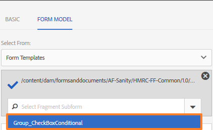

# Fragmentos do formulário adaptável{#adaptive-form-fragments}

Embora cada formulário seja projetado para uma finalidade específica, há alguns segmentos comuns na maioria das formas, como para fornecer detalhes pessoais, como nome e endereço, detalhes familiares, detalhes de renda etc. Os desenvolvedores de formulário precisam criar esses segmentos comuns sempre que um novo formulário for criado.

O Adaptive Forms fornece um mecanismo conveniente para criar segmentos de formulário, como um painel ou um grupo de campos, somente uma vez e reutilizá-los no Adaptive Forms. Esses segmentos reutilizáveis e independentes são chamados de Fragmentos de formulário adaptáveis.

## Criar um fragmento {#create-a-fragment}

É possível criar um Fragmento do formulário adaptável do zero ou salvar um painel em um Formulário adaptável existente como fragmento.

### Criar fragmento do zero {#create-fragment-from-scratch}

1. Faça logon [!DNL AEM Forms] instância do autor em https://[*hostname*]:[*porta*]/aem/forms.html.
1. Clique em **Criar > Fragmento de formulário adaptável**.
1. Especifique o título, o nome, a descrição e as tags do fragmento.

   >[!NOTE]
   >
   >Certifique-se de especificar um nome exclusivo para o fragmento. Se já existir outro fragmento com o mesmo nome, ele não será criado.

1. Clique para abrir o **Modelo de formulário** e da guia **Selecionar de** no menu suspenso , selecione um dos seguintes modelos para o fragmento:

   * **Nenhum**: Especifica a criação do fragmento do zero sem usar qualquer modelo de formulário.
   * **Modelo de formulário**: Especifica a criação do fragmento usando um modelo XDP carregado para [!DNL AEM Forms]. Selecione o modelo XDP apropriado como o modelo de formulário para o fragmento.

   

   Os subformulários marcados como fragmentos no modelo de formulário selecionado também são exibidos. É possível selecionar um subformulário para Fragmento do formulário adaptável na lista suspensa.

   

   Além disso, é possível criar um Fragmento de formulário adaptável usando subformulários que não são marcados como fragmentos no modelo de formulário especificando a expressão SOM para o subformulário na caixa suspensa.

   * **Esquema XML**: Especifica a criação do fragmento usando um esquema XML carregado para [!DNL AEM Forms]. Você pode fazer upload ou selecionar a partir dos esquemas XML disponíveis como o modelo de formulário do fragmento.

   

   Você também pode criar um Fragmento do formulário adaptável selecionando um complexType presente no schema selecionado na caixa suspensa.

   

1. Clique em **Criar** e, em seguida, clique em **Abrir** para abrir o fragmento, com um modelo padrão, no modo de edição.

No modo de edição, você pode arrastar e soltar qualquer componente do Formulário adaptável do sidekick de AEM para o fragmento. <!-- For information about Adaptive Form components, see Introduction to authoring Adaptive Forms. -->

Além disso, se você selecionou um esquema XML ou modelo de formulário XDP como o modelo de formulário para o fragmento, uma nova guia que exibe a hierarquia do modelo de formulário será exibida no localizador de conteúdo. Permite arrastar e soltar elementos do modelo de formulário no fragmento. Os elementos de modelo de formulário adicionados são convertidos em componentes de formulário, ao mesmo tempo em que mantêm as propriedades originais do XDP ou XSD associado.

### Salvar painel como fragmento {#save-panel-as-a-fragment}

1. Abra um Formulário adaptável que contenha o painel que você deseja salvar como Fragmento do formulário adaptável.
1. Na barra de ferramentas do painel, clique em **[!UICONTROL Salvar como fragmento]**. A caixa de diálogo Salvar como fragmento é aberta.

   >[!NOTE]
   >
   >Se o painel que você está salvando como fragmento contém o painel filho, o fragmento resultante os incluirá.

1. Na caixa de diálogo Criação do fragmento , especifique as seguintes informações:

   * **Nome**: Nome do fragmento. O valor padrão é o nome do elemento do painel. É um campo obrigatório.
      >[!NOTE]
      >
      >Certifique-se de especificar um nome exclusivo para o fragmento. Se já existir outro fragmento com o mesmo nome, ele não será criado.

   * **Título**: Título do fragmento. O valor padrão é o título do painel.

   * **Descrição**: Descrição do fragmento.

   * **Tags**: Marque metadados para o fragmento.

   * **Caminho do Target**: Caminho do repositório onde o fragmento será salvo. Se um caminho não for especificado, um nó com o mesmo nome do fragmento será criado ao lado do nó que contém o formulário adaptável. O fragmento é salvo neste nó.

   * **Modelo de formulário**: Dependendo do modelo de formulário para o Formulário adaptável, esse campo exibe a variável **Esquema XML**, **Modelo de formulário** ou **Nenhum**. É um campo não editável.

   * **Raiz do modelo de fragmento**: Aparece somente no Forms adaptável baseado em XSD. Especifica a raiz do modelo de fragmento. Você pode escolher **/** ou o tipo de complexo XSD no menu suspenso. Observe que é possível reutilizar o fragmento em outro formulário adaptável somente se você selecionar o tipo complexo como a raiz do modelo de fragmento.
Se você escolher **/** como a raiz do modelo de fragmento, a árvore XSD completa da raiz é visível na guia Modelo de dados de formulário adaptável . Para uma raiz de modelo de fragmento do tipo complexo, somente os descendentes do tipo complexo selecionado são visíveis na guia Modelo de dados de formulário adaptável .

   * **Ref XSD**: Aparece somente no Forms adaptável baseado em XSD. Ele exibe o local do esquema XML.

   * **Ref XDP**: Aparece somente no Forms adaptável baseado em XDP. Ele exibe o local do modelo de formulário XDP.

   

   Caixa de diálogo Salvar como fragmento

1. Clique em **OK**.

   O painel é salvo no local especificado ou padrão no repositório. No formulário adaptável, o painel é substituído por um instantâneo do fragmento. Como mostrado abaixo, o painel Informações gerais e seus painéis filhos, Informações pessoais e Endereço, são salvos como um fragmento.

   Para editar o fragmento, clique em **[!UICONTROL Editar ativo]** na barra de ferramentas do painel. O fragmento é aberto em uma nova guia ou janela no modo de edição.

   

## Trabalhar com fragmentos {#working-with-fragments}

### Configurar a aparência do fragmento {#configure-fragment-appearance}

Qualquer fragmento inserido no Adaptive Forms é exibido como uma imagem de espaço reservado. O espaço reservado exibe títulos de até no máximo dez painéis filhos no fragmento. Você pode configurar [!DNL AEM Forms] para mostrar o fragmento completo em vez da imagem de espaço reservado.

Execute as seguintes etapas para mostrar fragmentos completos em formulários:

1. Vá para AEM página de configuração do console da Web em https:[*host*]:[*porta*]/system/console/configMgr.

1. Pesquise e clique em **[!UICONTROL Serviço de configuração de formulário adaptável]** para abri-lo no modo de edição.
1. Desativar **[!UICONTROL Ativar espaço reservado no lugar do fragmento]** caixa de seleção para mostrar fragmentos completos em vez da imagem de espaço reservado.

### Inserir um fragmento em um formulário adaptável {#insert-a-fragment-in-an-adaptive-form}

Os Fragmentos do formulário adaptável criados aparecem na guia Fragmentos do formulário adaptável do localizador de conteúdo AEM. Para inserir um Fragmento de formulário adaptável em um formulário adaptável:

1. Abra o Formulário adaptável, no modo de edição, no qual deseja inserir um Fragmento de formulário adaptável.
1. Clique em **Ativos**  na barra lateral. No navegador de ativos, selecione **Fragmentos de formulário adaptáveis** no menu suspenso .

   Você também pode optar por exibir todos os Fragmentos de formulário adaptáveis ou filtrar com base em seu modelo de formulário - Modelo de formulário, Esquema XML ou Básico.

1. Arraste e solte um Fragmento de formulário adaptável no Formulário adaptável.

   >[!NOTE]
   >
   >O Fragmento do formulário adaptável não está habilitado para criação a partir do formulário adaptável. Além disso, não é possível usar um fragmento baseado em XSD em um formulário adaptável baseado em JSON e da maneira oposta.

O Fragmento do formulário adaptável é inserido por referência no Formulário adaptável e é sincronizado com o Fragmento do formulário adaptável independente. Significa que, ao atualizar o Fragmento do formulário adaptável, as alterações são refletidas em todos os Forms adaptáveis, onde o fragmento é usado.

### Incorporar um fragmento no formulário adaptável {#embed-a-fragment-in-adaptive-form}

Você pode optar por incorporar um Fragmento de formulário adaptável em um Formulário adaptável clicando em **Incorporar ativo: &lt;*fragmentName*>** na barra de ferramentas do painel do fragmento adicionado, como mostrado na imagem de exemplo a seguir.

>[!NOTE]
>
>O fragmento incorporado não está mais vinculado ao fragmento independente. É possível editar os componentes no fragmento incorporado no Formulário adaptável.

### Uso de fragmentos dentro de fragmentos {#using-fragments-within-fragments}

É possível criar Fragmentos de formulário adaptáveis aninhados, o que significa que você pode arrastar e soltar um fragmento em outro fragmento e pode ter uma estrutura de fragmento aninhada.

### Alterar fragmentos {#change-fragments}

Você pode substituir ou alterar um Fragmento do formulário adaptável por outro fragmento usando o **Selecionar ativo de fragmento** na caixa de diálogo Editar componente do painel Fragmento do formulário adaptável.

## Mapeamento automático de fragmentos para vínculo de dados {#auto-mapping-of-fragments-for-data-binding}

Ao criar um Fragmento de formulário adaptável usando um modelo de formulário XFA ou um tipo complexo XSD e arrastar e soltar o fragmento em um Formulário adaptável, o fragmento XFA ou o tipo complexo XSD é automaticamente substituído pelo Fragmento de formulário adaptável correspondente cuja raiz de modelo de fragmento está mapeada para o fragmento XFA ou o Tipo complexo XSD.

É possível alterar o ativo do fragmento e seus vínculos na caixa de diálogo Editar componente.

>[!NOTE]
>
>Você também pode arrastar e soltar um Fragmento de formulário adaptável vinculado da biblioteca do Fragmento de formulário adaptável AEM localizador de conteúdo e fornecer a referência de vínculo correta na caixa de diálogo Editar componente do painel Fragmento de formulário adaptável.

## Gerenciar fragmentos {#manage-fragments}

É possível executar várias operações em Fragmentos de formulário adaptáveis usando o [!DNL AEM Forms] IU.

1. Ir para `https://[hostname]:'port'/aem/forms.html`.

1. Clique em **Selecionar** no [!DNL AEM Forms] Barra de ferramentas da interface do usuário e selecione um Fragmento de formulário adaptável. A barra de ferramentas exibe as seguintes operações que podem ser executadas no Fragmento de formulário adaptável selecionado.

<table>
 <tbody>
  <tr>
   <td>
<strong>Operação</strong>
 </td>
   <td>
<strong>Descrição</strong>
 </td>
  </tr>
  <tr>
   <td>
Abrir
 </td>
   <td>
Abre o Fragmento do formulário adaptável selecionado no modo de edição.    
 </td>
  </tr>
  <tr>
   <td>
Propriedades da exibição
 </td>
   <td>
Abre o painel Propriedades. No painel Propriedades, é possível exibir e editar as propriedades, gerar uma visualização e carregar uma imagem em miniatura do fragmento selecionado. Para obter mais informações, consulte <a href="manage-form-metadata.md" target="_blank">Gerenciamento de metadados</a>.    
 </td>
  </tr>
  <tr>
   <td>
Copiar
 </td>
   <td>
Copia o fragmento selecionado. O botão Colar aparece na barra de ferramentas.    
 </td>
  </tr>
  <tr>
   <td>
Download
 </td>
   <td>
Faz o download do fragmento selecionado.    
 </td>
  </tr>
  <tr>
   <td>
Visualizar
 </td>
   <td>
Fornece opções para visualizar o fragmento como um HTML ou uma visualização personalizada ao mesclar dados de um arquivo XML com o fragmento. <!-- For more information, see <a href="previewing-forms.md" target="_blank">Previewing a form</a>.    -->
 </td>
  </tr>
  <tr>
   <td>
Iniciar Revisão/Gerenciar Revisão
 </td>
   <td>
Permite iniciar e gerenciar uma revisão do fragmento selecionado. <!-- For more information, see <a href="create-reviews-forms.md" target="_blank">Creating and managing reviews</a>.    
 --> </td>
  </tr>
  <tr>
   <td>
Criar dicionário
 </td>
   <td>
Gera um dicionário para localizar o fragmento selecionado. <!-- For more information, see <a href="lazy-loading-adaptive-forms.md" target="_blank">Localizing Adaptive Forms</a>.    --> 
 </td>
  </tr>
  <tr>
   <td>
Publicar/Desfazer a publicação
 </td>
   <td>
Publica / despublica o fragmento selecionado.    
 </td>
  </tr>
  <tr>
   <td>
Excluir
 </td>
   <td>
Exclui o fragmento selecionado.    
 </td>
  </tr>
 </tbody>
</table>

## Localização do formulário adaptável contendo fragmentos {#localizing-adaptive-form-containing-fragments}

Para localizar um formulário adaptável que contenha Fragmentos de formulário adaptáveis, é necessário localizar o fragmento e o formulário separadamente. A ideia é localizar um fragmento uma vez e reutilizá-lo em vários Adaptive Forms.

>[!NOTE]
>
>As chaves de localização no fragmento não aparecerão no arquivo XLIFF para um Formulário adaptável.

## Pontos principais a lembrar ao trabalhar com fragmentos {#key-points-to-remember-when-working-with-fragments}

* Verifique se o nome do fragmento é exclusivo. O fragmento não é criado se houver um fragmento existente com o mesmo nome.
* Em um Formulário adaptável baseado em XDP, se você salvar um painel como fragmento que inclui outro fragmento XDP, o fragmento resultante será vinculado automaticamente ao fragmento XDP secundário. No caso de um formulário adaptável baseado em XSD, o fragmento resultante será vinculado à raiz do esquema.
* Quando você cria um Fragmento de formulário adaptável, um nó de fragmento é criado, o que é semelhante ao nó guideContainer para um Formulário adaptável, no CRXDe Lite.
* Um fragmento em um formulário adaptável que usa um modelo de dados de formulário diferente não é suportado. Por exemplo, um fragmento baseado em XDP não é suportado em um formulário adaptável baseado em XSD e vice-versa.
* Fragmentos de formulário adaptáveis estão disponíveis para uso por meio da guia Fragmentos de formulário adaptáveis AEM localizador de conteúdo.
* Qualquer expressão, script ou estilo em um Fragmento de formulário adaptável independente é retido quando inserido por referência ou incorporado em um Formulário adaptável.
* Não é possível editar um Fragmento do formulário adaptável, inserido por referência, de um formulário adaptável. Para editar, edite o Fragmento do formulário adaptável independente ou incorpore o fragmento no Formulário adaptável.
* Ao publicar um formulário adaptável, é necessário publicar os Fragmentos do formulário adaptável independentes inseridos por referência no formulário adaptável.
* Quando você republica um Fragmento de formulário adaptável atualizado, as alterações refletem nas instâncias publicadas do Formulário adaptável no qual o fragmento é usado.
* O formulário adaptável que contém o componente Verificar não suporta usuários anônimos. Além disso, não é recomendado usar o componente Verificar em um Fragmento de formulário adaptável.
* (**Somente Mac**) Para garantir que a funcionalidade dos fragmentos de formulário funcione perfeitamente em todos os cenários, adicione a seguinte entrada ao arquivo /private/etc/hosts:
   `127.0.0.1 <Host machine>` **Máquina host**: A máquina Apple Mac na qual [!DNL AEM Forms] é implantado.

## Fragmentos de referência {#reference-fragments}

Referência a fragmentos de formulário adaptáveis que você pode usar para criar seu formulário está disponível. Para obter mais informações, consulte [Fragmentos de referência](reference-adaptive-form-fragments.md).
