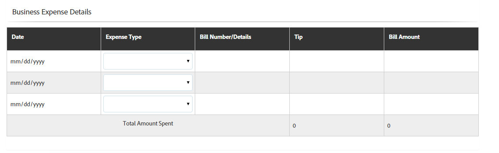

# Tabelas em forma adaptável {#tables-in-adaptive-forms}

O uso de tabelas é uma maneira eficiente, simplificada e organizada de apresentar dados complexos. Ajuda os usuários a identificar informações facilmente e fornecer entradas em uma disposição ordenada de linhas e colunas. A maioria das formas de serviços financeiros e organizações governamentais requer grandes tabelas de dados para colocar números e realizar cálculos.

O AEM Forms fornece um componente de Tabela no navegador de componentes na barra lateral que permite criar tabelas em formulários adaptáveis. Alguns dos principais recursos que ele oferece são:

* Layout responsivo em dispositivos móveis
* Linhas e colunas configuráveis
* Adição e exclusão dinâmicas de linhas no tempo de execução
* Combinar ou mesclar e dividir células
* Acessível por leitores de tela
* Layout personalizado usando CSS
* Compatível e mapeado com o componente de tabela XDP
* Suporte para adicionar linhas ou células usando elementos de tipo complexo XSD
* Mesclar dados de um arquivo XML

## Crie uma tabela {#create-a-table}

Para criar uma tabela, arraste e solte o componente Tabela do navegador de componentes no sidekick no formulário adaptável. Por padrão, a tabela contém duas colunas e três linhas, incluindo a linha de cabeçalho.


### Sobre células de cabeçalho e corpo {#about-header-and-body-cells}

As células de cabeçalho são campos de texto. Para alterar o rótulo de um cabeçalho, clique com o botão direito do mouse na célula de cabeçalho e clique em **Editar**. Na caixa de diálogo Editar, atualize o rótulo na **Valor** e clique em **OK**.

Por padrão, as células de corpo são caixas de texto. Você pode substituir uma célula de corpo por qualquer outro componente de formulários adaptáveis disponível no sidekick, como uma caixa numérica, um seletor de data ou uma lista suspensa.

Por exemplo, a primeira linha de corpo na tabela a seguir inclui a caixa de texto, o seletor de data e os componentes da lista suspensa como células.


Você pode unir duas ou mais células de corpo selecionando as células que deseja mesclar, clique com o botão direito do mouse e selecione **Mesclar**. Além disso, você pode dividir uma célula unida clicando com o botão direito do mouse e selecionando **Dividir células**.

### Adicionar, excluir, mover linhas e colunas {#add-delete-move-rows-and-columns}

É possível adicionar e excluir uma linha ou coluna e mover uma linha para cima e para baixo em uma tabela.

#### Adicionar, excluir ou mover uma linha

Para adicionar, excluir ou mover a linha, clique em qualquer célula da linha. abrir o navegador de conteúdo  e selecionar a linha correspondente, ela destaca a linha selecionada com a opção da barra de ferramentas da qual é possível adicionar, excluir ou mover a linha para cima ou para baixo.
* O **[!UICONTROL Mover para cima]** e **[!UICONTROL Mover para baixo]** move a linha selecionada para cima e para baixo.

* O **[!UICONTROL Adicionar coluna]** adiciona uma linha abaixo da linha selecionada.

* O **[!UICONTROL Excluir coluna]** a operação exclui a linha selecionada.


Clique duas vezes na linha para configurar as propriedades de uma linha, como Nome, Referência de associação, Configurações de repetição, Classe CSS.


#### Adicionar ou excluir uma coluna

Para adicionar ou excluir uma coluna, clique na célula de texto na seção do cabeçalho, uma barra de ferramentas abrirá com as opções para adicionar ou excluir uma coluna:


>[!NOTE]
>
>Embora seja possível adicionar qualquer número de linhas em uma tabela, o número máximo de colunas que você pode adicionar é seis. Além disso, não é possível excluir a linha de cabeçalho da tabela.

### Adicionar descrição da tabela {#add-table-description}

Você pode adicionar uma descrição da tabela para explicar como as informações são organizadas que os leitores de tela podem interpretar e ler. Para adicionar a descrição:

1. Selecione a tabela e toque em  para ver suas propriedades na barra lateral.
1. Especifique o resumo na guia Acessibilidade.
1. Clique em **Concluído**.

### Classificar colunas em uma tabela {#sortcolumnstable}

Você pode classificar dados com base em qualquer coluna em uma tabela no formulário adaptável. Os valores na coluna podem ser classificados em ordem crescente ou decrescente.

A classificação pode ser aplicada às colunas da tabela contendo:

* Texto estático
* Propriedades do objeto do modelo de dados
* Combinação de propriedades de objetos de texto estático e de modelo de dados

Para aplicar a classificação em colunas da tabela, as células da coluna da tabela devem conter qualquer um dos seguintes componentes: Caixa numérica, Etapa numérica, Campo de entrada de data, Seletor de data, Texto ou Caixa de texto.

Para ativar a classificação:

1. Selecione a tabela e toque em  (Configurar). Também é possível selecionar a tabela usando o **Conteúdo** no sidekick da Comunicação interativa.
1. Selecionar **Habilitar Classificação**.
1. Toque  para salvar as propriedades da tabela. Os ícones de classificação, setas para cima e para baixo, em cabeçalhos de colunas representam que a classificação foi ativada.

   

1. Alterne para **Visualizar** para visualizar a saída. A tabela é automaticamente classificada com base na primeira coluna da tabela.
1. Clique no cabeçalho da coluna para classificar os valores com base na coluna.

   Um cabeçalho de coluna com uma seta para cima representa que a tabela é classificada com base nessa coluna. Além disso, os valores na coluna são exibidos em ordem crescente.

   

   Da mesma forma, um cabeçalho de coluna com uma seta para baixo representa que os valores na coluna são exibidos na ordem decrescente.

   Também é possível fazer alterações na tabela no **Visualizar** e clique no cabeçalho da coluna novamente para classificar os valores da coluna.

## Definir a largura da coluna para uma tabela {#set-column-width}

Execute as seguintes etapas para definir a largura da coluna de uma tabela:

1. No **[!UICONTROL Conteúdo]** toque na guia **[!UICONTROL Tabela]** e toque em Configurar ()ícone.

1. Insira a lista de valores separada por vírgulas no **[!UICONTROL Largura da coluna]** para especificar a largura proporcional de cada coluna na tabela. Por exemplo, para uma tabela que inclui 3 colunas, especificando 2,4,6 como o valor na variável **[!UICONTROL Largura da coluna]** O campo resulta na configuração da largura das colunas como 2/12 para a primeira coluna, 4/12 para a segunda coluna e 6/12 para a terceira coluna. 2/12 dado que a largura da primeira coluna corresponde a um sexto da largura da tabela. Da mesma forma, 4/12 define a largura da segunda coluna como um terço da largura da tabela e 6/12 define a largura da terceira coluna como metade da largura da tabela.

## Configurar estilo de tabela {#configure}

Você pode definir o estilo de uma tabela usando o modo Estilo na barra de ferramentas da página. Execute as seguintes etapas para alternar para o modo de estilo e editar o estilo da tabela

1. Na barra de ferramentas da página, antes de Visualizar, toque em  > **Estilo**.

1. Na barra lateral, selecione a tabela e toque no botão Editar .
Você pode ver as propriedades de estilo na barra lateral.


>[!NOTE]
>
>Você pode alterar o tema de cor das linhas de cabeçalho e corpo alterando os valores de [MENOS variáveis](https://lesscss.org//). Para obter mais informações, consulte [Temas no AEM Forms](/help/forms/themes.md).

## Adicionar ou excluir uma linha dinamicamente {#add-or-delete-a-row-dynamically}

As tabelas fornecem suporte pronto para uso para adicionar ou excluir dinamicamente linhas no tempo de execução.

1. Selecione uma linha de tabela e toque em .
1. Na guia Repetir configurações , especifique as contagens mínima e máxima para limitar o número de linhas na tabela.
1. Clique em **Concluído**.

Em tempo de execução ou pré-visualização, você verá **+** e  botões para adicionar ou excluir uma linha.


>[!NOTE]
>
>A adição ou exclusão dinâmica de uma linha não é suportada em Cabeçalhos no layout móvel esquerdo das tabelas.

## Expressões em uma tabela {#expressions-in-a-table}

Tabelas em formulários adaptáveis permitem gravar expressões em JavaScript para induzir comportamentos, como mostrar ou ocultar uma tabela ou linha, adicionar todos os números e mostrar o total em uma célula, ativar ou desativar uma célula, validar a entrada do usuário e assim por diante. Essas expressões usam APIs de modelo de script de formulários adaptáveis.

Embora as tabelas e as linhas sejam compatíveis apenas com expressões de visibilidade para controlar sua visibilidade com base no valor retornado por uma expressão, as células são compatíveis com as seguintes expressões:

* **Script de inicialização:** para executar uma ação na inicialização de um campo.
* **Script de confirmação de valor:** para alterar os componentes de um formulário depois que o valor de um campo é alterado.

>[!NOTE]
>
>Se o script XFA change/exit também for aplicado ao mesmo campo, o script XFA change/exit será executado antes do script Value Commit.

* **Calcular expressões**: para calcular automaticamente o valor de um campo.
* **Expressões de validação**: para validar um campo.
* **Expressões de acesso**: para ativar/desativar um campo.
* **Expressão de visibilidade**: para controlar a visibilidade de um campo e painel.

A expressão de visibilidade de uma tabela ou linha pode ser definida na guia Propriedades do painel da caixa de diálogo correspondente do componente de edição. As expressões de uma célula podem ser definidas na guia Script da caixa de diálogo Editar componente .

Para obter a lista completa de classes de formulários adaptáveis, eventos, objetos e APIs públicas, consulte [Referência da API da biblioteca JavaScript para formulários adaptáveis](https://helpx.adobe.com/experience-manager/6-5/forms/javascript-api/index.html).

## Layouts para dispositivos móveis {#mobile-layouts}

Tabelas em formulários adaptáveis fornecem experiência inigualável em dispositivos móveis devido a seus layouts fluidos e responsivos. O AEM Forms oferece dois tipos de layouts móveis para tabelas - Cabeçalhos à esquerda e Colapsíveis.

É possível configurar um layout móvel para uma tabela na guia Estilo da caixa de diálogo Editar componente para uma tabela.

### Cabeçalhos à esquerda {#headers-on-left}

No layout Cabeçalhos à esquerda, o cabeçalho na tabela é transposto à esquerda com apenas uma célula aparecendo em relação a um cabeçalho. Cada linha neste layout aparece como uma seção distinta. As imagens a seguir comparam uma tabela em um desktop com aquela em um dispositivo móvel.



Exibição de desktop de uma tabela com Cabeçalho no layout esquerdo


Exibição móvel de uma tabela com Cabeçalho no layout esquerdo

### Layout de colunas recolhidas {#collapsible-columns-layout}

No layout Collapsible column , as colunas na tabela são recolhidas para mostrar uma ou duas colunas, dependendo do tamanho do dispositivo, enquanto outras colunas são recolhidas. Você pode clicar no ícone recolher/expandir para exibir outras colunas na tabela.

>[!NOTE]
>
>Embora o layout de coluna Reduzível seja otimizado para dispositivos móveis, ele também funcionará na área de trabalho, se a largura disponível não for suficiente para mostrar todas as colunas em uma tabela.

As imagens a seguir comparam a aparência de uma tabela em um dispositivo com colunas recolhidas e expandidas.


Colunas recolhidas de uma tabela com apenas duas colunas exibidas em um dispositivo móvel


Coluna expandida de uma tabela em um dispositivo móvel

## Mesclar dados em uma tabela {#merge-data-in-a-table}

Tabelas em formulários adaptáveis permitem preencher a tabela em tempo de execução usando dados de um arquivo XML. O arquivo XML de dados pode residir no sistema de arquivos local da máquina em que o servidor AEM Forms está sendo executado ou no repositório CRX.

Vamos ver o exemplo da seguinte tabela de resumo de transação bancária que queremos preencher com dados de um arquivo XML.


Neste exemplo, a propriedade Element name para:

* a linha é **Linha1**
* a célula de corpo em Data de transação é **tableItem1**
* a célula de corpo em Descrição é **tableItem2**
* a célula de corpo em Tipo de transação é **type**
* a célula do corpo em Quantia em USD é **tableItem3**

O arquivo XML que contém dados no seguinte formato:

```xml
<?xml version="1.0" encoding="UTF-8"?><afData>
  <afUnboundData>
    <data>
 <typeSelect>0</typeSelect>
 <Row1>
      <tableItem1>2015-01-08</tableItem1>
      <tableItem2>Purchase laptop</tableItem2>
      <type>0</type>
      <tableItem3>12000</tableItem3>
 </Row1>
 <Row1>
      <tableItem1>2015-01-05</tableItem1>
      <tableItem2>Transport expense</tableItem2>
      <type>0</type>
      <tableItem3>120</tableItem3>
 </Row1>
 <Row1>
      <tableItem1>2014-01-08</tableItem1>
      <tableItem2>Laser printer</tableItem2>
      <type>0</type>
      <tableItem3>500</tableItem3>
 </Row1>
 <Row1>
      <tableItem1>2014-12-08</tableItem1>
      <tableItem2>Credit card payment</tableItem2>
      <type>0</type>
      <tableItem3>300</tableItem3>
 </Row1>
 <Row1>
      <tableItem1>2015-01-06</tableItem1>
      <tableItem2>Interest earnings</tableItem2>
      <type>1</type>
      <tableItem3>12000</tableItem3>
 </Row1>
 <Row1>
      <tableItem1>2015-01-05</tableItem1>
      <tableItem2>Payment from a client</tableItem2>
      <type>1</type>
      <tableItem3>500</tableItem3>
 </Row1>
 <Row1>
      <tableItem1>2015-01-08</tableItem1>
      <tableItem2>Food expense</tableItem2>
      <type>0</type>
      <tableItem3>120</tableItem3>
 </Row1>
 </data>
  </afUnboundData>
  <afBoundData>
    <data/>
  </afBoundData>
  <afBoundData/>
</afData>
```

No XML de amostra, os dados de uma linha são definidos pela variável `<Row1>` tags , que é o nome do elemento para a linha na tabela. No `<Row1>` , os dados de cada célula são definidos dentro da tag para o nome do elemento, como `<tableItem1>`, `<tableItem2>`, `<tableItem3>`e `<type>`.

Para mesclar esses dados com a tabela no tempo de execução, precisamos apontar o formulário adaptável contendo a tabela para o local XML absoluto com wcmmode desabilitado. Por exemplo, se o formulário adaptável estiver em *https://localhost:4502/myForms/bankTransaction.html* e o arquivo XML de dados é salvo em *C:/myTransactions/bankSummary.xml*, é possível exibir a tabela com dados no seguinte URL:

*https://localhost:4502/myForms/bankTransaction.html?dataRef=file:/// C:/myTransactions/bankSummary.xml&amp;wcmmode=disabled*


## Usar componentes XDP e tipos complexos XSD {#use-xdp-components-and-xsd-complex-types}

Se você criou um formulário adaptável com base em um modelo de formulário XFA, os elementos XFA estarão disponíveis na guia Modelo de dados AEM Localizador de conteúdo. Você pode arrastar e soltar esses elementos XFA, incluindo tabelas, no formulário adaptável.

O elemento de tabela XFA é mapeado para o componente Tabela e funciona imediatamente em formulários adaptáveis. Todas as propriedades e funcionalidades da tabela XDP são preservadas quando movidas para um formulário adaptável, e você pode executar qualquer operação nela da mesma forma que faz com a tabela de formulário adaptável nativa. Por exemplo, se uma linha em uma tabela XDP estiver marcada como repetível, ela também será repetida quando solta em formulários adaptáveis.

Além disso, é possível arrastar e soltar o subformulário XDP para adicionar uma nova linha na tabela. No entanto, observe que soltar um subformulário aninhado não funciona.

>[!NOTE]
>
>Uma tabela XDP sem uma linha de cabeçalho não será mapeada para o componente de Tabela de formulário adaptável. Em vez disso, ele será mapeado para o componente de painel de formulário adaptável com layout fluido. Além disso, ao adicionar uma tabela aninhada de um XDP em um formulário adaptável, a tabela externa é convertida em um painel enquanto mantém a tabela interna.

Além disso, você pode arrastar e soltar um grupo de elementos de tipo complexo XSD para criar uma linha de tabela. Uma nova linha é criada logo abaixo da linha na qual você soltou os elementos. As células criadas usando os elementos de tipo complexo XSD mantêm uma referência de vínculo com o XSD. Você também pode substituir uma célula de corpo por um elemento de tipo complexo XSD, soltando o elemento na célula.

>[!NOTE]
>
>O número de elementos em um componente de tabela XDP, um subformulário ou um tipo complexo XSD não pode exceder o número de células em uma linha. Por exemplo, não é possível soltar quatro elementos em uma linha que tenha apenas três células. Isso resultará em um erro.
>
>Se o número de elementos for menor que o número de células em uma linha, a nova linha primeiro adiciona células com base nos elementos e, em seguida, as células padrão são adicionadas para preencher as células restantes na linha. Por exemplo, se você soltar um grupo de três elementos em uma linha que tem quatro células, as três primeiras células serão baseadas nos elementos soltos e a célula restante será a célula padrão da tabela.

## Principais considerações {#key-considerations}

* Se você mover linhas para cima e para baixo durante a criação de uma tabela baseada em XSD, alguma perda de dados das linhas da tabela será vista no XML de dados gerado ao enviar o formulário.
* Cada célula de corpo em uma tabela padrão tem um nome de elemento predefinido associado a ela. Se outra tabela for adicionada no formulário adaptável, as células de corpo padrão na nova tabela terão o mesmo nome de elemento que na primeira tabela. Nesse cenário, os dados gerados ao enviar o formulário incluirão dados nas células de corpo padrão de apenas uma das tabelas. Portanto, renomeie os nomes de elemento das células de corpo padrão para mantê-las exclusivas nas tabelas e evitar perda de dados.

   Observe que isso se aplica somente às células de corpo padrão. Se você adicionar mais linhas ou colunas a uma tabela, o gerará automaticamente nomes de elemento exclusivos para células de corpo não padrão.
