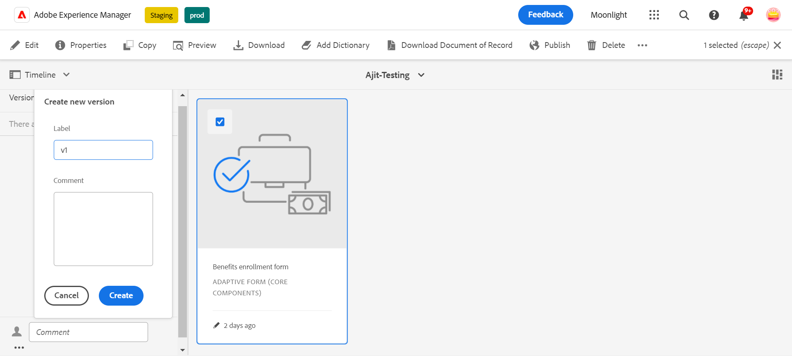
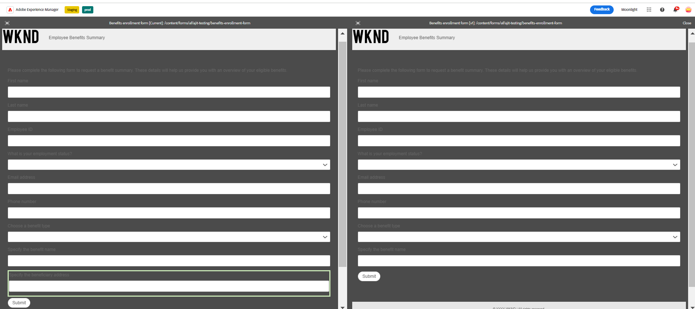
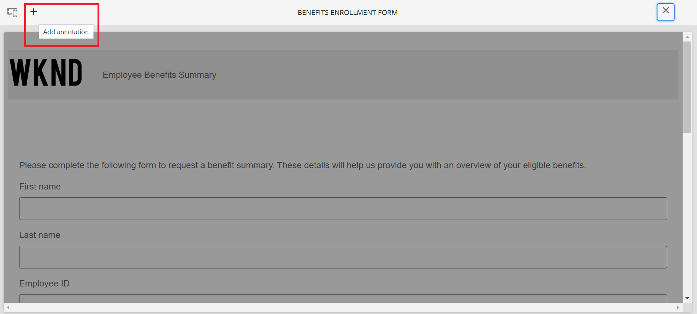

# Controle de versão, revisão e comentário em um Formulário adaptável

<!--Before you can use versionings, comments, and annotations in an Adaptive Form, you must ensure you have [enabled Adaptive Form Core Components](
https://experienceleague.adobe.com/pt-br/docs/experience-manager-cloud-service/content/forms/setup-configure-migrate/enable-adaptive-forms-core-components).-->

<!--Adaptive Form Core Components facilitates to add versionings, comments, and annotations to a form. These features helps form authors and users to enhance the form development process where they can create multiple versions of a form, collaborate and add their comments to a form, and add annotations to form components.-->

Os Componentes principais do formulário adaptável fornecem funcionalidade que permite que os autores de formulários incorporem versões, comentários e anotações nos formulários. Esses recursos servem para simplificar o processo de desenvolvimento de formulário, permitindo que os usuários criem e gerenciem várias versões de um formulário, participem de discussões colaborativas por meio de comentários e anexem anotações a componentes de formulário específicos, aprimorando assim a experiência geral de criação de formulários.

## Versão do formulário adaptável {#adaptive-form-versioning}

O controle de versão do formulário adaptável ajuda a adicionar versões a um formulário. Os autores de formulários podem criar facilmente várias versões de um formulário e, finalmente, usar aquela que é adequada aos objetivos de negócios. Além disso, os usuários do formulário também podem reverter o formulário para as versões anteriores. Também facilita que os autores comparem duas versões de um formulário, visualizando-as, permitindo que analisem melhor os formulários a partir das perspectivas da interface do usuário. Vamos analisar detalhadamente cada funcionalidade de controle de versão de formulário adaptável:

### Criar uma versão de formulário {#create-a-form-version}

Para criar a versão de um formulário, siga as etapas fornecidas abaixo:

1. Crie um formulário ou use um formulário existente.
1. Na interface do usuário do AEM, navegue até o **[!UICONTROL Formulário]**>**[!UICONTROL Forms e Documentos]** e selecione seu **Formulário**.
1. Na lista suspensa de seleção no painel esquerdo, selecione **[!UICONTROL Versões]**.
   
1. Clique nos **três pontos** localizados no painel inferior à esquerda, e clique em **[!UICONTROL Salvar como Versão]**.
1. Agora, forneça um rótulo para a versão do formulário e você poderá fornecer informações sobre o formulário por meio do comentário.
   

### Atualizar uma versão de formulário {#update-a-form-version}

Ao editar e atualizar seu formulário adaptável, você adiciona uma nova versão ao formulário. Siga as etapas fornecidas na última seção para nomear uma nova versão do formulário como mostrado na imagem:

### Reverter uma versão de formulário {#revert-a-form-version}

Para reverter uma versão de formulário para a anterior, selecione uma versão de formulário, clique em **[!UICONTROL Reverter para esta Versão]**.

### Comparar versões de formulários {#compare-form-versions}

Os autores de formulário podem comparar duas versões diferentes de um formulário para fins de visualização. Para comparar versões, selecione qualquer versão de formulário e clique em **[!UICONTROL Comparar com atual]**. Ela mostra duas versões de formulário diferentes no modo de visualização.

## Adicionar comentários {#add-comments}

Uma revisão é um mecanismo que permite que um ou mais revisores comentem formulários. Qualquer usuário do formulário pode comentar em um formulário ou revisar um formulário por meio de comentários. Para comentar em um formulário, selecione um **[!UICONTROL Formulário]** e adicione um **[!UICONTROL Comentário]** ao formulário.

>[!NOTE]
> Quando você usa comentários em componentes principais do formulário adaptável, como discutido acima, a funcionalidade de formulário [Criação e gerenciamento de revisões para formulários](/help/forms/create-reviews-forms.md) está desabilitada.

## Adicionar anotações {#adaptive-form-annotations}

Em muitos casos, os usuários do grupo de formulários são solicitados a adicionar anotações em um formulário para fins de revisão, por exemplo, em uma guia específica de um formulário ou em componentes de um formulário. Nesses casos, os autores podem usar anotações. Para adicionar anotações a um formulário, execute as seguintes etapas:

1. Abra um formulário no modo **[!UICONTROL Editar]**.

1. Clique no **ícone de adição** localizado no painel superior direito, conforme fornecido na imagem.
   

1. Clique no **ícone adicionar**, localizado no painel superior esquerdo, conforme fornecido na imagem, para adicionar a anotação.
   

1. Agora é possível adicionar comentários, desenhar rascunhos com várias cores para formar componentes.

1. Para ver todas as anotações adicionadas a um formulário, selecione o formulário e veja as anotações adicionadas no painel esquerdo, como mostrado na imagem.

   

## Consulte também {#see-also}

{{see-also}}
