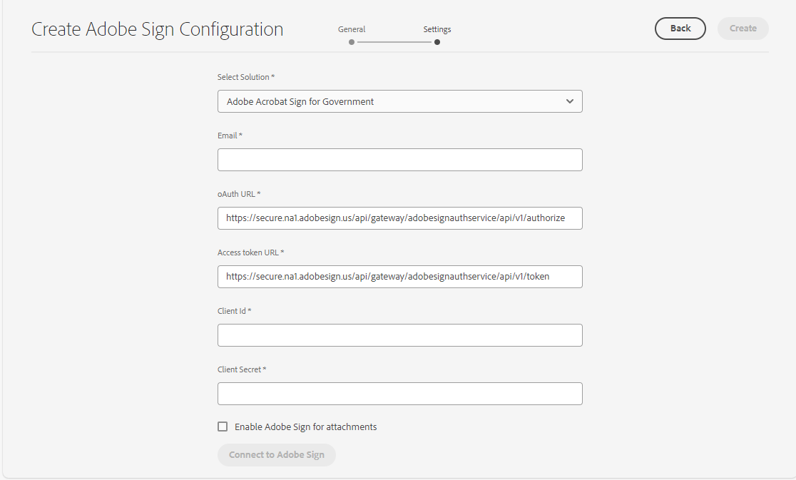

# Conectar o as a Cloud Service [!DNL AEM Forms] com [!DNL Adobe Acrobat Sign] {#integrate-adobe-sign-with-aem-forms}

| Versão | Link do artigo |
| -------- | ---------------------------- |
| AEM 6.5 | [Clique aqui](https://experienceleague.adobe.com/docs/experience-manager-65/forms/adaptive-forms-advanced-authoring/adobe-sign-integration-adaptive-forms.html#adobe-acrobat-sign-for-government) |
| AEM as a Cloud Service | Este artigo |

O [!DNL Adobe Acrobat Sign] habilita fluxos de trabalho de assinatura eletrônica para fluxos de trabalho adaptáveis do Forms e do AEM. As assinaturas eletrônicas melhoram os fluxos de trabalho para processar documentos para áreas jurídicas, de vendas, de folha de pagamento, de gerenciamento de recursos humanos e muito mais.

Em um cenário típico do [!DNL Adobe Acrobat Sign] e do Adaptive Forms, um usuário preenche um Formulário adaptável para se candidatar a um serviço. Por exemplo, um aplicativo de cartão de crédito e um formulário de benefícios para o cidadão. Quando um usuário preenche, envia e assina o formulário de aplicativo, ele é enviado ao provedor de serviços para que seja tomada uma nova ação. O provedor de serviços revisa o aplicativo e usa [!DNL Adobe Acrobat Sign] para marcar o aplicativo como aprovado. O AEM Forms é compatível com Adobe Acrobat Sign e Adobe Acrobat Sign Solutions para o governo. Dependendo da sua licença e dos requisitos, você pode integrar ou conectar o AEM Forms a qualquer uma das soluções:

* [Conectar o AEM Forms com o Adobe Acrobat Sign](#adobe-sign)
* [Conectar o AEM Forms com o Adobe Acrobat Sign Solutions para o governo](#adobe-acrobat-sign-for-government)

## Conectar o AEM Forms com o Adobe Acrobat Sign {#adobe-sign}

Para conectar o **[!DNL AEM Forms]** ao **[!DNL Adobe Acrobat Sign]**, configure o software e as contas listados na seção de pré-requisitos e configure o Adobe Sign Cloud Service nas instâncias de Autor e Publicação do Forms as a Cloud Service:

### Pré-requisitos para conectar o AEM Forms ao Adobe Acrobat Sign {#prerequisites-for-adobe-sign}

Você precisa da seguinte configuração para integrar o [!DNL Adobe Acrobat Sign] com o [!DNL AEM Forms]:

1. Uma conta de desenvolvedor [Adobe Acrobat Sign ativa.](https://www.adobe.com/acrobat/business/developer-form.html)
1. Um [aplicativo de API do Adobe Acrobat Sign](https://www.adobe.io/apis/documentcloud/sign/docs.html#!adobedocs/adobe-sign/master/gstarted/create_app.md).
1. Credenciais (ID do Cliente e Segredo do Cliente) do aplicativo da API [!DNL Adobe Acrobat Sign].
1. (Somente para autenticação baseada em ID do Governo) [Habilite o método de autenticação](https://helpx.adobe.com/sign/using/adobesign-authentication-government-id.html#AuditReport) para autenticação de ID do Governo.

### Conectar instâncias do Autor e de publicação do AEM Forms com o Adobe Acrobat Sign {#configure-adobe-sign-with-aem-forms}

Depois que os pré-requisitos estiverem em vigor, execute as etapas a seguir para configurar o [!DNL Adobe Acrobat Sign] com [!DNL AEM Forms] nas instâncias do Autor.

1. Na instância do autor do AEM Forms, navegue até **[!UICONTROL Ferramentas]**  > **[!UICONTROL Geral]** > **[!UICONTROL Navegador de Configuração]**.
1. Na página **[!UICONTROL Navegador de Configuração]**, selecione **[!UICONTROL Criar]**.
1. Na caixa de diálogo **[!UICONTROL Criar Configuração]**, especifique um **[!UICONTROL Título]** para a configuração, habilite as **[!UICONTROL Configurações de Nuvem]** e selecione **[!UICONTROL Criar]**. Ele cria um contêiner de configuração para armazenar os Serviços em nuvem. Verifique se o nome da pasta não contém nenhum espaço.
1. Navegue até **[!UICONTROL Ferramentas]**  > **[!UICONTROL Serviços da nuvem]** > **[!UICONTROL Adobe Acrobat Sign]** e abra o contêiner de configuração criado na etapa anterior.

   >[!NOTE]
   >
   >Ao criar um Formulário adaptável, especifique o nome do contêiner no campo **[!UICONTROL Contêiner de configuração]**.

1. Na página de configuração, selecione **[!UICONTROL Criar]** para criar a configuração [!DNL Adobe Acrobat Sign] no AEM Forms.
1. Na guia **[!UICONTROL Geral]** da página **[!UICONTROL Criar configuração do Adobe Acrobat Sign]**, especifique um **[!UICONTROL Nome]** para a configuração e selecione **[!UICONTROL Avançar]**. Opcionalmente, você pode especificar um **[!UICONTROL Título]** e procurar para selecionar uma **[!UICONTROL Miniatura]** para a configuração.

1. Agora você pode **[!UICONTROL Selecionar solução]** para selecionar [!DNL Adobe Acrobat Sign].

   <!---->
   

<!--

[create URL](#create-a-redirect-url-for-your-aem-instance)
 -->

1. Copie a URL presente na janela do navegador atual para um bloco de notas e remova a parte `/ui#/aem` da URL. A URL modificada é então necessária para configurar o aplicativo [!DNL Adobe Acrobat Sign] com [!DNL AEM Forms], em uma etapa posterior. Selecione **[!UICONTROL Próximo]**.

1. Na guia **[!UICONTROL Configurações]**,
   * o campo **[!UICONTROL URL do OAuth]** contém a URL padrão que inclui o fragmento de banco de dados do Adobe Sign. O formato do URL é:

     `https://<shard>/public/oauth/v2`

     Por exemplo:
     `https://secure.na1.echosign.com/public/oauth/v2`

   * o campo **[!UICONTROL URL do token de acesso]** contém a URL padrão que inclui o fragmento de banco de dados do Adobe Sign. O formato do URL é:

     `https://<shard>/oauth/v2/token`

     Por exemplo:
     `https://api.na1.echosign.com/oauth/v2/token`

   em que:

   **na1** refere-se ao fragmento de banco de dados padrão. Você pode modificar o valor do fragmento de banco de dados. Verifique se as Configurações de Nuvem do [!DNL  Adobe Acrobat Sign] apontam para o [Fragmento correto](https://helpx.adobe.com/sign/using/identify-account-shard.html).

   >[!NOTE]
   >
   >* Mantenha aberta a página **Criar configuração do Adobe Acrobat Sign**. Não feche. Você pode recuperar a **ID do Cliente** e o **Segredo do Cliente** após definir as configurações OAuth para o aplicativo [!DNL Adobe Acrobat Sign] conforme descrito nas próximas etapas.
   >* Depois de fazer logon na conta do Adobe Sign, navegue até **[!UICONTROL API do Acrobat Sign]** > **[!UICONTROL Informações da API]** > **[!UICONTROL Documentação dos métodos da API REST]** > **[!UICONTROL Token de acesso OAuth]** para acessar informações relacionadas à URL do OAuth e à URL do Token de acesso do Adobe Sign.

1. Defina as configurações de OAuth para o aplicativo [!DNL Adobe Acrobat Sign]:

   1. Abra uma janela de navegador e entre na sua conta de desenvolvedor do [!DNL Adobe Acrobat Sign].
   1. Selecione o aplicativo configurado para [!DNL AEM Forms] e selecione **[!UICONTROL Configurar OAuth para o Aplicativo]**.
   1. Na caixa **[!UICONTROL Redirecionar URL]**, adicione a URL copiada em uma etapa anterior (Etapa 8) e clique em **[!UICONTROL Salvar]**.
   1. Habilite o seguinte Escopo para o aplicativo [!DNL Adobe Acrobat Sign] e clique em **[!UICONTROL Salvar]**.

   * [!DNL aggrement_read]
   * [!DNL aggrement_write]
   * [!DNL aggrement_send]
   * [!DNL widget_read]
   * [!DNL widget_write]
   * [!DNL workflow_read]

   >[!NOTE]
   > Você pode alterar o modificador de escopos de `self` para `account` diretamente da interface do AEM, conforme fornecido na etapa 12.

   Para obter informações passo a passo sobre como definir as configurações OAuth para um aplicativo [!DNL Adobe Acrobat Sign] e obter as chaves, consulte [Definir configurações oAuth para a documentação do desenvolvedor do aplicativo](https://www.adobe.io/apis/documentcloud/sign/docs.html#!adobedocs/adobe-sign/master/gstarted/configure_oauth.md).

   

1. Volte para a página **[!UICONTROL Criar configuração do Adobe Acrobat Sign]**. Na guia **[!UICONTROL Configurações]**, especifique a [**[!UICONTROL ID do Cliente]** (também conhecida como ID do Aplicativo) e o **[!UICONTROL Segredo do Cliente]**]. Use a [ID do Cliente e o Segredo do Cliente do aplicativo Adobe Acrobat Sign](https://opensource.adobe.com/acrobat-sign/developer_guide/helloworld.html#get-the-app-id-and-secret) criados na etapa anterior.

1. Na seção [!UICONTROL Escopo da Autorização], você pode modificar os escopos para &quot;conta&quot; ou &quot;self&quot; adicionando o prefixo &quot;self&quot; ou &quot;account&quot; aos escopos, conforme necessário.
   

1. Selecione a opção **[!UICONTROL Habilitar Adobe Acrobat Sign para anexos]** para anexar arquivos anexados a um Formulário Adaptável ao documento [!DNL Adobe Acrobat Sign] correspondente enviado para assinatura.

1. Selecione **[!UICONTROL Conectar ao Adobe Acrobat Sign]**. Quando as credenciais forem solicitadas, forneça **nome de usuário** e **senha** da conta usada ao criar o aplicativo [!DNL Adobe Acrobat Sign]. Quando for solicitada a confirmação, acesse para `your developer account`, clique em **[!UICONTROL Permitir acesso]**. Se as credenciais estiverem corretas e você permitir que o [!DNL AEM Forms] acesse sua conta de desenvolvedor do [!DNL Adobe Acrobat Sign], uma mensagem de êxito semelhante à seguinte será exibida.

   

1. Selecione **[!UICONTROL Criar]** para criar a configuração [!DNL Adobe Acrobat Sign].

1. Selecione a configuração e clique em **[!UICONTROL Publicar]**, selecione a configuração e clique em **[!UICONTROL Publicar]**. Ele replica a configuração nos ambientes de publicação correspondentes.

1. Repita todas as etapas acima nas instâncias de desenvolvedor, preparo e produção (qualquer uma que tenha restado) para concluir a configuração do [!DNL Adobe Acrobat Sign] com [!DNL AEM Forms] para o seu ambiente.

Agora, você pode [usar a opção adicionar campos do Adobe Acrobat Sign a um Formulário adaptável](working-with-adobe-sign.md). Adicione o contêiner de configuração usado para o Cloud Service a toda a Forms adaptável que está sendo habilitada para [!DNL Adobe Acrobat Sign]. Você pode especificar um contêiner de configuração nas propriedades de um Formulário adaptável.

>[!NOTE]
>
> Para configurar a sandbox do Adobe Sign, você pode seguir as mesmas etapas de configuração descritas em [Adobe Sign](#adobe-sign).

#### Resolução de problemas {#resolve-config-error}

Ao conectar [!DNL Adobe Acrobat Sign] com [!DNL AEM Forms] e encontrar um erro `Unable to authorize access because the client configuration is invalid: invalid_request`, como mostrado na imagem abaixo. Para resolver isso, siga as etapas fornecidas abaixo:


1. Copie a URL presente na janela do navegador atual para um bloco de notas e remova a parte `/ui#/aem` da URL.
1. Abra uma janela de navegador e entre na sua conta de desenvolvedor do [!DNL Adobe Acrobat Sign].
1. Selecione o aplicativo configurado para [!DNL AEM Forms] e selecione **[!UICONTROL Configurar OAuth para o Aplicativo]**.
1. Na caixa **[!UICONTROL Redirecionar URL]**, adicione a URL copiada em uma etapa anterior e clique em **[!UICONTROL Salvar]**.

## Conectar o AEM Forms com o Adobe Acrobat Sign Solutions para o governo {#adobe-acrobat-sign-for-government}

A conexão do AEM Forms com o Adobe Acrobat Sign Solutions para o governo é um processo de várias etapas. Envolve:

* Criar URL de redirecionamento para suas instâncias do AEM
* Compartilhamento do URL de redirecionamento e escopos com a equipe do Adobe Sign Solutions for Government
* Recebimento de credenciais da equipe do Adobe Sign
* Usar as credenciais recebidas para conectar o AEM Forms ao Adobe Acrobat Sign Solutions for Government


O AEM Forms as a Cloud Service fornece ambientes de desenvolvimento, preparo e produção. Você pode começar com a conexão do seu ambiente de desenvolvimento para com o Adobe Acrobat Sign Solutions for Government e conectar os ambientes de preparo e produção posteriormente.

### Antes de começar {#prerequisites-for-adobe-sign-for-acrobat-sign-for-government}

Antes de começar a conectar o AEM Forms com a Solução da Adobe Acrobat Sign, verifique se a sua conta do [Adobe Acrobat Sign Solutions for Government](https://opensource.adobe.com/acrobat-sign/signgov/gstarted.html#account-provisioning) foi provisionada.


### Conectar o AEM Forms as a Cloud Service com o Adobe Acrobat Sign Solutions for Government {#connect-adobe-acrobat-sign-for-government}

#### Crie um URL de redirecionamento para sua instância do AEM

1. Na instância do autor do Forms as a Cloud Service, navegue até **[!UICONTROL Ferramentas]**  > **[!UICONTROL Geral]** > **[!UICONTROL Navegador de Configuração]**.
1. Na página **[!UICONTROL Navegador de Configuração]**, selecione **[!UICONTROL Criar]**.
1. Na caixa de diálogo **[!UICONTROL Criar Configuração]**, especifique um **[!UICONTROL Título]** para a configuração, habilite as **[!UICONTROL Configurações de Nuvem]** e selecione **[!UICONTROL Criar]**. Ele cria um contêiner de configuração para armazenar os Serviços em nuvem. Verifique se o nome da pasta não contém nenhum espaço.
1. Navegue até **[!UICONTROL Ferramentas]**  > **[!UICONTROL Serviços da nuvem]** > **[!UICONTROL Adobe Acrobat Sign]** e abra o contêiner de configuração criado na etapa anterior. Ao criar um Formulário adaptável, especifique o nome do contêiner no campo **[!UICONTROL Contêiner de configuração]**.
1. Na página de configuração, selecione **[!UICONTROL Criar]** para criar a configuração [!DNL Adobe Acrobat Sign] no AEM Forms.
1. Copie a URL da janela do navegador atual para um bloco de notas e remova `/ui#/aem` da URL. Esta URL é referida como `re-direct URL`.
Na próxima seção, você compartilha o `re-direct URL` e o `Scopes` com a equipe do Adobe Sign e solicita as credenciais (ID do cliente e Segredo do cliente).

#### Compartilhar o URL de redirecionamento e os escopos com a equipe do Adobe Sign e receber credenciais

A equipe do Adobe Acrobat Sign for Government Solutions exige que o `re-direct URL` e determinados escopos sejam habilitados para que seu aplicativo Adobe Acrobat Sign (listado abaixo) gere credenciais (ID do cliente e Segredo do cliente) que permitam conectar o AEM Forms ao Adobe Acrobat Sign Solutions for Government.

Compartilhe o `scopes` (listado abaixo) e o `re-direct URL` criado e anotado na última etapa da seção anterior com seu representante Adobe Acrobat Sign for Government Solution ([membro da equipe do Adobe Professional Services](https://opensource.adobe.com/acrobat-sign/signgov/gstarted.html#password)).

**_Escopos_**

* [!DNL aggrement_read]
* [!DNL aggrement_write]
* [!DNL aggrement_send]
* [!DNL widget_read]
* [!DNL widget_write]
* [!DNL workflow_read]
* [!DNL offline_access]

O representante gera e compartilha credenciais com você. Na próxima seção, use as credenciais (ID do cliente e Segredo do cliente) para conectar o AEM Forms ao Adobe Acrobat Sign Solutions for Government.

#### Use as credenciais recebidas para conectar o AEM Forms ao Adobe Acrobat Sign Solutions for Government

1. Abra o `re-direct URL` no navegador. Você criou e anotou o `re-direct URL` na última etapa da seção [criar uma URL de redirecionamento na sua instância do AEM](#create-a-redirect-url-for-your-aem-instance).

1. Na guia **[!UICONTROL Geral]** da página **[!UICONTROL Criar configuração do Adobe Sign]**, especifique um **[!UICONTROL Nome]** para a configuração e selecione **[!UICONTROL Avançar]**. Opcionalmente, você pode especificar um **[!UICONTROL Título]** e procurar para selecionar uma **[!UICONTROL Miniatura]** para a configuração. Clique em **[!UICONTROL Avançar]**.

1. Na guia **[!UICONTROL Configurações]** da página **[!UICONTROL Criar configuração do Adobe Sign]**, para a opção **[!UICONTROL Selecionar solução]**, selecione [!DNL Adobe Acrobat Sign Solutions for Government].


   

1. No campo **[!UICONTROL Email]**, especifique o endereço de email associado à sua conta do Adobe Acrobat Sign Solutions for Government.

1. Na guia **[!UICONTROL Configurações]**,
   * o campo **[!UICONTROL URL do OAuth]** contém a URL padrão que inclui o fragmento de banco de dados do Adobe Sign. O formato do URL é:

     `https://<shard>/api/gateway/adobesignauthservice/api/v1/authorize`

     Por exemplo:
     `https://secure.na1.adobesign.us/api/gateway/adobesignauthservice/api/v1/authorize`

   * o campo **[!UICONTROL URL do token de acesso]** contém a URL padrão que inclui o fragmento de banco de dados do Adobe Sign. O formato do URL é:

     `https://<shard>/api/gateway/adobesignauthservice/api/v1/token`

     Por exemplo:
     `https://secure.na1.adobesign.us/api/gateway/adobesignauthservice/api/v1/token`

   em que:

   **na1** refere-se ao fragmento de banco de dados padrão. Você pode modificar o valor do fragmento de banco de dados. Verifique se as Configurações de Nuvem do [!DNL  Adobe Acrobat Sign] apontam para o [Fragmento correto](https://helpx.adobe.com/sign/using/identify-account-shard.html).

   >[!NOTE]
   >
   > * Depois de fazer logon na conta do Adobe Sign, navegue até **[!UICONTROL API do Acrobat Sign]** > **[!UICONTROL Informações da API]** > **[!UICONTROL Documentação dos Métodos da API REST]** > **[!UICONTROL Token de acesso OAuth]** para acessar informações relacionadas à URL do Adobe Sign oAuth e à URL do Token de acesso.

1. Use as credenciais compartilhadas pela Adobe Acrobat Sign para o representante de Solução Governamental ([membro da equipe da Adobe Professional Services]) na seção anterior como [**[!UICONTROL ID do Cliente]** e **[!UICONTROL Segredo do Cliente]**].

1. Selecione a opção **[!UICONTROL Habilitar Adobe Acrobat Sign para anexos]** para anexar arquivos anexados a um Formulário Adaptável ao documento [!DNL Adobe Acrobat Sign] correspondente enviado para assinatura.

1. Selecione **[!UICONTROL Conectar ao Adobe Sign]**. Quando as credenciais forem solicitadas, forneça o nome de usuário e a senha da conta usada ao criar o aplicativo [!DNL Adobe Acrobat Sign]. Quando solicitado a confirmar o acesso para `your developer account`, clique em **[!UICONTROL Permitir Acesso]**. Se as credenciais estiverem corretas e você permitir que o [!DNL AEM Forms] acesse sua conta de desenvolvedor do [!DNL Adobe Acrobat Sign], uma mensagem de êxito semelhante à seguinte será exibida.

   

   <!-- 
      > When prompted for credentials, provide username and password of the account used while creating [!DNL Adobe Acrobat Sign] application. When asked to confirm access for `your developer account`, Click **[!UICONTROL Allow Access]**. 
      -->

1. Selecione **[!UICONTROL Criar]** para criar a configuração.

1. Selecione a configuração e clique em **[!UICONTROL Publicar]**, selecione a configuração e clique em **[!UICONTROL Publicar]**. Ele replica a configuração nos ambientes de publicação correspondentes.

1. Repita todas as etapas acima nas instâncias de desenvolvedor, preparo e produção (qualquer uma que tenha restado) para concluir a configuração do [!DNL Adobe Acrobat Sign Solutions for Government] com [!DNL AEM Forms] para o seu ambiente.

Agora você pode [usar a opção adicionar campos do Adobe Acrobat Sign em um Formulário Adaptável](working-with-adobe-sign.md) ou [Fluxo de Trabalho do AEM](/help/forms/aem-forms-workflow-step-reference.md#sign-document-step-sign-document-step). Adicione o contêiner de configuração usado para a configuração do Cloud Service a todo o Forms adaptável que está sendo habilitado para [!DNL Adobe Acrobat Sign]. Você pode especificar um contêiner de configuração nas propriedades de um Formulário adaptável.

## Configurar o agendador [!DNL Adobe Acrobat Sign] para sincronizar o status de assinatura {#configure-adobe-sign-scheduler-to-sync-the-signing-status}

O AEM Forms as a Cloud Service fornece um serviço de scheduler que verifica o status dos signatários em intervalos definidos. Os cenários nos quais você configura o serviço scheduler:

* Se você usar [Enviar o formulário (depois que cada destinatário concluir a cerimônia de assinatura)](/help/forms/working-with-adobe-sign.md#select-adobe-sign-cloud-service-and-signing-order) para assinar um documento, o formulário será enviado somente depois que todos os signatários tiverem assinado o formulário.
* Se você usar a [Etapa Assinar em um Fluxo de Trabalho do AEM](/help/forms/aem-forms-workflow-step-reference.md#sign-document-step) para assinar um documento, a etapa assinar aguardará que todos os signatários assinem o documento antes de prosseguir para a próxima etapa do fluxo de trabalho.

Por padrão, os serviços do Agendador do [!DNL Adobe Acrobat Sign] verificam a resposta do assinante a cada 24 horas. Você pode alterar o intervalo padrão do seu ambiente.

Para alterar o intervalo padrão, especifique uma [expressão cron](https://en.wikipedia.org/wiki/Cron#CRON_expression) para a propriedade **sign.status.exp** da configuração do **Serviço de Configuração do Adobe Acrobat Sign**.

Por exemplo, para executar o serviço de configuração diariamente às 00:00 am, defina a propriedade **sign.status.exp** da configuração do **Serviço de Configuração do Adobe Acrobat Sign** para especificar `0 0 0 1/1 * ? *`. O arquivo JSON a seguir exibe a amostra para executar o serviço de configuração diariamente às 00:00 am:

```json
{
  "sign.status.exp":"0 0 0 1/1 * ? *"
}
```

Para definir valores de uma configuração, [Gere Configurações OSGi usando o AEM SDK](https://experienceleague.adobe.com/docs/experience-manager-cloud-service/implementing/deploying/configuring-osgi.html?lang=en#generating-osgi-configurations-using-the-aem-sdk-quickstart) e [implante a configuração](https://experienceleague.adobe.com/docs/experience-manager-cloud-service/implementing/using-cloud-manager/deploy-code.html?lang=en#deployment-process) na sua instância do Cloud Service.

## Perguntas frequentes

* **P: Posso renderizar a página de Assinatura GovCloud do Adobe Sign em um iframe?**
* **A:** Sim, você pode renderizar a página de Assinatura GovCloud do Adobe Sign em um iframe.

>[!MORELIKETHIS]
>
>* [Assinar um formulário eletronicamente usando assinaturas escritas](/help/forms/signing-forms-using-scribble.md)
>* [Práticas recomendadas para usar o Adobe Acrobat Sign com o Adaptive Forms](https://medium.com/adobetech/using-adobe-sign-to-e-sign-an-adaptive-form-heres-the-best-way-to-do-it-dc3e15f9b684)
