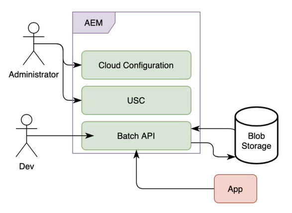

# Forms as a Cloud Service Communications - processamento em lote

As comunicações permitem criar, montar e fornecer comunicações personalizadas e orientadas por marcas, como correspondências comerciais, documentos, demonstrativos, cartas de processamento de solicitações, avisos de benefícios, cartas de processamento de solicitações, contas mensais e kits de boas-vindas. Você pode usar as APIs de comunicações para combinar um modelo (XFA ou PDF) com os dados do cliente para gerar documentos nos formatos PDF, PS, PCL, DPL, IPL e ZPL.

As comunicações fornecem APIs para geração de documentos sob demanda e programada. Você pode usar APIs síncronas para APIs sob demanda e em lote (APIs assíncronas) para geração de documento agendado:

* As APIs síncronas são adequadas para casos de uso sob demanda, baixa latência e geração de documento de registro único. Essas APIs são mais adequadas para casos de uso baseados em ações do usuário. Por exemplo, gerar um documento depois que um usuário preencher um formulário.

* As APIs em lote (APIs assíncronas) são adequadas para casos de uso de geração de documento com várias throughput programada. Essas APIs geram documentos em lotes. Por exemplo, contas telefônicas, demonstrativos de cartão de crédito e demonstrativos de benefícios gerados todo mês.

<!-- The following skills are required to create templates and use HTTP APIs: 

* Understanding of Adobe Forms Designer or Acrobat Forms to create templates

* Understanding of HTTP APIs and experience of using HTTP APIs

* Basic understanding of Adobe Experience Manager -->


## Operações em lote {#batch-operations}

Uma operação em lote é um processo de geração de vários documentos do tipo semelhante para um conjunto de registros em intervalos programados. Uma operação em lote tem duas partes: Configuração (definição) e execução.

* **Configuração (definição)**: Uma configuração em lote armazena informações sobre vários ativos e propriedades a serem definidos para documentos gerados. Por exemplo, ele fornece detalhes sobre o modelo XDP ou PDF e o local dos dados do cliente a serem usados, além de especificar várias propriedades para documentos de PDF de saída.

* **Execução**: Para iniciar uma operação em lote, especifique a execução e transmita o nome da configuração em lote para a API de execução em lote.

### Componentes de uma operação em lote {#components-of-a-batch-operations}

**Configuração na nuvem**: A configuração da Experience Manager Cloud ajuda você a conectar uma instância do Experience Manager ao Armazenamento do Microsoft Azure de propriedade do cliente. Ele permite especificar as credenciais para a conta do Microsoft Azure de propriedade do cliente para se conectar a ela.

**Configuração do armazenamento de dados em lote (USC)**: A configuração de dados em lote ajuda a configurar uma instância específica do armazenamento de blobs para APIs em lote. Ele permite especificar os locais de entrada e saída no armazenamento do Microsoft Azure Blob de propriedade do cliente.

**APIs em lote**: Permite criar configurações em lote e executar as execuções em lote com base nessas configurações para criar e executar uma operação em lote para unir um modelo PDF ou XDP aos dados e gerar saída nos formatos PDF, PS, PCL, DPL, IPL e ZPL. As comunicações fornecem APIs em lote para criar, ler, atualizar e excluir operações.



**Armazenamento**: As APIs de comunicação usam o armazenamento da Microsoft Azure Cloud de propriedade do cliente para buscar registros do cliente e armazenar documentos gerados. Você configura o Armazenamento do Microsoft Azure na Configuração do Experience Manager Cloud Service.

**Aplicativo**: Seu aplicativo personalizado para usar as APIs em lote para gerar e consumir documentos.

## Gerar vários documentos usando operações em lote {#generate-multiple-documents-using-batch-operations}

Você pode usar operações em lote para gerar vários documentos em intervalos programados.

>[!VIDEO](https://video.tv.adobe.com/v/338349)

Você pode assistir ao vídeo ou executar as instruções abaixo para saber como gerar documentos usando operações em lote. A documentação de referência da API usada no vídeo está disponível no formato .yaml. Você pode baixar o [APIs em lote](assets/batch-api.yaml) e carregue-o no Postman para verificar a funcionalidade das APIs e acompanhar o vídeo.

### Pré-requisitos {#pre-requisites}

Para usar a API em lote, o seguinte é obrigatório:

* [Conta de Armazenamento do Microsoft Azure](https://docs.microsoft.com/en-us/azure/storage/common/storage-account-create)
* Modelos PDF ou XDP
* [Dados a serem mesclados com modelos](#form-data)
* Usuários com privilégios de administrador de Experience Manager

### Configurar o ambiente {#setup-your-environment}

Antes de usar uma operação em lote:

* Fazer upload dos dados do cliente (arquivos XML) para o armazenamento de blobs do Microsoft Azure
* Criar uma configuração do Cloud
* Criar configuração do armazenamento de dados em lote
* Fazer upload de modelos e outros ativos para a instância do Experience Manager Forms Cloud Service

### Fazer upload dos dados do cliente (arquivos XML) para o Armazenamento do Azure {#upload-customer-data-to-Azure-Storage}

No armazenamento do Microsoft Azure, crie [contêineres](https://docs.microsoft.com/en-us/azure/vs-azure-tools-storage-explorer-blobs) e [fazer upload dos dados do cliente (XML)](https://docs.microsoft.com/en-us/azure/vs-azure-tools-storage-explorer-blobs#managing-blobs-in-a-blob-container) para [pastas](https://docs.microsoft.com/en-us/azure/storage/blobs/storage-quickstart-blobs-portal) dentro dos contêineres.
>[!NOTE]
>
>Você pode configurar o armazenamento do Microsoft Azure para limpar automaticamente a pasta de entrada ou mover o conteúdo da pasta de saída para um local diferente em intervalos agendados. No entanto, verifique se as pastas não são limpas quando uma operação em lote que faz referência às pastas ainda estiver em execução.

### Criar uma configuração do Cloud {#create-a-cloud-configuration}

A configuração da nuvem conecta sua instância do Experience Manager ao Armazenamento do Microsoft Azure. Para criar uma configuração do Cloud:

1. Vá para Ferramentas > Cloud Services > Armazenamento do Azure
1. Abra uma pasta para hospedar a configuração e clique em Criar. Use a pasta Global ou crie uma pasta.
1. Especifique o nome da configuração e as credenciais para se conectar ao serviço. Você pode [recuperar essas credenciais do portal de armazenamento do Microsoft Azure](https://docs.microsoft.com/en-us/azure/storage/common/storage-account-keys-manage?tabs=azure-portal#view-account-access-keys).
1. Clique em Criar.

A instância do Experience Manager agora está pronta para se conectar ao Armazenamento do Microsoft Azure e usá-la para armazenar e ler conteúdo, quando necessário.

### Criar configuração do armazenamento de dados em lote {#create-batch-data-store-configuration}

A configuração de dados em lote ajuda a configurar contêineres e pastas para entrada e saída. Você mantém os registros do cliente na Pasta de origem e os documentos gerados são colocados na Pasta de destino.

Para criar a configuração:

1. Acesse Ferramentas > Forms > Conector de armazenamento unificado.
1. Abra uma pasta para hospedar a configuração e clique em Criar. Use a pasta Global ou crie uma pasta.
1. Especifique o Título e o Nome da configuração. Em Armazenamento, selecione Armazenamento do Microsoft Azure.
1. No Caminho de configuração de armazenamento, navegue e selecione a Configuração da nuvem que contém credenciais da conta de armazenamento do Azure de propriedade do cliente.
1. Na Pasta de Origem, especifique o nome do contêiner de Armazenamento do Azure e a pasta que contém os registros.
1. Na Pasta de Destino, especifique o caminho do contêiner de Armazenamento do Azure e a pasta para armazenar os documentos gerados.
1. Clique em Criar.

A instância do Experience Manager agora está conectada ao Armazenamento do Microsoft Azure e configurada para recuperar e enviar dados para locais específicos no Armazenamento do Microsoft Azure.

### Fazer upload de modelos e outros ativos para a instância do Experience Manager {#upload-templates-and-other-assets-to-your-AEM-instance}

Uma organização geralmente tem vários modelos. Por exemplo, um modelo cada para demonstrativos de cartão de crédito, demonstrativos de benefícios e aplicações de reivindicações. Faça upload de todos esses modelos XDP e PDF para sua instância do Experience Manager. Para fazer upload de um template:

1. Abra a instância do Experience Manager.
1. Vá para Forms > Forms e Documentos
1. Clique em Criar > Pasta e crie uma pasta. Abra a pasta.
1. Clique em Criar > Upload de arquivo e faça upload dos modelos.

## Usar API em lote para gerar documentos {#use-batch-API-to-generate-documents}

Para usar uma API em lote, crie uma configuração em lote e execute uma execução com base nessa configuração. A documentação da API fornece informações sobre APIs para criar e executar um lote, parâmetros correspondentes e possíveis erros. Você pode baixar o [Arquivo de definição de API](assets/batch-api.yaml) e faça upload para [Postman](https://go.postman.co/home) ou software semelhante para testar as APIs para criar e executar uma operação em lote.

### Criar um lote {#create-a-batch}

Para criar um lote, use o `GET /config` API. Inclua as seguintes propriedades obrigatórias no corpo da solicitação HTTP:


* **configName**: Especifique o nome Exclusivo do lote. Por exemplo, `wknd-job`
* **dataSourceConfigUri**: Especifique o local da configuração do armazenamento de dados em lote. Pode ser um caminho relativo ou absoluto da configuração. Por exemplo: `/conf/global/settings/forms/usc/batch/wknd-batch`
* **outputTypes**: Especificar formatos de saída: PDF ou IMPRIMIR. Se você usar o tipo de saída PRINT , em `printedOutputOptionsList` , especifique pelo menos uma opção de impressão. As opções de impressão são identificadas pelo tipo de renderização, de modo que, no momento, várias opções de impressão com o mesmo tipo de renderização não são permitidas. Os formatos compatíveis são PS, PCL, DPL, IPL e ZPL.

* **modelo**: Especifique o caminho absoluto ou relativo do modelo. Por exemplo, `crx:///content/dam/formsanddocuments/wknd/statements.xdp`

Se você especificar um caminho relativo, também forneça uma raiz de conteúdo. Consulte a documentação da API para obter detalhes da raiz do conteúdo.

<!-- For example, you include the following JSON in the body of HTTP APIs to create a batch named wknd-job: -->

Depois de criar um lote, é possível usar a variável `GET /config /[configName]/execution/[execution-identifier]` para ver detalhes do lote.

### Executar um lote {#run-a-batch}

Para executar (executar) um lote, use o `POST /config /[configName]/execution`. Por exemplo, para executar um lote chamado wknd-demo, use /config/wknd-demo/execution. O servidor retorna o código de resposta HTTP 202 ao aceitar a solicitação. A API não retorna nenhuma carga, exceto um código exclusivo (identificador de execução) no cabeçalho da resposta HTTP para o trabalho em lote em execução no servidor. Você pode usar o identificador de execução para recuperar o status do lote.

>[!NOTE]
>
>Enquanto o lote estiver em execução, não faça alterações nas pastas de origem e de destino correspondentes, na configuração da fonte de dados e na configuração da Microsoft Azure Cloud.

### Verificar o status de um lote {#status-of-a-batch}

Para recuperar o status de um lote, use o `GET /config /[configName]/execution/[execution-identifier]`. O identificador de execução é incluído no cabeçalho da resposta HTTP para a solicitação de execução em lote.  Por exemplo, a imagem a seguir exibe o identificador de execução para um trabalho em lote.

A resposta da solicitação de status contém a seção de status . Ele fornece detalhes sobre o status do trabalho em lote, o número de registros já em pipeline (já lidos e processados) e o status de cada outputType/renderType(número de itens em andamento, bem-sucedidos e com falha). O status também inclui a hora inicial e final do trabalho em lote, juntamente com informações sobre erros, se houver. A hora de término é -1 até que a execução do lote seja realmente concluída.

>[!NOTE]
>
>* Quando você solicita vários formatos PRINT, o status contém várias entradas. Por exemplo, PRINT/ZPL, PRINT/IPL.
>* Um trabalho em lote não lê todos os registros simultaneamente, em vez disso, o trabalho continua lendo e incrementando o número de registros. Portanto, o status retorna um número diferente de registros em cada execução.


### Exibir documentos gerados {#view-generated-documents}

Após a conclusão do trabalho, os documentos gerados são armazenados no `success` no local de destino especificado na configuração do Armazenamento de dados em lote. Se houver erros, o serviço criará uma `failure` pasta. Ele fornece informações sobre o tipo e o motivo dos erros.

Vamos entender com a ajuda de um exemplo: Suponha que haja um arquivo de dados de entrada `record1.xml` e dois tipos de saída: `PDF` e `PCL`. Em seguida, o local de destino contém duas subpastas `pdf` e `pcl`, um para cada um dos tipos de saída. Vamos supor que a geração de PDF tenha êxito, então a `pdf` subpasta contém o `success` subpasta que, por sua vez, contém o documento PDF gerado real `record1.pdf`. Vamos supor que a geração da PCL falhou, então a `pcl` subpasta contém um `failure` subpasta que, por sua vez, contém um arquivo de erro `record1.error.txt` que contém detalhes do erro. Além disso, o local de destino contém uma pasta temporária chamada `__tmp__` que mantém determinados arquivos necessários durante a execução do lote. Essa pasta pode ser excluída quando não houver execuções ativas de lote referenciando a pasta de destino.

>[!NOTE]
>
>O processamento de um lote pode levar algum tempo, dependendo do número de registros de entrada e da complexidade do template, aguardar alguns minutos antes de verificar as pastas de destino quanto a arquivos de saída.

## Considerações  {#considerations-for-communications-apis}

### Dados do formulário {#form-data}

As APIs de comunicações aceitam um design de formulário que normalmente é criado no Designer e dados de formulário XML como entrada. Para preencher um documento com dados, um elemento XML deve existir nos dados do formulário XML para cada campo de formulário que você deseja preencher. O nome do elemento XML deve corresponder ao nome do campo. Um elemento XML é ignorado se não corresponder a um campo de formulário ou se o nome do elemento XML não corresponder ao nome do campo. Não é necessário corresponder à ordem em que os elementos XML são exibidos. O fator importante é que os elementos XML são especificados com valores correspondentes.

Considere o seguinte exemplo de formulário de pedido de empréstimo:


Para unir dados neste design de formulário, crie uma fonte de dados XML que corresponda ao formulário. O XML a seguir representa uma fonte de dados XML que corresponde ao formulário de aplicativo de hipoteca de exemplo.

```XML
<?xml version="1.0" encoding="UTF-8" ?>
- <xfa:datasets xmlns:xfa="http://www.xfa.org/schema/xfa-data/1.0/">
- <xfa:data>
- <data>
    - <Layer>
        <closeDate>1/26/2007</closeDate>
        <lastName>Johnson</lastName>
        <firstName>Jerry</firstName>
        <mailingAddress>JJohnson@NoMailServer.com</mailingAddress>
        <city>New York</city>
        <zipCode>00501</zipCode>
        <state>NY</state>
        <dateBirth>26/08/1973</dateBirth>
        <middleInitials>D</middleInitials>
        <socialSecurityNumber>(555) 555-5555</socialSecurityNumber>
        <phoneNumber>5555550000</phoneNumber>
    </Layer>
    - <Mortgage>
        <mortgageAmount>295000.00</mortgageAmount>
        <monthlyMortgagePayment>1724.54</monthlyMortgagePayment>
        <purchasePrice>300000</purchasePrice>
        <downPayment>5000</downPayment>
        <term>25</term>
        <interestRate>5.00</interestRate>
    </Mortgage>
</data>
</xfa:data>
</xfa:datasets>
```

### Tipos de documento suportados {#supported-document-types}

Para obter acesso completo aos recursos de renderização das APIs de Comunicação, é recomendável usar um arquivo XDP como entrada. Às vezes, um arquivo PDF pode ser usado. No entanto, usar um arquivo PDF como entrada tem as limitações:

Um documento PDF que não contém um fluxo XFA não pode ser renderizado como PostScript, PCL ou ZPL. As APIs de comunicações podem renderizar documentos PDF com fluxos XFA (ou seja, formulários criados no Designer) em formatos de laser e rótulo. Se o documento do PDF for assinado, certificado ou contiver direitos de uso (aplicados usando o serviço AEM Forms Reader Extensions), ele não poderá ser renderizado para esses formatos de impressão.

## Documentação de referência da API

A documentação de referência da API fornece informações detalhadas sobre todos os parâmetros, métodos de autenticação e vários serviços fornecidos pelas APIs. A documentação de referência da API está disponível no formato .yaml. Você pode baixar o [APIs em lote](assets/batch-api.yaml) e faça upload para o Postman para verificar a funcionalidade de APIs.

## Problemas conhecidos {#known-issues}

* Certifique-se de que o arquivo xml de dados não contenha o cabeçalho da declaração XML. Por exemplo, `<?xml version="1.0" encoding="UTF-8"?>`

* Quando PRINT é especificado, um tipo de renderização específico só pode ser especificado uma vez na lista de opções de impressão. Por exemplo, você não pode ter duas opções de impressão especificando cada uma um um tipo de renderização PCL.

* Não modifique a Configuração do USC da Fonte de Dados/Configuração da Nuvem do Azure usada em uma configuração de lote enquanto o lote está sendo executado. Mesmo após a execução, se alguma atualização for necessária, crie uma cópia da configuração em vez de atualizar a usada em uma configuração de lote existente.

## Práticas recomendadas     {#best-practices}

* O Adobe recomenda hospedar arquivos de dados no armazenamento do contêiner de blob na região de nuvem usada pelo Experience Manager Cloud Service.

## Perguntas frequentes {#faq}

**Posso usar uma pasta monitorada ou outros mecanismos de armazenamento para armazenar entrada e saída?**

No momento, você pode usar o Armazenamento do Microsoft Azure para salvar dados de entrada e documentos gerados. O armazenamento do Microsoft Azure fornece várias opções para [automatizar operações de movimentação de dados](https://docs.microsoft.com/en-us/azure/storage/common/storage-use-azcopy-v10).

**Uma conta de armazenamento do Microsoft Azure está incluída na licença do Experience Manager Forms Cloud Service?**

A conta de armazenamento do Microsoft Azure é independente da licença do Experience Manager Forms Cloud Service.

**As APIs do Communication armazenam dados nos servidores do Experience Manager Forms Cloud Service?**

Os dados de entrada e saída são salvos somente no Armazenamento do Microsoft Azure.

**As APIs de comunicação estão disponíveis apenas para o Experience Manager Forms Cloud Service? Posso obter funcionalidade semelhante no ambiente local?**

Você pode usar o serviço AEM Forms Output para combinar um modelo (XFA ou PDF) com dados do cliente para gerar documentos nos formatos PDF, PS, PCL e ZPL.

Em comparação com o ambiente local, o Cloud Service oferece benefícios adicionais de dimensionamento automático e economia de custos.

<!--**Where is data processed?**

**Who has access to data?**

**Is data encrypted?**

**Where is data hosted?** -->

**Posso executar várias operações em lote simultaneamente?**
Sim, você pode executar várias operações em lote de maneira semelhante. Sempre use pastas de origem e de destino diferentes para cada operação para evitar conflitos.
