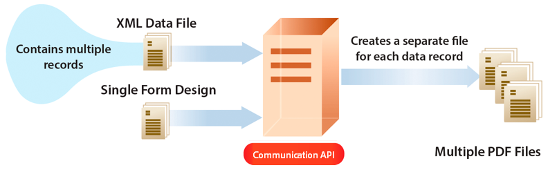

# APIs de comunicação do AEM Forms as a Cloud Service {#communications-apis-overview}

> **Disponibilidade de Versão**
>
> * **AEM 6.5**: [Visão Geral dos Serviços de Documento da AEM](https://experienceleague.adobe.com/docs/experience-manager-65/forms/use-document-services/overview-aem-document-services.html)
> * **AEM as a Cloud Service**: Este artigo

## Introdução

As APIs de comunicação no AEM Forms as a Cloud Service ajudam você a criar documentos aprovados pela marca, personalizados e padronizados para as necessidades de sua empresa. Essas APIs avançadas permitem gerar, manipular e proteger documentos programaticamente, seja sob demanda ou em processos em lote de alto volume.

### Principais benefícios

* **Geração de documentos simplificada** - Crie documentos personalizados mesclando modelos com dados do cliente
* **Manipulação poderosa de documentos** - Combine, reorganize e valide documentos do PDF de forma programática
* **Opções de implantação flexíveis** - Use APIs sob demanda para necessidades de baixa latência ou APIs em lote para operações de alta taxa de transferência
* **Segurança avançada** - Aplique assinaturas digitais, certificação e criptografia para proteger documentos confidenciais
* **Arquitetura nativa em nuvem** - Aproveite a infraestrutura de nuvem escalável e segura sem sobrecarga de manutenção

## Visão geral dos recursos da API

As APIs de comunicação fornecem um conjunto abrangente de recursos de processamento de documentos organizados nas seguintes áreas funcionais:

| Geração de documentos | Manipulação de documentos | Extração de documento | Conversão de documentos | Assurance do documento |
|---------------------|----------------------|---------------------|---------------------|-------------------|
| Gerar documentos personalizados mesclando modelos com dados em vários formatos, incluindo formatos de PDF e impressão. | Combine, reorganize e valide documentos do PDF de forma programática para criar novos pacotes de documentos. | Extraia propriedades, metadados e conteúdo dos documentos do PDF para processamento adicional. | Converter documentos entre formatos, incluindo validação de conformidade PDF/A para necessidades de arquivamento. | Aplique assinaturas digitais, certificação e criptografia para proteger documentos. |

A [documentação de referência da API](https://developer.adobe.com/experience-cloud/experience-manager-apis/api/experimental/document/) fornece informações detalhadas sobre todos os parâmetros, métodos de autenticação e vários serviços fornecidos por APIs. A documentação de referência da API também está disponível no formato .yaml. É possível baixar o .yaml e carregá-lo no Postman para verificar a funcionalidade das APIs.

## Aplicabilidade e casos de uso

### Seguros

## O AEM Forms pode gerar documentos de apólice de seguro?

Sim. O AEM Forms pode gerar documentos relacionados à política usando modelos e dados estruturados capturados por meio de formulários.

## O AEM Forms pode lidar com operações de seguro em escala?

Sim. Quando implantada usando arquiteturas recomendadas no Adobe Managed Services ou na nuvem privada, a AEM Forms oferece suporte a envios de formulários de alto volume e a cargas de trabalho de escala empresarial.

## Geração de documentos

As APIs de geração de documentos de comunicação ajudam a combinar um modelo (XFA ou PDF) com os dados do cliente (XML) para gerar documentos no PDF, AFP (Advanced Function Presentation) e formatos de impressão como formatos PS, PCL, DPL, IPL e ZPL. Essas APIs usam modelos PDF e XFA com [dados XML](communications-known-issues-limitations.md#form-data) para gerar um único documento sob demanda ou vários documentos usando um trabalho em lotes.

Normalmente, você cria um modelo usando o [Designer](use-forms-designer.md) e usa as APIs de comunicações para mesclar dados com o modelo. Seu aplicativo pode enviar o documento de saída para uma impressora de rede, uma impressora local ou para um sistema de armazenamento para arquivamento. Um fluxo de trabalho típico personalizado e pronto para uso é semelhante ao seguinte:

Dependendo do caso de uso, também é possível disponibilizar esses documentos para download através do seu site ou de um servidor de armazenamento.

### Principais recursos de geração de documentos

#### Criar documentos em formatos eletrônicos PDF/AFP

Você pode usar as APIs de geração de documentos para criar um documento nos formatos PDF ou AFP com base em um design de formulário e dados de formulário XML. A saída é um documento não interativo. Ou seja, os usuários não podem inserir ou modificar os dados do formulário. Um fluxo de trabalho básico é mesclar dados de formulário XML com um design de formulário para criar um documento. A ilustração a seguir mostra a mesclagem de um design de formulário e dados de formulário XML para produzir um documento PDF.

Figura: Fluxo de trabalho típico para criar um documento

A tabela abaixo exibe a diferença entre os formatos AFP e PDF:

| **Recurso** | **AFP (Apresentação de Função Avançada)** | **PDF (Formato de Documento Portátil)** |
|---------------------------|--------------------------------------------------------------------|-------------------------------------------------------------|
| **Finalidade** | Impressão e produção de grandes volumes de documentos transacionais | Compartilhamento e exibição de documentos de uso geral |
| **Caso de uso** | Demonstrativos bancários, contas, faturas, documentos de seguro | E-books, formulários, relatórios, currículos, manuais |
| **Plataforma de Origem** | Desenvolvido pela IBM | Desenvolvido pela Adobe |
| **Estrutura** | Formato orientado por página com campos e objetos estruturados | Orientado a página, mas com layout fixo |
| **Capacidade de edição** | Projetado para impressão em produção e raramente é editado | Pode ser editado com várias ferramentas, por exemplo, Adobe Acrobat |
| **Tamanho e desempenho do arquivo** | Otimizado para desempenho em ambientes de impressão de alta velocidade | Pode ser maior e menos otimizado para saída em massa |
| **Interatividade** | Mínimo para nenhum; páginas estáticas | Suporta elementos interativos como formulários, links, JavaScript |
| **Controle de saída** | Controle refinado sobre o layout de impressoras | Layout visual otimizado para tela e impressão |
| **Fontes e Elementos Gráficos** | Usa referências de fonte e recurso; requer renderizadores para interpretar | Incorpora fontes e imagens diretamente no arquivo |

A API de geração de documento retorna o documento PDF ou o documento AFP gerado. Opcionalmente, também é possível carregar os PDFs gerados no Armazenamento de blobs do Azure.

 O carregamento dos PDFs gerados usando a API de geração de documentos para o recurso de Armazenamento Azure Blob está no [Programa Early Adoter](/help/forms/early-access-ea-features.md). Você pode escrever para aem-forms-ea@adobe.com a partir da sua ID de email oficial para ingressar no programa de adoção antecipada e solicitar acesso ao recurso. 

>
>
> As APIs de geração de documento incluem endpoints de geração de saída em lote e síncronos. Essas APIs oferecem suporte à autenticação de servidor para servidor usando JWT ou OAuth, dependendo do endpoint. Para saber mais sobre as APIs de Geração de Documentos, [clique aqui](/help/forms/aem-forms-communication-api-overview.md#document-generation-apis).

#### Criar documento PostScript (PS), Printer Command Language (PCL), Zebra Printing Language (ZPL) {#create-PS-PCL-ZPL-documents}

Você pode usar APIs de geração de documentos para criar um documento PostScript (PS), Printer Command Language (PCL) e Zebra Printing Language (ZPL) com base em um design de formulário XDP ou documento do PDF. Essas APIs ajudam a mesclar um design de formulário com dados de formulário para gerar um documento. Você pode salvar o documento em um arquivo e desenvolver um processo personalizado para enviá-lo a uma impressora.

#### Processamento de dados em lote para criar vários documentos {#processing-batch-data-to-create-multiple-documents}

Você pode usar APIs de geração de documentos para criar documentos separados para cada registro em uma fonte de dados em lote XML. Você pode gerar documentos em massa e em modo assíncrono. Você pode configurar vários parâmetros para a conversão e iniciar o processo em lote.

## Manipulação de documentos

As APIs de manipulação de documento de comunicações (transformação de documento) ajudam a combinar e reorganizar documentos do PDF. Normalmente, você cria um DDX e o envia para APIs de manipulação de documentos para montar ou reorganizar um documento. O [Documento DDX](https://helpx.adobe.com/content/dam/help/en/experience-manager/forms-cloud-service/ddxRef.pdf) fornece instruções sobre como usar os documentos de origem para produzir um conjunto de documentos necessários. A documentação de referência do DDX fornece informações detalhadas sobre todas as operações compatíveis.

>
>
> As APIs de manipulação de documentos oferecem suporte à autenticação de servidor para servidor usando JWT. Para saber mais sobre APIs de Manipulação de Documentos, [clique aqui](/help/forms/aem-forms-communication-api-overview.md#document-manipulation-apis).

### Principais recursos de manipulação de documentos

#### Montar documentos PDF

Você pode usar as APIs de manipulação de documentos para montar dois ou mais documentos PDF ou XDP em um único documento PDF ou Portfólio de PDF. Estas são algumas das maneiras pelas quais você pode reunir documentos do PDF:

* Montar um documento PDF simples
* Criar um Portifolio de PDF
* Compilar documentos criptografados
* Montar documentos usando a numeração de Bates
* Nivelar e reunir documentos

Figura: Montagem de um documento PDF simples a partir de vários documentos de PDF

#### Desmontar documentos PDF

Você pode usar as APIs de manipulação de documentos para desmontar um documento do PDF. As APIs podem extrair páginas do documento de origem ou dividir um documento de origem com base em marcadores. Normalmente, essa tarefa é útil se o documento PDF foi criado originalmente de muitos documentos individuais, como uma coleção de declarações.

* Extrair páginas de um documento de origem
* Dividir um documento de origem com base em marcadores

Figura: Dividir um documento de origem com base em marcadores de vários documentos

>[!NOTE]
>
> O AEM Forms oferece uma variedade de fontes integradas que se integram perfeitamente aos arquivos PDF. Para ver a lista de fontes com suporte, [clique aqui](/help/forms/supported-out-of-the-box-fonts.md).

## Extração de documento

 O recurso de extração de documentos está no programa Early Adoter. Você pode escrever para aem-forms-ea@adobe.com a partir da sua ID de email oficial para ingressar no programa de adoção antecipada e solicitar acesso ao recurso. 

O serviço de Extração de documentos oferece a capacidade de obter as propriedades de um documento do PDF, como direitos de uso, propriedades e metadados do PDF. Os recursos de extração de documentos são:

* Obtém as propriedades de um documento PDF, como se a PDF tivesse anexos, comentários, sua versão Acrobat e muito mais.
* Extraia os direitos de uso ativados em um documento do PDF, os usuários recuperam os direitos de uso ativados ou desativados em um documento do PDF para extensibilidade do Adobe Acrobat Reader.
* Para obter as informações de metadados presentes em um documento do PDF, os metadados são informações sobre o documento (conforme diferenciado do conteúdo do documento, como texto e gráficos). A Adobe Extensible Metadata Platform (XMP) é um padrão para manipular metadados de documentos. O serviço Utilitários da XMP pode recuperar metadados XMP de documentos do PDF e exportar metadados XMP para documentos do PDF.

>
>
> As APIs de extração de documentos são compatíveis com autenticação de servidor para servidor usando OAuth. Para saber mais sobre as APIs de Extração de Documentos, [clique aqui](/help/forms/aem-forms-communication-api-overview.md#document-extraction-apis).
>

## Conversão de documentos

### Converter e validar documentos compatíveis com PDF/A

As APIs de conversão de documento de comunicações ajudam a Converter um documento do PDF em PDF/A. Você pode usar as APIs para converter um documento PDF em um documento compatível com PDF/A e também para determinar se um documento PDF é compatível com PDF/A. O PDF/A é um formato de arquivamento destinado à preservação do conteúdo do documento a longo prazo. As fontes são incorporadas no documento e o arquivo é descompactado. Como resultado, um documento PDF/A geralmente é maior do que um documento PDF padrão. Além disso, um documento PDF/A não tem conteúdo de áudio e vídeo. Os padrões compatíveis de conformidade do PDF/A incluem o PDF/A-1a, 1b, 2a, 2b, 3a e 3b.

### Converter PDF em XDP {#convert-pdf-to-xdp}

 O recurso Converter PDF em XDP está no Early Adoter Program. Você pode escrever para aem-forms-ea@adobe.com a partir da sua ID de email oficial para ingressar no programa de adoção antecipada e solicitar acesso ao recurso. 

Converte um documento PDF em um arquivo XDP. Para que um documento do PDF seja convertido com êxito em um arquivo XDP, o documento do PDF deve conter um fluxo XFA no dicionário.

>
>
> As APIs de conversão de documento oferecem suporte à autenticação de servidor para servidor usando OAuth. Para saber mais sobre APIs de Conversão de Documentos, [clique aqui](/help/forms/aem-forms-communication-api-overview.md#document-conversion-apiss).

## Assurance do documento {#doc-assurance}

O serviço DocAssurance inclui as APIs de Assinatura e Criptografia:

### APIs de assinatura

As APIs de assinatura permitem que sua organização proteja a segurança e a privacidade dos documentos do Adobe PDF que distribui e recebe. <!--This service uses digital signatures and certification to ensure that only intended recipients can alter documents. --> Os recursos de segurança são aplicados ao próprio documento; o documento permanece seguro e controlado durante todo o seu ciclo de vida. O documento permanece seguro além do firewall, quando é baixado offline e quando é enviado de volta à sua organização. Você pode realizar as seguintes tarefas usando as APIs de assinatura:

* Adicione um campo de assinatura visível a um documento do PDF.
* Adicione um campo de assinatura invisível a um documento do PDF.
* Assine o campo de assinatura especificado em um documento do PDF.
* Certificar um documento do PDF
* Remover a assinatura do campo de assinatura especificado em um documento do PDF
* Excluir o campo de assinatura especificado de um documento do PDF

 Remova a assinatura do campo de assinatura especificado e exclua o campo de assinatura especificado, de um documento do PDF, que estão disponíveis no programa de adoção antecipada. Você pode escrever para aem-forms-ea@adobe.com a partir da sua ID de email oficial para ingressar no programa de adoção antecipada e solicitar acesso ao recurso. 

>
>
> As APIs do Assurance de documentos oferecem suporte à autenticação de servidor para servidor usando OAuth. Para saber mais sobre as APIs do Document Assurance, [clique aqui](/help/forms/aem-forms-communication-api-overview.md#document-assurance-apis).

### APIs de criptografia

As APIs de criptografia permitem criptografar e descriptografar documentos. Quando um documento é criptografado, seu conteúdo fica ilegível. Um usuário autorizado pode descriptografar o documento para obter acesso ao conteúdo. Se um documento do PDF for criptografado com uma senha, o usuário deverá especificar a senha aberta para que o documento possa ser visualizado no Adobe Reader ou no Adobe Acrobat. <!-- Likewise, if a PDF document is encrypted with a certificate, the user must decrypt the PDF document with the public key that corresponds to the certificate (private key) that was used to encrypt the PDF document.-->

Você pode realizar essas tarefas usando as APIs de criptografia:

* Criptografar um documento do PDF com uma senha.
* Remova a criptografia baseada em senha de um documento do PDF.
* Recupere o tipo de segurança aplicada a um documento do PDF.
* Retorne o tipo de segurança aplicado a um documento do PDF.

As APIs de Assinatura e de Criptografia são [APIs Síncronas](#types-of-communications-apis-types).

### Utilitários de documento {#doc-utility}

Utilitários de documento com APIs síncronas ajudam a converter documentos entre formatos de arquivo PDF e XDP. Aplique direitos de uso a um documento e extraia os direitos de uso ativados de um documento. Consulte informações sobre um documento do PDF. <!-- determines whether a PDF document contains comments or attachments and more, and use document transformation services for XMP utilities--> Detalhes das APIs de direitos de uso são fornecidos abaixo:

#### APIs de direitos de uso (extensão do Reader)

 O recurso Direitos de Uso (Extensão do Reader) está no Programa de Primeiros Adotores. Você pode escrever para aem-forms-ea@adobe.com a partir da sua ID de email oficial para ingressar no programa de adoção antecipada e solicitar acesso ao recurso. 

O recurso Direitos de uso permite que sua organização compartilhe facilmente documentos interativos do PDF, estendendo a funcionalidade do Adobe Reader com direitos de uso adicionais. O serviço funciona com o Adobe Reader 7.0 ou posterior e adiciona direitos de uso a um documento do PDF. Essa ação ativa recursos que geralmente não estão disponíveis quando um documento do PDF é aberto usando o Adobe Reader, como adicionar comentários a um documento, preencher formulários e salvar o documento.

Quando os documentos do PDF têm os direitos de uso apropriados adicionados, os recipients podem fazer as seguintes atividades no Adobe Reader:

* Preencha os documentos e formulários do PDF on-line ou off-line, permitindo que os recipients salvem cópias localmente para seus registros e ainda mantenham as informações adicionadas intactas.
* Salve os documentos do PDF em um disco rígido local para manter o documento original e quaisquer comentários, dados ou anexos adicionais.
* Anexe arquivos e clipes de mídia a documentos do PDF.
* Assine, certifique e autentique documentos do PDF aplicando assinaturas digitais usando tecnologias de infraestrutura de chave pública (PKI) padrão do setor.
* Envie documentos PDF preenchidos ou anotados eletronicamente.
* Use os documentos e formulários do PDF como um front-end de desenvolvimento intuitivo para bancos de dados internos e serviços da Web.
* Compartilhe documentos do PDF com outras pessoas para que os revisores possam adicionar comentários usando ferramentas de marcação intuitivas. Essas ferramentas incluem notas adesivas eletrônicas, carimbos, destaques e tachado de texto. As mesmas funções estão disponíveis no Acrobat.
* Suporte à decodificação Forms com código de barras.

Esses recursos de direitos de uso especiais são ativados automaticamente quando um documento do PDF habilitado para direitos é aberto no Adobe Reader. Quando o usuário terminar de trabalhar com um documento habilitado para direitos, essas funções serão novamente desabilitadas no Adobe Reader. Eles permanecem desativados até que o usuário receba outro documento do PDF com direitos ativados.

#### Ativar ou desativar direitos de uso

Os vários recursos de direitos de uso para estender os serviços do PDF Reader são:

* **Decodificação de códigos de barras**: para decodificar códigos de barras dentro do documento do PDF.

* **Comentários**: para comentar offline no documento do PDF.

* **Comentários Online**: para comentar online no documento do PDF.

* **Assinatura digital**: para adicionar assinaturas digitais a um documento do PDF.

* **Campos de Formulário Dinâmicos**: para adicionar campos de formulário a um documento do PDF.

* **Páginas de Formulário Dinâmicas**: para adicionar páginas de formulário a um documento do PDF.

* **Arquivos Inseridos**: para inserir arquivos em um documento do PDF.

* **Importação de dados de formulário**: para importar dados de formulário para um documento do PDF.

* **Exportação de dados de formulário**: para importar dados de formulário para um documento do PDF.

* **Preenchimento de formulário**: para preencher campos de formulário em um documento do PDF.

* **Forms Online**: para acessar um serviço Web ou banco de dados de um documento do PDF.

* **Enviar Autônomo**: para enviar dados de formulário offline de um documento PDF.

#### Outros recursos

* **Mensagem**: a mensagem exibida no Adobe Acrobat Reader ao abrir um documento do PDF com um ou mais direitos de uso aplicados.
* **Desbloquear Senha**: A senha necessária para abrir um documento PDF criptografado. Normalmente, essa é a senha para abrir o documento, mas se o documento do PDF também estiver protegido por uma senha de permissões, ela poderá ser usada para abri-lo.

## Tipos de APIs de Comunicação {#types}

As Comunicações fornecem APIs HTTP para geração de documentos sob demanda e em lote:

* **[APIs síncronas](https://developer.adobe.com/experience-manager-forms-cloud-service-developer-reference/)** são adequadas para cenários sob demanda, baixa latência e geração de documento de registro único. Essas APIs são mais adequadas para casos de uso baseados em ações do usuário. Por exemplo, gerar um documento depois que um usuário conclui o preenchimento de um formulário.

* **[APIs em lote (APIs assíncronas)](https://developer.adobe.com/experience-manager-forms-cloud-service-developer-reference/)** são adequadas para cenários programados, de alta taxa de transferência e de geração de vários documentos. Essas APIs geram documentos em lotes. Por exemplo, contas de telefone, demonstrativos de cartão de crédito e demonstrativos de benefícios são gerados todos os meses.

## Integração

O recurso de Comunicações está disponível como um módulo independente e complementar para usuários do Forms as a Cloud Service. Você pode entrar em contato com a equipe de vendas da Adobe ou com seu representante da Adobe para solicitar acesso. A Adobe habilita o acesso para sua organização e fornece os privilégios necessários à pessoa designada como administrador em sua organização. O administrador pode conceder acesso aos desenvolvedores (usuários) do Forms as a Cloud Service de sua organização para usar as APIs.

Após a integração, para ativar o recurso de comunicações para o ambiente Forms as a Cloud Service:

1. Faça logon no Cloud Manager e abra a instância do AEM Forms as a Cloud Service.

1. Abra a opção Editar programa, vá para a guia Soluções e complementos e selecione a opção **[!UICONTROL Forms - Comunicações]**.

   

   Se você já tiver habilitado a variável **[!UICONTROL Forms - Inscrição digital]**, selecione a opção **[!UICONTROL Forms - complemento Comunicações]**.

   

1. Clique em **[!UICONTROL Atualizar]**.

1. Execute o pipeline de build. Depois que o pipeline do build for bem-sucedido, as APIs de Comunicações são habilitadas para o seu ambiente.

>[!NOTE]
>
> Para habilitar e configurar APIs de manipulação de documentos, adicione a seguinte regra à [configuração do Dispatcher](setup-local-development-environment.md#forms-specific-rules-to-dispatcher):
>
> `# Allow Forms Doc Generation requests`
> `/0062 { /type "allow" /method "POST" /url "/adobe/forms/assembler/*" }`

>[!MORELIKETHIS]
>
>* [Introdução às Comunicações do AEM Forms as a Cloud Service](/help/forms/aem-forms-cloud-service-communications-introduction.md)
>* [Arquitetura do AEM Forms as a Cloud Service para APIs de comunicação e Forms adaptável](/help/forms/aem-forms-cloud-service-architecture.md)
>* [Processamento da comunicação - APIs síncronas](/help/forms/aem-forms-cloud-service-communications.md)
>* [Processamento de comunicação - APIs em lote](/help/forms/aem-forms-cloud-service-communications-batch-processing.md)
>* [API de Comunicações do Forms - Tutorial](/help/forms/aem-forms-cloud-service-communications-on-demand-processing.md)
>* [Documentação de referência da API](https://developer.adobe.com/experience-cloud/experience-manager-apis/api/experimental/document/)
>* [Recursos iniciais do programa de adoção](/help/forms/early-access-ea-features.md)
