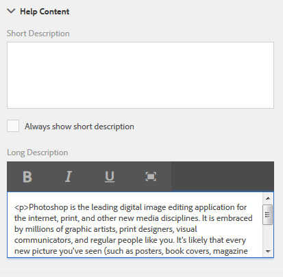

# Criação da ajuda em contexto para campos de formulário{#authoring-in-context-help-for-form-fields}

## Introdução {#introduction}

Há situações em que os usuários finais que preenchem um formulário não têm certeza de como preencher detalhes em um campo de formulário específico. Para resolver esses problemas, o Adaptive Forms oferece suporte para adicionar texto ou ajuda rica em contexto a um campo de formulário. Isso ajuda a melhorar a experiência de preenchimento de formulário e evita qualquer ambiguidade para os usuários finais.

Este artigo discute como os autores de formulários podem adicionar ajuda em contexto ao criarem o Forms adaptável.

## Adicionar ajuda em contexto {#add-in-context-help}

Você pode especificar a ajuda em contexto usando as seguintes opções na seção Conteúdo da Ajuda da guia de propriedades na barra lateral.

* [Descrição curta](authoring-in-field-help.md#p-short-description-p)
* [Descrição longa](authoring-in-field-help.md#p-long-description-p)

>[!NOTE]
>
>A descrição longa substitui a descrição curta. Se você tiver especificado ambos, somente a descrição Longa será exibida.

### Descrição curta {#short-description}

O campo Short description fornece dicas rápidas e curtas sobre o preenchimento de um campo de formulário. O texto especificado no campo Descrição curta é exibido como uma dica de ferramenta ao passar o mouse sobre o campo.

>[!NOTE]
>
>Selecionar **Sempre mostrar descrição curta** para exibir permanentemente o texto de ajuda abaixo do campo.

### Descrição longa {#long-description}

Você pode usar o campo Descrição longa para especificar texto longo ou incorporar conteúdo de mídia avançada, incluindo vídeos, como ajuda no contexto. Por exemplo, a imagem a seguir mostra como é possível incorporar um vídeo como ajuda em contexto.

A adição de descrição Longa exibe uma **?** ícone ao lado do campo. Clicar no ícone exibe o conteúdo adicionado na seção de descrição longa.

### Ajuda no nível do painel {#panel-level-help}

Além da ajuda em contexto para campos de formulário, você pode especificar a ajuda em nível de painel na guia Conteúdo da ajuda da caixa de diálogo de edição do painel.

Adicionar ajuda para exibições de painel uma **?** ícone ao lado da descrição do painel. Clicar no ícone exibe o conteúdo adicionado na seção Conteúdo da ajuda da caixa de diálogo de edição do painel.

>[!MORELIKETHIS]
>
>* [Adicionar texto de espaço reservado a campos de formulário](/help/forms/placeholder-text-in-aem-forms.md)
>* [Adicionar nota de rodapé a um formulário adaptável para rich text](/help/forms/footnotes-richtextsupport.md)