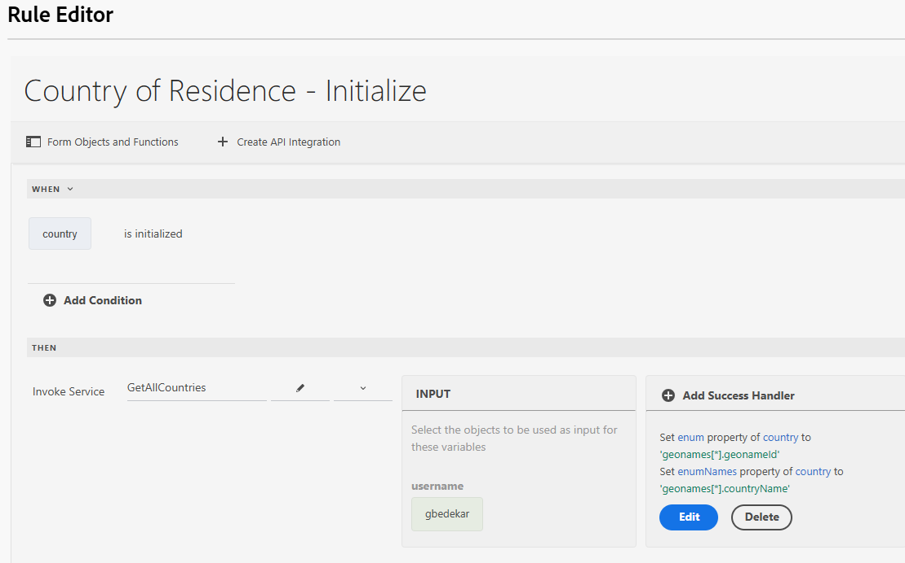

# Criar formulário usando o editor universal

Crie o formulário a seguir usando o editor universal. O formulário tem três listas suspensas, cujos valores serão preenchidos usando a integração da API

## País de residência

Na inicialização, o menu suspenso do país de residência será preenchido com os resultados da chamada à API.

## Manipulador de sucesso

O manipulador de sucesso foi definido para definir o enum e enumNames da lista suspensa do país com os valores apropriados da matriz geonames. A matriz geonames está disponível na opção Carga do evento

## Buscar valores secundários

A lista suspensa de estado ou província é preenchida quando o usuário faz uma seleção na lista suspensa País de residência. O geonameId associado ao país selecionado é passado como parâmetro de entrada para a integração da API GetChildren

O manipulador de êxito foi definido para definir enum/enumNames do campo suspenso StateOrProvince

Quando o estado ou província é selecionado, você pode preencher a lista suspensa cidade seguindo o padrão mencionado acima usado para preencher a lista suspensa estado ou província.