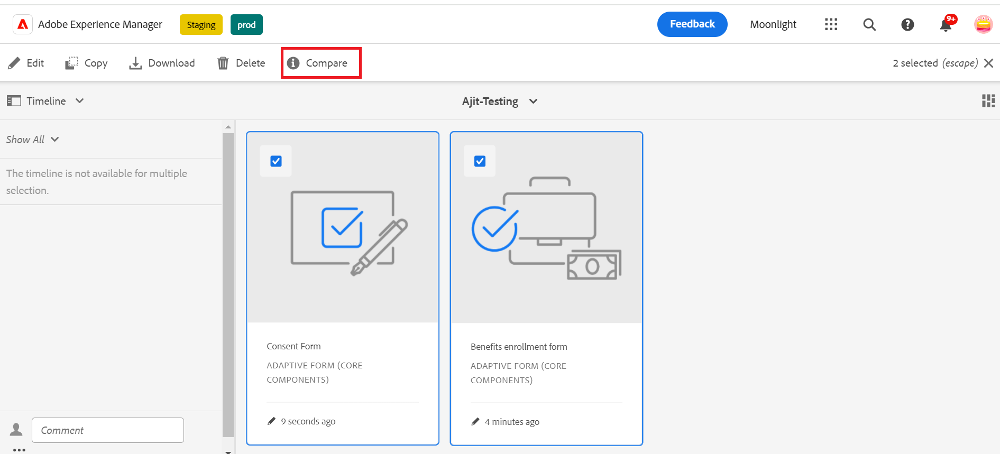

# Comparar Forms adaptável {#compare-two-forms}

 É um recurso de pré-lançamento acessível através do nosso [canal de pré-lançamento](https://experienceleague.adobe.com/pt-br/docs/experience-manager-cloud-service/content/release-notes/prerelease#new-features). 

Quando os autores de formulários precisam comparar dois formulários distintos com base nos campos, conteúdo e componentes de formulário, eles comparam os dois formulários. O autor do formulário deve verificar se os dois formulários estão no mesmo diretório ou pasta para compará-los. Para comparar dois formulários adaptáveis distintos, execute as seguintes etapas:

1. Selecione os formulários adaptáveis e clique em **[!UICONTROL Comparar]**.

   

1. Ao clicar em, você verá dois formulários no modo de visualização. Ele seleciona o primeiro formulário como o formulário base a ser comparado com o segundo formulário e compara o conteúdo entre os dois formulários, que são semelhantes e diferenciados. O conteúdo diferenciado do primeiro formulário é marcado como verde, como mostrado na imagem.

   

## Consulte também {#see-also}

{{see-also}}
