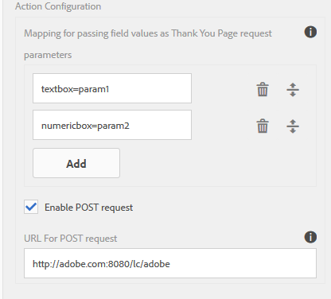

# Ação de envio do formulário adaptável {#configuring-the-submit-action}

 O Adobe recomenda usar os Componentes principais para [adicionar o Adaptive Forms a uma página do AEM Sites](/help/forms/create-or-add-an-adaptive-form-to-aem-sites-page.md) ou para [criar Forms adaptável independente](/help/forms/creating-adaptive-form-core-components.md). 

| Versão | Link do artigo |
| -------- | ---------------------------- |
| AEM 6.5 | [Clique aqui](https://experienceleague.adobe.com/docs/experience-manager-65/forms/adaptive-forms-basic-authoring/configuring-submit-actions.html) |
| AEM as a Cloud Service | Este artigo |
| Aplica-se a | Componentes Principais Do Formulário Adaptável, ❎ [Componentes de base do formulário adaptável](/help/forms/configuring-submit-actions.md) |

Uma ação enviar permite escolher o destino dos dados capturados por meio de um formulário adaptável. É acionado quando um usuário clica na variável **[!UICONTROL Enviar]** em um Formulário adaptável. O Forms as a Cloud Service, para o Adaptive Forms com base em Componentes principais, oferece uma variedade de Ações de envio pré-criadas. Essas ações de envio prontas para uso permitem:

* Envie dados de formulário por email sem esforço.
* Iniciar fluxos do Microsoft Power Automate ou fluxos de trabalho do AEM ao transmitir os dados.
* Transmita diretamente os dados do formulário para o Microsoft SharePoint Server, o Armazenamento de Blobs do Microsoft Azure ou o Microsoft OneDrive.
* Envie os dados com facilidade para uma fonte de dados configurada usando o Modelo de dados do formulário.
* Envie convenientemente os dados para um endpoint REST.

Também é possível [estender as ações enviar padrão](custom-submit-action-form.md) para criar sua própria Ação enviar.

## Selecionar e configurar uma ação enviar para um formulário adaptável {#select-and-configure-submit-action}

Para selecionar e configurar uma Ação de envio para o formulário:

1. Abra o Navegador de conteúdo e selecione a variável **[!UICONTROL Contêiner do guia]** componente do seu Formulário adaptável.
1. Clique nas propriedades do Container do guia  ícone. A caixa de diálogo Contêiner de formulário adaptável é aberta.

1. Clique em  **[!UICONTROL Envio]** guia.

   

1. Selecionar e configurar um **[!UICONTROL Enviar ação]**, com base nas suas necessidades. Para obter informações detalhadas sobre a Ação de Submissão selecionada, consulte:

   * [Enviar e-mail](#send-email)
   * [Enviar para o SharePoint](#submit-to-sharedrive)
   * [Enviar usando modelo de dados do formulário](#submit-using-form-data-model)
   * [Enviar para o Armazenamento de blob do Azure](#azure-blob-storage)
   * [Enviar para endpoint REST](#submit-to-rest-endpoint)
   * [Enviar para o OneDrive](#submit-to-onedrive)
   * [Chamar um fluxo de trabalho de AEM](#invoke-an-aem-workflow)
   * [Enviar para o Power Automate](#microsoft-power-automate)
   * [Enviar para o Workfront Fusion](#workfront-fusion)

## Enviar e-mail {#send-email}

Para enviar um email para um ou mais recipients após o envio bem-sucedido do formulário, você pode utilizar o **[!UICONTROL Enviar e-mail]** Ação de envio. Essa ação permite criar um email que inclui dados de formulário em um formato predefinido. Por exemplo, considere o seguinte modelo em que o nome do cliente, o endereço de entrega, o nome do estado e o CEP são recuperados dos dados de formulário enviado:

    &quot;
    
    Olá ${customer_Name},
    
    O endereço a seguir é definido como o endereço de entrega padrão:
    ${customer_Name},
    ${customer_Shipping_Address},
    ${customer_State},
    ${customer_ZIPCode}
    
    Atenciosamente,
    WKND
    
    &quot;

>[!NOTE]
>
> * É crucial que todos os campos de formulário tenham nomes de elemento exclusivos, mesmo que eles sejam colocados em painéis diferentes em um Formulário adaptável.
> * Ao usar o AEM as a Cloud Service, o email de saída requer criptografia. Por padrão, a funcionalidade de email de saída está desativada. Para ativá-lo, envie um tíquete de suporte para [Solicitar acesso](https://experienceleague.adobe.com/docs/experience-manager-cloud-service/implementing/developing/development-guidelines.html?lang=en#sending-email).

Além disso, a **[!UICONTROL Enviar e-mail]** A opção Enviar ação fornece a opção de incluir anexos e um Documento de registro (DoR) com o email.

Para ativar o [!UICONTROL Anexar documento de registro] , consulte a documentação em [Configurar o formulário adaptável para gerar um Documento de registro (DoR)](generate-document-of-record-core-components.md). Você pode ativar essa opção nas propriedades do Formulário adaptável.

<!-- [!NOTE]
>
>Send PDF via Email Submit Action is applicable only to Adaptive Forms that use XFA template as form model. 

>[!NOTE]
>
>Ensure that the [AEM_Installation_Directory]\crx-quickstart\temp\datamanager\ASM folder
>exists. The directory is required to temporarily store attachments. If the directory does not exist, create it. -->

<!--

>[!CAUTION]
>
>If you  [prefill](prepopulate-adaptive-form-fields.md) a form template,  a Form Data Model or schema based Adaptive Form with XML or JSON data complaint to a schema (XML schema, JSON schema , form template, or form data model) that is data does not contain &lt;afData&gt;, &lt;afBoundData&gt;, and &lt;/afUnboundData&gt; tags, then the data of unbounded fields (Unbounded fields are Adaptive Form fields without [bindref](prepopulate-adaptive-form-fields.md) property) of the Adaptive Form is lost. 

>[!CAUTION]
>
>If you [prefill](prepopulate-adaptive-form-fields.md) a form template, a Form Data Model or schema based Adaptive Form with XML or JSON data complaint to a schema (XML schema, JSON schema, or form data model) that does not contain &lt;afData&gt;, &lt;afBoundData&gt;, and &lt;/afUnboundData&gt; tags, then the data of unbounded fields (Unbounded fields are Adaptive Form fields without [bindref](prepopulate-adaptive-form-fields.md) property) of the Adaptive Form is lost.

-->

## Enviar para o SharePoint {#submit-to-sharedrive}

A variável **[!UICONTROL Enviar para o SharePoint]** A ação enviar conecta um formulário adaptável com um armazenamento Microsoft® SharePoint. É possível enviar o arquivo de dados de formulário, os anexos ou o Documento de Registro para o Armazenamento do Microsoft® Sharepoint conectado.

Usando a opção Enviar para o SharePoint, você pode:
* [Conectar um formulário adaptável à biblioteca de documentos do SharePoint](#connect-af-sharepoint-doc-library)
* [Conectar um formulário adaptável à lista do SharePoint](#connect-af-sharepoint-list)

### Conectar um formulário adaptável à biblioteca de documentos do SharePoint {#connect-af-sharepoint-doc-library}

Para usar o **[!UICONTROL Enviar para a Biblioteca de documentos da SharePoint]** Enviar ação em um formulário adaptável:

1. [Criar uma configuração da biblioteca de documentos da SharePoint](#create-a-sharepoint-configuration-create-sharepoint-configuration): ele conecta o AEM Forms ao seu Microsoft® Sharepoint Storage.
2. [Usar a ação enviar Enviar para o SharePoint em um Formulário adaptável](#use-sharepoint-configuartion-in-af): ele conecta seu formulário adaptável ao Microsoft® SharePoint configurado.

#### Criar uma configuração da Biblioteca de documentos da SharePoint {#create-sharepoint-configuration}

Para conectar o AEM Forms ao seu Microsoft® Sharepoint Document Library Storage:

1. Vá para o **Autor do AEM Forms** instância > **[!UICONTROL Ferramentas]** > **[!UICONTROL Cloud Service]** >  **[!UICONTROL Microsoft® SharePoint]**.
1. Depois de selecionar a variável **[!UICONTROL Microsoft® SharePoint]**, você será redirecionado para **[!UICONTROL Navegador SharePoint]**.
1. Selecione um **Contêiner de configuração**. A configuração é armazenada no Contêiner de configuração selecionado.
1. Clique em **[!UICONTROL Criar]** > **[!UICONTROL Biblioteca de documentos da SharePoint]** na lista suspensa. O assistente de configuração do SharePoint é exibido.

1. Especifique a **[!UICONTROL Título]**, **[!UICONTROL ID do cliente]**, **[!UICONTROL Segredo do cliente]** e **[!UICONTROL URL do OAuth]**. Para obter informações sobre como recuperar a ID do cliente, o Segredo do cliente e a ID do locatário para o URL do OAuth, consulte [Documentação Microsoft®](https://learn.microsoft.com/en-us/graph/auth-register-app-v2).
   * Você pode recuperar a variável `Client ID` e `Client Secret` do seu aplicativo no portal do Microsoft® Azure.
   * No portal do Microsoft® Azure, adicione o URI de redirecionamento como `https://[author-instance]/libs/cq/sharepoint/content/configurations/wizard.html`. Substituir `[author-instance]` com o URL da sua instância do Author.
   * Adicionar as permissões da API `offline_access` e `Sites.Manage.All` para fornecer permissões de leitura/gravação.
   * Usar URL do OAuth: `https://login.microsoftonline.com/tenant-id/oauth2/v2.0/authorize`. Substituir `<tenant-id>` com o `tenant-id` do seu aplicativo no portal do Microsoft® Azure.

   >[!NOTE]
   >
   > A variável **segredo do cliente** é obrigatório ou opcional depende da configuração do aplicativo do Azure Ative Diretory. Se o aplicativo estiver configurado para usar um segredo do cliente, é obrigatório fornecer o segredo do cliente.

1. Clique em **[!UICONTROL Conectar]**. Em uma conexão bem-sucedida, a variável `Connection Successful` é exibida.

1. Agora, selecione **Site do SharePoint** > **Biblioteca de documentos** > **Pasta do SharePoint**, para salvar os dados.

   >[!NOTE]
   >
   >* Por padrão, `forms-ootb-storage-adaptive-forms-submission` está presente no site do SharePoint selecionado.
   >* Criar uma pasta como `forms-ootb-storage-adaptive-forms-submission`, se ainda não estiver presente no `Documents` do site do SharePoint selecionado clicando em **Criar pasta**.

Agora, você pode usar essa configuração do SharePoint Sites para a ação enviar em um Formulário adaptável.

#### Usar a configuração da biblioteca de documentos SharePoint em um formulário adaptável {#use-sharepoint-configuartion-in-af}

Você pode usar a configuração criada da Biblioteca de documentos da SharePoint em um Formulário adaptável para salvar dados ou o Documento de registro gerado em uma pasta do SharePoint. Execute as seguintes etapas para usar uma configuração de armazenamento da Biblioteca de documentos da SharePoint em um Formulário adaptável como:

1. Criar um [Formulário adaptável](/help/forms/creating-adaptive-form-core-components.md).

   >[!NOTE]
   >
   > * Selecionar o mesmo [!UICONTROL Contêiner de configuração] para um Formulário adaptável, em que você criou o armazenamento da Biblioteca de documentos da SharePoint.
   > * Se não [!UICONTROL Contêiner de configuração] for selecionada, a variável global [!UICONTROL Configuração de armazenamento] pastas são exibidas na janela de propriedades Submeter Ação.

1. Selecionar **Ação de envio** as **[!UICONTROL Enviar para o SharePoint]**.
   
1. Selecione o **[!UICONTROL Configuração de armazenamento]**, onde deseja salvar os dados.
1. Clique em **[!UICONTROL Salvar]** para salvar as configurações de Envio.

Ao enviar o formulário, os dados são salvos no Armazenamento da Biblioteca de Documentos do Microsoft® Sharepoint especificado.
A estrutura de pastas para salvar os dados é `/folder_name/form_name/year/month/date/submission_id/data`.

### Conectar um formulário adaptável à lista Microsoft® SharePoint {#connect-af-sharepoint-list}

 Esse é um recurso de pré-lançamento acessível por meio de nossa [canal de pré-lançamento](https://experienceleague.adobe.com/docs/experience-manager-cloud-service/content/release-notes/prerelease.html#new-features). 

>[!VIDEO](https://video.tv.adobe.com/v/3424820/connect-aem-adaptive-form-to-sharepointlist/?quality=12&learn=on)

Para usar o [!UICONTROL Enviar para a lista do SharePoint] Enviar ação em um formulário adaptável:

1. [Criar uma configuração de lista do SharePoint](#create-sharepoint-list-configuration): ele conecta o AEM Forms ao seu Armazenamento de lista do Microsoft® Sharepoint.
1. [Usar o Enviar usando o Modelo de dados de formulário em um Formulário adaptável](#use-submit-using-fdm): ele conecta seu formulário adaptável ao Microsoft® SharePoint configurado.

#### Criar uma configuração de lista do SharePoint {#create-sharepoint-list-configuration}

Para conectar o AEM Forms à sua lista do Microsoft® Sharepoint:

1. Ir para **[!UICONTROL Ferramentas]** > **[!UICONTROL Cloud Service]** >  **[!UICONTROL Microsoft® SharePoint]**.
1. Selecione um **Contêiner de configuração**. A configuração é armazenada no Contêiner de configuração selecionado.
1. Clique em **[!UICONTROL Criar]** > **[!UICONTROL Lista do SharePoint]** na lista suspensa. O assistente de configuração do SharePoint é exibido.
1. Especifique a **[!UICONTROL Título]**, **[!UICONTROL ID do cliente]**, **[!UICONTROL Segredo do cliente]** e **[!UICONTROL URL do OAuth]**. Para obter informações sobre como recuperar a ID do cliente, o Segredo do cliente e a ID do locatário para o URL do OAuth, consulte [Documentação Microsoft®](https://learn.microsoft.com/en-us/graph/auth-register-app-v2).
   * Você pode recuperar a variável `Client ID` e `Client Secret` do seu aplicativo no portal do Microsoft® Azure.
   * No portal do Microsoft® Azure, adicione o URI de redirecionamento como `https://[author-instance]/libs/cq/sharepointlist/content/configurations/wizard.html`. Substituir `[author-instance]` com o URL da sua instância do Author.
   * Adicionar as permissões da API `offline_access` e `Sites.Manage.All` no **Gráfico Microsoft®** para fornecer permissões de leitura/gravação. Adicionar `AllSites.Manage` permissão na **Sharepoint** para interagir remotamente com os dados do SharePoint.
   * Usar URL do OAuth: `https://login.microsoftonline.com/tenant-id/oauth2/v2.0/authorize`. Substituir `<tenant-id>` com o `tenant-id` do seu aplicativo no portal do Microsoft® Azure.

     >[!NOTE]
     >
     > A variável **segredo do cliente** é obrigatório ou opcional depende da configuração do aplicativo do Azure Ative Diretory. Se o aplicativo estiver configurado para usar um segredo do cliente, é obrigatório fornecer o segredo do cliente.

1. Clique em **[!UICONTROL Conectar]**. Em uma conexão bem-sucedida, a variável `Connection Successful` é exibida.
1. Selecionar **[!UICONTROL Site do SharePoint]** e **[!UICONTROL Lista do SharePoint]** na lista suspensa.
1. Selecionar **[!UICONTROL Criar]** para criar a configuração de nuvem do Microsoft® SharePointList.

#### Usar o Enviar usando o Modelo de dados de formulário em um Formulário adaptável {#use-submit-using-fdm}

Você pode usar a configuração da Lista do SharePoint criada em um Formulário adaptável para salvar dados ou o Documento de registro gerado em uma Lista do SharePoint. Execute as seguintes etapas para usar uma Lista SharePoint em um Formulário adaptável como:

1. [Criar um modelo de dados de formulário usando o Microsoft](/help/forms/create-form-data-models.md)
1. [Configurar o modelo de dados do formulário para recuperar e enviar dados](/help/forms/work-with-form-data-model.md#configure-services)
1. [Criação de um Formulário adaptável](/help/forms/creating-adaptive-form-core-components.md)
1. [Configurar a ação Enviar usando um Modelo de dados de formulário](/help/forms/configuring-submit-actions.md#submit-using-form-data-model)

Ao enviar o formulário, os dados são salvos no Armazenamento de Lista do Microsoft® Sharepoint especificado.

>[!NOTE]
>
> Na Lista do Microsoft® SharePoint, os seguintes tipos de coluna não são suportados:
* coluna de imagem
* coluna de metadados
* coluna de pessoa
* coluna de dados externos

## Enviar usando modelo de dados do formulário {#submit-using-form-data-model}

A variável **[!UICONTROL Enviar usando modelo de dados do formulário]** A ação enviar grava dados de formulário adaptável enviados para o objeto de modelo de dados especificado em um modelo de dados de formulário para sua fonte de dados. Ao configurar a Ação Submeter, você pode escolher um objeto de modelo de dados cujos dados submetidos você deseja gravar na origem de dados.

É possível conectar um formulário adaptável a uma lista do Microsoft SharePoint usando a ação Enviar modelo de dados de formulário.

Além disso, você pode enviar um anexo de formulário usando um Modelo de dados de formulário e um Documento de registro (DoR) para a fonte de dados. Para obter informações sobre o modelo de dados de formulário, consulte [[!DNL AEM Forms] Integração de dados](data-integration.md).

## Enviar para endpoint REST {#submit-to-rest-endpoint}

Use o **[!UICONTROL Enviar para Ponto de Extremidade REST]** ação para publicar os dados enviados em um URL restante. A URL pode ser de um servidor interno (o servidor no qual o formulário é renderizado) ou externo.

Para publicar dados em um servidor interno, forneça o caminho do recurso. Os dados são publicados no caminho do recurso. Por exemplo, /content/restEndPoint. Para essas solicitações de publicação, as informações de autenticação da solicitação de envio são usadas.

Para publicar dados em um servidor externo, forneça um URL. O formato do URL é `https://host:port/path_to_rest_end_point`. Configure o caminho para lidar com a solicitação POST de forma anônima.

No exemplo acima, o usuário inseriu informações em `textbox` é capturado usando o parâmetro `param1`. Sintaxe para publicar dados capturados usando `param1` é:

`String data=request.getParameter("param1");`

Da mesma forma, os parâmetros usados para lançar dados XML e anexos são `dataXml` e `attachments`.

Por exemplo, você usa esses dois parâmetros no script para analisar dados para um ponto final rest. Você usa a seguinte sintaxe para armazenar e analisar os dados:

`String data=request.getParameter("dataXml");`
`String att=request.getParameter("attachments");`

Neste exemplo, `data` armazena os dados XML e `att` armazena dados de anexo.

A variável **[!UICONTROL Enviar para endpoint REST]** Ação enviar envia os dados preenchidos no formulário para uma página de confirmação configurada como parte da solicitação HTTP GET. Você pode adicionar o nome dos campos a serem solicitados. O formato da solicitação é:

`{fieldName}={request parameter name}`

Como mostrado na imagem abaixo, `param1` e `param2` são transmitidos como parâmetros com valores copiados do **caixa de texto** e **caixa numérica** para a próxima ação.

Também é possível **[!UICONTROL Habilitar solicitação POST]** e forneça um URL para publicar a solicitação. Para enviar dados ao servidor AEM que hospeda o formulário, use um caminho relativo correspondente ao caminho raiz do servidor AEM. Por exemplo, `/content/forms/af/SampleForm.html`. Para enviar dados para qualquer outro servidor, use o caminho absoluto.

>[!NOTE]
>
Para passar os campos como parâmetros em um URL REST, todos os campos devem ter nomes de elemento diferentes, mesmo se os campos forem colocados em painéis diferentes.

<!-- ## Send PDF via Email {#send-pdf-via-email}

The **Send PDF via Email** Submit Action sends an email with a PDF containing form data, to one or more recipients on successful submission of the form.

>[!NOTE]
>
>This Submit Action is available for XFA-based Adaptive Forms and XSD-based adaption forms that have the Document of Record template. -->

<!-- ## Invoke a forms workflow {#invoke-a-forms-workflow}

The **Submit to Forms workflow** submit option sends a data xml and file attachments (if any) to an existing Adobe LiveCycle or [!DNL AEM Forms] on JEE process.

For information about how to configure the Submit to forms workflow Submit Action, see [Submitting and processing your form data using forms workflows](submit-form-data-livecycle-process.md). -->

<!--
## Forms Portal Submit Action {#forms-portal-submit-action}

The **Forms Portal Submit Action** option makes form data available through an [!DNL AEM Forms] portal.

For more information about the Forms Portal and Submit Action, see [Drafts and submissions component](draft-submission-component.md). -->

## Chamar um fluxo de trabalho de AEM {#invoke-an-aem-workflow}

A variável **[!UICONTROL Chamar um fluxo de trabalho de AEM]** A ação enviar associa um formulário adaptável a um [Fluxo de trabalho do AEM](https://experienceleague.adobe.com/docs/experience-manager-65/developing/extending-aem/extending-workflows/workflows-models.html?lang=en#extending-aem). Quando um formulário é enviado, o fluxo de trabalho associado é iniciado automaticamente na instância do Autor. Você pode salvar o arquivo de dados, os anexos e o Documento de registro no local da carga útil do fluxo de trabalho ou em uma variável. Se o workflow estiver marcado para armazenamento de dados externo e configurado para um armazenamento de dados externo, então somente a opção de variável estará disponível. É possível selecionar na lista de variáveis disponíveis para o modelo de fluxo de trabalho. Se o workflow estiver marcado para armazenamento de dados externo em um estágio posterior e não no momento da criação do workflow, verifique se as configurações de variável necessárias estão em vigor.

A ação enviar coloca o seguinte no local da carga do fluxo de trabalho, ou a variável se o fluxo de trabalho estiver marcado para armazenamento de dados externo:

* **Arquivo de dados**: contém dados enviados para o Formulário adaptável. Você pode usar o **[!UICONTROL Caminho do arquivo de dados]** opção para especificar o nome do arquivo e o caminho do arquivo relativo à carga útil. Por exemplo, a variável `/addresschange/data.xml` caminho cria uma pasta chamada `addresschange` e o coloca em relação à carga útil. Também é possível especificar somente `data.xml` para enviar somente dados enviados sem criar uma hierarquia de pastas. Se o workflow estiver marcado para armazenamento de dados externo, use a opção variable e selecione a variável na lista de variáveis disponíveis para o modelo de workflow.

* **Anexos**: Você pode usar o **[!UICONTROL Caminho do anexo]** opção para especificar o nome da pasta para armazenar os anexos carregados no Formulário adaptável. A pasta é criada em relação à carga útil. Se o workflow estiver marcado para armazenamento de dados externo, use a opção variable e selecione a variável na lista de variáveis disponíveis para o modelo de workflow.

* **Documento do registro**: contém o Documento de registro gerado para o Formulário adaptável. Você pode usar o **[!UICONTROL Caminho do documento de registro]** opção para especificar o nome do documento de registro e o caminho do arquivo relativo à carga útil. Por exemplo, a variável `/addresschange/DoR.pdf` caminho cria uma pasta chamada `addresschange` relativo à carga útil e coloca o `DoR.pdf` em relação à carga útil. Também é possível especificar somente `DoR.pdf` para salvar somente o Documento de registro sem criar uma hierarquia de pastas. Se o workflow estiver marcado para armazenamento de dados externo, use a opção variable e selecione a variável na lista de variáveis disponíveis para o modelo de workflow.

Antes de usar o **[!UICONTROL Chamar um fluxo de trabalho de AEM]** Ação de envio Configure o seguinte para o **[!UICONTROL Serviço de configurações do AEM DS]** configuração:

* **[!UICONTROL URL do servidor de processamento]**: o servidor de processamento é o servidor onde o fluxo de trabalho do Forms ou AEM é acionado. Pode ser o mesmo que o URL da instância do autor do AEM ou outro servidor.

* **[!UICONTROL Nome de usuário do servidor de processamento]**: nome de usuário do usuário do workflow

* **[!UICONTROL Senha do servidor de processamento]**: Senha do usuário do workflow

## Enviar para o OneDrive {#submit-to-onedrive}

A variável **[!UICONTROL Enviar para o OneDrive]** A ação enviar conecta um formulário adaptável a um Microsoft® OneDrive. Você pode enviar os dados do formulário, arquivo, anexos ou Documento de registro para o Microsoft® OneDrive Storage conectado.

>[!VIDEO](https://video.tv.adobe.com/v/3424864/connect-aem-adaptive-form-to-onedrive/?quality=12&learn=on)

Para usar o [!UICONTROL Enviar para o OneDrive] Enviar ação em um formulário adaptável:

1. [Criar uma Configuração do OneDrive](#create-a-onedrive-configuration-create-onedrive-configuration): ele conecta o AEM Forms ao seu Microsoft® OneDrive Storage.
2. [Usar a ação de envio Enviar para o OneDrive em um Formulário adaptável](#use-onedrive-configuration-in-an-adaptive-form-use-onedrive-configuartion-in-af): ele conecta seu formulário adaptável ao Microsoft® OneDrive configurado.

### Criar uma Configuração do OneDrive {#create-onedrice-configuration}

Para conectar o AEM Forms ao seu Microsoft® OneDrive Storage:

1. Vá para o **Autor do AEM Forms** instância > **[!UICONTROL Ferramentas]** > **[!UICONTROL Cloud Service]** >  **[!UICONTROL Microsoft® OneDrive]**.
1. Depois de selecionar a variável **[!UICONTROL Microsoft® OneDrive]**, você será redirecionado para **[!UICONTROL Navegador do OneDrive]**.
1. Selecione um **Contêiner de configuração**. A configuração é armazenada no Contêiner de configuração selecionado.
1. Clique em **[!UICONTROL Criar]**. O assistente de configuração do OneDrive é exibido.

   

1. Especifique a **[!UICONTROL Título]**, **[!UICONTROL ID do cliente]**, **[!UICONTROL Segredo do cliente]** e **[!UICONTROL URL do OAuth]**. Para obter informações sobre como recuperar a ID do cliente, o Segredo do cliente e a ID do locatário para o URL do OAuth, consulte [Documentação Microsoft®](https://learn.microsoft.com/en-us/graph/auth-register-app-v2).
   * Você pode recuperar a variável `Client ID` e `Client Secret` do seu aplicativo no portal do Microsoft® Azure.
   * No portal do Microsoft® Azure, adicione o URI de redirecionamento como `https://[author-instance]/libs/cq/onedrive/content/configurations/wizard.html`. Substituir `[author-instance]` com o URL da sua instância do Author.
   * Adicionar as permissões da API `offline_access` e `Files.ReadWrite.All` para fornecer permissões de leitura/gravação.
   * Usar URL do OAuth: `https://login.microsoftonline.com/tenant-id/oauth2/v2.0/authorize`. Substituir `<tenant-id>` com o `tenant-id` do seu aplicativo no portal do Microsoft® Azure.

   >[!NOTE]
   >
   A variável **segredo do cliente** é obrigatório ou opcional depende da configuração do aplicativo do Azure Ative Diretory. Se o aplicativo estiver configurado para usar um segredo do cliente, é obrigatório fornecer o segredo do cliente.

1. Clique em **[!UICONTROL Conectar]**. Em uma conexão bem-sucedida, a variável `Connection Successful` é exibida.

1. Agora, selecione **[!UICONTROL Container do OneDrive]** > **[Pasta do OneDrive]**  para salvar os dados.

   >[!NOTE]
   >
   * Por padrão, `forms-ootb-storage-adaptive-forms-submission` está presente no OneDrive Container.
   * Criar uma pasta como `forms-ootb-storage-adaptive-forms-submission`, se ainda não estiver presente clicando em **Criar pasta**.

Agora, você pode usar esta configuração de armazenamento do OneDrive para a ação de envio em um Formulário adaptável.

### Usar a configuração do OneDrive em um formulário adaptável {#use-onedrive-configuartion-in-af}

Você pode usar a configuração de armazenamento do OneDrive criada em um Formulário adaptável para salvar dados ou o Documento de Registro gerado em uma pasta do OneDrive. Execute as seguintes etapas para usar a configuração de armazenamento do OneDrive em um Formulário adaptável como:
1. Criar um [Formulário adaptável](/help/forms/creating-adaptive-form.md).

   >[!NOTE]
   >
   * Selecionar o mesmo [!UICONTROL Contêiner de configuração] para um Formulário adaptável, em que você criou seu armazenamento do OneDrive.
   * Se não [!UICONTROL Contêiner de configuração] for selecionada, a variável global [!UICONTROL Configuração de armazenamento] pastas são exibidas na janela de propriedades Submeter Ação.

1. Selecionar **Ação de envio** as **[!UICONTROL Enviar para o OneDrive]**.
   
1. Selecione o **[!UICONTROL Configuração de armazenamento]**, onde deseja salvar os dados.
1. Clique em **[!UICONTROL Salvar]** para salvar as configurações de Envio.

Ao enviar o formulário, os dados são salvos no Armazenamento do Microsoft® OneDrive especificado.
A estrutura de pastas para salvar os dados é `/folder_name/form_name/year/month/date/submission_id/data`.

## Enviar para o Armazenamento de blob do Azure {#submit-to-azure-blob-storage}

A variável **[!UICONTROL Enviar para o Armazenamento Azure Blob]**  A ação enviar conecta um formulário adaptável a um portal do Microsoft® Azure. Você pode enviar os dados do formulário, o arquivo, os anexos ou o Documento de registro para os contêineres conectados do Armazenamento do Azure. Para usar a ação Enviar para o Armazenamento de blobs do Azure:

1. [Criar um contêiner de armazenamento do Azure Blob](#create-a-azure-blob-storage-container-create-azure-configuration): conecta o AEM Forms aos contêineres de Armazenamento do Azure.
2. [Usar a configuração de armazenamento do Azure em um formulário adaptável](#use-azure-storage-configuration-in-an-adaptive-form-use-azure-storage-configuartion-in-af): ele conecta seu Formulário adaptável aos contêineres configurados do Armazenamento do Azure.

### Criar um contêiner de armazenamento do Azure Blob {#create-azure-configuration}

Para conectar o AEM Forms aos seus contêineres de Armazenamento do Azure:
1. Vá para o **Autor do AEM Forms** instância > **[!UICONTROL Ferramentas]** > **[!UICONTROL Cloud Service]** >  **[!UICONTROL Armazenamento do Azure]**.
1. Depois de selecionar a variável **[!UICONTROL Armazenamento do Azure]**, você será redirecionado para **[!UICONTROL Navegador de armazenamento do Azure]**.
1. Selecione um **Contêiner de configuração**. A configuração é armazenada no Contêiner de configuração selecionado.
1. Clique em **[!UICONTROL Criar]**. O assistente Criar configuração de armazenamento do Azure é exibido.

   

1. Especifique a **[!UICONTROL Título]**, **[!UICONTROL Conta de armazenamento do Azure]** e **[!UICONTROL Chave de acesso do Azure]**.

   * Você pode recuperar `Azure Storage Account` nome e `Azure Access key` a partir das Contas de armazenamento no portal Microsoft® Azure.

1. Clique em **[!UICONTROL Salvar]**.

Agora, você pode usar essa configuração do contêiner de Armazenamento do Azure para a ação de envio em um Formulário adaptável.

### Usar a configuração de armazenamento do Azure em um formulário adaptável {#use-azure-storage-configuartion-in-af}

Você pode usar a configuração do contêiner de Armazenamento do Azure criada em um Formulário adaptável, para salvar dados ou o Documento de registro gerado no contêiner de Armazenamento do Azure. Execute as seguintes etapas para usar a configuração do contêiner de Armazenamento do Azure em um Formulário adaptável como:
1. Criar um [Formulário adaptável](/help/forms/creating-adaptive-form-core-components.md).

   >[!NOTE]
   >
   * Selecionar o mesmo [!UICONTROL Contêiner de configuração] para um Formulário adaptável, em que você criou seu armazenamento do OneDrive.
   * Se não [!UICONTROL Contêiner de configuração] for selecionada, a variável global [!UICONTROL Configuração de armazenamento] pastas são exibidas na janela de propriedades Submeter Ação.

1. Selecionar **Ação de envio** as **[!UICONTROL Enviar para o Armazenamento Azure Blob]**.
   

1. Selecione o **[!UICONTROL Configuração de armazenamento]**, onde deseja salvar os dados.
1. Clique em **[!UICONTROL Salvar]** para salvar as configurações de Envio.

Ao enviar o formulário, os dados são salvos na configuração especificada do contêiner de Armazenamento do Azure.
A estrutura de pastas para salvar os dados é `/configuration_container/form_name/year/month/date/submission_id/data`.

Para definir valores de uma configuração, [Gerar configurações de OSGi usando o SDK do AEM](https://experienceleague.adobe.com/docs/experience-manager-cloud-service/implementing/deploying/configuring-osgi.html?lang=en#generating-osgi-configurations-using-the-aem-sdk-quickstart), e [implantar a configuração](https://experienceleague.adobe.com/docs/experience-manager-cloud-service/implementing/using-cloud-manager/deploy-code.html?lang=en#deployment-process) para a instância do Cloud Service.

## Enviar para o Power Automate {#microsoft-power-automate}

Você pode configurar um Formulário adaptável para executar um fluxo da nuvem do Microsoft® Power Automate no envio. O formulário adaptável configurado envia dados capturados, anexos e documentos de registro para processamento no fluxo da nuvem do Power Automate. Ele ajuda você a criar uma experiência personalizada de captura de dados, aproveitando o poder do Microsoft® Power Automate para criar lógicas comerciais sobre dados capturados e automatizar os fluxos de trabalho do cliente. Estes são alguns exemplos do que você pode fazer após integrar um formulário adaptável ao Microsoft® Power Automate:

* Usar dados adaptáveis do Forms em processos de negócios do Power Automate
* Use o Power Automate para enviar dados capturados para mais de 500 fontes de dados ou qualquer API disponível publicamente
* Realizar cálculos complexos em dados capturados
* Salve os dados do Forms adaptável em sistemas de armazenamento em uma programação predefinida

O editor Forms adaptável fornece a **Chamar um fluxo do Microsoft® Power Automate** envie uma ação para enviar dados de formulários adaptáveis, anexos e documentos de registro para o fluxo da nuvem do Power Automate. Para usar a ação Enviar para enviar dados capturados para o Microsoft® Power Automate, [Conecte sua instância do Forms as a Cloud Service com o Microsoft® Power Automate](forms-microsoft-power-automate-integration.md)

Após uma configuração bem-sucedida, use o [Chamar um fluxo do Microsoft® Power Automate](forms-microsoft-power-automate-integration.md#use-the-invoke-a-microsoft&reg;-power-automate-flow-submit-action-to-send-data-to-a-power-automate-flow-use-the-invoke-microsoft-power-automate-flow-submit-action) ação de envio para enviar dados a um Fluxo do Power Automate.

## Enviar para o Workfront Fusion {#workfront-fusion}

Você pode configurar um Formulário adaptável para enviar dados ao Workfront Fusion no envio. O Workfront Fusion permite a automação de processos para que o usuário possa se concentrar em novas tarefas, em vez de repetir as mesmas tarefas repetidamente. Ele automatiza tarefas simples e complexas, economizando tempo e garantindo uma execução consistente do processo.

O editor Forms adaptável fornece a **Chamar um cenário do Workfront Fusion** enviar ação para enviar dados ou anexos do Adaptive Forms para um cenário do Workfront Fusion. Para usar a ação enviar para enviar dados capturados para um cenário do Workfront Fusion, consulte [Enviar um formulário adaptável ao Adobe Workfront Fusion](/help/forms/submit-adaptive-form-to-workfront-fusion.md).

## Usar envio síncrono ou assíncrono {#use-synchronous-or-asynchronous-submission}

Uma Ação de envio pode usar envio síncrono ou assíncrono.

**Envio síncrono**: tradicionalmente, os formulários web são configurados para enviar de forma síncrona. Em um envio síncrono, quando os usuários enviam um formulário, eles são redirecionados para uma página de confirmação, uma página de agradecimento ou, se houver falha de envio, uma página de erro. É possível selecionar a variável **[!UICONTROL Usar envio assíncrono]** opção para redirecionar os usuários para uma página da web ou mostrar uma mensagem no envio.

**Envio assíncrono**: experiências da Web modernas, como aplicativos de página única, estão ganhando popularidade, onde a página da Web permanece estática enquanto a interação cliente-servidor acontece em segundo plano. Agora você pode fornecer essa experiência com o Forms adaptável ao [configuração do envio assíncrono](asynchronous-submissions-adaptive-forms.md).

## Revalidação do lado do servidor no formulário adaptável {#server-side-revalidation-in-adaptive-form}

Normalmente, em qualquer sistema de captura de dados online, os desenvolvedores colocam algumas validações do JavaScript no lado do cliente para aplicar algumas regras de negócios. Mas em navegadores modernos, os usuários finais têm uma maneira de ignorar essas validações e fazer envios manualmente usando várias técnicas, como o Console DevTools do navegador da Web. Essas técnicas também são válidas para o Adaptive Forms. Um desenvolvedor de formulários pode criar várias lógicas de validação, mas tecnicamente, os usuários finais podem ignorar essas lógicas de validação e enviar dados inválidos para o servidor. Dados inválidos violariam as regras de negócios aplicadas por um autor de formulários.

O recurso de revalidação do lado do servidor também permite executar as validações que um autor do Adaptive Forms forneceu ao criar um Formulário adaptável no servidor. Isso evita qualquer possível comprometimento dos envios de dados e violações das regras de negócios representadas em termos de validações de formulário.

### O que validar no servidor? {#what-to-validate-on-server-br}

Todas as validações de campo prontas para uso (OOTB) de um Formulário adaptável que são executadas novamente no servidor são:

* Obrigatório
* Cláusula de Imagem de Validação
* Expressão de validação

### Ativar a validação do lado do servidor {#enabling-server-side-validation-br}

Use o **[!UICONTROL Revalidar no servidor]** em Contêiner de formulário adaptável, na barra lateral, para ativar ou desativar a validação do lado do servidor para o formulário atual.

Ativar a validação do lado do servidor

Se o usuário final ignorar essas validações e enviar os formulários, o servidor executará novamente a validação. Se a validação falhar no final do servidor, a transação de envio será interrompida. O formulário original é apresentado ao usuário novamente. Os dados capturados e os dados enviados são apresentados ao usuário como um erro.

>[!NOTE]
>
A validação do lado do servidor valida o modelo de formulário. É recomendável criar uma biblioteca do cliente separada para validações e não misturá-la com outras coisas, como estilo de HTML e manipulação de DOM na mesma biblioteca do cliente.

### Suporte a funções personalizadas em expressões de validação {#supporting-custom-functions-in-validation-expressions-br}

Às vezes, se houver **regras de validação complexas**, o script de validação exato reside em funções personalizadas e o autor chama essas funções personalizadas a partir da expressão de validação de campo. Para tornar essa biblioteca de funções personalizadas conhecida e disponível ao executar validações do lado do servidor, o autor do formulário pode configurar o nome da biblioteca do cliente AEM no **[!UICONTROL Básico]** das propriedades do Contêiner de formulário adaptável conforme mostrado abaixo.

Suporte a funções personalizadas em expressões de validação

O autor pode configurar a biblioteca JavaScript personalizada por formulário adaptável. Na biblioteca, mantenha somente as funções reutilizáveis, que têm dependência em bibliotecas de terceiros jquery e underscore.js.

## Tratamento de erros na ação enviar {#error-handling-on-submit-action}

Como parte das diretrizes de segurança e proteção contra AEM, configure páginas de erro personalizadas como 400.jsp, 404.jsp e 500.jsp. Esses manipuladores são chamados quando ao enviar um formulário 400, 404 ou 500 erros são exibidos. Os manipuladores também são chamados quando esses códigos de erro são acionados no nó Publicar. Você também pode criar páginas JSP para outros códigos de erro HTTP.

Ao preencher previamente um modelo de dados de formulário ou um formulário adaptável baseado em esquema com dados XML ou JSON, faça uma reclamação para um esquema cujos dados não contêm `<afData>`, `<afBoundData>`, e `</afUnboundData>` , os dados de campos não vinculados do Formulário adaptável serão perdidos. O esquema pode ser um esquema XML, esquema JSON ou um modelo de dados de formulário. Os campos não limitados são campos do Formulário adaptável sem `bindref` propriedade.

<!-- For more information, see [Customizing Pages shown by the Error Handler](/help/sites-developing/customizing-errorhandler-pages.md). -->

<!--
## See next

* [Create style or themes for your forms](using-themes-in-core-components.md)
* [Create an Adaptive Form (core components)](/help/forms/creating-adaptive-form-core-components.md)
* [Create a custom Submit Action for Adaptive Forms](/help/forms/custom-submit-action-form.md)

-->

## Consulte também {#see-also}

{{see-also}}

