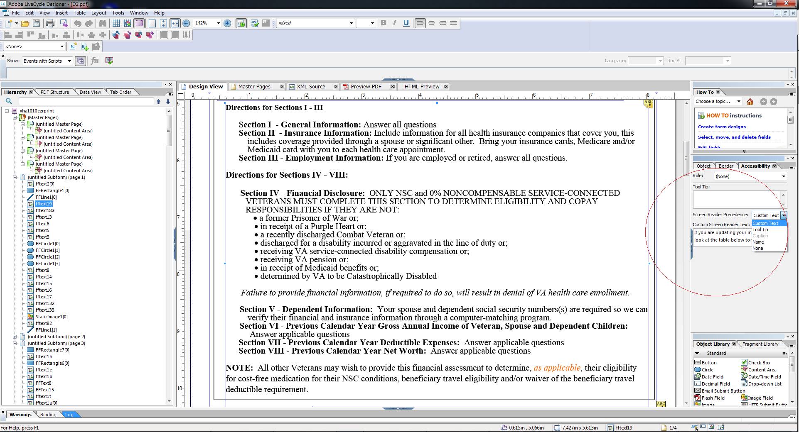

# Criação de formulários acessíveis do HTML5 {#designing-accessible-html-forms}

 O recurso HTML5 Forms é oferecido como parte do Programa de acesso antecipado. Para solicitar acesso, envie um email de sua ID de email oficial (comercial) para aem-forms-ea@adobe.com.

Os formulários HTML5 usam o padrão de acessibilidade ARIA HTML5 para gerar formulários HTML acessíveis. Esses formulários são compatíveis com a navegação com guias (exceto o Mozilla FireFox) e são certificados para serem compatíveis com leitores de tela comuns. Para gerar um formulário HTML5 com bons recursos de acessibilidade, crie o modelo de formulário XFA com base em algumas diretrizes básicas de design. As diretrizes de design incluem a configuração da ordem de tabulação correta e o fornecimento do conteúdo de Fale Texto para cada controle de formulário. O AEM Forms Designer é compatível com a configuração desses atributos de controle de formulário para gerar um formulário do PDF e do HTML5 acessível.

A navegação de *Observação:Tabbed não abrange campos protegidos, como campos de cálculo que exibem a soma de valores. Para que o leitor de tela leia o valor de um campo protegido, coloque um campo somente leitura vazio na parte superior ou ao lado do campo protegido. Atribua o valor do campo protegido ao novo campo Somente leitura. O leitor de tela ou a navegação com guias pode escolher esse campo somente leitura e falar como o valor do campo protegido.*

O AEM Forms Designer inclui várias opções de Falar texto que podem ser passadas para leitores de tela. Para cada objeto em um formulário, o usuário pode especificar uma das várias configurações para o texto do leitor de tela:

* Texto do leitor de tela personalizado, que pode ser definido usando a paleta Acessibilidade. Os autores podem anotar os nomes de botões e campos e sua finalidade.
* Dicas de ferramentas, que podem ser definidas na paleta Acessibilidade.
* Legendas para campos no formulário.
* Nomes de objetos, conforme especificado na opção Nome da guia Vinculação.

Quando várias opções, como dica de ferramenta, Texto da tela de Reader e Legenda estão disponíveis em um controle de Formulário, o Screen Reader usa apenas uma dessas propriedades. A ordem padrão é Texto Reader de tela personalizada, dica de ferramenta, Legenda e Nome. Você pode substituir a ordem padrão usando a opção **Precedência** do Screen Reader na paleta Acessibilidade.
