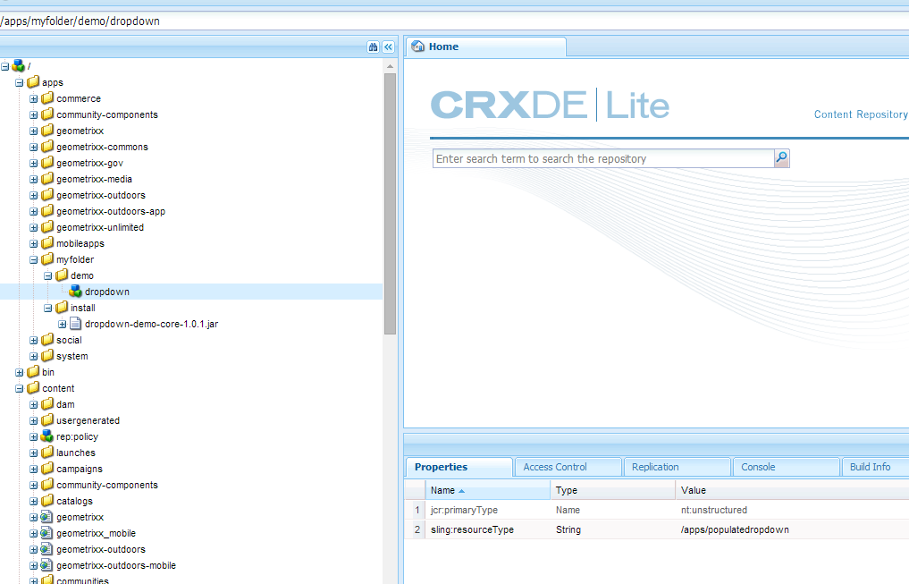

# Preenchimento dinâmico de listas suspensas {#dynamically-populating-drop-down-lists}

## Pré-requisitos {#prerequisites}

* [Criação de pacotes OSGi](https://helpx.adobe.com/experience-manager/using/creating-osgi-bundles-digital-marketing.html)
* [Desenvolvimento de componentes do AEM](https://experienceleague.adobe.com/docs/experience-manager-cloud-service/implementing/developing/full-stack/components-templates/overview.html#developing)
* [Criação do formulário adaptável](creating-adaptive-form.md)
* [Criação de formulário adaptável](introduction-forms-authoring.md)

## Procedimento para preencher listas suspensas dinamicamente {#procedure-to-dynamically-populate-drop-down-lists}

Considere um cenário em que você deseja preencher o **Estado** lista suspensa com base em um valor selecionado na variável **País** lista suspensa. Se você selecionar Austrália no campo **País** lista suspensa, a variável **Estado** exibe os estados na Austrália. O procedimento a seguir descreve como realizar essa tarefa.

1. Crie um projeto com os seguintes módulos:

   * O pacote que contém a lógica para preencher o menu suspenso, que nesse caso é um servlet.
   * O conteúdo, que incorpora o arquivo .jar e tem um recurso suspenso. O servlet aponta para esse recurso.

1. Grave um servlet com base no parâmetro de solicitação País, que retorna uma matriz que contém os nomes dos estados do país.

   ```java
   @Component(metatype = false)
   @Service(value = Servlet.class)
   @Properties({
           @Property(name = "sling.servlet.resourceTypes", value = "/apps/populatedropdown"),
           @Property(name = "sling.servlet.methods", value = {"GET", "POST"}),
           @Property(name = "service.description", value = "Populate states dropdown based on country value")
   })
   public class DropDownPopulator extends SlingAllMethodsServlet {
       private Logger logger = LoggerFactory.getLogger(DropDownPopulator.class);
   
       protected void doPost(SlingHttpServletRequest request,
                             final SlingHttpServletResponse response)
               throws ServletException, IOException {
           response.setHeader("Access-Control-Allow-Origin", "*");
           response.setContentType("application/json");
           response.setCharacterEncoding("UTF-8");
           try {
               String US_STATES[] = {"0=Alabama",
                       "1=Alaska",
                       "2=Arizona",
                       "3=Arkansas",
                       "4=California",
                       "5=Colorado",
                       "6=Connecticut",
                       "7=Delaware",
                       "8=Florida",
                       "9=Georgia",
                       "10=Hawaii",
                       "11=Idaho",
                       "12=Illinois",
                       "13=Indiana",
                       "14=Iowa",
                       "15=Kansas",
                       "16=Kentucky",
                       "17=Louisiana",
                       "18=Maine",
                       "19=Maryland",
                       "20=Massachusetts",
                       "21=Michigan",
                       "22=Minnesota",
                       "23=Mississippi",
                       "24=Missouri",
                       "25=Montana",
                       "26=Nebraska",
                       "27=Nevada",
                       "28=New Hampshire",
                       "29=New Jersey",
                       "30=New Mexico",
                       "31=New York",
                       "32=North Carolina",
                       "33=North Dakota",
                       "34=Ohio",
                       "35=Oklahoma",
                       "36=Oregon",
                       "37=Pennsylvania",
                       "38=Rhode Island",
                       "39=South Carolina",
                       "40=South Dakota",
                       "41=Tennessee",
                       "42=Texas",
                       "43=Utah",
                       "44=Vermont",
                       "45=Virginia",
                       "46=Washington",
                       "47=West Virginia",
                       "48=Wisconsin",
                       "49=Wyoming"};
               String AUSTRALIAN_STATES[] = {"0=Ashmore and Cartier Islands",
                       "1=Australian Antarctic Territory",
                       "2=Australian Capital Territory",
                       "3=Christmas Island",
                       "4=Cocos (Keeling) Islands",
                       "5=Coral Sea Islands",
                       "6=Heard Island and McDonald Islands",
                       "7=Jervis Bay Territory",
                       "8=New South Wales",
                       "9=Norfolk Island",
                       "10=Northern Territory",
                       "11=Queensland",
                       "12=South Australia",
                       "13=Tasmania",
                       "14=Victoria",
                       "15=Western Australia"};
               String country = request.getParameter("country");
               JSONArray stateJsonArray = new JSONArray();
               if (country.length() > 0) {
                   if ("australia".equalsIgnoreCase(country)) {
                       stateJsonArray = new JSONArray();
                       for (String state : AUSTRALIAN_STATES) {
                           stateJsonArray.put(state);
                       }
                   } else if ("unitedstates".equalsIgnoreCase(country)) {
                       stateJsonArray = new JSONArray();
                       for (String state : US_STATES) {
                           stateJsonArray.put(state);
                       }
                   }
                   response.setContentType("application/json");
                   response.getWriter().write(stateJsonArray.toString());
               }
   
           } catch ( Exception e) {
               logger.error(e.getMessage(), e);
           }
       }
   }
   ```

1. Crie um nó suspenso em uma hierarquia de pastas específica em aplicativos (por exemplo, crie um nó em /apps/myfolder/demo). Certifique-se de que o `sling:resourceType` o parâmetro do nó é o mesmo para o qual o servlet aponta (/apps/populatedropdown).

   

1. Empacote o nó de conteúdo e incorpore o arquivo .jar em um local específico (por exemplo /apps/myfolder/demo/install/). Implante o mesmo arquivo no servidor.
1. Crie um Formulário adaptável e adicione duas listas suspensas, País e Estado a ele. A lista de países pode incluir os nomes dos países. A lista Estado pode preencher dinamicamente os nomes dos estados do país selecionado na primeira lista.

   Adicione os nomes dos países a serem exibidos na lista de Países. Na lista Estado, adicione um script para preenchê-lo com base no nome do país na lista País.

     

   ```javascript
   JSON.parse(
       $.ajax({
           url: "/apps/myfolder/demo/dropdown",
           type: "POST",
           async: false,
           data: {"country": country.value},
            success: function(res){},
            error : function (message) {
                 guideBridge._guide.logger().log(message);
                 successFlag = false;
                 }
              })
   .responseText);
   ```

O pacote de Conteúdo que contém uma amostra do Formulário adaptável (demo/AFdemo) com o código acima implementado.

[Obter arquivo](assets/dropdown-demo-content-1.0.1-snapshot.zip)
