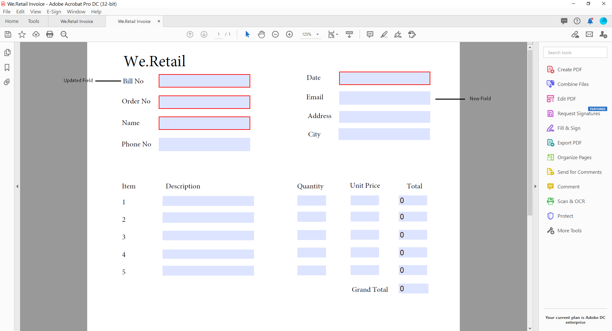

# Gerar um PDF de envio (antigo Documento de registro) para o Adaptive Forms (Componentes principais)

## Visão geral {#overview}

Quando um formulário é preenchido ou enviado, você pode manter um registro do formulário, impresso ou no formato do documento. Esse registro é chamado de PDF de envio (antigo Documento de registro ou DoR). É um PDF para impressão do formulário enviado. Você também pode consultar o PDF de envio para obter as informações que os clientes preencheram posteriormente ou usar o PDF de envio para arquivar formulários e conteúdo juntos no formato PDF.


## Aplicabilidade e casos de uso

### Seguros

## O AEM Forms pode gerar documentos de solicitação de seguro?

Sim. A AEM Forms oferece suporte à geração de Submission PDF (antigo Documento de registro), permitindo que as seguradoras produzam PDFs e registros com base em dados de formulário enviados.

## Os documentos gerados pelo AEM Forms são adequados para auditorias?

Sim. O AEM Forms oferece suporte à geração consistente de documentos, ao acesso controlado e à rastreabilidade, que são importantes para os requisitos de auditoria e conformidade.

Para criar uma PDF de envio, um modelo baseado em XFA ou acroforma é mesclado com os dados coletados por meio de um formulário adaptável. Você pode gerar um PDF de envio automaticamente ou sob demanda. A opção sob demanda permite especificar um modelo XFA ou baseado em acroforma personalizado para fornecer uma aparência personalizada ao seu PDF de envio.

É possível:

* [Gerar uma PDF de envio com base em XFA](#generate-an-XFA-based-document-of-record)
* [Gerar um PDF de envio baseado em acroforma (Acrobat Form PDF)](#generate-an-Acroform-based-document-of-record)
* [Gerar automaticamente uma PDF de envio](#auto-generate-a-document-of-record)

## Antes de começar {#components-to-automatically-generate-a-document-of-record}

Antes de começar a aprender e preparar os ativos necessários para uma PDF de envio:

**Modelo base:** um modelo XFA (arquivo XDP) criado no Forms Designer ou em um formulário Acrobat (AcroForm). O [Modelo base](#base-template-of-a-document-of-record) é usado para especificar informações de estilo e identidade visual para uma PDF de Envio. Carregue seu modelo XFA (arquivo XDP) na instância do AEM Forms antes de.

**Formulário adaptável:** um Formulário adaptável para o qual o PDF de Envio deve ser gerado.

## Gerar uma PDF de envio com base em XFA {#generate-an-XFA-based-document-of-record}

Faça upload do modelo XFA (arquivo XDP) na instância do AEM Forms. Execute as seguintes etapas para configurar um Formulário adaptável para usar o modelo XFA (arquivo XDP) como modelo para o PDF de envio:

1. Na instância do autor do Experience Manager, clique em **[!UICONTROL Forms]** > **[!UICONTROL Forms e Documentos].**
1. Selecione um Formulário ou Crie um Formulário Adaptável e clique em **[!UICONTROL Propriedades]**.
1. Na janela Propriedades, selecione **[!UICONTROL Modelo de formulário]**.
1. Na guia **[!UICONTROL Modelo de Formulário]**, no menu suspenso **[!UICONTROL Selecionar de]**, selecione **[!UICONTROL Modelo de Dados de Formulário]**, **[!UICONTROL Esquema]** ou **[!UICONTROL Nenhum]**. Você também pode selecionar um modelo de formulário ao criar um formulário.
1. Na seção Document of Record Template Configuration da guia Form Model, selecione **Associar Modelo de Formulário como Documento de Modelo de Registro**. Ao selecionar essa opção, todos os modelos XFA (arquivos XDP) disponíveis em sua máquina são exibidos. Selecione o arquivo apropriado. Além disso, verifique se o mesmo esquema (esquema de dados) é usado para o Formulário adaptável e o modelo XFA selecionado (arquivo XDP).
1. Clique em **[!UICONTROL Concluído]**

O formulário adaptável agora está configurado para usar um arquivo XDP como modelo para PDF de envio. A próxima etapa é [vincular componentes do Formulário adaptável com campos de modelo correspondentes](#bind-adaptive-form-components-with-template-fields).

## Gerar uma PDF de envio com base em acroforma {#generate-an-Acroform-based-document-of-record}

Faça upload do Adobe Acrobat PDF (Acrobat) na sua instância do AEM Forms. Execute as seguintes etapas para configurar um Formulário adaptável para usar o Adobe Acrobat PDF (AcroForm) como modelo para o Submission PDF:

1. Na instância do autor do Experience Manager, clique em **[!UICONTROL Forms]** > **[!UICONTROL Forms e Documentos].**
1. Selecione um Formulário ou **[!UICONTROL Criar um Formulário Adaptável]** e clique em **[!UICONTROL Propriedades]**.
1. Na janela Propriedades, selecione **[!UICONTROL Modelo de formulário]**.
1. Na guia **[!UICONTROL Modelo de Formulário]**, no menu suspenso **[!UICONTROL Selecionar de]**, selecione **[!UICONTROL Modelo de Dados de Formulário]**, **[!UICONTROL Esquema]** ou **[!UICONTROL Nenhum]**. Você também pode selecionar um modelo de formulário ao criar um formulário.
1. Na seção Document of Record Template Configuration da guia Form Model, selecione **Associar Modelo de Formulário como Documento de Modelo de Registro**. Ao selecionar essa opção, todos os PDF do Acrobat (Acroform) disponíveis em sua máquina são exibidos. Selecione o Acrobat que deseja usar.
1. Clique em **[!UICONTROL Concluído]**

O formulário adaptável agora está configurado para usar um acroforma como modelo para o PDF de envio. A próxima etapa é [vincular componentes do Formulário adaptável com campos de modelo correspondentes](#bind-adaptive-form-components-with-template-fields).

## Gerar automaticamente uma PDF de envio {#auto-generate-a-document-of-record}

Quando um Formulário adaptável é configurado para gerar automaticamente um PDF de envio, sempre que um formulário é alterado, seu PDF de envio é atualizado imediatamente. Por exemplo, se um campo for removido de um formulário adaptável existente, o campo correspondente também será removido e não estará visível no PDF de envio. Existem muitas outras vantagens de gerar automaticamente uma PDF de envio:

* Os desenvolvedores de formulários não precisam manter as associações de dados manualmente. O Submission PDF gerado automaticamente cuida das atualizações relacionadas à vinculação de dados.
* Os desenvolvedores de formulários não precisam ocultar manualmente os campos marcados como excluir do PDF de envio. As PDF de envio geradas automaticamente são pré-configuradas para excluir esses campos.
* A opção Submission PDF gerada automaticamente economiza tempo necessário para criar um modelo de Formulário para PDF de envio.
* A opção Submission PDF gerada automaticamente permite usar estilos e aparências diferentes usando modelos base diferentes. Ele ajuda a selecionar o melhor estilo e aparência para o PDF de envio para sua organização. Se você não especificar o estilo, os estilos do sistema serão definidos como padrão.
* O Submission PDF gerado automaticamente garante que qualquer alteração no formulário seja refletida imediatamente no Submission PDF.

Execute as seguintes etapas para configurar um Formulário adaptável para gerar automaticamente uma PDF de envio:

1. Na instância do autor do Experience Manager, clique em **[!UICONTROL Forms]** > **[!UICONTROL Forms e Documentos].**
1. Selecione um Formulário ou Crie um Formulário Adaptável e clique em **[!UICONTROL Propriedades]**.
1. Na janela Propriedades, selecione **[!UICONTROL Modelo de formulário]**.
1. Na guia **[!UICONTROL Modelo de Formulário]**, no menu suspenso **[!UICONTROL Selecionar de]**, selecione **[!UICONTROL Modelo de Dados de Formulário]**, **[!UICONTROL Esquema]** ou **[!UICONTROL Nenhum]**. Você também pode selecionar um modelo de formulário ao criar um formulário.
1. Na seção Document of Record Template Configuration da guia Form Model, selecione **Gerar Documento de Registro**.
1. Clique em **[!UICONTROL Concluído]**

## Vincular componentes do formulário adaptável a campos de modelo {#bind-adaptive-form-components-with-template-fields}

Vincule campos de formulário adaptável com campos de modelo para exibir dados de formulário capturados no campo PDF de envio correspondente. Para vincular componentes do Formulário adaptável aos campos de modelo do PDF de envio correspondentes:

1. Abra o Formulário adaptável, configurado para usar um modelo de formulário personalizado para edição.

1. Selecione um componente de Formulário adaptável e clique em abrir o ícone Configurar . Ele abre o navegador de propriedades.

1. No navegador de propriedades, navegue e selecione um campo.

   * (Para o modelo AcroForm) a propriedade **[!UICONTROL campo Referência de Associação de Documento de Registro]**.
   * (Para modelo XFA) a propriedade **[!UICONTROL Referência de Associação de Modelo de Dados]**.

1. Clique em **[!UICONTROL Salvar]**.

<!-- 
In the following video, Adaptive Form components are bound with corresponding Acroform template fields and the Document of Record is sent as an email attachment.
-->

Você pode usar ações de envio como &quot;Enviar email&quot;, &quot;Chamar um fluxo de trabalho do AEM&quot;, &quot;Chamar um fluxo do Power Automate&quot; e outras [Ações de Envio](configuring-submit-actions.md) para receber uma PDF de Envio.


>[!NOTE]
>
> Você pode salvar o PDF de envio para qualquer modelo de dados de formulário usando a propriedade **[!UICONTROL campo Referência de associação de documento de registro]**.

## Atualizações incrementais no modelo de PDF de envio {#document-of-record-template-incremental-updates}

Os formulários adaptáveis e os modelos de PDF de envio correspondentes podem evoluir ao longo do tempo. Você pode optar por adicionar, remover ou modificar campos para um formulário adaptável ou um modelo de PDF de envio.

Ao alterar um modelo de PDF de envio e fazer upload do modelo alterado para o AEM Forms, o editor do Adaptive Forms detecta automaticamente as associações alteradas e informa sobre os componentes de formulário adaptáveis que exigem novas associações. Ele permite fazer atualizações incrementais em um modelo de PDF de envio.

Por exemplo, uma organização, *We.Retail*, tem um modelo de PDF de envio baseado em AcroForm, *we-retail-Invoice.pdf*. O modelo tem a seguinte aparência:


Depois de usar o modelo por algum tempo, a organização decide renomear o campo `invoice-number` para o campo `bill-number` e capturar o endereço de email dos compradores. Um desenvolvedor atualiza o nome do campo `invoice-number` e adiciona um campo de email ao modelo. Ele também cria uma nova versão do modelo chamada *we-retail-Invoice-v2.pdf*.



<!--

The developer uploads and applies to the updated template to the adaptive form. The adaptive form automatically detects and displays list of fields where binding has changed.


The form developer binds Adaptive Forms fields with corresponding Document of Record template.

-->

>[!VIDEO](assets/we-retail-binding.mp4)

Agora, quando o Formulário adaptável for enviado, uma PDF de envio atualizada será gerada.


## Considerações principais ao trabalhar com a PDF de envio {#key-considerations-when-working-with-document-of-record}

Lembre-se das seguintes considerações e limitações ao trabalhar no PDF de envio para o Adaptive Forms.

* Os modelos de PDF de envio não são compatíveis com rich text. Portanto, qualquer rich text no Formulário adaptável estático ou nas informações preenchidas pelo usuário é exibido como texto simples no PDF de envio.
* Fragmentos de documento em um Formulário adaptável não aparecem no PDF de envio. No entanto, os fragmentos de formulário adaptável são compatíveis.
* Não há suporte para vinculação de conteúdo no PDF de envio gerado para o Formulário adaptável baseado em esquema XML.
* A versão localizada do PDF de envio é criada sob demanda para um local quando o usuário solicita a renderização do PDF de envio. A localização do PDF de envio ocorre junto com a localização do Formulário adaptável. <!-- For more information on localization of Document of Record and Adaptive Forms see Using AEM translation workflow to localize Adaptive Forms and Document of Record.-->

<!-- ## Configure an adaptive form to generate  Document of Record {#adaptive-form-types-and-their-documents-of-record}

While creating an adaptive form, in the Form Model tab of Adaptive Form properties, select one the following option: 

* **None**
  Select the option to create an Adaptive Form without a form model. When the option is selected, the Document of Record is automatically generated for your Adaptive Form.

* **[Associate form template as a Document of Record template](creating-adaptive-form.md#create-an-adaptive-form-based-on-an-xfa-form-template)**
  Select the option to use an XFA Form as a template for Document of Record. 

* **[Generate Document of Record](creating-adaptive-form.md#create-an-adaptive-form-based-on-xml-or-json-schema)**
  Select the option to use an XFA Form as a template. When the option is selected, the Document of Record is automatically generated for your Adaptive Form. When you use an XML schema as a template for an Adaptive Form, ensure that the adaptive form and associated XFA Form use the same XML schema as your Adaptive Form

When you select a form model, configure Document of Record using options available under Document of Record Template Configuration. See [Document of Record Template Configuration](#document-of-record-template-configuration). -->

## Mapeamento de elementos do formulário adaptável {#mapping-of-adaptive-form-elements}

A tabela a seguir descreve os componentes do Formulário adaptável e os componentes XFA correspondentes e se eles aparecem em uma PDF de envio.

### Campos {#fields}

<table>
 <tbody>
  <tr>
   <th>Componente de formulário adaptável</th>
   <th>Componente XFA correspondente</th>
   <th>Incluído por padrão no modelo Submissão de PDF?</th>
   <th>Notas</th>
  </tr>
  <tr>
   <td>Botão</td>
   <td>Botão</td>
   <td>falso</td>
   <td> </td>
  </tr>
  <tr>
   <td>Caixa de seleção</td>
   <td>Caixa de seleção</td>
   <td>verdadeiro</td>
   <td> </td>
  </tr>
  <tr>
   <td>Seletor de data</td>
   <td>Campo de data/hora</td>
   <td>verdadeiro</td>
   <td> </td>
  </tr>
  <tr>
   <td>Lista suspensa</td>
   <td>Lista suspensa</td>
   <td>verdadeiro</td>
   <td> </td>
  </tr>
  <tr>
   <td>Caixa numérica</td>
   <td>Campo numérico</td>
   <td>verdadeiro</td>
   <td> </td>
  </tr>
  <tr>
   <td>Botão de opção</td>
   <td>Botão de opção</td>
   <td>verdadeiro</td>
   <td> </td>
  </tr>
  <tr>
   <td>Caixa de texto</td>
   <td>Campo de texto</td>
   <td>verdadeiro</td>
   <td> </td>
  </tr>
  <tr>
   <td>Botão de redefinição</td>
   <td>Botão de redefinir</td>
   <td>falso</td>
   <td> </td>
  </tr>
  <tr>
   <td>Botão Enviar</td>
   <td><p>Botão Enviar de email</p> <p>Botão Enviar do HTTP</p> </td>
   <td>falso</td>
   <td> </td>
  </tr>
  <tr>
   <td>Arquivo em anexo</td>
   <td> </td>
   <td>falso</td>
   <td>Não disponível no modelo de PDF de envio. Disponível somente no PDF de envio por meio de anexos.</td>
  </tr>
 </tbody>
</table>

### Contêineres {#containers}

<table>
 <tbody>
  <tr>
   <th>Componente de formulário adaptável</th>
   <th>Componente XFA correspondente</th>
   <th>Notas</th>
  </tr>
  <tr>
   <td>Painel<br /> </td>
   <td>Subformulário<br /> </td>
   <td>O painel repetível é mapeado para um subformulário repetível.</td>
  </tr>
 </tbody>
</table>

### Componentes estáticos {#static-components}

| Componente de formulário adaptável | Componente XFA correspondente | Notas |
|---|---|---|
| Imagem | Imagem | Os componentes TextDraw e Imagem, vinculados ou não, sempre aparecem no PDF de envio para um Formulário adaptável baseado em XSD, a menos que sejam excluídos usando as configurações do PDF de envio. |
| Texto | Texto |  |

### Tabelas {#tables}

Os componentes da tabela Adaptive Forms, como cabeçalho, rodapé e mapa de linhas para componentes XFA correspondentes. Você pode mapear painéis repetíveis para tabelas no PDF de envio.

## Modelo base de uma PDF de envio {#base-template-of-a-document-of-record}

O modelo base fornece informações de estilo e aparência para o PDF de envio. Ela permite personalizar a aparência padrão do Submission PDF gerado automaticamente. Por exemplo, você pode usar um modelo base para adicionar o logotipo da sua empresa nas informações de cabeçalho e copyright no rodapé do PDF de envio.

A página principal de um modelo base é usada como uma página principal do modelo PDF de envio. A página principal pode ter informações como cabeçalho, rodapé e número de página que podem ser aplicadas ao PDF de envio. É possível aplicar essas informações ao PDF de Envio usando o modelo base para geração automática do PDF de Envio. O uso de um template base permite alterar as propriedades padrão dos campos.

Sempre siga as [Convenções do modelo base](#base-template-conventions) ao criar o modelo base.

## Convenções do modelo base {#base-template-conventions}

Um modelo base é usado para definir o cabeçalho, rodapé, estilo e aparência de um PDF de envio. O cabeçalho e o rodapé podem incluir informações como o logotipo da empresa e o texto de direitos autorais. A primeira página mestra no modelo base é copiada e usada como página mestra do PDF de envio, que contém um cabeçalho, rodapé, número de página ou qualquer outra informação que deve aparecer em todas as páginas do PDF de envio. Se você usar um modelo base que não esteja em conformidade com as convenções do modelo base, a primeira página mestra do modelo base ainda será usada no modelo PDF de Envio. É altamente recomendável que você crie seu modelo base de acordo com suas convenções e o use para a geração automática do Submission PDF.

**Convenções de página mestra**

* No modelo base, nomeie o subformulário raiz como `AF_METATEMPLATE` e a página mestra como `AF_MASTERPAGE`.

* A página mestra com o nome `AF_MASTERPAGE`, localizada no subformulário raiz `AF_METATEMPLATE`, é preferível para extrair informações de cabeçalho, rodapé e estilo.

* Se `AF_MASTERPAGE` estiver ausente, a primeira página mestra presente no modelo base será usada.

**Convenções de estilo para campos**

* Para aplicar estilo nos campos no PDF de Envio, o modelo base fornece campos localizados no subformulário `AF_FIELDSSUBFORM` sob o subformulário raiz `AF_METATEMPLATE`.

* As propriedades desses campos são aplicadas aos campos no PDF de envio. Esses campos devem seguir a convenção de nomenclatura `AF_<name of field in all caps>_XFO`. Por exemplo, o nome do campo da caixa de seleção deve ser `AF_CHECKBOX_XFO`.

Para criar um template base, faça o seguinte no Forms Designer.

1. Clique em **[!UICONTROL Arquivo]** > **[!UICONTROL Novo]**.
1. Selecione a opção **[!UICONTROL Baseado em um modelo]**.

1. Selecione a categoria **[!UICONTROL Forms - Documento de Registro]**.
1. Selecione **[!UICONTROL Modelo Base DoR]**.
1. Clique em **[!UICONTROL Avançar]** e forneça as informações necessárias.

1. (Opcional) Modifique o estilo e a aparência dos campos que deseja aplicar nos campos do PDF de envio.
1. Salve o formulário.
   

Agora é possível usar o formulário salvo como um modelo base para uma PDF de envio. Não modifique ou remova scripts presentes no modelo base.

**Modificando modelo base**

* Não aplique nenhum estilo sobre os campos no modelo base. É aconselhável remover esses campos do modelo base para que todas as atualizações no modelo base sejam selecionadas automaticamente.
* Ao modificar o modelo base, não remova, adicione ou modifique scripts.

Siga rigorosamente as convenções e instruções mencionadas acima para criar um modelo base.

## Personalizar as informações sobre a marca no Submission PDF {#customize-the-branding-information-in-document-of-record}

Ao gerar uma PDF de Envio, você pode alterar as informações de marca da PDF de Envio na guia Documento de registro. A guia Documento de registro inclui opções como logotipo, aparência, layout, cabeçalho e rodapé, aviso de isenção e se você deseja ou não incluir opções de caixa de seleção e botão de opção não selecionados.

Para localizar as informações de marca inseridas na guia Documento de registro, certifique-se de que o local do navegador esteja definido adequadamente. Para personalizar as informações sobre marca do PDF de Submissão, execute as seguintes etapas:

1. Selecione um painel (painel raiz) no PDF de Envio e, em seguida, selecione .
1. Selecione . A guia Documento de registro é exibida.
1. Selecione o template padrão ou um template personalizado para renderizar o PDF de envio. Se você selecionar o modelo padrão, uma pré-visualização em miniatura do PDF de envio será exibida abaixo do menu suspenso Modelo.
1. Se você selecionar um modelo padrão ou personalizado, algumas das propriedades a seguir, ou todas as propriedades, serão exibidas na guia Documento de registro. Especifique as propriedades mencionadas abaixo para definir a aparência do PDF de envio:

   1. **Propriedades básicas**:
      * **Modelo**: se quiser selecionar um modelo personalizado, procure e selecione um XDP no servidor [!DNL AEM Forms]. Se quiser usar um modelo que não esteja disponível no servidor [!DNL AEM Forms], primeiro carregue o XDP no servidor [!DNL AEM Forms].
      * **Cor de Ênfase**: a cor na qual o texto do cabeçalho e as linhas de separador são renderizados na PDF de Envio.
      * **Família da Fonte**: Família da fonte do texto no PDF de Envio.

        >[!NOTE]
        >
        > O AEM Forms oferece uma variedade de fontes integradas que se integram perfeitamente aos arquivos PDF. Para ver a lista de fontes com suporte, [clique aqui](/help/forms/supported-out-of-the-box-fonts.md).

      * **Incluir objetos de formulário que não estão associados ao modelo de dados**: a configuração da propriedade inclui campos desassociados do Formulário adaptável baseado em esquema no PDF de envio.

        <!-- **Exclude hidden fields from the Document of Record**: Setting the property identifies the hidden fields for exclusion from Document of Record.-->

      * **Ocultar descrição de painéis**: definir a propriedade exclui a descrição do painel/tabela da PDF de Envio. Aplicável para painel e tabela.

   1. **Propriedades do Campo de Formulário**:

      * **Para os componentes da Caixa de Seleção e do Botão de Opção, mostrar apenas os valores selecionados**: a configuração da propriedade exibe apenas os valores selecionados da caixa de seleção e do botão de opção em [!UICONTROL Documento de Registro].
      * **Separador para vários valores**: você pode escolher qualquer separador como vírgula ou quebra de linha para exibir vários valores.
      * **Alinhamento de Opções**: Você pode selecionar o alinhamento desejado (Horizontal, Vertical, Igual ao Formulário adaptável) para definir o alinhamento dos campos, como caixa de seleção ou botão de opção, a serem exibidos em [!UICONTROL Documento de Registro]. Por padrão, o alinhamento vertical é definido para os campos em [!UICONTROL Documento de registro]. Definir as propriedades das [!UICONTROL Propriedades do Campo de Formulário] de DoR substitui as propriedades definidas no [!UICONTROL Alinhamento de Itens] para os campos em um Formulário adaptável. Caso você selecione a opção [!UICONTROL Igual ao formulário adaptável], o alinhamento conforme configurado em uma instância de autor do formulário adaptável será usado para os campos [!UICONTROL Documento de registro].
      * **Número de opções de alinhamento horizontal**:You pode definir o número de opções a serem exibidas no PDF de Envio para o alinhamento horizontal.

   1. **Propriedades da Página Mestra**:

      * **Imagem de logotipo**: você pode optar por usar a imagem de logotipo do Formulário adaptável, escolher uma do DAM ou carregar uma do seu computador.
      * **Título do Formulário**: Título do DoR.
      * **Texto do Cabeçalho**: texto que aparece na seção de cabeçalho do PDF de Envio.
      * **Rótulo do aviso**: Rótulo do aviso.
      * **Aviso de Isenção de Responsabilidade**: texto que especifica o escopo de direitos e obrigações no PDF de Envio.
      * **Texto do aviso**: texto do aviso.

      <!---->

      >[!NOTE]
      >
      >Se você estiver usando um modelo de Formulário adaptável criado com uma versão do Designer anterior à 6.3, para que as propriedades de Cor de ênfase e Família de fontes funcionem, verifique se o seguinte está presente no modelo de Formulário adaptável no subformulário raiz:

      ```xml
      <proto>
      <font typeface="Arial"/>
      <fill>
      <color value="4,166,203"/>
      </fill>
      <edge>
      <color value="4,166,203"/>
      </edge>
      </proto>
      ```

1. Para salvar as alterações de identidade visual, selecione **[!UICONTROL Concluído]**.

>[!NOTE]
> 
> Para exibir um título de formulário personalizado em seu PDF de Envio, edite o **Título de Formulário Personalizado** em **Propriedades do Documento de Registro** > **Propriedades da Página Mestra**. Este título personalizado:
> 
> * Aparece no cabeçalho do PDF gerado
> * Aparece como o Título nas propriedades do documento do PDF
> * Aparece como o Título da exibição inicial quando a PDF é aberta

## Layouts de tabela e coluna para painéis no PDF de envio {#table-and-column-layouts-for-panels-in-document-of-record}

O formulário adaptável pode ser longo, com vários campos de formulário. Talvez você não queira salvar uma PDF de envio como uma cópia exata do Formulário adaptável. Agora é possível escolher um layout de tabela ou coluna para salvar um ou mais painéis do Formulário adaptável no PDF de envio.

Antes de gerar um PDF de envio, nas configurações de um painel, selecione Layout do documento de registro desse painel como Tabela ou Coluna. Os campos no painel são organizados de acordo no PDF de envio.


Campos em um painel renderizado em um layout de tabela no PDF de envio


Campos em um painel renderizado em um layout de coluna no PDF de envio

## Configurações do PDF de envio {#document-of-record-settings}

As configurações de PDF de envio permitem escolher as opções que deseja incluir no PDF de envio. Por exemplo, um banco aceita nome, idade, número de seguridade social e número de telefone em um formulário. O formulário gera um número de conta bancária e detalhes da agência. Você pode optar por exibir somente o nome, o número do seguro social, a conta bancária e os detalhes da agência no Submission PDF.

A configuração do componente Documento de registro está disponível em suas propriedades. Para acessar as propriedades de um componente, selecione o componente e clique em  na sobreposição. As propriedades são listadas na barra lateral e você pode encontrar as seguintes configurações.

**Configurações de nível de campo**

* **Excluir do documento de registro**: definir a propriedade true exclui o campo do PDF de envio. Esta é uma propriedade que pode ser gerada por script chamada `excludeFromDoR`. Seu comportamento depende de **Excluir campos do DoR se ocultos** propriedade de nível de formulário.

* **Exibir painel como tabela:** Definir a propriedade exibe o painel como tabela no PDF de Envio se o painel tiver menos de 6 campos. Aplicável somente para o painel.
* **Excluir título do documento de registro:** a configuração da propriedade exclui título do painel/tabela do PDF de envio. Aplicável somente para painel e tabela.
* **Excluir descrição do Documento de Registro:** A configuração da propriedade exclui a descrição do painel/tabela do PDF de Envio. Aplicável somente para painel e tabela.
* **Excluir campos ocultos do Documento de Registro**: a seleção dessa propriedade exclui campos ocultos do PDF de Envio. Ela se aplica a todos os campos de formulário. Por padrão, a opção **Excluir campos ocultos do Documento de Registro** não está selecionada.

**Configurações de nível de formulário**

* **Incluir campos desatados em DoR:** A configuração da propriedade inclui campos desatados do Formulário adaptável baseado em esquema no Submission PDF. Por padrão, é verdadeiro.

## Consulte também {#see-also}

{{see-also}}


<!-- 

**Exclude fields from DoR if hidden:** Set the property to exclude the hidden fields from Document of Record at form submission. When you enable [Revalidate on server](/help/forms/configuring-submit-actions.md#server-side-revalidation-in-adaptive-form-server-side-revalidation-in-adaptive-form), the server recomputes the hidden fields before excluding those fields from the Document of Record.

-->

