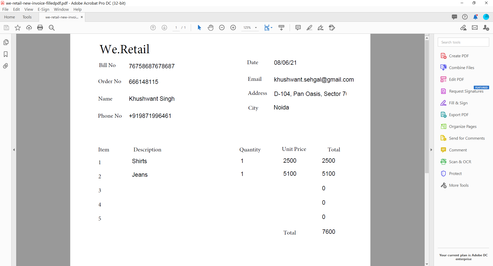

# Gerar documento de registro para o Forms adaptável (componentes principais)

## Visão geral {#overview}

Quando um formulário é preenchido ou enviado, você pode manter um registro do formulário, impresso ou no formato do documento. Esse registro é chamado de Documento de registro (DoR). É uma cópia do formulário enviado que pode ser impressa. Você também pode consultar o documento de registro para as informações que os clientes preencheram em uma data posterior ou usar o documento de registro para arquivar formulários e conteúdo juntos no formato PDF.


Para criar um documento de registro, um modelo baseado em XFA ou acroforma é mesclado com os dados coletados por meio de um formulário adaptável. Você pode gerar um Documento de registro automaticamente ou sob demanda. A opção sob demanda permite especificar um modelo XFA ou baseado em acroforma personalizado para fornecer uma aparência personalizada ao documento de registro.

É possível:

* [Gerar um documento de registro baseado em XFA](#generate-an-XFA-based-document-of-record)
* [Gerar um documento de registro baseado em acroforma (PDF do Acrobat Form)](#generate-an-Acroform-based-document-of-record)
* [Gerar automaticamente um documento de registro](#auto-generate-a-document-of-record)

## Antes de você iniciar {#components-to-automatically-generate-a-document-of-record}

Antes de começar a aprender e preparar os ativos necessários para um Documento de registro:

**Modelo base:** Um modelo XFA (arquivo XDP) criado no Forms Designer ou um formulário do Acrobat (AcroForm). [Modelo base](#base-template-of-a-document-of-record) é usado para especificar informações de estilo e marca para um Documento de registro. Carregue seu modelo XFA (arquivo XDP) na instância do AEM Forms antes de.

**Formulário adaptável:** Um formulário adaptável para o qual o documento de registro deve ser gerado.

## Gerar um documento de registro baseado em XFA {#generate-an-XFA-based-document-of-record}

Faça upload do modelo XFA (arquivo XDP) na instância do AEM Forms. Execute as seguintes etapas para configurar um Formulário adaptável para usar o modelo XFA (arquivo XDP) como modelo para o Documento de registro:

1. Na instância do autor do Experience Manager, clique em **[!UICONTROL Forms]** > **[!UICONTROL Forms e documentos].**
1. Selecione um formulário ou Crie um formulário adaptável e clique em **[!UICONTROL Propriedades]**.
1. Na janela Propriedades, toque em **[!UICONTROL Modelo de formulário]**.
1. No  **[!UICONTROL Modelo de formulário]** , na guia **[!UICONTROL Selecionar de]** selecione **[!UICONTROL Modelo de dados do formulário]**, **[!UICONTROL Esquema]** ou **[!UICONTROL Nenhum]**. Você também pode selecionar um modelo de formulário ao criar um formulário.
1. Na seção Document of Record Template Configuration da guia Form Model, selecione **Associar o modelo de formulário como o documento de modelo de registro**. Ao selecionar essa opção, todos os modelos XFA (arquivos XDP) disponíveis em sua máquina são exibidos. Selecione o arquivo apropriado. Além disso, verifique se o mesmo esquema (esquema de dados) é usado para o Formulário adaptável e o modelo XFA selecionado (arquivo XDP).
1. Clique em **[!UICONTROL Concluído.]**

O formulário adaptável agora está configurado para usar um arquivo XDP como modelo para o documento de registro. O próximo passo é [vincular componentes do Formulário adaptável com campos de modelo correspondentes](#bind-adaptive-form-components-with-template-fields).

## Gerar um documento de registro baseado em acroforma {#generate-an-Acroform-based-document-of-record}

Carregue seu PDF Adobe Acrobat (Acroform) na instância do AEM Forms. Execute as seguintes etapas para configurar um Formulário adaptável para usar o Adobe Acrobat PDF (AcroForm) como modelo para o Documento de registro:

1. Na instância do autor do Experience Manager, clique em **[!UICONTROL Forms]** > **[!UICONTROL Forms e documentos].**
1. Selecione um formulário ou **[!UICONTROL Criar um formulário adaptável]** e clique em **[!UICONTROL Propriedades]**.
1. Na janela Propriedades, toque em **[!UICONTROL Modelo de formulário]**.
1. No  **[!UICONTROL Modelo de formulário]** , na guia **[!UICONTROL Selecionar de]** selecione **[!UICONTROL Modelo de dados do formulário]**, **[!UICONTROL Esquema]** ou **[!UICONTROL Nenhum]**. Você também pode selecionar um modelo de formulário ao criar um formulário.
1. Na seção Document of Record Template Configuration da guia Form Model, selecione **Associar o modelo de formulário como o documento de modelo de registro**. Ao selecionar essa opção, todas as PDF de Acrobat (Acroform) disponíveis em sua máquina são exibidas. Selecione o Acrobat que deseja usar.
1. Clique em **[!UICONTROL Concluído.]**

O formulário adaptável agora está configurado para usar um acroforma como modelo para o documento de registro. O próximo passo é [vincular componentes do Formulário adaptável com campos de modelo correspondentes](#bind-adaptive-form-components-with-template-fields).

## Gerar automaticamente um documento de registro {#auto-generate-a-document-of-record}

Quando um formulário adaptável é configurado para gerar automaticamente um documento de registro, toda vez que um formulário é alterado, seu documento de registro é atualizado imediatamente. Por exemplo, se um campo for removido de um formulário adaptável existente, o campo correspondente também será removido e não estará visível no Documento de registro. Há muitas outras vantagens de gerar automaticamente o Documento de registro:

* Os desenvolvedores de formulários não precisam manter as associações de dados manualmente. O Documento de registro gerado automaticamente cuida das atualizações relacionadas à vinculação de dados.
* Os desenvolvedores de formulários não precisam ocultar manualmente os campos marcados como excluir do documento de registro. O documento de registro gerado automaticamente é pré-configurado para excluir esses campos.
* A opção Documento de registro gerado automaticamente economiza tempo necessário para criar um modelo de Formulário para Documento de registro.
* A opção Documento de registro gerado automaticamente permite usar estilos e aparências diferentes usando modelos base diferentes. Ele ajuda a selecionar o melhor estilo e aparência para o Documento de registro da sua organização. Se você não especificar o estilo, os estilos do sistema serão definidos como padrão.
* O documento de registro gerado automaticamente garante que qualquer alteração no formulário seja refletida imediatamente no documento de registro.

Execute as seguintes etapas para configurar um Formulário adaptável para gerar automaticamente um Documento de registro:

1. Na instância do autor do Experience Manager, clique em **[!UICONTROL Forms]** > **[!UICONTROL Forms e documentos].**
1. Selecione um formulário ou Crie um formulário adaptável e clique em **[!UICONTROL Propriedades]**.
1. Na janela Propriedades, toque em **[!UICONTROL Modelo de formulário]**.
1. No  **[!UICONTROL Modelo de formulário]** , na guia **[!UICONTROL Selecionar de]** selecione **[!UICONTROL Modelo de dados do formulário]**, **[!UICONTROL Esquema]** ou **[!UICONTROL Nenhum]**. Você também pode selecionar um modelo de formulário ao criar um formulário.
1. Na seção Document of Record Template Configuration da guia Form Model, selecione **Gerar documento de registro**.
1. Clique em **[!UICONTROL Concluído.]**

## Vincular componentes do formulário adaptável a campos de modelo {#bind-adaptive-form-components-with-template-fields}

Vincule campos de formulário adaptável a campos de modelo para exibir dados de formulário capturados no campo de documento de registro correspondente. Para vincular componentes do Formulário adaptável ao documento correspondente de campos de modelo de registro:

1. Abra o Formulário adaptável, configurado para usar um modelo de formulário personalizado para edição.

1. Selecione um componente de Formulário adaptável e clique em abrir Configurar  ícone. Ele abre o navegador de propriedades.

1. No navegador de propriedades, navegue e selecione um campo.

   * (Para o modelo AcroForm) a variável **[!UICONTROL Campo Documento de referência de associação de registro]** propriedade.
   * (Para modelo XFA) a variável **[!UICONTROL Referência de associação de modelo de dados]** propriedade.

1. Clique em **[!UICONTROL Salvar]**.

<!-- 
In the following video, Adaptive Form components are bound with corresponding Acroform template fields and the Document of Record is sent as an email attachment.
-->

Você pode usar ações de envio, como &quot;Enviar email&quot;, &quot;Chamar um fluxo de trabalho do AEM&quot;, &quot;Chamar um fluxo do Power Automate&quot; e outras [Ações de envio](configuring-submit-actions.md) para receber um documento de registro.


## Atualizações incrementais no documento de modelo de registro {#document-of-record-template-incremental-updates}

Os formulários adaptáveis e os documentos correspondentes de modelos de registro podem evoluir ao longo do tempo. Você pode optar por adicionar, remover ou modificar campos para um modelo de Formulário adaptável ou Documento de registro.

Quando você altera um modelo de documento de registro e faz upload do modelo alterado de documento de registro para o AEM Forms, o editor do Adaptive Forms detecta automaticamente as associações alteradas e informa sobre os componentes de formulário adaptáveis que exigem novas associações. Ele permite fazer atualizações incrementais em um documento de modelo de registro.

Por exemplo, uma Organização, *We.Retail*, tem um modelo de documento de registro baseado em AcroForm, *we-retail-Invoice.pdf*. O modelo tem a seguinte aparência:


Depois de usar o modelo por algum tempo, a organização decide renomear `invoice-number` campo para `bill-number` e capture o endereço de email dos compradores. Um desenvolvedor atualiza o nome do `invoice-number` e adiciona um campo de email ao modelo. Ele também cria uma nova versão do template chamada  *we-retail-Invoice-v2.pdf*.


<!--

The developer uploads and applies to the updated template to the adaptive form. The adaptive form automatically detects and displays list of fields where binding has changed.


The form developer binds Adaptive Forms fields with corresponding Document of Record template.

-->

>[!VIDEO](assets/we-retail-binding.mp4)

Agora, quando o formulário adaptável é enviado, um documento de registro atualizado é gerado.



## Considerações principais ao trabalhar com o documento de registro {#key-considerations-when-working-with-document-of-record}

Lembre-se das considerações e limitações a seguir ao trabalhar no Documento de registro do Adaptive Forms.

* Os modelos de documento de registro não são compatíveis com rich text. Portanto, qualquer rich text no Formulário adaptável estático ou nas informações preenchidas pelo usuário aparece como texto simples no Documento de registro.
* Os fragmentos de documento em um Formulário adaptável não aparecem no Documento de registro. No entanto, os fragmentos de formulário adaptável são compatíveis.
* Não há suporte para vinculação de conteúdo no Documento de registro gerado para o Formulário adaptável baseado em Esquema XML.
* A versão localizada do documento de registro é criada sob demanda para um local quando o usuário solicita a renderização do documento de registro. A localização do documento de registro ocorre juntamente com a localização do formulário adaptável. <!-- For more information on localization of Document of Record and Adaptive Forms see Using AEM translation workflow to localize Adaptive Forms and Document of Record.-->

<!-- ## Configure an adaptive form to generate  Document of Record {#adaptive-form-types-and-their-documents-of-record}

While creating an adaptive form, in the Form Model tab of Adaptive Form properties, select one the following option: 

* **None**
  Select the option to create an Adaptive Form without a form model. When the option is selected, the Document of Record is automatically generated for your Adaptive Form.

* **[Associate form template as a Document of Record template](creating-adaptive-form.md#create-an-adaptive-form-based-on-an-xfa-form-template)**
  
  Select the option to use an XFA Form as a template for Document of Record. 

* **[Generate Document of Record](creating-adaptive-form.md#create-an-adaptive-form-based-on-xml-or-json-schema)**
  Select the option to use an XFA Form as a template. When the option is selected, the Document of Record is automatically generated for your Adaptive Form. When you use an XML schema as a template for an Adaptive Form, ensure that the adaptive form and associated XFA Form use the same XML schema as your Adaptive Form
  

When you select a form model, configure Document of Record using options available under Document of Record Template Configuration. See [Document of Record Template Configuration](#document-of-record-template-configuration). -->

## Mapeamento de elementos do formulário adaptável {#mapping-of-adaptive-form-elements}

A tabela a seguir descreve os componentes do formulário adaptável e os componentes XFA correspondentes, e se eles aparecem em um documento de registro.

### Campos {#fields}

<table>
 <tbody>
  <tr>
   <th>Componente de formulário adaptável</th>
   <th>Componente XFA correspondente</th>
   <th>Incluído por padrão no documento de modelo de registro?</th>
   <th>Notas</th>
  </tr>
  <tr>
   <td>Botão</td>
   <td>Botão</td>
   <td>falso</td>
   <td> </td>
  </tr>
  <tr>
   <td>Caixa de seleção</td>
   <td>Caixa de seleção</td>
   <td>verdadeiro</td>
   <td> </td>
  </tr>
  <tr>
   <td>Seletor de data</td>
   <td>Campo de data/hora</td>
   <td>verdadeiro</td>
   <td> </td>
  </tr>
  <tr>
   <td>Lista suspensa</td>
   <td>Lista suspensa</td>
   <td>verdadeiro</td>
   <td> </td>
  </tr>
  <tr>
   <td>Caixa numérica</td>
   <td>Campo numérico</td>
   <td>verdadeiro</td>
   <td> </td>
  </tr>
  <tr>
   <td>Botão de opção</td>
   <td>Botão de opção</td>
   <td>verdadeiro</td>
   <td> </td>
  </tr>
  <tr>
   <td>Caixa de texto</td>
   <td>Campo de texto</td>
   <td>verdadeiro</td>
   <td> </td>
  </tr>
  <tr>
   <td>Botão de redefinição</td>
   <td>Botão Redefinir</td>
   <td>falso</td>
   <td> </td>
  </tr>
  <tr>
   <td>Botão Enviar</td>
   <td><p>Botão Enviar de email</p> <p>Botão Enviar do HTTP</p> </td>
   <td>falso</td>
   <td> </td>
  </tr>
  <tr>
   <td>Anexo de arquivo</td>
   <td> </td>
   <td>falso</td>
   <td>Não disponível no documento de modelo de registro. Disponível somente no documento de registro por meio de anexos.</td>
  </tr>
 </tbody>
</table>

### Contêineres {#containers}

<table>
 <tbody>
  <tr>
   <th>Componente de formulário adaptável</th>
   <th>Componente XFA correspondente</th>
   <th>Notas</th>
  </tr>
  <tr>
   <td>Painel<br /> </td>
   <td>Subformulário<br /> </td>
   <td>O painel repetível é mapeado para um subformulário repetível.</td>
  </tr>
 </tbody>
</table>

### Componentes estáticos {#static-components}

| Componente de formulário adaptável | Componente XFA correspondente | Notas |
|---|---|---|
| Imagem | Imagem | Os componentes TextDraw e Image, vinculados ou não, sempre aparecem no Documento de registro para um Formulário adaptável baseado em XSD, a menos que sejam excluídos usando as configurações do Documento de registro. |
| Texto | Texto |

### Tabelas {#tables}

Os componentes da tabela Adaptive Forms, como cabeçalho, rodapé e mapa de linhas para componentes XFA correspondentes. Você pode mapear painéis repetíveis para tabelas no documento de registro.

## Modelo base de um documento de registro {#base-template-of-a-document-of-record}

O modelo base fornece informações de estilo e aparência ao documento de registro. Ela permite personalizar a aparência padrão do documento de registro gerado automaticamente. Por exemplo, você pode usar um modelo base para adicionar o logotipo da sua empresa nas informações de cabeçalho e copyright no rodapé do documento de registro.

A página mestra de um modelo base é usada como uma página mestra do modelo Documento de registro. A página-mestre pode ter informações como cabeçalho, rodapé e número de página que podem ser aplicadas ao documento de registro. É possível aplicar essas informações ao Documento de Registro usando o modelo-base para geração automática do Documento de Registro. O uso de um template base permite alterar as propriedades padrão dos campos.

Sempre seguir [Convenções do modelo base](#base-template-conventions) ao criar o modelo base.

## Convenções do modelo base {#base-template-conventions}

Um modelo base é usado para definir o cabeçalho, rodapé, estilo e aparência de um documento de registro. O cabeçalho e o rodapé podem incluir informações como o logotipo da empresa e o texto de direitos autorais. A primeira página mestra no modelo base é copiada e usada como página mestra do documento de registro, que contém um cabeçalho, rodapé, número de página ou qualquer outra informação que deve aparecer em todas as páginas do documento de registro. Se você usar um modelo base que não esteja em conformidade com as convenções do modelo base, a primeira página-mestre do modelo base ainda será usada no modelo Documento de registro. É altamente recomendável que você projete seu modelo base de acordo com suas convenções e o use para a geração automática do Documento de registro.

**Convenções da página principal**

* No template base, nomeie o subformulário raiz como `AF_METATEMPLATE` e a página principal como `AF_MASTERPAGE`.

* A página mestra com o nome `AF_MASTERPAGE` localizado abaixo de `AF_METATEMPLATE` o subformulário raiz é preferido para extrair informações de cabeçalho, rodapé e estilo.

* Se `AF_MASTERPAGE` estiver ausente, a primeira página principal presente no modelo base será usada.

**Convenções de estilo para campos**

* Para aplicar estilo nos campos no documento de registro, o modelo base fornece campos localizados na `AF_FIELDSSUBFORM` subde sob o `AF_METATEMPLATE` subformulário raiz.

* As propriedades desses campos são aplicadas aos campos no documento de registro. Esses campos devem seguir o `AF_<name of field in all caps>_XFO` convenção de nomenclatura. Por exemplo, o nome do campo da caixa de seleção deve ser `AF_CHECKBOX_XFO`.

Para criar um modelo base, faça o seguinte no Forms Designer.

1. Clique em **[!UICONTROL Arquivo]** > **[!UICONTROL Novo]**.
1. Selecione o **[!UICONTROL Com base em um modelo]** opção.

1. Selecione o **[!UICONTROL Forms - Documento de registro]** categoria.
1. Selecionar **[!UICONTROL Modelo base do DoR]**.
1. Clique em **[!UICONTROL Próxima]** e fornecer as informações necessárias.

1. (Opcional) Modifique o estilo e a aparência dos campos que deseja aplicar nos campos do documento de registro.
1. Salve o formulário.
   

Agora você pode usar o formulário salvo como um modelo base para um Documento de registro. Não modifique ou remova scripts presentes no modelo base.

**Modificação do modelo base**

* Não aplique nenhum estilo sobre os campos no modelo base. É aconselhável remover esses campos do modelo base para que todas as atualizações no modelo base sejam selecionadas automaticamente.
* Ao modificar o modelo base, não remova, adicione ou modifique scripts.

Siga rigorosamente as convenções e instruções mencionadas acima para criar um modelo base.

## Personalizar as informações de marca no documento de registro {#customize-the-branding-information-in-document-of-record}

Ao gerar um Documento de registro, você pode alterar as informações de marca do Documento de registro na guia Documento de registro. A guia Documento de registro inclui opções como logotipo, aparência, layout, cabeçalho e rodapé, aviso de isenção e se você deseja ou não incluir opções de caixa de seleção e botão de opção não selecionados.

Para localizar as informações de marca inseridas na guia Documento de registro, certifique-se de que o local do navegador esteja definido adequadamente. Para personalizar as informações de marca do Documento de registro, execute as seguintes etapas:

1. Selecione um painel (painel raiz) no Documento de registro e toque em .
1. Toque . A guia Documento de registro é exibida.
1. Selecione o modelo padrão ou um modelo personalizado para renderizar o documento de registro. Se você selecionar o modelo padrão, uma visualização em miniatura do Documento de registro será exibida abaixo do menu suspenso Modelo.
1. Se você selecionar um modelo padrão ou personalizado, algumas ou todas as propriedades a seguir serão exibidas na guia Documento de registro. Especifique as propriedades mencionadas abaixo para definir a aparência do documento de registro:

   1. **Propriedades básicas**:
      * **Modelo**: se quiser selecionar um modelo personalizado, procure e selecione um XDP no [!DNL AEM Forms] servidor. Se quiser usar um modelo que não esteja disponível no [!DNL AEM Forms] servidor, primeiro carregue o XDP no seu [!DNL AEM Forms] servidor.
      * **Cor de realce**: A cor na qual o texto do cabeçalho e as linhas de separador são renderizados no documento do PDF de registro.
      * **Família da fonte**: Família de fontes do texto no documento de PDF de registro.

      * **Incluir objetos de formulário que não estão vinculados ao modelo de dados**: a configuração da propriedade inclui campos não vinculados do Formulário adaptável baseado em esquema no Documento de registro.

      <!-- **Exclude hidden fields from the Document of Record**: Setting the property identifies the hidden fields for exclusion from Document of Record.-->

      * **Ocultar descrição de painéis**: a configuração da propriedade exclui a descrição do painel/tabela do documento de registro. Aplicável para painel e tabela.


   1. **Propriedades do campo de formulário**:
      * **Para os componentes Caixa de seleção e Botão de opções, mostrar apenas os valores selecionados**: a configuração da propriedade exibe somente os valores selecionados da caixa de seleção e do botão de opção no [!UICONTROL Documento do registro].
      * **Separador para vários valores**: é possível escolher qualquer separador, como vírgula ou quebra de linha, para exibir vários valores.
      * **Alinhamento de opções**: Você pode selecionar o alinhamento desejado (Horizontal, Vertical, Igual ao formulário adaptável) para definir o alinhamento dos campos, como caixa de seleção ou botão de opção a ser exibido em [!UICONTROL Documento do registro]. Por padrão, o alinhamento vertical é definido para os campos em [!UICONTROL Documento do registro]. Definir as propriedades do [!UICONTROL Propriedades do campo de formulário] de DoR substitui as propriedades definidas no [!UICONTROL Alinhamento do Item] para os campos em um Formulário adaptável. Caso, selecione [!UICONTROL O mesmo que Formulário adaptável] opção, o alinhamento conforme configurado em uma instância do autor do Formulário adaptável é usado para [!UICONTROL Documento do registro] campos.
      * **Número de opções de alinhamento horizontal**: Você pode definir o número de opções a serem exibidas no Documento de registro para o alinhamento horizontal.


   1. **Página principal  Propriedades**:
      * **Imagem de logotipo**: Você pode optar por usar a imagem de logotipo do Formulário adaptável, escolher um do DAM ou fazer upload de um do seu computador.
      * **Título do formulário**: Título do DoR.
      * **Texto do cabeçalho**: texto que aparece na seção de cabeçalho do Documento de registro.
      * **Rótulo do aviso**: Rótulo do aviso.
      * **Isenção de responsabilidade**: texto que especifica o escopo dos direitos e obrigações no documento de registro.
      * **Texto do aviso**: Texto do aviso de isenção de responsabilidade.

      

   >[!NOTE]
   >
   >Se você estiver usando um modelo de Formulário adaptável criado com uma versão do Designer anterior à 6.3, para que as propriedades de Cor de ênfase e Família de fontes funcionem, verifique se o seguinte está presente no modelo de Formulário adaptável no subformulário raiz:

   ```xml
   <proto>
   <font typeface="Arial"/>
   <fill>
   <color value="4,166,203"/>
   </fill>
   <edge>
   <color value="4,166,203"/>
   </edge>
   </proto>
   ```

1. Para salvar as alterações de marca, toque em **[!UICONTROL Concluído]**.


## Layouts de tabela e coluna para painéis no documento de registro {#table-and-column-layouts-for-panels-in-document-of-record}

O formulário adaptável pode ser longo, com vários campos de formulário. Talvez você não queira salvar um Documento de registro como uma cópia exata do Formulário adaptável. Agora é possível escolher um layout de tabela ou coluna para salvar um ou mais painéis do Formulário adaptável no documento de PDF de registro.

Antes de gerar um documento de registro, nas configurações de um painel, selecione Layout do documento de registro para esse painel como Tabela ou Coluna. Os campos no painel são organizados de acordo no documento de registro.


Campos em um painel renderizado em um layout de tabela no documento de registro


Campos em um painel renderizado em um layout de coluna no documento de registro

## Configurações do documento de registro {#document-of-record-settings}

As configurações de Documento de registro permitem escolher as opções que você deseja incluir no Documento de registro. Por exemplo, um banco aceita nome, idade, número de seguridade social e número de telefone em um formulário. O formulário gera um número de conta bancária e detalhes da agência. Você pode optar por exibir somente o nome, o número de seguridade social, a conta bancária e os detalhes da agência no Documento de Registro.

A configuração do componente Documento de registro está disponível em suas propriedades. Para acessar as propriedades de um componente, selecione o componente e clique em  na sobreposição. As propriedades são listadas na barra lateral e você pode encontrar as seguintes configurações.

**Configurações de nível de campo**

* **Excluir do documento de registro**: definir a propriedade como true exclui o campo do Documento de registro. Esta é uma propriedade que pode ser gerada por script chamada `excludeFromDoR`. Seu comportamento depende da **Excluir campos de DoR se ocultos** propriedade de nível de formulário.

* **Exibir painel como tabela:** Definir a propriedade exibe o painel como tabela no documento de registro se o painel tiver menos de 6 campos. Aplicável somente para o painel.
* **Excluir título do documento de registro:** Definir a propriedade exclui o título do painel/tabela do documento de registro. Aplicável somente para painel e tabela.
* **Excluir descrição do documento de registro:** Definir a propriedade exclui a descrição do painel/tabela do documento de registro. Aplicável somente para painel e tabela.

**Configurações do nível de formulário**

* **Incluir campos desatados em DoR:** A configuração da propriedade inclui campos não vinculados do formulário adaptável baseado em esquema no documento de registro. Por padrão, é verdadeiro.

## Consulte também {#see-also}

{{see-also}}


<!-- 

**Exclude fields from DoR if hidden:** Set the property to exclude the hidden fields from Document of Record at form submission. When you enable [Revalidate on server](/help/forms/configuring-submit-actions.md#server-side-revalidation-in-adaptive-form-server-side-revalidation-in-adaptive-form), the server recomputes the hidden fields before excluding those fields from the Document of Record.

!->>
