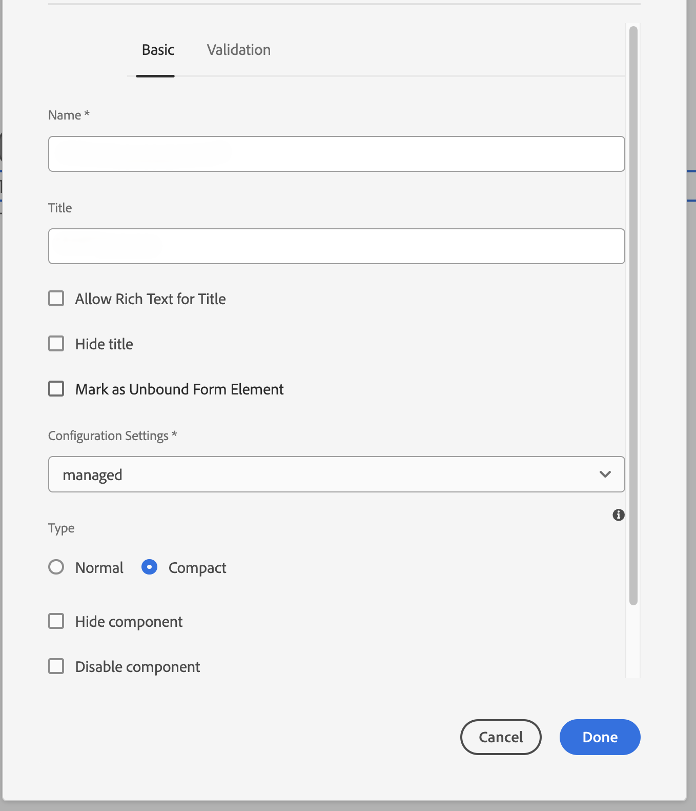

# Conecte seu ambiente AEM Forms com o hCaptcha® {#connect-your-forms-environment-with-hcaptcha-service}

 Esse recurso está em Early Adoter Program. Você pode escrever para aem-forms-ea@adobe.com a partir de sua ID de e-mail oficial para participar do programa de adoção antecipada e solicitar acesso ao recurso. 

O serviço de Captcha® protege seus formulários contra bots, spam e abuso automatizado. Ele apresenta um desafio de widget de caixa de seleção e avalia a resposta do usuário para determinar se é um humano ou um bot interagindo com o formulário. Ele impede que o usuário continue se o teste falhar e ajuda a tornar as transações online seguras, impedindo que os bots publiquem spam ou atividades mal-intencionadas.

O AEM Forms as a Cloud Service suporta o hCaptcha® nos componentes principais adaptáveis do Forms. Você pode usá-lo para apresentar um desafio de widget de caixa de seleção no envio do formulário.

<!-- -->

## Pré-requisitos para integrar o ambiente do AEM Forms com o Captcha® {#prerequisite}

Para configurar o hCaptcha® com o AEM Forms, é necessário obter a [Chave de site do Captcha® e chave secreta](https://docs.hcaptcha.com/switch/#get-your-hcaptcha-sitekey-and-secret-key) no site do hCaptcha®.

## Etapas para configurar o hCaptcha® {#steps-to-configure-hcaptcha}

Para integrar o AEM Forms com o serviço hCaptcha®, execute as seguintes etapas:

1. Crie um Contêiner de configuração em seu ambiente as a Cloud Service do AEM Forms. Um Contêiner de configuração contém as Configurações de nuvem usadas para conectar o AEM a serviços externos. Para criar e configurar um Contêiner de configuração para conectar seu ambiente AEM Forms com o hCaptcha®:
   1. Abra a instância do AEM Forms as a Cloud Service.
   1. Ir para **[!UICONTROL Ferramentas > Geral > Navegador de configuração]**.
   1. No Navegador de configuração, você pode selecionar uma pasta existente ou criar uma pasta. Você pode criar uma pasta e ativar a opção Configurações de nuvem para ela ou Ativar a opção Configurações de nuvem para uma pasta existente:

      * Para criar uma pasta e ativar a opção Configurações de nuvem para ela:
         1. No Navegador de configuração, clique em **[!UICONTROL Criar]**.
         1. Na caixa de diálogo Criar configuração, especifique um nome, título e selecione a variável **[!UICONTROL Configurações da nuvem]** opção.
         1. Clique em **[!UICONTROL Criar]**.
      * Para ativar a opção Configurações de nuvem para uma pasta existente:
         1. No Navegador de configuração, selecione a pasta e selecione **[!UICONTROL Propriedades]**.
         1. Na caixa de diálogo Propriedades de configuração, ative **[!UICONTROL Configurações da nuvem]**.
         1. Selecionar **[!UICONTROL Salvar e fechar]** para salvar a configuração e sair do diálogo.

1. Configure o Cloud Service:
   1. Na instância do autor do AEM, acesse  > **[!UICONTROL Cloud Service]** e selecione **[!UICONTROL Captcha®]**.
      
   1. Selecione um Contêiner de configuração, criado ou atualizado, conforme descrito na seção anterior. Selecione **[!UICONTROL Criar]**.
      
   1. Especificar **[!UICONTROL Título]**, **[!UICONTROL Nome]**, **[!UICONTROL Chave do site]**, e **[!UICONTROL Chave secreta]** para serviço hCaptcha® [obtido no pré-requisito](#prerequisite). Selecione **[!UICONTROL Criar]**.

      

   >[!NOTE]
   > Os usuários não precisam modificar [URL de validação do JavaScript do lado do cliente](https://docs.hcaptcha.com/#add-the-hcaptcha-widget-to-your-webpage) e [URL de validação do lado do servidor](https://docs.hcaptcha.com/#verify-the-user-response-server-side) já que estão pré-preenchidos para validação do hCaptcha®.

   Após configurar o serviço hCAPTCHA, ele fica disponível para uso em uma [Formulário adaptável com base nos Componentes principais](https://experienceleague.adobe.com/en/docs/experience-manager-core-components/using/adaptive-forms/introduction).

## Usar o Captcha® em um Forms Adaptive Core Components {#using-hCaptcha®-core-components}

1. Abra a instância do AEM Forms as a Cloud Service.
1. Ir para **[!UICONTROL Forms]** > **[!UICONTROL Forms e documentos]**.
1. Selecione um formulário adaptável e **[!UICONTROL Propriedades]**. Para o **[!UICONTROL Contêiner de configuração]** selecione o Contêiner de configuração que contém a configuração na nuvem que conecta o AEM Forms com o Captcha® e selecione **[!UICONTROL Salvar e fechar]**.

   Se você não tiver um Contêiner de configuração, consulte a seção [Conecte seu ambiente AEM Forms com o hCaptcha®](#connect-your-forms-environment-with-hcaptcha-service) para saber como criar um Contêiner de configuração.

   

1. Selecione um formulário adaptável e **[!UICONTROL Editar]**. O Formulário adaptável é aberto no Editor Forms adaptável.
1. No navegador de componentes, arraste e solte ou adicione o **[!UICONTROL Formulário adaptável hCaptcha®]** no Formulário adaptável.
1. Selecione o **[!UICONTROL Formulário adaptável hCaptcha®]** propriedades do componente e clique  ícone. Ele abre a caixa de diálogo de propriedades. Especifique as seguintes propriedades:

   

   * **[!UICONTROL Nome]:** Especifique o nome do componente Captcha. Você pode identificar facilmente um componente de formulário com seu nome exclusivo no formulário e no editor de regras.
   * **[!UICONTROL Título]:** Especifique o título para o componente Captcha.
   * **[!UICONTROL Configurações]:** Selecione uma Configuração na nuvem configurada para o hCaptcha®.
   * **Tamanho do Captcha:** Você pode selecionar o tamanho de exibição da caixa de diálogo de desafio do hCaptcha®. Use o **[!UICONTROL Compacto]** opção para exibir um tamanho pequeno e a variável **[!UICONTROL Normal]** opção para exibir uma caixa de diálogo de desafio do hCaptcha® de tamanho relativamente grande.<!-- or **[!UICONTROL Invisible]** to validate hCaptcha® without explicitly rendering the checkbox widget on the user interface. -->
   * **[!UICONTROL Mensagem de validação]:** Forneça uma mensagem de validação para sua validação de Captcha no envio do formulário.
   * **[!UICONTROL Mensagem de validação de script]**: essa opção permite que você insira uma mensagem que será exibida caso haja falha na validação do script.
     >[!NOTE]
     >Você pode ter várias configurações de nuvem no seu ambiente para uma finalidade semelhante. Então, escolha o serviço com cuidado. Se nenhum serviço estiver listado, consulte [Conecte seu ambiente AEM Forms com o hCaptcha®](#connect-your-forms-environment-with-hcaptcha-service) para saber como criar um Cloud Service que conecta seu ambiente AEM Forms com o serviço hCaptcha®.
     <!--* **Error Message:** Provide the error message to display to the user when the Captcha submission fails.-->

1. Selecionar **[!UICONTROL Concluído]**.

Agora, somente formulários legítimos, nos quais o preenchimento do formulário apaga com êxito o desafio imposto pelo serviço hCaptcha®, são permitidos no envio do formulário. hCaptcha®

**Captcha® é uma marca registrada da Intuition Machines, Inc.**

## Perguntas frequentes

* **P: Posso usar mais de um componente Captcha em um formulário adaptável?**
* **Ans:** Não há suporte para o uso de mais de um componente Captcha em um Formulário adaptável. Além disso, não é recomendável usar um componente Captcha em um fragmento ou painel marcado para carregamento lento.

## Consulte também {#see-also}

{{see-also}}
