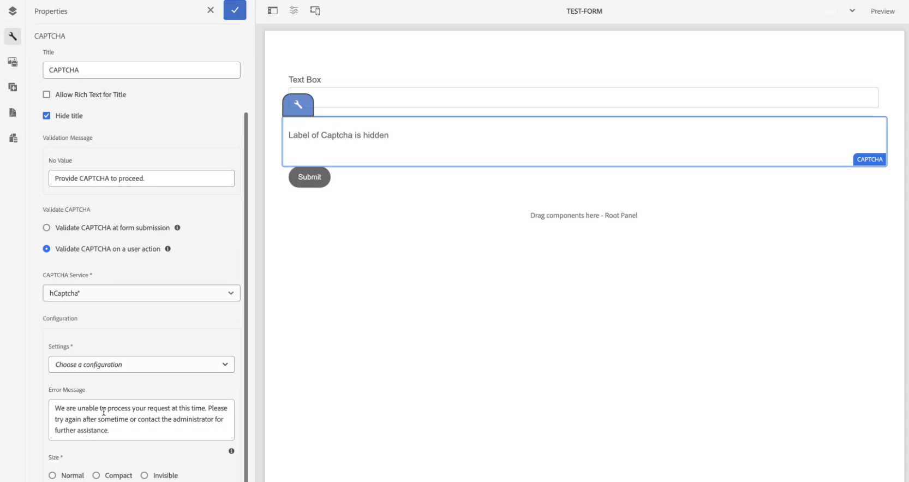

# Conecte seu ambiente AEM Forms com o hCaptcha® {#connect-your-forms-environment-with-hcaptcha-service}

 Este recurso está em Early Adoter Program. Você pode escrever para aem-forms-ea@adobe.com da sua ID de email oficial para ingressar no programa de adoção antecipada e solicitar acesso ao recurso. 

O CAPTCHA (um teste de Turing público e completamente automatizado para diferenciar computadores e humanos) é um programa comumente usado em transações online para distinguir entre humanos e programas ou bots automatizados. O recurso apresenta um desafio e avalia a resposta do usuário para determinar se é um humano ou um bot interagindo com o site. O CAPTCHA impede que o usuário prossiga se o teste falhar e ajuda a tornar as transações online seguras, evitando que bots publiquem spam ou outro conteúdo mal-intencionado.

O AEM Forms as a Cloud Service é compatível com as seguintes soluções CAPTCHA:

* [Captcha](#integrate-aem-forms-environment-with-hcaptcha-captcha)
* [Cilindro de nuvens](/help/forms/integrate-adaptive-forms-turnstile.md)
* [Google reCAPTCHA](/help/forms/captcha-adaptive-forms.md)

## Integrar o ambiente do AEM Forms com o Captcha Captcha

O serviço hCaptcha® protege seus formulários contra bots, spam e abuso automatizado. O recurso representa um desafio de dispositivo de caixa de seleção e avalia a resposta do usuário para determinar se um humano ou um bot está interagindo com o formulário. Ele impede que o usuário prossiga se o teste falhar e ajuda a tornar as transações online seguras, evitando que os bots publiquem spam ou atividades mal-intencionadas.

O AEM Forms as a Cloud Service suporta o hCaptcha® nos componentes principais adaptáveis do Forms. Você pode usá-lo para apresentar um desafio de widget de caixa de seleção no envio do formulário.

<!-- -->

## Pré-requisitos para integrar o ambiente do AEM Forms com o Captcha® {#prerequisite}

Para configurar o hCaptcha® com AEM Forms, você precisa obter a [chave do site e a chave secreta do hCaptcha®](https://docs.hcaptcha.com/switch/#get-your-hcaptcha-sitekey-and-secret-key) do site do hCaptcha®.

## Etapas para configurar o hCaptcha® {#steps-to-configure-hcaptcha}

1. Crie um contêiner de configuração no ambiente as a Cloud Service do AEM Forms. Um Contêiner de configuração contém as Configurações de nuvem usadas para conectar o AEM a serviços externos. Para criar e configurar um Contêiner de configuração para conectar seu ambiente AEM Forms com o hCaptcha®:
   1. Abra a instância as a Cloud Service do AEM Forms.
   1. Vá para **[!UICONTROL Ferramentas > Geral > Navegador de Configuração]**.
   1. No Navegador de configuração, você pode selecionar uma pasta existente ou criar uma pasta. É possível criar uma pasta e habilitar a opção Configurações de nuvem para ela ou habilitar a opção Configurações de nuvem para uma pasta existente:

      * **Para criar uma pasta e habilitar a opção Configurações de Nuvem para ela**:
         1. No Navegador de Configuração, clique em **[!UICONTROL Criar]**.
         1. Na caixa de diálogo Criar Configuração, especifique um nome, título e selecione a opção **[!UICONTROL Configurações de Nuvem]**.
         1. Clique em **[!UICONTROL Criar]**.
      * Para ativar a opção Configurações de nuvem para uma pasta existente:
         1. No Navegador de Configuração, selecione a pasta e selecione **[!UICONTROL Propriedades]**.
         1. Na caixa de diálogo Propriedades de Configuração, habilite **[!UICONTROL Configurações de Nuvem]**.
         1. Selecione **[!UICONTROL Salvar e fechar]** para salvar a configuração e sair da caixa de diálogo.

1. Configure o Cloud Service:
   1. Na instância do autor AEM, vá para  > **[!UICONTROL Cloud Service]** e selecione **[!UICONTROL hCaptcha®]**.
      
   1. Selecione um Contêiner de configuração, criado ou atualizado, conforme descrito na seção anterior. Selecione **[!UICONTROL Criar]**.
      
   1. Especifique **[!UICONTROL Título]**, **[!UICONTROL Nome]**, **[!UICONTROL Chave do Site]** e **[!UICONTROL Chave Secreta]** para o serviço hCaptcha® [obtido no pré-requisito](#prerequisite). Selecione **[!UICONTROL Criar]**.

      

>[!NOTE]
> Os usuários não precisam modificar a [URL de validação do JavaScript do lado do cliente](https://docs.hcaptcha.com/#add-the-hcaptcha-widget-to-your-webpage) e a [URL de validação do lado do servidor](https://docs.hcaptcha.com/#verify-the-user-response-server-side), pois já estão pré-preenchidos para validação do hCaptcha®. Para alguns países, os endpoints podem ser diferentes, visite [Perguntas frequentes sobre o hCaptcha®](https://docs.hcaptcha.com/faq#does-hcaptcha-support-access-by-users-in-china) para obter mais informações.

Depois que o serviço hCAPTCHA é configurado, ele é disponibilizado para uso em um Formulário adaptável.

## Usar o hCaptcha® em um formulário adaptável{#using-hCaptcha®-foundation-components}

1. Abra a instância as a Cloud Service do AEM Forms.
1. Ir para **[!UICONTROL Forms]** > **[!UICONTROL Forms e Documentos]**.
1. Selecione um Formulário adaptável e selecione **[!UICONTROL Propriedades]**. Para a opção **[!UICONTROL Contêiner de configuração]**, selecione o Contêiner de configuração que contém a Configuração na nuvem que conecta o AEM Forms com o hCaptcha® e selecione **[!UICONTROL Salvar e fechar]**.

   Se você não tiver um Contêiner de configuração como esse, consulte a seção [Conecte seu ambiente AEM Forms com o hCaptcha®](#connect-your-forms-environment-with-hcaptcha-service) para saber como criar um Contêiner de configuração.

   

1. Selecione um Formulário adaptável e selecione **[!UICONTROL Editar]**. O Formulário adaptável é aberto no Editor Forms adaptável.
1. No navegador de componentes, arraste e solte o componente **[!UICONTROL Captcha]** no Formulário adaptável.
1. Selecione o componente **[!UICONTROL Captcha]** e clique no ícone de propriedades . Ele abre a caixa de diálogo de propriedades.

   

   Especifique as seguintes propriedades:

   * **[!UICONTROL Título]:** Especifique o título para o componente Captcha, você pode identificar facilmente um componente de formulário com seu nome exclusivo no formulário e no editor de regras.
   * **[!UICONTROL Mensagem de validação]:** Forneça uma mensagem de validação para a validação Captcha no envio do formulário.
   * **[!UICONTROL Validar Captcha]:** Você pode selecionar uma das opções para validar Captcha:
      * No envio do formulário
      * Em uma ação do usuário.
   * **[!UICONTROL Serviço Captcha]:** Selecione seu serviço Captcha, aqui você seleciona o serviço Captcha®.
   * **[!UICONTROL Configuração de Captcha]:** Selecione uma Configuração de Nuvem configurada para hCaptcha®.
     >[!NOTE]
     >Você pode ter várias configurações de nuvem no seu ambiente para uma finalidade semelhante. Então, escolha o serviço com cuidado. Se nenhum serviço estiver listado, consulte [Conectar seu ambiente AEM Forms com o hCaptcha®](#connect-your-forms-environment-with-hcaptcha-service) para saber como criar um Cloud Service que conecta seu ambiente AEM Forms com o serviço hCaptcha®.

   * **Mensagem de Erro:** Forneça a mensagem de erro a ser exibida ao usuário quando o envio do Captcha falhar.
   * **Tamanho do Captcha:** Selecione o tamanho de exibição da caixa de diálogo de desafio do hCaptcha®. Use a opção **[!UICONTROL Compactar]** para exibir um hCaptcha® de tamanho pequeno e a opção **[!UICONTROL Normal]** para exibir uma caixa de diálogo de desafio de hCaptcha® de tamanho relativamente grande ou **[!UICONTROL Invisível]** para validar o hCaptcha® sem renderizar explicitamente o widget caixa de seleção na interface do usuário.

1. Selecione **[!UICONTROL Concluído]**.

Agora, somente formulários legítimos, nos quais o preenchimento do formulário apaga com êxito o desafio imposto pelo serviço hCaptcha®, são permitidos no envio do formulário.

**hCaptcha® é uma marca registrada da Intuition Machines, Inc.**

## Perguntas frequentes

* **P: Posso usar mais de um componente Captcha em um Formulário adaptável?**
* **Ans:** Não há suporte para o uso de mais de um componente Captcha em um Formulário adaptável. Além disso, não é recomendável usar um componente Captcha em um fragmento ou painel marcado para carregamento lento.

## Consulte também {#see-also}

{{see-also}}
