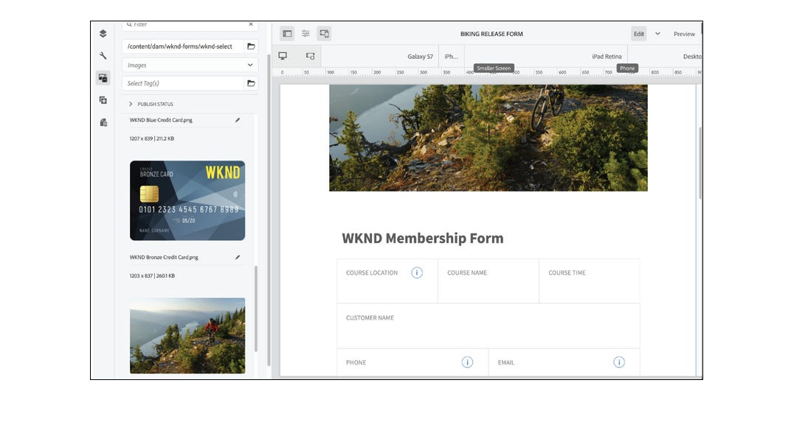

<!-- # Introduction to [!DNL AEM Forms] as a Cloud Service {#overview}

Adobe Experience Manager Forms as a Cloud Service offers a cloud-native, Platform as a Service (PaaS) solution for businesses to create, manage, publish, and update complex digital forms while integrating submitted data with back-end processes, business rules, and saving data in an external data store. The service is always current, always available, and always learning.

You can use the service to create and rollout  interactive and engaging digital forms. For example, an organization is looking to digitize their customer enrollment journey. They have multiple data sources with existing customer data, they are looking to pre-populate forms, add e-sign their forms, and archive filled forms as PDF files. Besides, the organization has multiple print forms (PDF forms), they are also looking to convert all of their print forms to digital forms.

The organization can use [!DNL AEM Forms] as a Cloud Service to create digital forms, connect forms to existing data sources, integrate forms with [!DNL Adobe Sign] to add e-signatures to forms, and generate Document of Record (DoR) to archive filled forms as PDF files. The organization can also use the service to convert their existing PDF forms to digital forms. 

An organization can sign up for [!DNL AEM Forms] as a Cloud Service and start using all these features without waiting to buy and set up a local infrastructure. The service also frees the organizations from the cycle of upgrades as it is always up to date and always offers the latest feature.  -->

# Inovações mais recentes {#latest-innovations}

Algumas das mais recentes inovações no AEM Forms as a Cloud Service incluem:

| Recurso | Detalhes |
|---|---|
| Forms adaptável headless | Criar e gerenciar [Forms adaptável headless](https://experienceleague.corp.adobe.com/docs/experience-manager-headless-adaptive-forms/using/overview.html) na plataforma Adobe Experience Manager. Permita que os desenvolvedores criem, publiquem e gerenciem formulários interativos que possam ser acessados e interagidos por meio de APIs, em vez de uma interface gráfica tradicional.     Esses formulários foram projetados para serem enviados sem a necessidade de uma interface de formulário HTML tradicional. Em outras palavras, eles permitem enviar dados de formulário programaticamente por meio de uma API ou código de back-end sem exigir elementos de formulário visíveis no front-end.     Os formulários headless são úteis em vários cenários, como ao criar aplicativos de página única, aplicativos web progressivos ou aplicativos móveis, em que uma interface de formulário HTML tradicional pode não ser necessária ou prática. Ao permitir que os desenvolvedores enviem dados de formulário diretamente por meio de APIs ou código de back-end, os formulários headless ajudam a simplificar os fluxos de trabalho e melhorar o desempenho geral dos aplicativos web. |
| Componentes principais  | A variável [Componentes principais adaptáveis do Forms](https://experienceleague.adobe.com/docs/experience-manager-core-components/using/adaptive-forms/introduction.html#features) são um conjunto de 24 componentes de código aberto, compatíveis com BEM, que foram criados com base nos Componentes principais do WCM no Adobe Experience Manager. Eles foram projetados especificamente para serem usados para criar o Adaptive Forms, que são formulários que se adaptam ao dispositivo, navegador e tamanho de tela do usuário.     Esses componentes podem ser usados para criar experiências excepcionais de captura e inscrição de dados fornecendo uma grande variedade de opções de campo de formulário, incluindo campos de texto, caixas de seleção, menus suspensos e muito mais. Eles também incluem recursos como validação, lógica condicional e design responsivo, que podem ser usados para criar formulários amigáveis e fáceis de usar.      Além disso, como esses componentes são de código aberto, os desenvolvedores têm a capacidade de personalizar e estender facilmente os componentes para atender às necessidades específicas de sua organização. Além disso, esses componentes se baseiam na metodologia BEM, o que garante que sejam escaláveis e sustentáveis. |
| Conector do Microsoft PowerAutomate | O AEM Forms Power Automate Connector permite integrar o Adobe Experience Manager (AEM) Forms ao Microsoft Power Automate (anteriormente conhecido como Microsoft Flow). O Power Automate é um serviço baseado em nuvem que permite criar fluxos de trabalho automatizados entre diferentes aplicativos e serviços.      Com o Conector do AEM Form Power Automate, é possível criar fluxos de trabalho que são acionados automaticamente com base no envio de um Formulário adaptável. Por exemplo, você pode criar um fluxo de trabalho que envia automaticamente uma notificação por email a uma pessoa específica quando um usuário envia um formulário ou cria uma tarefa no Microsoft Planner quando um usuário conclui um formulário.       O AEM Forms Power Automate Connector é uma ferramenta poderosa que permite automatizar e integrar o Adaptive Forms a outros aplicativos e serviços que se conectam ao Microsoft Power Automate, permitindo que você trabalhe com uma variedade maior de ferramentas. Você pode criar workflows personalizados para suas necessidades específicas, com a capacidade de adicionar ações, condições e acionadores personalizados. Além disso, o Power Automate fornece análises e relatórios detalhados, permitindo monitorar e otimizar seus workflows ao longo do tempo. |
| Conectores de armazenamento Microsoft | Conectores de armazenamento AEM Forms Microsoft para <a href="https://experienceleague.corp.adobe.com/docs/experience-manager-cloud-service/content/forms/adaptive-forms-authoring/authoring-adaptive-forms-foundation-components/configure-submit-actions-and-metadata-submission/configuring-submit-actions.html#submit-to-sharedrive">OneDrive</a>, <a href="https://experienceleague.corp.adobe.com/docs/experience-manager-cloud-service/content/forms/adaptive-forms-authoring/authoring-adaptive-forms-foundation-components/configure-submit-actions-and-metadata-submission/configuring-submit-actions.html?#submit-to-sharedrive"> SharePoint, </a> e <a href="https://experienceleague.corp.adobe.com/docs/experience-manager-cloud-service/content/forms/adaptive-forms-authoring/authoring-adaptive-forms-foundation-components/configure-submit-actions-and-metadata-submission/configuring-submit-actions.html?#submit-to-azure-blob-storage"> Armazenamento Azure Blob </a> são conectores que permitem integrar o Adobe Experience Manager (AEM) Forms ao Microsoft OneDrive e ao SharePoint. Com esse conector, você pode fazer upload de arquivos de dados e anexos para o OneDrive e o SharePoint diretamente do Adaptive Forms.     O OneDrive e o SharePoint podem se integrar a outros aplicativos de negócios, como sistemas CRM, software de contabilidade e ferramentas de gerenciamento de projetos. Isso permite simplificar os processos de negócios, reduzir a entrada manual de dados e melhorar a eficiência geral. |

<!-- 

# Key features and capabilities {#key-features}

[!DNL AEM Forms] as a Cloud Service provides several cloud-native capabilities such as a cloud-native architecture, auto-scaling, zero downtime for upgrades, a CDN (Content Delivery Network), cloud-native development environment, and ability to self-Service the environments via Cloud Manager. You can use the service to: 

* [Create Adaptive Forms](creating-adaptive-form.md#strong-create-an-adaptive-form-strong) that automatically render for a user's device and browser.

    

* [Create pixel-perfect PDF forms](use-forms-designer.md#create-an-adaptive-form) that look almost like paper.

* Use [Automated Forms Conversion service](https://experienceleague.adobe.com/docs/aem-forms-automated-conversion-service/using/introduction.html) to convert a PDF Form to an Adaptive Form. It helps you accelerate digitization and modernization of data capture experiences of your organization.

    

* [Create business processes](aem-forms-workflow-step-reference.md#create-form-centric-workflows). For example, You can create and trigger an approval and rejection workflow on submission of an Adaptive Form.

In addition to above [!DNL AEM Forms] as a Cloud Service offers the following features and capabilities:

* An easy-to-use graphical user interface to let business users easily import, manage, preview, and publish forms
* A responsive forms directory with powerful search features using keywords, tags, and metadata
* Dynamic detection of a user's device and location to render the form appropriately across web and mobile channels
* [Integration with Adobe Sign](adobe-sign-integration-adaptive-forms.md) services or Scribble to electronically sign documents containing confidential information
* Ability to [connect the service to various types of data sources](data-integration.md#create-an-adaptive-form) to send and retrieve data. The service supports sending and retrieving data from RESTful web services, SOAP-based web services, and OData enabled services.
* Integration with AEM Sites. It allows to embed an adaptive form in an AEM Sites page. You can also integrate an adaptive form to any webpage. 
* Ability to create a Document of Record (DoR) to keep a record of the information that you provide and submit in an Adaptive Form so that you can refer to it later. A DoR is a PDF version of a form. It includes both a template and data. The service provides a default DoR template and tools to develop a custom template.
* Ability to create Adaptive Forms to produce schema-compliant data. It helps you submit captured data to existing processes and data sources without any or minimal modifications.
* Ability to create a prefill service to fill a form with existing customer data based on a criteria. It helps fasten the form filling process and reduce the abandon rate.

<!-- 

## Enterprise-class forms {#enterprise-class-forms}

You can create enterprise class forms (Adaptive Forms) and deliver beautiful, interactive, responsive, and personalized experiences to your customers. These forms change behavior and appearance based on the underlying device. You can also use themes and templates with Adaptive Forms to mandate a uniform structure and appearance for all the forms of an organization or a department.

## Automatic conversion of PDF forms to Adaptive Forms {#automatic-conversion-of-pdf-forms-to-adaptive-forms}

You can use Automated Forms Conversion service to convert a PDF Form to an Adaptive Form. It helps you accelerate digitization and modernization of data capture experiences of your organization.

## Data Integration {#data-integration}

You can connect the service to various types of data sources to send and retrieve data. The service supports sending and retrieving data from RESTful web services, SOAP-based web services, and OData enabled services.

## Integration with [!DNL Adobe Sign] {#integration-with-adobe-sign}

 You can integrate the service with [!DNL Adobe Sign] and add [!DNL Adobe Sign] fields to an Adaptive Form. It allows your users to e-sign an Adaptive Form and use [!DNL Adobe Sign] with AEM Workflows. You can use AEM Workflows to develop a business logic and send forms and documents to recipients for signatures based on the business logic.

## Integration with [!DNL AEM Sites] {#integration-with-aem-sites}

You can embed an adaptive form in an AEM Sites or an external webpage. The service provides a component out of the box to integrate an adaptive forms to an AEM Sites page.

## Business Processes Automation {#bpa}

You can use AEM Workflows to create business processes and automate operations. For example, You can create and trigger an approval and rejection workflow on submission of an Adaptive Form. 

## Document of Record {#dor}

You can create a Document of Record (DoR) to keep a record of the information that you provide and submit in an Adaptive Form so that you can refer to it later. A DoR is a PDF version of a form. It includes both a template and data. The service provides a default DoR template and tools to develop a custom template.

## Rule editor {#rule-editor}

Rule editor empowers you to build dynamism and interactivity to Adaptive Forms. These rules define actions to trigger on form objects based on preset conditions, user inputs, and user actions on the form. It helps  streamline the form filling experience while ensuring accuracy and speed.
  

## WYSIWYG editors {#wysiwyg-editor} 

The service provides several WYSIWYG editors: Adaptive Forms editor, Theme editor, and Template editor. These help you create and edit forms and related assets in WYSIWYG manner. The editors also provide out-of-the-box options to simulate views for popular mobile devices, tablets, and desktop screen configurations.

## Schema-compliant data {#schema-complaint-data}

You can create Adaptive Forms to produce schema-compliant data. It helps you submit captured data to existing processes and data sources without any or minimal modifications.

## Prefill a form

You can create a prefill service to fill a form with existing customer data based on a criteria. It helps fasten the form filling process and reduce the abandon rate.

## Submit Actions

A Submit Action allows you to persist and process captured data. The service provides several Submit Actions out-of-the-box. You can use these Submit Actions to send submitted data to a REST endpoint, database, or an AEM Workflow. You can also email submitted data along with attachments and Document of Record(DoR). You can also develop a custom Submit Action to perform an action specific to your business.

* **Emulators:** You can view an Adaptive Form in an in-built emulator. It helps you simulate how an Adaptive Form appears on different devices to an end user. It provides out-of-the-box options to simulate views for popular mobile devices, tablets, and desktop screen configurations. 

In addition to standard [!DNL AEM Forms] features, [!DNL AEM Forms] as a Cloud Service provides several cloud-native capabilities such as a cloud-native architecture, auto-scaling, zero downtime for upgrades, a CDN (Content Delivery Network), cloud-native development environment, and ability to self-Service the environments via Cloud Manager. -->
