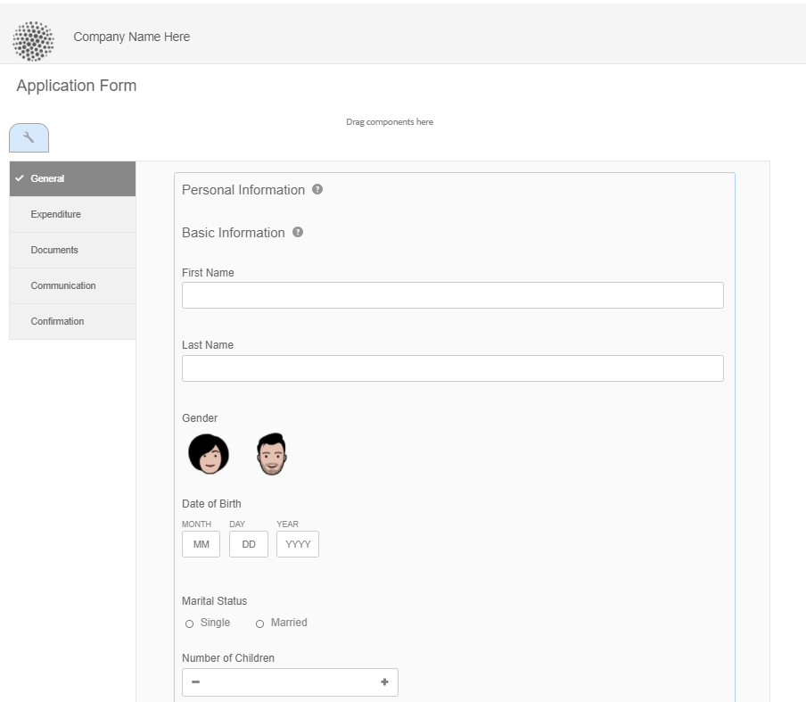

# Recursos de layout do Adaptive Forms {#layout-capabilities-of-adaptive-forms}

<span class="preview"> O Adobe recomenda o uso da captura de dados moderna e extensível [Componentes principais](https://experienceleague.adobe.com/docs/experience-manager-core-components/using/adaptive-forms/introduction.html?lang=pt-BR) para [criação de um novo Forms adaptável](/help/forms/creating-adaptive-form-core-components.md) ou [adição de Forms adaptável às páginas do AEM Sites](/help/forms/create-or-add-an-adaptive-form-to-aem-sites-page.md). Esses componentes representam um avanço significativo na criação do Forms adaptável, garantindo experiências de usuário impressionantes. Este artigo descreve a abordagem mais antiga para criar o Forms adaptável usando componentes de base. </span>


| Versão | Link do artigo |
| -------- | ---------------------------- |
| AEM 6.5 | [Clique aqui](https://experienceleague.adobe.com/docs/experience-manager-65/forms/adaptive-forms-basic-authoring/layout-capabilities-adaptive-forms.html) |
| AEM as a Cloud Service | Este artigo |

[!DNL Adobe Experience Manager] O permite criar Forms adaptável fácil de usar, que oferece experiências dinâmicas para usuários finais. O layout de formulário controla como os itens ou componentes são exibidos em um Formulário adaptável.

<!-- ## Prerequisite knowledge {#prerequisite-knowledge}

Before learning about the different layout capabilities of Adaptive Forms, read [Introduction to authoring forms](introduction-forms-authoring.md) to know more about Adaptive Forms. -->

## Tipos de layouts {#types-of-layouts}

Um Formulário adaptável fornece os seguintes tipos de layouts:

**[!UICONTROL Layout do painel]** Controla como os itens ou componentes dentro de um painel são exibidos em um dispositivo.

**[!UICONTROL Layout de dispositivo móvel]** Controla a navegação de um formulário em um dispositivo móvel. Se a largura do dispositivo for de 768 pixels ou mais, o layout é considerado um Layout de dispositivo móvel e otimizado para um dispositivo móvel.

**[!UICONTROL Layout da barra de ferramentas]** Controla a colocação dos botões de Ação na barra de ferramentas ou na barra de ferramentas do painel em um formulário.

Todos esses layouts de painel são definidos no `/libs/fd/af/layouts` localização.

Para alterar o layout de um formulário adaptável, use o Modo de criação no [!DNL Experience Manager].

## [!UICONTROL Layout do painel] {#panel-layout}

Um autor de formulário pode associar um layout a cada painel de um formulário adaptável, incluindo o painel raiz.

Os layouts do painel estão disponíveis em `/libs/fd/af/layouts/panel` localização. Toque no painel e selecione  para exibir as propriedades do painel.


### [!UICONTROL Responsivo - tudo em uma página sem navegação] {#responsive-everything-on-one-page-without-navigation-br}

Use este layout de painel para criar um layout responsivo que se ajuste ao tamanho da tela do seu dispositivo sem qualquer necessidade de navegação especializada.

Usando este layout, você pode colocar vários **[!UICONTROL Formulário adaptável do painel]** componentes um após o outro, dentro do painel.



### [!UICONTROL Assistente] {#wizard}

Use esse layout de painel para fornecer navegação guiada dentro de um formulário. Por exemplo, use esse layout quando quiser capturar informações obrigatórias em um formulário enquanto guia os usuários passo a passo.

Use o **[!UICONTROL Formulário adaptável do painel]** para fornecer navegação passo a passo dentro de um painel. Quando você usa esse layout, um usuário passa para a próxima etapa somente após a etapa atual ser concluída

```javascript
window.guideBridge.validate([], this.panel.navigationContext.currentItem.somExpression)
```


### [!UICONTROL Acordeão] {#layout-for-accordion-design}

Usando esse layout, você pode colocar o **[!UICONTROL Formulário adaptável do painel]** em um painel com navegação de estilo Accordion. Usando esse layout, você também pode criar painéis repetíveis. Os painéis repetíveis permitem adicionar ou remover painéis dinamicamente, conforme necessário. Você pode definir o número mínimo e máximo de vezes que um painel é repetido. Além disso, o título do painel pode ser determinado dinamicamente, com base nas informações fornecidas nos itens do painel.

A expressão de resumo pode ser usada para mostrar os valores fornecidos pelo usuário final no título do painel minimizado.


### [!UICONTROL Layout com guias - as guias são exibidas à esquerda]{#tabbed-layout-tabs-appear-on-the-left}

Usando esse layout, você pode colocar o **[!UICONTROL Formulário adaptável do painel]** em um painel com navegação por guias. As guias são colocadas à esquerda do conteúdo do painel.


Guias que aparecem à esquerda de um painel

### [!UICONTROL Layout com guias - guias são exibidas na parte superior] {#tabbed-layout-tabs-appear-on-the-top}

Usando esse layout, você pode colocar o **[!UICONTROL Formulário adaptável do painel]** Componente em um painel com navegação por guias. As guias são colocadas em cima do conteúdo do painel.


## Layouts móveis {#mobile-layouts}

Os layouts móveis permitem uma navegação fácil nos dispositivos móveis com telas relativamente menores. Os layouts móveis usam estilos com guias ou de assistente para navegação de formulário. A aplicação de um layout móvel fornece um único layout para todo o formulário.

Esse layout controla a navegação usando uma barra de navegação e um menu de navegação. A barra de navegação mostra **&lt;** e **>** ícone para indicar **[!UICONTROL próximo]** e **[!UICONTROL anterior]** etapas de navegação no formulário.

Os Layouts móveis estão disponíveis em `/libs/fd/af/layouts/mobile/` localização. Os seguintes layouts móveis estão disponíveis no Adaptive Forms, por padrão.


Selecione o **[!UICONTROL Adicionar itens navegáveis do layout responsivo para o menu móvel]** opção para visualizar as opções navegáveis disponíveis para um painel no Layout móvel. As opções navegáveis estarão visíveis somente se você selecionar **[!UICONTROL Responsivo]** para um painel.

Ao usar um layout Móvel, o menu de formulário, para acessar vários painéis de formulário, está disponível ao tocar em  ícone.

### [!UICONTROL Layout com títulos de painel no cabeçalho do formulário] {#layout-with-panel-titles-in-the-form-header}

Esse layout, como o nome sugere, mostra títulos de painel junto com o menu de navegação e a barra de navegação. Esse layout também fornece ícones Próximo e Anterior para navegação.


### [!UICONTROL Layout sem títulos de painel no cabeçalho do formulário]{#layout-without-panel-titles-in-the-form-header}

Esse layout, como o nome sugere, mostra apenas o menu de navegação e a barra de navegação sem títulos de painel. Esse layout também fornece ícones Próximo e Anterior para navegação.


## Consulte também {#see-also}

{{see-also}}


<!-- ## Toolbar layouts {#toolbar-layouts}

A Toolbar Layout controls positioning and display of any action buttons that you add to your Adaptive Forms. The layout can be added at a form level or at a panel level.


A list of Toolbar Layouts in Adaptive Forms

Toolbar layouts are available at `/libs/fd/af/layouts/toolbar` location. Adaptive Forms provide the following Toolbar Layouts, by default.

### [!UICONTROL Default layout for toolbar] {#default-layout-for-toolbar}

This layout is selected as the default layout when you add any action buttons in an Adaptive Form. Selecting this layout displays the same layout for both, desktop and mobile devices.

Also, you can add multiple toolbars containing action buttons configured with this layout. An action button is associated with a form control. You can configure the toolbars to be before or after a panel.


Default view for toolbar

### [!UICONTROL Mobile fixed layout for toolbar] {#mobile-fixed-layout-for-toolbar}

Select this layout to provide alternate layouts for desktop and mobile devices.

For the desktop layout, you can add Action buttons using some specific labels. Only one toolbar can be configured with this layout. If more than one toolbar is configured with this layout, there is an overlap for mobile devices and only one toolbar is visible. For example, you can have a toolbar at the bottom or the top of the form, or, after or before panels in the form.

For the Mobile layout, you can add action buttons using icons.


Mobile fixed layout for toolbar-->


