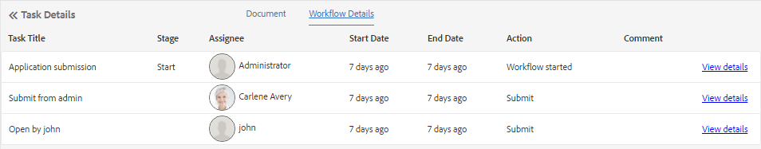

# Gerenciar aplicativos e tarefas do Forms na Caixa de entrada AEM{#manage-forms-applications-and-tasks-in-aem-inbox}

Uma das muitas maneiras de iniciar ou acionar um fluxo de trabalho centrado no Forms é por meio de aplicativos em AEM Caixa de entrada. É necessário criar um aplicativo de fluxo de trabalho para disponibilizar um fluxo de trabalho do Forms como aplicativo na Caixa de entrada. Para obter mais informações sobre o aplicativo de fluxo de trabalho e outras maneiras de iniciar fluxos de trabalho do Forms, consulte [Iniciar um fluxo de trabalho centrado na Forms no OSGi](aem-forms-workflow.md#launch).

Além disso, AEM Caixa de entrada consolida notificações e tarefas de vários componentes de AEM, incluindo workflows do Forms. Quando um fluxo de trabalho de formulários contendo uma etapa de tarefa Atribuir é acionado, o aplicativo associado é listado como uma tarefa na Caixa de entrada do destinatário. Se o destinatário for um grupo, a tarefa aparecerá na Caixa de entrada de todos os membros do grupo até que um indivíduo reivindique ou delegue a tarefa.

A interface do usuário da Caixa de entrada fornece exibições de lista e calendário para visualizar tarefas. Você também pode definir as configurações de exibição. Você pode filtrar tarefas com base em vários parâmetros. Para obter mais informações sobre visualização e filtros, consulte [Sua Caixa de entrada](https://experienceleague.adobe.com/docs/experience-manager-cloud-service/sites/authoring/getting-started/inbox.html#inbox-in-the-header).

Em resumo, a Caixa de entrada permite criar um novo aplicativo e gerenciar tarefas atribuídas.

>[!NOTE]
>
>Você deve ser um membro do [!DNL workflow-users] para poder usar AEM Caixa de entrada.

## Criar aplicativo {#create-application}

1. Vá para AEM Caixa de entrada em https://&#39;[server]:[porta]&#39;/aem/inbox.
1. Na interface da caixa de entrada, toque em **[!UICONTROL Criar > Aplicativo]**. A página Selecionar aplicativo é exibida.
1. Selecione um aplicativo e clique em **[!UICONTROL Criar]**. O formulário adaptável associado ao aplicativo é aberto. Preencha as informações no Formulário adaptável e toque em **[!UICONTROL Enviar]**. Ele inicia o fluxo de trabalho associado e cria uma tarefa na Caixa de entrada do destinatário.

## Gerencie tarefas {#manage-tasks}

Quando um workflow do Forms é acionado e você é um destinatário ou parte do grupo destinatário, uma tarefa é exibida em sua Caixa de entrada. Você pode visualizar os detalhes da tarefa e executar as ações disponíveis na tarefa a partir da Caixa de entrada.

### Solicitar ou delegar tarefas {#claim-or-delegate-tasks}

As tarefas atribuídas a um grupo são exibidas na Caixa de entrada de todos os membros do grupo. Qualquer membro do grupo pode reivindicar essa tarefa ou delegá-la a outro membro do grupo. Para fazer isso:

1. Toque para selecionar a miniatura da tarefa. As opções para abrir ou delegar a tarefa são exibidas na parte superior.

   

1. Faça uma das seguintes opções:

   * Para delegar a tarefa, toque em **[!UICONTROL Delegar]**. A caixa de diálogo Delegar item é aberta. Selecione um usuário, como opção, adicione um comentário e toque em **[!UICONTROL OK]**.

   

   * Para reivindicar a tarefa, toque em **[!UICONTROL Abrir]**. A caixa de diálogo Atribuir a si mesmo é aberta. Toque **[!UICONTROL Continue]** para reivindicar a tarefa. A tarefa reivindicada é exibida com você como o destinatário em sua Caixa de entrada.

   

### Exibir detalhes e executar ações em tarefas {#view-details-and-perform-actions-on-tasks}

Ao abrir uma tarefa, você pode exibir os detalhes da tarefa e executar as ações disponíveis. As ações disponíveis para uma tarefa são definidas na etapa Assign task do workflow associado Forms .

1. Toque para selecionar a miniatura da tarefa. As opções para abrir ou delegar a tarefa selecionada aparecem na parte superior.
1. Toque **Abrir** para exibir detalhes da tarefa e realizar ações. A exibição detalhada da tarefa é aberta. Nesta visualização, você pode exibir detalhes da tarefa e realizar ações na tarefa.

   >[!NOTE]
   >
   >Se uma tarefa for atribuída a um grupo, você deverá reivindicar a abertura da tarefa na exibição detalhada.


A exibição detalhada da tarefa compreende as seguintes seções:

* Detalhes da tarefa
* Formulário
* Detalhes do fluxo de trabalho
* Barra de ferramentas Ações

#### Detalhes da tarefa {#task-details}

A seção Detalhes da tarefa exibe informações sobre a tarefa. As informações exibidas dependem das configurações do [Atribuir etapa da tarefa](https://experienceleague.adobe.com/docs/experience-manager-65/developing/extending-aem/extending-workflows/workflows-step-ref.html#extending-aem) no fluxo de trabalho. O exemplo acima exibe a descrição, o status, a data de início e o workflow usado para a tarefa. Também permite anexar um arquivo à tarefa.

#### Formulário {#form}

A guia Formulário na área de conteúdo principal exibe o formulário enviado e os anexos em nível de campo, se houver.

#### Detalhes do fluxo de trabalho {#workflow-details}

A guia Detalhes do fluxo de trabalho na parte superior mostra o progresso da tarefa em vários estágios no fluxo de trabalho. Ele mostra estágios concluídos, atuais e pendentes para a tarefa. Os estágios de um workflow são definidos na variável [Atribuir etapa da tarefa](https://experienceleague.adobe.com/docs/experience-manager-65/developing/extending-aem/extending-workflows/workflows-step-ref.html#extending-aem) do fluxo de trabalho associado.

Além disso, a guia exibe o histórico de tarefas para cada estágio concluído no fluxo de trabalho. Você pode tocar em **[!UICONTROL Exibir detalhes]** para uma fase concluída, para conhecer os detalhes dessa fase. Ele exibe comentários, anexos de formulário e tarefa, status, datas de início e término e assim por diante sobre a tarefa.


#### Barra de ferramentas Ações {#actions-toolbar}

A barra de ferramentas Ações mostra todas as opções disponíveis para a tarefa. Enquanto Salvar, Redefinir e Delegar são ações padrão, outras ações disponíveis são configuradas em [Atribuir etapa da tarefa](https://experienceleague.adobe.com/docs/experience-manager-65/developing/extending-aem/extending-workflows/workflows-step-ref.html#extending-aem). No exemplo acima, Approve e Reject são configurados no workflow.

À medida que você executa uma ação na tarefa, ela prossegue no fluxo de trabalho.

### Exibir tarefas concluídas {#view-completed-tasks}

AEM Caixa de entrada exibe somente as tarefas ativas. Tarefas concluídas não aparecem na lista. No entanto, você pode usar filtros da Caixa de entrada para filtrar tarefas com base em vários parâmetros, como tipo de tarefa, status, datas de início e término e assim por diante. Para exibir tarefas concluídas:

1. Na Caixa de entrada AEM, toque em  para abrir o seletor de filtro.
1. Toque **[!UICONTROL Status da tarefa]** e selecione **[!UICONTROL Concluído]**. Todas as tarefas concluídas são exibidas.

   

1. Toque para selecionar uma tarefa e clique em **[!UICONTROL Abrir]**.

A tarefa é aberta para exibir o documento ou o Formulário adaptável associado à tarefa. Para o Formulário adaptável, a tarefa exibe o Formulário adaptável somente leitura ou seu Documento de registro do PDF, conforme configurado na guia Formulário/Documento do [Etapa Atribuir fluxo de trabalho da tarefa](https://experienceleague.adobe.com/docs/experience-manager-65/developing/extending-aem/extending-workflows/workflows-step-ref.html#extending-aem).

A seção de detalhes da tarefa exibe informações como ação executada, status da tarefa, data de início e data de término.


O **[!UICONTROL Detalhes do fluxo de trabalho]** mostra cada etapa do fluxo de trabalho. Toque **[!UICONTROL Exibir detalhes]** para obter uma etapa para obter informações detalhadas.



## Resolução de problemas {#troubleshooting-workflows}

### Não é possível exibir itens relacionados ao Fluxo de trabalho AEM AEM caixa de entrada {#unable-to-see-aem-worklow-items}

Um proprietário de modelo de fluxo de trabalho não pode exibir itens relacionados ao Fluxo de trabalho AEM AEM caixa de entrada. Para resolver o problema, adicione os índices listados abaixo ao seu repositório de AEM e recrie o índice.

1. Use um dos seguintes métodos para adicionar índices:

   * Crie os seguintes nós em no CRX DE em `/oak:index/workflowDataLucene/indexRules/granite:InboxItem/properties` com as respectivas propriedades, conforme especificado no quadro seguinte:

      | Nó | Propriedade | Tipo |
      |---|---|---|
      | sharedWith | sharedWith | SEQÜÊNCIA DE CARACTERES |
      | bloqueado | bloqueado | BOOLEANO |
      | retornado | retornado | BOOLEANO |
      | allowInboxSharing | allowInboxSharing | BOOLEANO |
      | allowExplicitSharing | allowExplicitSharing | BOOLEANO |


   * Implante os índices por meio de um pacote de AEM. Você pode usar um [Arquétipo de AEM](https://experienceleague.adobe.com/docs/experience-manager-core-components/using/developing/archetype/overview.html?lang=en) projeto para criar um pacote AEM implantável. Use o código de amostra a seguir para adicionar índices a um projeto AEM Archetype:

   ```Java
      .property("sharedWith", "sharedWith").type(TYPENAME_STRING).propertyIndex()
      .property("locked", "locked").type(TYPENAME_BOOLEAN).propertyIndex()
      .property("returned", "returned").type(TYPENAME_BOOLEAN).propertyIndex()
      .property("allowInboxSharing", "allowInboxSharing").type(TYPENAME_BOOLEAN).propertyIndex()
      .property("allowExplicitSharing", "allowExplicitSharing").type(TYPENAME_BOOLEAN).propertyIndex()
   ```

1. [Criar um Índice de propriedades e defini-lo como verdadeiro](https://experienceleague.adobe.com/docs/experience-manager-65/deploying/deploying/queries-and-indexing.html?lang=en#the-property-index).

1. Após configurar os índices no CRX DE ou implantar por meio de um pacote, [reindexe o repositório](https://helpx.adobe.com/in/experience-manager/kb/HowToCheckLuceneIndex.html#Completelyrebuildtheindex).

