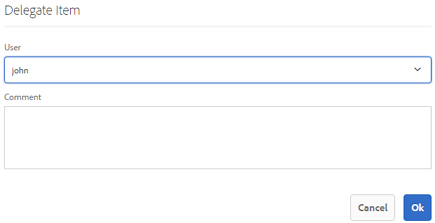
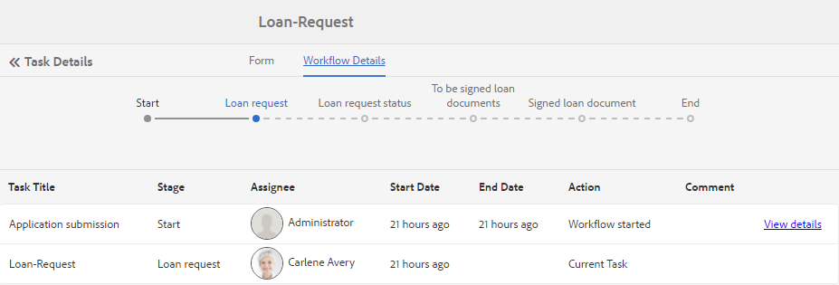

# Gerenciar aplicativos e tarefas do Forms na Caixa de entrada do AEM{#manage-forms-applications-and-tasks-in-aem-inbox}

Uma das muitas maneiras de iniciar ou acionar um fluxo de trabalho centrado no Forms é por meio de aplicativos na Caixa de entrada do AEM. É necessário criar um aplicativo de fluxo de trabalho para disponibilizar um Forms Workflow como um aplicativo na Caixa de entrada. Para obter mais informações sobre o aplicativo de fluxo de trabalho e outras maneiras de iniciar fluxos de trabalho do Forms, consulte [Iniciar um fluxo de trabalho centrado no Forms no OSGi](aem-forms-workflow.md#launch).

Além disso, a Caixa de entrada do AEM consolida notificações e tarefas de vários componentes do AEM, incluindo workflows da Forms. Quando uma Forms Workflow contendo uma etapa Atribuir tarefa é acionada, o aplicativo associado é listado como uma tarefa na Caixa de entrada do destinatário. Se o destinatário for um grupo, a tarefa aparecerá na Caixa de entrada de todos os membros do grupo até que um indivíduo reclame ou delegue a tarefa.

A interface do usuário da Caixa de entrada fornece exibições de lista e calendário para exibir tarefas. Você também pode definir as configurações de exibição. Você pode filtrar tarefas com base em vários parâmetros. Para obter mais informações sobre exibição e filtros, consulte [Sua Caixa de Entrada](https://experienceleague.adobe.com/docs/experience-manager-cloud-service/sites/authoring/getting-started/inbox.html?lang=pt-BR#inbox-in-the-header).

Em resumo, a Caixa de entrada permite criar um aplicativo e gerenciar tarefas atribuídas.

## Aplicabilidade e casos de uso

### Seguros

## O AEM Forms pode rastrear o status de solicitações ou solicitações de seguro?

Sim. Os workflows do AEM Forms permitem que as seguradoras rastreiem o envio e o status de processamento de formulários em diferentes estágios do processo de negócios.

## O AEM Forms oferece suporte a trilhas de auditoria para processos de seguro?

Sim. A AEM Forms oferece suporte à auditoria por meio de histórico de fluxo de trabalho, controles de acesso e logs do sistema, que ajudam as seguradoras a atender às necessidades de auditoria interna e externa.

## Os agentes podem enviar formulários de seguro em nome dos clientes?

Sim. A AEM Forms oferece suporte ao preenchimento de formulários assistidos e por agentes, permitindo que usuários autorizados enviem formulários em nome dos clientes, mantendo a capacidade de auditoria.

>[!NOTE]
>
>Você deve ser membro do grupo [!DNL workflow-users] para poder usar a Caixa de Entrada do AEM.

## Criar aplicativo {#create-application}

1. Vá para a Caixa de Entrada do AEM em https://&#39;[server]:[port]&#39;/aem/inbox.
1. Na interface da Caixa de Entrada, selecione **[!UICONTROL Criar > Aplicativo]**. A página Selecionar Aplicativo é exibida.
1. Selecione um aplicativo e clique em **[!UICONTROL Criar]**. O Formulário adaptável associado ao aplicativo é aberto. Preencha as informações no Formulário adaptável e selecione **[!UICONTROL Enviar]**. Ele inicia o fluxo de trabalho associado e cria uma tarefa na Caixa de entrada do destinatário.

## Gerencie tarefas {#manage-tasks}

Quando um fluxo de trabalho do Forms é acionado e você é um destinatário ou parte do grupo de destinatários, uma tarefa é exibida na Caixa de entrada. Você pode exibir os detalhes da tarefa e executar as ações disponíveis na tarefa de dentro da Caixa de entrada.

### Reclamar ou delegar tarefas {#claim-or-delegate-tasks}

As tarefas atribuídas a um grupo aparecem na Caixa de Entrada de todos os membros do grupo. Qualquer membro do grupo pode reivindicar essa tarefa ou delegá-la a outro membro do grupo. Para fazer isso:

1. Selecione para selecionar a miniatura da tarefa. As opções para abrir ou delegar a tarefa são exibidas na parte superior.

   

1. Siga uma das seguintes opções:

   * Para delegar a tarefa, selecione **[!UICONTROL Delegar]**. A Caixa De Diálogo Delegar Item É Aberta. Selecione um usuário, opcionalmente adicione um comentário e selecione **[!UICONTROL OK]**.

   

   * Para reivindicar a tarefa, selecione **[!UICONTROL Abrir]**. A caixa de diálogo Atribuir a si mesmo é aberta. Selecione **[!UICONTROL Prosseguir]** para declarar a tarefa. A tarefa solicitada aparece com você como o destinatário em sua Caixa de entrada.

   

### Exibir detalhes e executar ações em tarefas {#view-details-and-perform-actions-on-tasks}

Ao abrir uma tarefa, você pode exibir os detalhes da tarefa e executar as ações disponíveis. As ações disponíveis para uma tarefa são definidas na etapa Atribuir tarefa da Forms Workflow associada.

1. Selecione para selecionar a miniatura da tarefa. As opções para abrir ou delegar a tarefa selecionada aparecem na parte superior.
1. Selecione **Abrir** para exibir os detalhes da tarefa e as ações disponíveis. A visualização detalhada da tarefa é aberta. Nesta exibição, é possível exibir detalhes da tarefa e agir em uma tarefa.

   >[!NOTE]
   >
   >Se uma tarefa for atribuída a um grupo, você deverá declará-la para poder abri-la na exibição detalhada.


A exibição de tarefa detalhada compreende as seguintes seções:

* Detalhes da tarefa
* Formulário
* Detalhes do fluxo de trabalho
* Barra de ferramentas Ações

#### Detalhes da tarefa {#task-details}

A seção Detalhes da Tarefa exibe informações sobre a tarefa. As informações exibidas dependem das definições de configuração da [etapa Atribuir tarefa](https://experienceleague.adobe.com/docs/experience-manager-65/developing/extending-aem/extending-workflows/workflows-step-ref.html?lang=pt-BR#extending-aem) no fluxo de trabalho. O exemplo acima exibe a descrição, o status, a data de início e o workflow usado para a tarefa. Também permite anexar um arquivo à tarefa.

#### Formulário {#form}

A guia Form na área de conteúdo principal exibe o formulário enviado e os anexos no nível de campo, se houver.

#### Detalhes do fluxo de trabalho {#workflow-details}

A guia Detalhes do fluxo de trabalho na parte superior mostra o progresso da tarefa em vários estágios no fluxo de trabalho. Ela mostra os estágios concluídos, atuais e pendentes da tarefa. Os estágios de um fluxo de trabalho são definidos na [etapa Atribuir tarefa](https://experienceleague.adobe.com/docs/experience-manager-65/developing/extending-aem/extending-workflows/workflows-step-ref.html?lang=pt-BR#extending-aem) do fluxo de trabalho associado.

Além disso, a guia exibe o histórico da tarefa para cada estágio concluído no workflow. Você pode selecionar **[!UICONTROL Exibir Detalhes]** para um estágio concluído para saber detalhes sobre esse estágio. Ele exibe comentários, anexos de formulário e tarefa, status, datas de início e término e assim por diante, sobre a tarefa.



#### Barra de ferramentas Ações {#actions-toolbar}

A barra de ferramentas Ações mostra todas as opções disponíveis para a tarefa. Enquanto Salvar, Redefinir e Delegar são ações padrão, outras ações disponíveis são configuradas na [etapa Atribuir tarefa](https://experienceleague.adobe.com/docs/experience-manager-65/developing/extending-aem/extending-workflows/workflows-step-ref.html?lang=pt-BR#extending-aem). No exemplo acima, Aprovar e Rejeitar são configurados no workflow.

À medida que você age na tarefa, ela continua mais no fluxo de trabalho.

### Exibir tarefas concluídas {#view-completed-tasks}

A Caixa de entrada do AEM exibe somente tarefas ativas. Tarefas concluídas não aparecem na lista. No entanto, você pode usar filtros da Caixa de entrada para filtrar tarefas com base em vários parâmetros, como tipo de tarefa, status, datas de início e término. Para exibir tarefas concluídas:

1. Na Caixa de Entrada do AEM, selecione  para abrir o seletor de filtros.
1. Selecione a opção **[!UICONTROL Status da tarefa]** e selecione **[!UICONTROL Concluído]**. Todas as tarefas concluídas são exibidas.

   

1. Selecione uma tarefa e clique em **[!UICONTROL Abrir]**.

A tarefa é aberta para exibir o documento ou o Formulário adaptável associado à tarefa. Para o Formulário adaptável, a tarefa exibe o Formulário adaptável somente leitura ou seu Documento de registro do PDF, conforme configurado na guia Formulário/Documento da [etapa de fluxo de trabalho Atribuir tarefa](https://experienceleague.adobe.com/docs/experience-manager-65/developing/extending-aem/extending-workflows/workflows-step-ref.html?lang=pt-BR#extending-aem).

A seção de detalhes da tarefa exibe informações como ação tomada, status da tarefa, data inicial e data final.


A guia **[!UICONTROL Detalhes do Fluxo de Trabalho]** mostra cada etapa do fluxo de trabalho. Selecione **[!UICONTROL Exibir detalhes]** para obter informações detalhadas sobre uma etapa.


## Resolução de problemas {#troubleshooting-workflows}

### Não é possível exibir itens relacionados ao fluxo de trabalho do AEM na Caixa de entrada do AEM {#unable-to-see-aem-worklow-items}

Um proprietário de modelo de fluxo de trabalho não pode exibir itens relacionados ao Fluxo de trabalho do AEM na Caixa de entrada do AEM. Para resolver o problema, adicione os índices listados abaixo ao repositório do AEM e recrie o índice.

1. Use um dos métodos a seguir para adicionar índices:

   * Crie os seguintes nós em no CRX DE em `/oak:index/workflowDataLucene/indexRules/granite:InboxItem/properties` com as respectivas propriedades conforme especificado na tabela a seguir:

     | Nó | Propriedade | Tipo |
     |---|---|---|
     | sharedWith | sharedWith | SEQÜÊNCIA DE CARACTERES |
     | bloqueado | bloqueado | BOOLEANO |
     | retornado | retornado | BOOLEANO |
     | allowInboxSharing | allowInboxSharing | BOOLEANO |
     | allowExplicitSharing | allowExplicitSharing | BOOLEANO |


   * Implante os índices por meio de um pacote do AEM. Você pode usar um projeto do [Arquétipo do AEM](https://experienceleague.adobe.com/docs/experience-manager-core-components/using/developing/archetype/overview.html?lang=pt-BR) para criar um pacote do AEM implantável. Use o código de amostra a seguir para adicionar índices a um projeto do Arquétipo do AEM:

   ```Java
      .property("sharedWith", "sharedWith").type(TYPENAME_STRING).propertyIndex()
      .property("locked", "locked").type(TYPENAME_BOOLEAN).propertyIndex()
      .property("returned", "returned").type(TYPENAME_BOOLEAN).propertyIndex()
      .property("allowInboxSharing", "allowInboxSharing").type(TYPENAME_BOOLEAN).propertyIndex()
      .property("allowExplicitSharing", "allowExplicitSharing").type(TYPENAME_BOOLEAN).propertyIndex()
   ```

1. [Crie um Índice de Propriedade e defina-o como verdadeiro](https://experienceleague.adobe.com/docs/experience-manager-65/deploying/deploying/queries-and-indexing.html?lang=pt-BR#the-property-index).

1. Depois de configurar índices no CRX DE ou implantar por meio de um pacote, reindexe o repositório.
