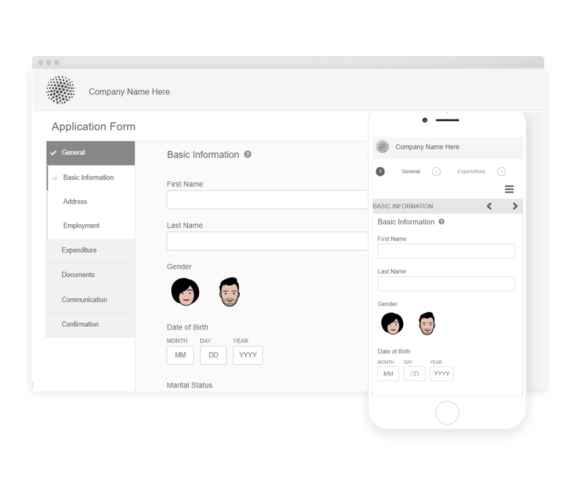

# Temas de referência, modelos e modelos de dados de formulário {#reference-themes-templates-and-data-models}

| Aplica-se a | Link do artigo |
| -------- | ---------------------------- |
| Formulário adaptável com base nos Componentes principais | [Clique aqui](https://experienceleague.adobe.com/docs/experience-manager-core-components/using/adaptive-forms/sample-themes-templates-form-data-models-core-components.html) |
| Formulário adaptável baseado em componentes de base | Este artigo |

>[!NOTE]
>
> A Adobe recomenda usar os [Componentes principais](https://experienceleague.adobe.com/docs/experience-manager-core-components/using/adaptive-forms/introduction.html?lang=pt-BR) de captura de dados moderna e extensível para [criar um novo Forms Adaptável](/help/forms/creating-adaptive-form-core-components.md) ou [adicionar o Forms Adaptável às páginas do AEM Sites](/help/forms/create-or-add-an-adaptive-form-to-aem-sites-page.md). Esses componentes representam um avanço significativo na criação do Forms adaptável, garantindo experiências de usuário impressionantes. Este artigo descreve a abordagem mais antiga para criar o Forms adaptável usando componentes de base.

O AEM Forms as a Cloud Service fornece vários temas de referência, modelos e modelo de dados de formulário (FDM) para ajudar você a começar rapidamente a criar o Adaptive Forms. Você pode baixar o [pacote de conteúdo de referência](https://experience.adobe.com/#/downloads/content/software-distribution/en/aemcloud.html?package=/content/software-distribution/en/details.html/content/dam/aemcloud/public/aem-forms-reference-content.ui.content-2.1.0.zip) do portal de distribuição de softwares e usar o [Gerenciador de Pacotes](/help/implementing/developing/tools/package-manager.md) para instalar o [pacote de conteúdo de referência](https://experience.adobe.com/#/downloads/content/software-distribution/en/aemcloud.html?package=/content/software-distribution/en/details.html/content/dam/aemcloud/public/aem-forms-reference-content.ui.content-2.1.0.zip) no seu ambiente de produção, desenvolvimento ou desenvolvimento local para obter esses ativos de referência para o seu ambiente.

Os temas, modelos e modelo de dados de formulário (FDM) incluídos no pacote de conteúdo de referência são:

| Temas | Modelos | Modelo de dados de formulário (FDM) |
|---------|----------|---------|
| Canvas 3.0 | Básico | Microsoft Dynamics 365 |
| Tranquilo | Em branco | Salesforce |
| Urbana |   |  |
| Ultramarina |  |  |
| Berilo |  |  |
| Serviços de saúde |  |   |
| FSI |   |   |

## Temas de referência {#reference-themes}

[Os temas](/help/forms/themes.md) permitem estilizar os formulários sem um conhecimento profundo de CSS. Você pode obter os seguintes temas instalando o [pacote de conteúdo de referência](https://experience.adobe.com/#/downloads/content/software-distribution/en/aemcloud.html?package=/content/software-distribution/en/details.html/content/dam/aemcloud/public/aem-forms-reference-content.ui.content-2.1.0.zip):

* Berilo
* Canvas 3.0
* Tranquilo
* Urbana
* Ultramarina
* Serviços de saúde
* FSI (Serviços financeiros e seguros)

Cada tema contém um estilo único e elegante que você pode usar para criar formulários adaptáveis deliciosos para seus usuários. Ele contém um estilo exclusivo para seletores, como painel, caixa de texto, caixa numérica, botão de opção, tabela e switch. Os estilos nesses temas são baseados na exigência. Por exemplo, em um cenário específico, você precisa de um tema minimalista com fontes limpas. O tema da liberdade permite que você realize esse olhar.

Os temas incluídos neste pacote são responsivos e o estilo nesses temas é definido para exibições móveis e em desktop. A maioria dos navegadores modernos em uma variedade de dispositivos pode renderizar formulários aplicados com um desses temas sem qualquer problema.

Para obter mais informações sobre como instalar o pacote, consulte [Como trabalhar com pacotes](/help/implementing/developing/tools/package-manager.md).

## Berilo {#beryl}

O tema Beryl enfatiza o uso da imagem de fundo, transparência e ícones grandes e planos. Na captura de tela abaixo, você pode ver como o tema Beryl aparece e como ele pode melhorar o estilo do seu formulário.

## Canvas 3.0 {#canvas}

O Canvas 3.0 é o tema padrão para o Adaptive Forms e enfatiza o uso de cores básicas, transparência e ícones planos. Na captura de tela abaixo, você pode ver a aparência do tema da Tela 3.0.

## Tranquilo {#tranquil}

O tema Tranquil fornece tons claros e escuros do esquema de cores Tranquil para destacar diferentes componentes de um formulário. Por exemplo, botões de opção, painéis e guias obtêm um tom diferente de verde.

## Urbana {#urbane}

O tema Urbane enfatiza uma aparência minimalista e funcional para o seu formulário. Ao aplicar o tema Urbane ao formulário, você pode ver que os componentes são planos. Os painéis têm contornos finos para criar uma aparência moderna.

## Ultramarina {#ultramarine}

O tema ultramarino usa sombras azuis profundas para realçar componentes como guias, painéis, caixas de texto e botões.

## Serviços de saúde {#healthcare}

O tema da área de saúde usa sombras verdes profundas para realçar componentes como guias, painéis, caixas de texto e botões.

## FSI (Serviços financeiros e seguros)

O tema FSI enfatiza uma aparência minimalista e funcional para o formulário. Ao aplicar o tema FSI ao formulário, é possível ver que os componentes do painel são amarelos.

## Modelos de referência {#reference-templates}

[Os modelos](/help/forms/themes.md) permitem definir a estrutura do formulário inicial, o conteúdo e as ações para seus formulários. Você pode obter os seguintes modelos instalando o [pacote de conteúdo de referência](https://experience.adobe.com/#/downloads/content/software-distribution/en/aemcloud.html?package=/content/software-distribution/en/details.html/content/dam/aemcloud/public/aem-forms-reference-content.ui.content-2.1.0.zip):

* Básico
* Em branco

O modelo básico ajuda a criar rapidamente um formulário de inscrição. Você também pode usá-lo para visualizar a funcionalidade dos componentes de base do Forms adaptável. Ele fornece um layout de assistente para a apresentação de dados seção a seção. Use o modelo em branco para começar a criar um Formulário adaptável a partir de uma tela em branco.

## Modelo de dados do formulário de referência (FDM) {#reference-models}

O Forms adaptável pode interagir com os servidores Microsoft Dynamics 365 e Salesforce para ativar fluxos de trabalho de negócios. Por exemplo:

* Grave dados no Microsoft Dynamics 365 e Salesforce no envio do Formulário adaptável.
* Grave dados no Microsoft Dynamics 365 e no Salesforce por meio de entidades personalizadas definidas no Modelo de dados de formulário (FDM) e vice-versa.
* Consulte o servidor Microsoft Dynamics 365 e Salesforce para obter dados e preencher previamente o Forms adaptável.
* Ler dados do servidor Microsoft Dynamics 365 e Salesforce.

Você pode obter o seguinte Modelo de Dados de Formulário (FDM) instalando o [pacote de conteúdo de Referência](https://experience.adobe.com/#/downloads/content/software-distribution/en/aemcloud.html?package=/content/software-distribution/en/details.html/content/dam/aemcloud/public/aem-forms-reference-content.ui.content-2.1.0.zip):

* Microsoft® Dynamics 365
* Salesforce

Para obter informações sobre como usar esses modelos, consulte [Configurar o Microsoft Dynamics 365 e o Salesforce Cloud Services](https://experienceleague.adobe.com/docs/experience-manager-cloud-service/content/forms/integrate/use-form-data-model/configure-msdynamics-salesforce.html?lang=en#configure-dynamics-cloud-service)

## Consulte também {#see-also}

{{see-also}}