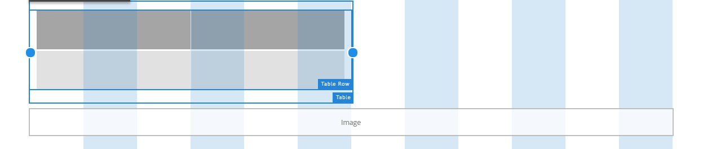

# Usar o modo Layout para redimensionar componentes {#use-layout-mode-to-resize-components}

A interface de criação do Adaptive Form permite redimensionar componentes usando o modo Layout. Arraste pontos azuis dentro de colunas para definir os pontos inicial e final para posicionar os componentes. Os pontos azuis são exibidos após tocar no componente dentro da grade responsiva. A grade responsiva consiste em 12 colunas iguais. O sombreamento de cores branco e azul em colunas alternativas diferencia uma coluna da outra.

Você pode usar o modo Layout para redimensionar componentes para todos os tipos de dispositivos, como desktop, tablet, telefone e outros dispositivos menores. O tablet deriva automaticamente a configuração de layout da versão de desktop e os dispositivos menores derivam a configuração de layout do telefone. No entanto, é possível substituir as configurações derivadas automaticamente para definir uma configuração diferente para cada tipo de dispositivo.

## Modo de layout de acesso {#access-layout-mode}

Selecionar **[!UICONTROL Layout]** na lista suspensa que aparece na parte superior da interface de criação do Formulário adaptável ao lado do **[!UICONTROL Visualizar]** opção. O formulário é exibido no modo Layout .

1. Faça logon no [!DNL Adobe Experience Manager] criar instância e navegar até **[!UICONTROL Adobe Experience Manager]** > **[!UICONTROL Forms]** > **[!UICONTROL Forms &amp; Documents]**.
1. Crie um novo ou abra um [Formulário adaptável](creating-adaptive-form.md).
1. Selecionar **[!UICONTROL Layout]** na lista suspensa que aparece na parte superior ao lado do **[!UICONTROL Visualizar]** opção. O formulário é exibido no modo Layout .

   

## Redimensionar componentes {#resize-components}

1. No modo Layout , toque no componente para redimensionar. Os pontos azuis são exibidos no início e no fim da grade responsiva.
1. Arraste e solte os pontos azuis para definir a posição do componente na grade responsiva.

   

   A barra de ferramentas que é exibida após tocar nos componentes consiste nas seguintes opções:

   * **[!UICONTROL Pai]**: Selecione o pai de um componente.
   * **[!UICONTROL Reverter layout do ponto de interrupção]**: Desfaça todas as alterações de redimensionamento e aplique o layout padrão ao componente.
   * **[!UICONTROL Flutuar para a nova linha]**: Deslocar o componente para a linha seguinte se houver vários componentes na mesma linha.

   Também é possível usar a variável **[!UICONTROL Reverter layout do ponto de interrupção]** ( ) no nível do painel para desfazer todas as alterações de redimensionamento.

   >[!NOTE]
   >
   >Não é possível redimensionar a coluna da tabela, a barra de ferramentas, o botão da barra de ferramentas e os componentes da área de destino usando o modo Layout . Use o modo Estilo para redimensionar esses componentes.

### Exemplo {#example}

**Objetivo:** Você deseja inserir um componente de tabela e um componente de Imagem e posicioná-los paralelos entre si em um formulário adaptável.

1. Insira a tabela e os componentes da imagem usando [!UICONTROL Editar] no formulário adaptável. O componente de imagem é exibido depois do componente de tabela.
1. Mudar para [!UICONTROL Layout] e toque no [!UICONTROL Tabela] componente. Os pontos azuis para redimensionar a exibição do componente nas colunas 1 e 12.
1. Arraste o ponto azul na coluna 12 para a coluna 6 da grade responsiva.

   

1. Da mesma forma, selecione o [!UICONTROL Imagem] e arraste o ponto azul na coluna 1 para a coluna 7 da grade responsiva. Os componentes de tabela e imagem são exibidos em paralelo.

   

   Você pode selecionar o componente Imagem e tocar no componente **[!UICONTROL Flutuar para a nova linha]** opção disponível na barra de ferramentas para deslocar o componente de Imagem para a próxima linha.

## Redimensionar painéis {#resize-panels-layout-mode}

Execute as seguintes etapas se quiser redimensionar todo o painel em vez de componentes individuais:

1. Toque em qualquer um dos componentes no painel que você deseja redimensionar, selecione e selecione a primeira opção na lista suspensa, se o painel for o pai imediato do componente.

   Os pontos azuis são exibidos no início e no fim da grade responsiva.

1. Arraste e solte os pontos azuis para definir a posição do painel na grade responsiva.
Você pode repetir as etapas 1 e 2 e selecionar  para transferir o painel redimensionado para a linha seguinte.

## Definir o layout de várias colunas para um painel

Execute as seguintes etapas para definir o número de colunas para um painel:

1. Em **[!UICONTROL Editar]** , toque no painel , selecione e selecione **[!UICONTROL Responsivo - tudo na página sem navegação]** da **[!UICONTROL Layout do painel]** lista suspensa.

1. Toque  para salvar as propriedades.

1. No **[!UICONTROL Layout]** , toque em qualquer um dos componentes no painel , selecione e selecione o painel .

1. Toque  e selecione o número de colunas na lista suspensa. O número de colunas pode variar de 1 a 12. O painel é dividido em um layout de várias colunas.

## Ativar a nova grade responsiva para layouts responsivos antigos {#enableresponsivegrid}

Ativar a nova grade responsiva para formulários que você criar usando [!DNL Adobe Experience Manager] Forms 6.4 ou versão inferior para redimensionar componentes.

>[!NOTE]
>
>A alternância para a nova grade responsiva descarta as propriedades de layout já definidas para os componentes usados no formulário.

Execute as seguintes etapas para ativar a nova grade responsiva:

1. Selecionar **[!UICONTROL Layout]** na lista suspensa que aparece na parte superior ao lado do **[!UICONTROL Visualizar]** opção. Uma confirmação para ativar o modo Layout é exibida.
1. Toque **[!UICONTROL Sim]** para ativar o **[!UICONTROL Layout]** para o formulário.

### Incorporar um fragmento antigo em um formulário adaptável com um novo layout responsivo {#embed-an-old-fragment-in-an-adaptive-form-with-new-responsive-layout}

O novo layout responsivo para Formulário adaptável permite adicionar um Fragmento de formulário adaptável com o layout responsivo antigo ao formulário. No entanto, o novo layout descarta as propriedades de layout já definidas para os componentes usados no fragmento. Você pode alternar para o modo Layout para definir as propriedades de layout para os componentes usados no fragmento.

### Incorporar um fragmento ao novo layout responsivo em um Formulário adaptável antigo {#embed-a-fragment-with-new-responsive-layout-in-an-old-adaptive-form}

Se um fragmento for incorporado com o novo layout responsivo em um Formulário adaptável com um layout responsivo antigo, o sistema solicitará que você ative o modo Layout do formulário e reincorpore o fragmento.

Para ativar o modo Layout , selecione **[!UICONTROL Layout]** na lista suspensa que aparece na parte superior ao lado do **[!UICONTROL Visualizar]** opção e toque em **[!UICONTROL Sim]** para confirmar. Selecionar **[!UICONTROL Editar]** para reincorporar o fragmento.

## Desativar o modo Layout para formulários com layout responsivo antigo {#disable-layout-mode-for-forms-with-old-responsive-layout}

Você pode desativar o modo Layout para formulários com layout responsivo antigo editando as propriedades do modelo usado no formulário.

Execute as seguintes etapas para desativar o modo Layout :

1. Selecionar **[!UICONTROL Ferramentas]** > **[!UICONTROL Geral]** > **[!UICONTROL Modelos]** e abra o modelo usado no formulário em **[!UICONTROL Editar]** modo.
1. Selecione o Contêiner de formulário no painel esquerdo e toque em **[!UICONTROL Política.]**

   

1. Toque no **[!UICONTROL Configurações de layout]** e selecione **[!UICONTROL Desativar modo de layout]**.
1. Toque  para salvar as propriedades do template.
