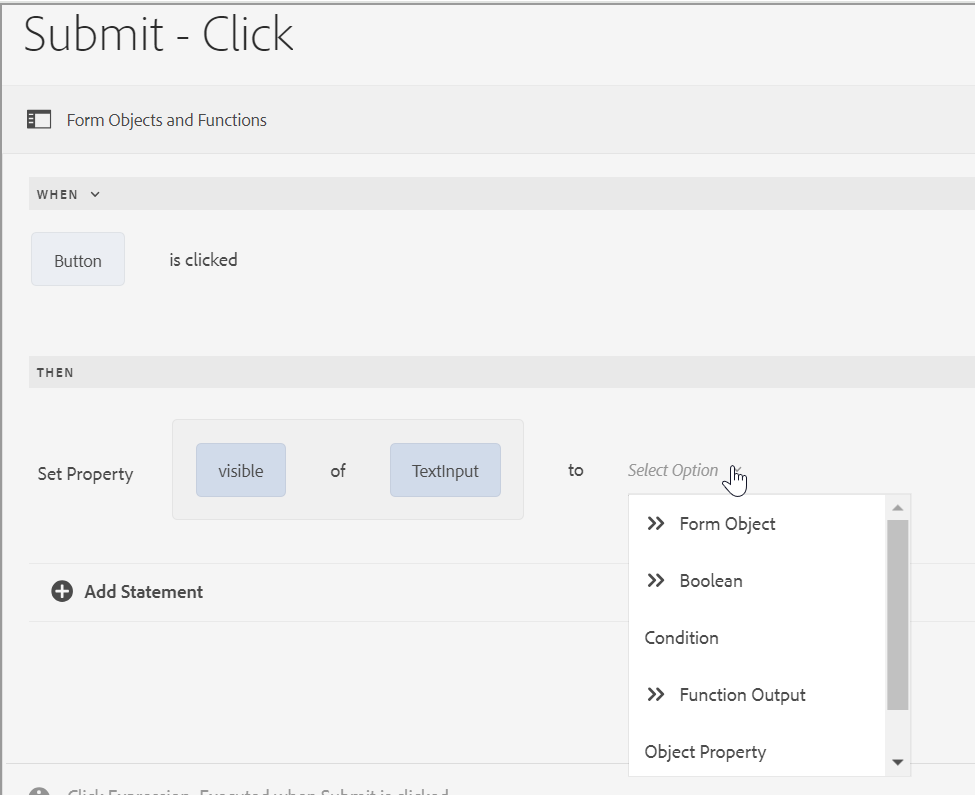

# Tipos de operadores e eventos no editor de regras de um Formulário adaptável com base nos Componentes principais

No AEM Forms as a Cloud, o editor de regras inclui vários tipos de operadores e eventos que permitem definir e executar condições e ações complexas com facilidade.

Os tipos de operador disponíveis no editor de regras de um Formulário adaptável fornecem uma estrutura robusta para a construção de condições precisas. Eles permitem manipular dados, realizar cálculos e combinar várias condições de maneira lógica e coerente. Independentemente de você estar comparando valores, executando operações aritméticas ou manipulando strings, esses operadores garantem que suas regras sejam flexíveis e poderosas.

Os eventos no editor de regras atuam como acionadores que ativam as regras. Eles definem as ações específicas que ocorrem quando determinadas condições são atendidas. Aproveitando diferentes tipos de eventos, você pode automatizar respostas para uma grande variedade de cenários, por exemplo, interações de usuário, horários agendados, alterações nos dados e estados do sistema. Com a capacidade de especificar esses acionadores, você pode criar regras dinâmicas e responsivas que atendam aos seus requisitos específicos.

Ao entender e usar os tipos de operadores e eventos disponíveis, é possível explorar todo o potencial do editor de regras, o que permite criar regras eficientes e eficazes que atendam às suas necessidades exclusivas e melhorem a funcionalidade geral do sistema.

## Tipos de operadores e eventos disponíveis no editor de regras {#available-operator-types-and-events-in-rule-editor}

O editor de regras fornece os seguintes operadores lógicos e eventos com os quais você pode criar regras.

* **É Igual a** - Verifica se um objeto de formulário corresponde a um valor especificado.
* **Não É Igual a** - Verifica se um objeto de formulário não corresponde a um valor especificado.
* **Começa com** - Verifica se um objeto de formulário começa com uma cadeia de caracteres especificada.
* **Termina com** - Verifica se um objeto de formulário termina com uma cadeia de caracteres especificada.
* **Contém** - Verifica se um objeto de formulário inclui uma subcadeia de caracteres especificada.
* **Não Contém** - Verifica se um objeto de formulário não inclui uma subcadeia de caracteres especificada.
* **Está Vazio** - Verifica se um objeto de formulário está vazio ou não foi fornecido.
* **Não Está Vazio** - Verifica se um objeto de formulário está presente e não está vazio.
* **Selecionado** - Retorna verdadeiro quando um usuário seleciona uma caixa de seleção, uma lista suspensa ou uma opção de botão de opção específica.
* **Está Inicializado (evento)** - Retorna verdadeiro quando um objeto de formulário é renderizado no navegador.
* **Is Changed (event)** - Retorna verdadeiro quando um usuário modifica o valor ou a seleção de um objeto de formulário.
* **É Clicado (evento)** - Retorna verdadeiro quando um usuário clica em um objeto de formulário, por exemplo, um botão. Um usuário pode [adicionar várias condições ao clique no botão](/help/forms/rule-editor-core-components-usecases.md#set-focus-to-another-panel-on-button-click-if-the-first-panel-is-valid).
* **É válido** - Verifica se um objeto de formulário atende aos critérios de validação.
* **Não é Válido** - Verifica se um objeto de formulário falha nos critérios de validação.

<!--
* **Navigation(event):** Returns true when the user clicks a navigation object. Navigation objects are used to move between panels. 
* **Step Completion(event):** Returns true when a step of a rule completes.
* **Successful Submission(event):** Returns true on successful submission of data to a form data model.
* **Error in Submission(event):**  Returns true on unsuccessful submission of data to a form data model. -->

### Tipos de regras disponíveis no editor de regras {#available-rule-types-in-rule-editor}

O editor de regras fornece um conjunto de tipos de regras predefinidos que você pode usar para escrever regras. Vamos analisar cada tipo de regra detalhadamente. Para obter mais informações sobre como gravar regras no editor de regras, consulte [Regras de gravação](/help/forms/rule-editor-core-components-user-interface.md#write-rules).

#### [!UICONTROL Quando] {#whenruletype}

O tipo de regra **[!UICONTROL When]** segue a construção de regra **ação-condição-ação-alternativa**, ou, às vezes, apenas a construção **ação-condição**. Nesse tipo de regra, primeiro especifique uma condição para avaliação seguida por uma ação para acionar se a condição for atendida ( `True`). Ao usar o tipo de regra When, você pode usar vários operadores AND e OR para criar [expressões aninhadas](/help/forms/rule-editor-core-components-usecases.md#nested-expressions).

Usando o tipo de regra Quando, é possível avaliar uma condição em um objeto de formulário e executar ações em um ou mais objetos.

Em palavras simples, uma regra When típica é estruturada da seguinte maneira:

`When on Object A:`

`(Condition 1 AND Condition 2 OR Condition 3) is TRUE;`

`Then, do the following:`

`Action 2 on Object B;`
`AND`
`Action 3 on Object C;`

`Else, do the following:`

`Action 2 on Object C;`

Quando você tem um componente de vários valores, como botões de opção ou lista, ao criar uma regra para esse componente, as opções são automaticamente recuperadas e disponibilizadas para o criador da regra. Não é necessário digitar os valores da opção novamente.

Por exemplo, uma lista tem quatro opções: Vermelho, Azul, Verde e Amarelo. Ao criar a regra, as opções (botões de opção) são recuperadas automaticamente e disponibilizadas ao criador da regra da seguinte maneira:

Ao escrever uma regra Quando, é possível acionar a ação Limpar valor de. Limpar valor da ação limpa o valor do objeto especificado. Ter o valor claro de como uma opção na instrução When permite criar condições complexas com vários campos. Você pode adicionar a instrução Else para adicionar outras condições

>[!NOTE]
>
> Quando o tipo de regra suporta apenas instruções then-else de nível único.

##### Vários campos permitidos em [!UICONTROL Quando] {#allowed-multiple-fields}

Na condição **When**, você tem a opção de adicionar outros campos além do campo ao qual a regra é aplicada.

Por exemplo, usando o tipo de regra Quando, é possível avaliar uma condição em diferentes objetos de formulário e executar a ação:

Quando:

(Objeto A Condição 1)

E/OU

(Condição do objeto B 2)

Em seguida, faça o seguinte:

Ação 1 no Objeto A

_

**Considerações ao usar Vários campos permitidos no recurso de condição When**

* Verifique se o componente principal [está definido como versão 3.0.14 ou posterior](https://github.com/adobe/aem-core-forms-components) para usar este recurso no editor de regras.
* Se as regras forem aplicadas a campos diferentes na condição When, a regra será acionada mesmo se apenas um desses campos for alterado.
* Você só pode adicionar vários campos na condição **When** para uma regra **AND**. Não é possível para uma regra **OR**.

>[!NOTE]
>
> Para adicionar várias condições que incluem um clique de botão, verifique se o evento de clique de botão é colocado como a primeira condição. Por exemplo, `When button is clicked AND text input equals '5'` é válido, enquanto `When text input equals '5' AND button is clicked` não é suportado.

<!--
* It is not possible to add multiple fields in the When condition while applying rules to a button.

##### To enable Allowed Multiple fields in When condition feature

Allowed Multiple fields in When condition feature is disabled by default. To enable this feature, add a custom property at the template policy:

1. Open the corresponding template associated with an Adaptive Form in the template editor.
1. Select the existing policy as **formcontainer-policy**.
1. Navigate to the **[!UICONTROL Structure]**  view and, from the **[!UICONTROL Allowed Components]** list, open the **[!UICONTROL Adaptive Forms Container]** policy.
1. Go to the **[!UICONTROL Custom Properties]** tab and to add a custom property, click **[!UICONTROL Add]**.
1. Specify the **Group Name** of your choice. For example, in our case, we added the group name as **allowedfeature**.
1. Add the **key** and **value** pair as follows:
   * key: fd:changeEventBehaviour
   * value: deps
1. Click **[!UICONTROL Done]**. -->

Se os vários campos permitidos no recurso Quando condição encontrarem problemas, siga as etapas de solução de problemas como:

1. Abra o formulário no modo de edição.
1. Abra o Navegador de conteúdo e selecione o componente **[!UICONTROL Contêiner do Guia]** do seu Formulário adaptável.
1. Clique no ícone de propriedades do Guia Contêiner . A caixa de diálogo Contêiner de formulário adaptável é aberta.
1. Clique em Concluído e salve a caixa de diálogo novamente.

**[!UICONTROL Ocultar]** oculta o objeto especificado.

**[!UICONTROL Mostrar]** Mostra o objeto especificado.

**[!UICONTROL Habilitar]** Habilita o objeto especificado.

**[!UICONTROL Desabilitar]** Desabilita o objeto especificado.

**[!UICONTROL Chamar serviço]** Chama um serviço configurado em um modelo de dados de formulário (FDM). Quando você escolhe a operação Chamar Serviço, um campo é exibido. Ao tocar no campo, ele exibe todos os serviços configurados em todos os modelos de dados de formulário (FDM) na instância [!DNL Experience Manager]. Ao escolher um serviço de modelo de dados de formulário, mais campos são exibidos onde você pode mapear objetos de formulário com parâmetros de entrada para o serviço especificado. Você pode mapear os parâmetros de saída por meio da opção de carga útil do evento para o serviço especificado. Você também pode criar regras para lidar com respostas de sucesso e falha da operação Chamar serviço usando o editor de regras.

>[!NOTE]
>
> Para saber mais sobre o serviço Chamar, [clique aqui](/help/forms/invoke-service-enhancements-rule-editor.md).

Consulte a regra de exemplo para chamar os serviços do Modelo de dados de formulário (FDM).

Além do serviço de modelo de dados de formulário, você pode especificar um URL WSDL direto para chamar um serviço Web. No entanto, um serviço de modelo de dados de formulário tem muitos benefícios e a abordagem recomendada para chamar um serviço.

Para obter mais informações sobre como configurar serviços no modelo de dados de formulário (FDM), consulte [[!DNL Experience Manager Forms] Integração de Dados](data-integration.md).

**[!UICONTROL Defina o valor de]** Computes e defina o valor do objeto especificado. Você pode definir o valor do objeto como uma string, o valor de outro objeto, o valor calculado usando uma expressão matemática ou função, o valor de uma propriedade de um objeto ou o valor de saída de um serviço de Modelo de Dados de Formulário configurado. Quando você escolhe a opção de serviço Web, ela exibe todos os serviços configurados em todos os modelos de dados de formulário (FDM) na sua instância [!DNL Experience Manager]. Ao escolher um serviço de modelo de dados de formulário, mais campos são exibidos onde você pode mapear objetos de formulário com parâmetros de entrada e saída para o serviço especificado.

Para obter mais informações sobre como configurar serviços no modelo de dados de formulário (FDM), consulte [[!DNL Experience Manager Forms] Integração de Dados](data-integration.md).

O tipo de regra **[!UICONTROL Definir Propriedade]** permite que você defina o valor de uma propriedade do objeto especificado com base em uma ação de condição. Você pode definir a propriedade como uma das seguintes opções:

* visível (Booleano)
* label.value (String)
* label.visible (Booleano)
* descrição (String)
* ativado (Booleano)
* readOnly (Booleano)
* obrigatório (booleano)
* screenReaderText (Cadeia de caracteres)
* válido (Booleano)
* errorMessage (String)
* padrão (Número, String, Data)
* enumNames (Cadeia de caracteres[])
* chartType (String)

Por exemplo, permite definir regras para mostrar a caixa de texto quando um botão é clicado. Você pode usar uma função personalizada, um objeto de formulário, uma propriedade de objeto ou uma saída de serviço para definir uma regra.

Para definir uma regra com base em uma função personalizada, selecione **[!UICONTROL Saída da Função]** na lista suspensa e arraste e solte uma função personalizada na guia **[!UICONTROL Funções]**. Se a ação da condição for atendida, a caixa de entrada de texto ficará visível.

Para definir uma regra baseada em um objeto de formulário, selecione **[!UICONTROL Objeto de formulário]** na lista suspensa e arraste e solte um objeto de formulário da guia **[!UICONTROL Objetos de formulário]**. Se a ação de condição for atendida, a caixa de entrada de texto ficará visível no Formulário adaptável.

Uma regra Definir propriedade com base em uma propriedade de objeto permite tornar a caixa de entrada de texto visível em um Formulário adaptável com base em outra propriedade de objeto incluída no Formulário adaptável.

A figura a seguir representa um exemplo de ativação dinâmica da caixa de seleção com base na ocultação ou exibição de uma caixa de texto em um Formulário adaptável:

**[!UICONTROL Limpar Valor de]** Limpa o valor do objeto especificado.

**[!UICONTROL Definir Foco]** Define o foco no objeto especificado.

**[!UICONTROL Enviar Formulário]** Envia o formulário.

**[!UICONTROL Redefinir]** Redefine o formulário ou o objeto especificado.

**[!UICONTROL Validar]** Valida o formulário ou o objeto especificado.

**[!UICONTROL Adicionar instância]** Adiciona uma instância do painel ou linha de tabela repetível especificado.

**[!UICONTROL Remover instância]** Remove uma instância do painel ou linha de tabela repetível especificado.

**[!UICONTROL Saída de Função]** Define uma regra baseada em funções predefinidas ou funções personalizadas.

**[!UICONTROL Navegue até]** Navegue até outro Forms adaptável, outros ativos, como imagens ou fragmentos de documentos, ou uma URL externa. <!-- For more information, see [Add button to the Interactive Communication](create-interactive-communication.md#addbuttontothewebchannel). -->

**[!UICONTROL Evento de expedição]** aciona as ações ou comportamentos específicos com base em condições ou eventos predefinidos.

#### [!UICONTROL Definir valor de] {#set-value-of}

O tipo de regra **[!UICONTROL Definir Valor de]** permite que você defina o valor de um objeto de formulário, dependendo se a condição especificada é atendida ou não. O valor pode ser definido como um valor de outro objeto, uma sequência literal, um valor derivado de uma expressão matemática ou de uma função, um valor de uma propriedade de outro objeto ou a saída de um serviço de modelo de dados de formulário. Da mesma forma, você pode verificar uma condição em um componente, string, propriedade ou valores derivados de uma função ou expressão matemática.

O tipo de regra **Definir Valor de** não está disponível para todos os objetos de formulário, como painéis e botões da barra de ferramentas. Uma regra padrão Definir valor de tem a seguinte estrutura:

Defina o valor do Objeto A como:

(Cadeia de caracteres ABC) OU
(propriedade de objeto X do Objeto C) OU
(valor de uma função) OR
(valor de uma expressão matemática) OR
(valor de saída de um serviço de modelo de dados);

Quando (opcional):

(Condição 1 E Condição 2 E Condição 3) é VERDADEIRO;

O exemplo a seguir seleciona o valor de `Question2` como `True` e define o valor de `Result` como `correct`.

Exemplo de regra Definir valor usando o serviço de Modelo de dados de formulário.

#### [!UICONTROL Programa] {#show}

Usando o tipo de regra **[!UICONTROL Mostrar]**, você pode escrever uma regra para mostrar ou ocultar um objeto de formulário com base no fato de uma condição ser atendida ou não. O tipo de regra Mostrar também aciona a ação Ocultar caso a condição não seja atendida ou retorne `False`.

Uma regra típica de exibição está estruturada da seguinte maneira:

`Show Object A;`

`When:`

`(Condition 1 OR Condition 2 OR Condition 3) is TRUE;`

`Else:`

`Hide Object A;`

#### [!UICONTROL Ocultar] {#hide}

Semelhante ao tipo de regra Mostrar, você pode usar o tipo de regra **[!UICONTROL Ocultar]** para mostrar ou ocultar um objeto de formulário com base no fato de uma condição ser atendida ou não. O tipo de regra Ocultar também aciona a ação Mostrar caso a condição não seja atendida ou retorne `False`.

Uma regra típica de Ocultar está estruturada da seguinte maneira:

`Hide Object A;`

`When:`

`(Condition 1 AND Condition 2 AND Condition 3) is TRUE;`

`Else:`

`Show Object A;`

#### [!UICONTROL Habilitar] {#enable}

O tipo de regra **[!UICONTROL Habilitar]** permite habilitar ou desabilitar um objeto de formulário com base no fato de uma condição ser atendida ou não. O tipo de regra Habilitar também aciona a ação Desabilitar caso a condição não seja atendida ou retorne `False`.

Uma regra Enable típica é estruturada da seguinte maneira:

`Enable Object A;`

`When:`

`(Condition 1 AND Condition 2 AND Condition 3) is TRUE;`

`Else:`

`Disable Object A;`

#### [!UICONTROL Desabilitar] {#disable}

Semelhante ao tipo de regra Habilitar, o tipo de regra **[!UICONTROL Desabilitar]** permite habilitar ou desabilitar um objeto de formulário com base no fato de uma condição ser atendida ou não. O tipo de regra Desativar também aciona a ação Ativar caso a condição não seja atendida ou retorne `False`.

Uma regra típica de Desativação está estruturada da seguinte maneira:

`Disable Object A;`

`When:`

`(Condition 1 OR Condition 2 OR Condition 3) is TRUE;`

`Else:`

`Enable Object A;`

#### [!UICONTROL Validar] {#validate}

O tipo de regra **[!UICONTROL Validar]** valida o valor em um campo usando uma expressão. Por exemplo, você pode escrever uma expressão para verificar se a caixa de texto para especificar um nome não contém caracteres especiais ou números.

Uma regra Validate típica é estruturada da seguinte maneira:

`Validate Object A;`

`Using:`

`(Expression 1 AND Expression 2 AND Expression 3) is TRUE;`

>[!NOTE]
>
>Se o valor especificado não estiver em conformidade com a regra Validar, você poderá exibir uma mensagem de validação para o usuário. Você pode especificar a mensagem no campo **[!UICONTROL Mensagem de validação de script]** nas propriedades do componente na barra lateral.

#### [!UICONTROL Navegar entre os painéis]

O tipo de regra **[!UICONTROL Navegar entre os painéis]** permite alternar o foco entre painéis diferentes em um formulário. Por exemplo, é possível criar uma expressão para mover o foco para o próximo painel.

Uma regra típica de **Navegar entre os painéis** para alternar o foco para o próximo painel está estruturada da seguinte maneira:

`Navigate among the panels`

`Shift focus to the next item Object A;`

`When:`

`(Condition 1 OR Condition 2 OR Condition 3) is TRUE;`

Da mesma forma, você pode escrever **Navegar entre a regra de painéis** para alternar o foco para o painel anterior:

`Navigate among the panels`

`Shift focus to the previous item Object A;`

`When:`

`(Condition 1 OR Condition 2 OR Condition 3) is TRUE;`

Para obter mais detalhes sobre como criar uma regra para navegar em um painel, [clique aqui](/help/forms/rule-editor-core-components-usecases.md#navigating-between-panels-using-buttons).

#### [!UICONTROL Chamada de função assíncrona]

 É um recurso de pré-lançamento acessível através do nosso [canal de pré-lançamento](https://experienceleague.adobe.com/pt-br/docs/experience-manager-cloud-service/content/release-notes/prerelease#new-features). 

O tipo de regra **[!UICONTROL Chamada de função assíncrona]** permite que você execute funções assíncronas. Ela permite iniciar uma chamada de função que opera independentemente do thread de execução principal, permitindo que outros processos continuem em execução sem esperar a conclusão da função assíncrona.

Uma regra de chamada de Função assíncrona típica para executar uma função assíncrona está estruturada da seguinte maneira:

`When:`

`(Condition 1 OR Condition 2 OR Condition 3) is TRUE;`

`Async Function call`

`[Callback Function];`

Para obter mais informações sobre como usar a chamada de Função assíncrona no Editor de Regras Visuais, consulte o artigo [Uso de chamadas de função assíncronas no editor de regras](/help/forms/using-async-funct-in-rule-editor.md).

<!--
### [!UICONTROL Set Options Of] {#setoptionsof}

The **[!UICONTROL Set Options Of]** rule type enables you to define rules to add check boxes dynamically to the Adaptive Form. You can use a Form Data Model or a custom function to define the rule.

To define a rule based on a custom function, select **[!UICONTROL Function Output]** from the drop-down list, and drag-and-drop a custom function from the **[!UICONTROL Functions]** tab. The number of checkboxes defined in the custom function are added to the Adaptive Form.

To create a custom function, see [custom functions in rule editor](#custom-functions).

To define a rule based on a form data model:

1. Select **[!UICONTROL Service Output]** from the drop-down list.
1. Select the data model object.
1. Select a data model object property from the **[!UICONTROL Display Value]** drop-down list. The number of checkboxes in the Adaptive Form is derived from the number of instances defined for that property in the database.
1. Select a data model object property from the **[!UICONTROL Save Value]** drop-down list.

 -->

## Próxima etapa

Vamos entender vários [exemplos de um Editor de regras para um Formulário adaptável com base nos Componentes principais](/help/forms/rule-editor-core-components-usecases.md).

## Consulte também

{{see-also-rule-editor}}
