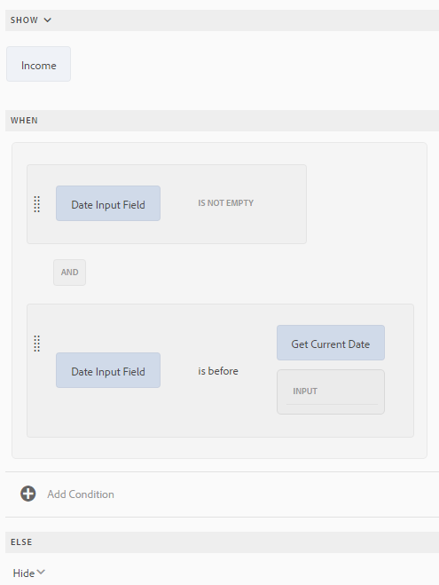

# Diferentes casos de uso do Editor de regras

O artigo fornece exemplos detalhados de um Editor de regras para um Formulário adaptável com base em componentes principais, fornecendo insights sobre sua implementação adequada para diferentes cenários. O editor de regras permite que os desenvolvedores definam e gerenciem a lógica que controla o comportamento dos formulários.
Agora, vamos discutir as diferentes implementações de um editor de regras.

## Defina o foco para outro painel ao clicar no botão se o primeiro painel for válido

 É um recurso de pré-lançamento acessível através do nosso [canal de pré-lançamento](https://experienceleague.adobe.com/pt-br/docs/experience-manager-cloud-service/content/release-notes/prerelease#new-features). 

O editor de regras permite validar os layouts de um painel, como Guias horizontais, Guias verticais, Acordeões ou Assistente para clicar no botão e definir o foco como um objeto de formulário em outro painel. Você pode usar essa funcionalidade para melhorar a navegação do formulário e a experiência do usuário.

Imagine um formulário de aplicativo de várias etapas usando um layout de Assistente. Você deve concluir o painel `Personal Information` antes de passar para `Employment Details`. Ao clicar no botão `Next`, o editor de regras valida o painel `Personal Information`. Se todos os campos obrigatórios forem preenchidos corretamente, o formulário automaticamente mudará o foco para o painel `Employment Details`. Caso contrário, exibirá uma mensagem de erro solicitando que os usuários preencham os campos ausentes.

É possível criar uma regra no botão `Next` para validar o primeiro painel:

{width=50%}

Ao clicar no botão **Avançar**, o painel **Informações Pessoais** é validado. Se os detalhes inseridos estiverem corretos, o foco será deslocado para o painel **Segurança da Conta**; caso contrário, uma mensagem de erro solicitará que você preencha os detalhes ausentes.

>[!VIDEO](https://video.tv.adobe.com/v/3457767)

## Navegar entre painéis usando o botão

O editor de regras permite adicionar botões de navegação aos layouts do painel, como Guias horizontais, Guias verticais, Acordeões ou Assistente. Esses botões melhoram a experiência do usuário simplificando as transições entre diferentes painéis em um formulário, deslocando o foco para o painel selecionado.

Imagine que você esteja interagindo com a seção de configurações de perfil de um aplicativo, onde a navegação é facilitada por botões em vez de guias. Ao inserir as configurações de perfil no painel principal, você encontrará uma série de painéis dedicados a diferentes aspectos do perfil: **Informações Pessoais**, **Segurança de Conta** e **Preferências de Notificação**.

Cada painel contém campos e opções relevantes para a atualização de informações específicas. Os botões de navegação, como `Next` e `Back`, estão posicionados de forma destacada e permitem que você se mova entre esses painéis. Clique em `Next` para avançar o usuário para o painel **Segurança da conta** e clique em `Back` para retornar ao painel **Informações pessoais**. Esse método de navegação garante uma transição contínua entre seções sem perder contexto, fornecendo uma experiência do usuário suave e intuitiva. O uso de botões de navegação simplifica o processo de gerenciamento das configurações de perfil, tornando a interação mais organizada e fácil de usar.

Você pode usar a regra `Navigate among the panels` para criar regras de navegação para botões que permitem alternar entre painéis diferentes.  Selecione o atributo `Shift focus to the next item` para mover o foco para o próximo painel do layout.

{width=50%}

Quando o botão `Next` é clicado, o foco é movido para o painel subsequente no layout.

Da mesma forma, é possível criar uma regra para o botão `Previous` para deslocar o foco para o painel anterior.

{width=50%}

## Simplificar cálculos complexos em painéis repetíveis com funções

O editor de regras permite usar funções prontas para uso, como Sum, Min, Max e Join diretamente em campos dentro de painéis repetíveis. Você também pode passar um valor de campo de painel repetível para a função que aceita matriz de números, matriz de sequência, matriz booleana, etc. Isso libera uma automação eficiente, permitindo que você implemente uma lógica de negócios complexa sem código personalizado.

Imagine um formulário com um painel repetível, em que cada instância do painel coleta informações sobre o valor declarado dos ativos.

Você pode usar a função `Sum` para calcular automaticamente o valor total dos ativos em todos os painéis, eliminando a necessidade de cálculos manuais e reduzindo a possibilidade de erros.

Quando você preenche um formulário, adicionando instâncias para declarar os valores do ativo, o botão `Calculate Asset Value` calcula a soma total de todos os valores do ativo declarados e exibe o resultado no total na caixa de texto `assetvalue`.

>[!NOTE]
>
> Se o valor do campo do painel repetível for passado para uma função que não aceite uma matriz, o valor do campo da última instância do painel repetível será passado para a função.

Este é apenas um exemplo! Explore as [funções](#b-form-objects-and-functions-br) disponíveis para simplificar fluxos de trabalho e melhorar a precisão dos dados em seus formulários.

## Expressões aninhadas {#nestedexpressions}

O editor de regras permite usar vários operadores AND e OR para criar regras aninhadas. É possível misturar vários operadores AND e OR nas regras.

Veja a seguir um exemplo de uma regra aninhada que exibe uma mensagem ao usuário sobre a elegibilidade para a custódia de uma criança quando as condições necessárias são atendidas.

Também é possível arrastar e soltar condições em uma regra para editá-la. Selecione e passe o mouse sobre o identificador ( ) antes de uma condição. Depois que o ponteiro se transformar no símbolo da mão, como mostrado abaixo, arraste e solte a condição em qualquer lugar dentro da regra. A estrutura da regra muda.

## Condições de expressão de data {#dateexpression}

O editor de regras permite usar comparações de datas para criar condições.

O que segue é uma condição de exemplo que exibe um objeto de texto estático se a hipoteca da casa já estiver sendo feita, o que o usuário significa preenchendo o campo de data.

Quando a data de hipoteca do imóvel conforme preenchido pelo usuário estiver no passado, o Formulário adaptável exibirá uma nota sobre o cálculo de renda. A regra a seguir compara a data preenchida pelo usuário com a data atual e, se a data preenchida pelo usuário for anterior à data atual, o formulário exibirá a mensagem de texto (chamada de Receita).

Quando a data de preenchimento for anterior à data atual, o formulário exibirá a mensagem de texto (Receita) como a seguir:

## Condições de comparação de número {#number-comparison-conditions}

O editor de regras permite criar condições que comparam dois números.

A seguir, há uma condição de exemplo que exibe um objeto de texto estático se o número de meses em que um candidato está hospedado no endereço atual for inferior a 36.

Quando o usuário indica que está morando no endereço residencial atual por menos de 36 meses, o formulário exibe uma notificação de que mais prova de residência pode ser solicitada.

<!-- ## Impact of rule editor on existing scripts {#impact-of-rule-editor-on-existing-scripts}

In [!DNL Experience Manager Forms] versions prior to [!DNL Experience Manager 6.1 Forms] feature pack 1, form authors and developers used to write expressions in the Scripts tab of the Edit component dialog to add dynamic behavior to Adaptive Forms. The Scripts tab is now replaced by the rule editor.

Any scripts or expressions that you must have written in the Scripts tab are available in the rule editor. While you cannot view or edit them in visual editor, if you are a part of the forms-power-users group you can edit scripts in code editor. -->

### Invocar serviço de modelo de dados de formulário {#invoke}

Considere um serviço Web `GetInterestRates` que obtém o valor do empréstimo, a estabilidade e a pontuação de crédito do candidato como entrada e retorna um plano de empréstimo incluindo o valor da IME e a taxa de juros. Você cria um Modelo de dados de formulário (FDM) usando o serviço Web como uma fonte de dados. Você adiciona objetos de modelo de dados e um serviço `get` ao modelo de formulário. O serviço aparece na guia Serviços do modelo de dados de formulário (FDM). Em seguida, crie um Formulário adaptável que inclua campos de objetos de modelo de dados para capturar as entradas do usuário para valor do empréstimo, estabilidade e pontuação de crédito. Adicione um botão que aciona o serviço Web para buscar detalhes do plano. A saída é preenchida nos campos apropriados.

A regra a seguir mostra como configurar a ação Chamar serviço para realizar o cenário de exemplo.

>[!NOTE]
>
>Se a entrada for do tipo matriz, os campos compatíveis com matrizes estarão visíveis na seção suspensa Saída.

### Acionamento de várias ações usando a regra Quando {#triggering-multiple-actions-using-the-when-rule}

Em um formulário de solicitação de empréstimo, você deseja registrar se o candidato ao empréstimo é um cliente existente ou não. Com base nas informações fornecidas pelo usuário, o campo ID do cliente deve mostrar ou ocultar. Além disso, é possível definir o foco no campo ID do cliente se o usuário for um cliente existente. O formulário de pedido de empréstimo tem os seguintes componentes:

* Um botão de opção, **[!UICONTROL Você já é cliente do Geometrixx?]**, que fornece as opções [!UICONTROL Sim] e [!UICONTROL Não]. O valor de Sim é **0** e Não é **1**.

* Um campo de texto, **[!UICONTROL ID do cliente do Geometrixx]**, para especificar a ID do cliente.

Quando você escreve uma regra Quando no botão de opção para implementar esse comportamento, a regra é exibida da seguinte maneira no editor visual de regras.

Na regra de exemplo, a instrução na seção When é a condição, que quando retorna True, executa as ações especificadas na seção Then.

<!-- The rule appears as follows in the code editor.

 

Rule in the code editor -->

### Uso de uma saída de função em uma regra {#using-a-function-output-in-a-rule}

Em um formulário de ordem de compra, você tem a tabela a seguir, na qual os usuários preenchem seus pedidos. Nesta tabela:

* A primeira linha pode ser repetida, para que os usuários possam solicitar vários produtos e especificar quantidades diferentes. Seu nome de elemento é `Row1`.
* O título da célula na coluna Quantidade do Produto da linha repetível é Quantidade. O nome do elemento desta célula é `productquantity`.
* A segunda linha da tabela não pode ser repetida e o título da célula na coluna Quantidade do Produto nesta linha é Quantidade Total.

**A.** Linha1 **B.** Quantidade **C.** Quantidade Total

Agora, você deseja adicionar quantidades especificadas na coluna Quantidade do Produto para todos os produtos e exibir a soma na célula Quantidade Total. Você pode obter essa soma gravando uma regra Definir Valor de na célula Quantidade total, como mostrado abaixo.

### Validação de um valor de campo usando expressão {#validating-a-field-value-using-expression}

No form ordem de compra explicado no exemplo anterior, você deseja impedir que o usuário faça pedidos de mais de uma quantidade de qualquer produto com preço superior a 10000. Para fazer essa validação, você pode gravar uma regra Validate como mostrado abaixo.

## Consulte também

{{see-also-rule-editor}}
