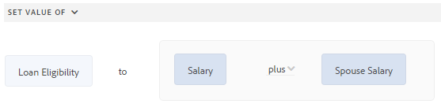

# Interface do usuário do Editor de regras para o Forms adaptável com base nos Componentes principais

A interface do usuário do Editor de regras para o Forms adaptável com base nos Componentes principais melhora o processo de criação de formulários no Adobe Experience Manager (AEM). Ele permite que usuários empresariais e desenvolvedores implementem comportamento dinâmico e lógica complexa em formulários, escrevendo regras que acionam ações com base em condições predefinidas, entradas de usuário e interações. Esse recurso oferece suporte a funcionalidades modernas do JavaScript até ES2022 e oferece um editor visual intuitivo que simplifica o processo de redação de regras.
O Editor de regras é fundamental para simplificar a experiência de preenchimento de formulários, garantindo precisão e eficiência. Ela permite a validação ou a redefinição de painéis e formulários, além da execução de funções personalizadas para calcular valores de objetos de formulário. Com suporte a condições aninhadas e a capacidade de chamar serviços de Modelo de dados de formulário, a interface do usuário do Editor de regras é um componente essencial para criar formulários responsivos, amigáveis e adaptáveis.

## Noções básicas sobre a interface do usuário do editor de regras {#understanding-the-rule-editor-user-interface}

O Editor de regras fornece uma interface de usuário abrangente, mas simples, para gravar e gerenciar regras. É possível iniciar a interface do usuário do editor de regras em um Formulário adaptável no modo de criação.

Para iniciar a interface do usuário do editor de regras:

1. Abra um Formulário adaptável no modo de criação.
1. Selecione o objeto de formulário para o qual deseja gravar uma regra e, na Barra de Ferramentas do Componente, selecione . A interface do usuário do editor de regras é exibida.

   

   Todas as regras existentes nos objetos de formulário selecionados são listadas nessa exibição. Para obter informações sobre como gerenciar regras existentes, consulte [Gerenciar regras](rule-editor.md#p-manage-rules-p).

1. Selecione **[!UICONTROL Criar]** para escrever uma nova regra. O editor visual da interface do usuário do editor de regras é aberto por padrão quando você inicia o editor de regras pela primeira vez.

   

Vamos analisar cada componente da interface do editor de regras em detalhes.

### A. Exibição de componente-regra {#a-component-rule-display}

Exibe o título do objeto de Formulário adaptável pelo qual você iniciou o editor de regras e o tipo de regra selecionado no momento. No exemplo acima, o editor de regras é iniciado de um objeto de Formulário adaptável chamado Pergunta 1, e o tipo de regra selecionado é Quando.

### B. Funções e objetos de formulário {#b-form-objects-and-functions-br}

O painel à esquerda na interface do usuário do editor de regras inclui duas guias: **[!UICONTROL Objetos do Forms]** e **[!UICONTROL Funções]**.

A guia Objetos de formulário mostra uma exibição hierárquica de todos os objetos contidos no formulário adaptável. Ele exibe o título e o tipo dos objetos. Ao escrever uma regra, você pode arrastar e soltar objetos de formulário no editor de regras. Ao criar ou editar uma regra ao arrastar e soltar um objeto ou função em um espaço reservado, o espaço reservado automaticamente assume o tipo de valor apropriado.

Os objetos de formulário que têm uma ou mais regras válidas aplicadas são marcados com um ponto verde. Se alguma das regras aplicadas a um objeto de formulário for inválida, o objeto de formulário será marcado com um ponto amarelo.

A guia Funções inclui um conjunto de funções incorporadas, como Soma de, Mín de, Máx de, Média de, Número de e Validar formulário. Você pode usar essas funções para calcular valores em painéis e linhas de tabela repetíveis e usá-los em declarações de ação e condição ao escrever regras. Entretanto, você também pode criar funções personalizadas.

Algumas das listas de funções são exibidas na figura:


>[!NOTE]
>
>Você pode executar a pesquisa de texto em nomes de objetos e funções e títulos nas guias Objetos e Funções do Forms.

Na árvore esquerda dos objetos de formulário, você pode selecionar os objetos de formulário para exibir as regras aplicadas a cada um dos objetos. Você não só pode navegar pelas regras dos vários objetos de formulário, como também pode copiar e colar regras entre os objetos de formulário. Para obter mais informações, consulte [Copiar-colar regras](rule-editor.md#p-copy-paste-rules-p).

### C. Alternância entre objetos e funções de formulário {#c-form-objects-and-functions-toggle-br}

O botão de alternância, quando tocado, alterna o painel de funções e objetos de formulário.

### D. Editor visual de regras {#visual-rule-editor}

Editor visual de regras é a área no modo editor visual da interface do usuário do editor de regras em que você escreve regras. Ele permite selecionar um tipo de regra e definir adequadamente condições e ações. Ao definir condições e ações em uma regra, você pode arrastar e soltar objetos e funções de formulário do painel Objetos de formulário e Funções.

Para obter mais informações sobre como usar um editor visual de regras, consulte [Regras de gravação](rule-editor.md#p-write-rules-p).
<!-- 
### E. Visual-code editors switcher {#e-visual-code-editors-switcher}

Users in the forms-power-users group can access code editor. For other users, code editor is not available. If you have the rights, you can switch from visual editor mode to code editor mode of the rule editor, and conversely, using the switcher right above the rule editor. When you launch rule editor the first time, it opens in the visual editor mode. You can write rules in the visual editor mode or switch to the code editor mode to write a rule script. However, note that if you modify a rule or write a rule in code editor, you cannot switch back to the visual editor for that rule unless you clear the code editor.

[!DNL Experience Manager Forms] tracks the rule editor mode you used last to write a rule. When you launch the rule editor next time, it opens in that mode. However, you can also configure a default mode to open the rule editor in the specified mode. To do so:

1. Go to [!DNL Experience Manager] web console at `https://[host]:[port]/system/console/configMgr`.
1. Click to edit **[!UICONTROL Adaptive Form Configuration Service]**.
1. choose **[!UICONTROL Visual Editor]** or **[!UICONTROL Code Editor]** from the **[!UICONTROL Default Mode for Rule Editor]** drop-down

1. Click **[!UICONTROL Save]**.
-->

### E. Botões Concluído e Cancelar {#done-and-cancel-buttons}

O botão **[!UICONTROL Concluído]** é usado para salvar uma regra. Você pode salvar uma regra incompleta. No entanto, incompletos são inválidos e não são executados. As regras salvas em um objeto de formulário são listadas na próxima vez que você iniciar o editor de regras a partir do mesmo objeto de formulário. Você pode gerenciar as regras existentes nessa visualização. Para obter mais informações, consulte [Gerenciar regras](rule-editor.md#p-manage-rules-p).

O botão **[!UICONTROL Cancelar]** descarta todas as alterações feitas em uma regra e fecha o editor de regras.

## Regras de gravação {#write-rules}

Você pode escrever regras usando o editor visual de regras <!-- or the code editor. When you launch the rule editor the first time, it opens in the visual editor mode. You can switch to the code editor mode and write rules. However, if you write or modify a rule in code editor, you cannot switch to the visual editor for that rule unless you clear the code editor. When you launch the rule editor next time, it opens in the mode that you used last to create rule. -->

Primeiro, vamos analisar como escrever regras usando um editor visual.

+++ Usando o editor visual {#using-visual-editor}

Vamos entender como criar uma regra em um editor visual usando o seguinte formulário de exemplo.


A seção Requisitos de Empréstimo no formulário de solicitação de empréstimo de exemplo exige que os candidatos especifiquem seu estado civil, salário e, se forem casados, o salário de seus cônjuges. Com base nas entradas do usuário, a regra calcula o valor de qualificação de empréstimo e é exibida no campo Elegibilidade do empréstimo. Aplique as seguintes regras para implementar o cenário:

* O campo Salário do Cônjuge é exibido somente quando o Estado Civil é Casado.
* O valor de qualificação de empréstimo é de 50% do salário total.

Para gravar regras, execute as seguintes etapas:

1. Primeiro, escreva a regra para controlar a visibilidade do campo Salário do Cônjuge com base na opção que o usuário seleciona para o botão de opção Estado Civil.

   Abra o formulário de solicitação de empréstimo no modo de criação. Selecione o componente **[!UICONTROL Estado civil]** e selecione . Em seguida, selecione **[!UICONTROL Criar]** para iniciar o editor de regras.

   

   Ao iniciar o editor de regras, a regra Quando é selecionada por padrão. Além disso, o objeto de formulário (nesse caso, Estado civil) de onde você iniciou o editor de regras é especificado na instrução When.

   Embora não seja possível alterar ou modificar o objeto selecionado, você poderá usar o menu suspenso de regras, como mostrado abaixo, para selecionar outro tipo de regra. Se quiser criar uma regra em outro objeto, selecione Cancelar para sair do editor de regras e iniciá-lo novamente a partir do objeto de formulário desejado.

1. Selecione o menu suspenso **[!UICONTROL Selecionar estado]** e selecione **[!UICONTROL é igual a]**. O campo **[!UICONTROL Inserir uma cadeia de caracteres]** é exibido.

   

1. No campo **[!UICONTROL Inserir uma Cadeia de Caracteres]** na regra, selecione **Casado** no menu suspenso.

   

   Você definiu a condição como `When Marital Status is equal to Married`. Em seguida, defina a ação a ser executada se essa condição for True.

1. Na instrução Then, selecione **[!UICONTROL Mostrar]** no menu suspenso **[!UICONTROL Selecionar Ação]**.

   

1. Arraste e solte o campo **[!UICONTROL Salário do Cônjuge]** da guia Objetos de Formulário no campo **[!UICONTROL Soltar objeto ou selecionar aqui]**. Como alternativa, selecione o campo **[!UICONTROL Soltar objeto ou selecione aqui]** e selecione o campo **[!UICONTROL Salário do Cônjuge]** no menu pop-up, que lista todos os objetos de formulário no formulário.

   

   Em seguida, defina a ação a ser executada se essa condição for False.
1. Clique em **[!UICONTROL Adicionar outra Seção]** para adicionar outra condição ao campo **[!UICONTROL Salário do Cônjuge]**, caso selecione Estado Civil como solteiro.

   


1. Na instrução Else, selecione **[!UICONTROL Ocultar]** no menu suspenso **[!UICONTROL Selecionar Ação]**.
   

1. Arraste e solte o campo **[!UICONTROL Salário do Cônjuge]** da guia Objetos de Formulário no campo **[!UICONTROL Soltar objeto ou selecionar aqui]**. Como alternativa, selecione o campo **[!UICONTROL Soltar objeto ou selecione aqui]** e selecione o campo **[!UICONTROL Salário do Cônjuge]** no menu pop-up, que lista todos os objetos de formulário no formulário.
   

   A regra é exibida da seguinte maneira no editor de regras.

   

1. Selecione **[!UICONTROL Concluído]** para salvar a regra.

<!--
1. Repeat steps 1 through 5 to define another rule to hide the Spouse Salary field if the marital Status is Single. The rule appears as follows in the rule editor.

    -->

>[!NOTE]
>
> Como alternativa, você pode escrever uma regra Mostrar no campo Salário do Cônjuge, em vez de regras Quando no campo Estado Civil, para implementar o mesmo comportamento.


1. Em seguida, escreva uma regra para calcular o valor de qualificação de empréstimo, que é 50% do salário total, e exiba-o no campo Elegibilidade do empréstimo. Para obter este resultado, crie **[!UICONTROL Definir valor de]** regras no campo Qualificação para empréstimo.

   No modo de criação, selecione o campo **[!UICONTROL Qualificação para empréstimo]** e selecione . Em seguida, selecione **[!UICONTROL Criar]** para iniciar o editor de regras.

1. Selecione a regra **[!UICONTROL Definir Valor de]** no menu suspenso de regras.

   

1. Selecione **[!UICONTROL Selecionar Opção]** e selecione **[!UICONTROL Expressão Matemática]**. Um campo para escrever expressão matemática é aberto.

   

1. No campo de expressão:

   * Selecione ou arraste e solte da guia Objeto do Forms o campo **[!UICONTROL Salário]** no primeiro campo **[!UICONTROL Soltar objeto ou selecione aqui]**.

   * Selecione **[!UICONTROL Plus]** no campo **[!UICONTROL Selecionar Operador]**.

   * Selecione ou arraste e solte na guia Objeto do Forms o campo **[!UICONTROL Salário do Cônjuge]** no outro objeto **[!UICONTROL Solte ou selecione aqui]**.

   

1. Em seguida, selecione na área destacada ao redor do campo de expressão e selecione **[!UICONTROL Estender expressão]**.

   

   No campo de expressão estendida, selecione **[!UICONTROL dividido por]** no campo **[!UICONTROL Selecionar Operador]** e **[!UICONTROL Número]** no campo **[!UICONTROL Selecionar Opção]**. Em seguida, especifique **[!UICONTROL 2]** no campo de número.

   

   >[!NOTE]
   >
   >Você pode criar expressões complexas usando componentes, funções, expressões matemáticas e valores de propriedade no campo Selecionar opção.

   Em seguida, crie uma condição, que quando retorna True, a expressão é executada.

1. Selecione **[!UICONTROL Adicionar Condição]** para adicionar uma instrução When.

   

   Na instrução When:

   * Selecione ou arraste e solte na guia Objeto do Forms o campo **[!UICONTROL Estado civil]** no primeiro campo **[!UICONTROL Soltar objeto ou selecione aqui]**.

   * Selecione **[!UICONTROL é igual a]** no campo **[!UICONTROL Selecionar Operador]**.

   * Selecione a string no outro objeto **[!UICONTROL Soltar ou selecione aqui]** e especifique **[!UICONTROL Casado]** no campo **[!UICONTROL Inserir uma string]**.

   A regra finalmente aparece da seguinte maneira no editor de regras.  

1. Selecione **[!UICONTROL Concluído]**. Ele salva a regra.

1. Repita as etapas 7 a 14 para definir outra regra para calcular a elegibilidade do empréstimo se o estado civil for Simples. A regra é exibida da seguinte maneira no editor de regras.

   

Como alternativa, você pode usar a regra Definir Valor de para calcular a elegibilidade do empréstimo na regra Quando criada para mostrar/ocultar o campo Salário do Cônjuge. A regra combinada resultante quando o estado civil é Simples é exibida da seguinte maneira no editor de regras.


Você pode escrever uma regra combinada para controlar a visibilidade do campo Salário do Cônjuge e calcular a elegibilidade para empréstimo quando o estado civil é Casado usando a condição Outro.


+++

### Suporte a funções e expressões matemáticas nos parâmetros de entrada

Agora, os parâmetros de entrada suportam ambas as saídas de função, por exemplo, concat, trim e join, bem como expressões matemáticas. Esse aprimoramento permite que os autores de formulários passem valores calculados dinamicamente diretamente, simplificando as configurações de regras, reduzindo a necessidade de campos adicionais e tornando os formulários mais adaptáveis à lógica complexa e a cenários orientados por cálculo.


### Lidar com regras quebradas

Às vezes, as regras podem quebrar se um campo referenciado for movido ou excluído. Quando isso acontece, o Editor de regras marca a regra afetada com um indicador de ponto vermelho.

* Quando um campo é movido (por exemplo, de um painel para outro), a regra associada pode ser quebrada. Nesse caso, abra a regra e salve-a novamente. A regra é restaurada automaticamente.

* Quando um campo é excluído, a regra não pode ser reparada.

  Para entender o problema, passe o mouse sobre o status da regra no Editor de regras para exibir a mensagem de erro.

  

<!-- ### Using code editor {#using-code-editor}

Users added to the forms-power-users group can use code editor. The rule editor auto generates the JavaScript code for any rule you create using visual editor. You can switch from visual editor to the code editor to view the generated code. However, if you modify the rule code in the code editor, you cannot switch back to the visual editor. If you prefer writing rules in code editor rather than visual editor, you can write rules afresh in the code editor. The visual-code editors switcher helps you switch between the two modes.

The code editor JavaScript is the expression language of Adaptive Forms. All the expressions are valid JavaScript expressions and use Adaptive Forms scripting model APIs. These expressions return values of certain types. For the complete list of Adaptive Forms classes, events, objects, and public APIs, see [JavaScript Library API reference for Adaptive Forms](https://helpx.adobe.com/br/experience-manager/6-5/forms/javascript-api/index.html).

For more information about guidelines to write rules in the code editor, see [Adaptive Form Expressions](adaptive-form-expressions.md).

While writing JavaScript code in the rule editor, the following visual cues help you with the structure and syntax:

* Syntax highlights

* Auto Indentation

* Hints and suggestions for Form objects, functions, and their properties

* Auto completion of form component names and common JavaScript functions


-->

### Funções personalizadas no editor de regras {#custom-functions}

Além das funções prontas para uso como *Soma de* que estão listadas em **Saída de Funções**, você também pode usar funções personalizadas no editor de regras. O editor de regras é compatível com a sintaxe do JavaScript ECMAScript 2019 para scripts e funções personalizadas. Para obter instruções sobre como criar funções personalizadas, consulte o artigo [Funções personalizadas no Adaptive Forms](/help/forms/create-and-use-custom-functions.md).

<!--

Ensure that the function you write is accompanied by the `jsdoc` above it. Adaptive Form supports the various [JavaScript annotations for custom functions](/help/forms/create-and-use-custom-functions.md#js-annotations).

For more information, see [jsdoc.app](https://jsdoc.app/).

Accompanying `jsdoc` is required:

* If you want custom configuration and description
* Because there are multiple ways to declare a function in `JavaScript,` and comments let you keep a track of the functions.

Supported `jsdoc` tags:

* **Private**
  Syntax: `@private`
  A private function is not included as a custom function.

* **Name**
  Syntax: `@name funcName <Function Name>`
  Alternatively `,` you can use: `@function funcName <Function Name>` **or** `@func` `funcName <Function Name>`.
  `funcName` is the name of the function (no spaces allowed).
  `<Function Name>` is the display name of the function.

* **Parameter**
  Syntax: `@param {type} name <Parameter Description>`
  Alternatively, you can use: `@argument` `{type} name <Parameter Description>` **or** `@arg` `{type}` `name <Parameter Description>`.
  Shows parameters used by the function. A function can have multiple parameter tags, one tag for each parameter in the order of occurrence.
  `{type}` represents parameter type. Allowed parameter types are:

    1. string
    2. number
    3. boolean
    4. scope
    5. string[]
    6. number[]
    7. boolean[]
    8. date
    9. date[]
    10. array
    11. object

   `scope` refers to a special globals object which is provided by forms runtime. It must be the last parameter and is not be visible to the user in the rule editor. You can use scope to access readable form and field proxy object to read properties, event which triggered the rule and a set of functions to manipulate the form.

   `object` type is used to pass readable field object in parameter to a custom function instead of passing the value.

   All parameter types are categorized under one of the above. None is not supported. Ensure that you select one of the types above. Types are not case-sensitive. Spaces are not allowed in the parameter name.  Parameter description can have multiple words.

* **Optional Parameter**
Syntax: `@param {type=} name <Parameter Description>` 
Alternatively, you can use: `@param {type} [name] <Parameter Description>`
By default all parameters are mandatory. You can mark a parameter optional by adding `=` in type of the parameter or by putting param name in square brackets.
   
   For example, let us declare `Input1` as optional parameter:
    * `@param {type=} Input1`
    * `@param {type} [Input1]`

* **Return Type**
  Syntax: `@return {type}`
  Alternatively, you can use `@returns {type}`.
  Adds information about the function, such as its objective.
  {type} represents the return type of the function. Allowed return types are:

    1. string
    2. number
    3. boolean
    4. string[]
    5. number[]
    6. boolean[]
    7. date
    8. date[]
    9. array
    10. object

  All other return types are categorized under one of the above. None is not supported. Ensure that you select one of the types above. Return types are not case-sensitive.

**Adding a custom function**

For example, you want to add a custom function which calculates area of a square. Side length is the user input to the custom function, which is accepted using a numeric box in your form. The calculated output is displayed in another numeric box in your form. To add a custom function, you have to first create a client library, and then add it to the CRX repository.

To create a client library and add it in the CRX repository, perform the following steps:

1. Create a client library. For more information, see [Using Client-Side Libraries](https://experienceleague.adobe.com/docs/experience-manager-cloud-service/implementing/developing/full-stack/clientlibs.html?lang=pt-BR#developing).
2. In CRXDE, add a property `categories`with string type value as `customfunction` to the `clientlib` folder.

   >[!NOTE]
   >
   >`customfunction`is an example category. You can choose any name for the category you create in the `clientlib`folder.

After you have added your client library in the CRX repository, use it in your Adaptive Form. It lets you use your custom function as a rule in your form. To add the client library in your Adaptive Form, perform the following steps:

1. Open your form in edit mode.
   To open a form in edit mode, select a form and select **[!UICONTROL Open]**.
1. In the edit mode, select a component, then select  &gt; **[!UICONTROL Adaptive Form Container]**, and then select .
1. In the sidebar, under Name of Client Library, add your client library. ( `customfunction` in the example.)

   

1. Select the input numeric box, and select  to open the rule editor.
1. Select **[!UICONTROL Create Rule]**. Using options shown below, create a rule to save the squared value of the input in the Output field of your form.

   [](assets/add-custom-rule.png)
  
1. Select **[!UICONTROL Done]**. Your custom function is added.

   >[!NOTE]
   >
   > To invoke a form data model from rule editor using custom functions, [see here](/help/forms/using-form-data-model.md#invoke-services-in-adaptive-forms-using-rules-invoke-services). 

#### Function declaration supported types {#function-declaration-supported-types}

**Function Statement**

```javascript
function area(len) {
    return len*len;
}
```

This function is included without `jsdoc` comments.

**Function Expression**

```javascript
var area;
//Some codes later
/** */
area = function(len) {
    return len*len;
};
```

**Function Expression and Statement**

```javascript
var b={};
/** */
b.area = function(len) {
    return len*len;
}
```

**Function Declaration as Variable**

```javascript
/** */
var x1,
    area = function(len) {
        return len*len;
    },
    x2 =5, x3 =true;
```

Limitation: custom function picks only the first function declaration from the variable list, if together. You can use function expression for every function declared.

**Function Declaration as Object**

```javascript
var c = {
    b : {
        /** */
        area : function(len) {
            return len*len;
        }
    }
};
```

>[!NOTE]
>
>Ensure that you use `jsdoc` for every custom function. Although `jsdoc`comments are encouraged, include an empty `jsdoc`comment to mark your function as custom function. It enables default handling of your custom function.
-->

## Gerenciar regras {#manage-rules}

Todas as regras existentes em um objeto de formulário são listadas ao selecionar o objeto e selecionar . É possível exibir o título e uma pré-visualização do resumo da regra. Além disso, a interface do permite expandir e exibir o resumo completo da regra, alterar a ordem das regras, editar regras e excluir regras.


Você pode executar as seguintes ações nas regras:

* **Expandir/Recolher**: a coluna Conteúdo da lista de regras exibe o conteúdo da regra. Se o conteúdo inteiro da regra não estiver visível no modo de exibição padrão, selecione  para expandi-lo.

* **Reordenar**: qualquer nova regra criada é empilhada na parte inferior da lista de regras. As regras são executadas de cima para baixo. A regra na parte superior é executada primeiro, seguida por outras regras do mesmo tipo. Por exemplo, se você tiver as regras When, Show, Enable e When na primeira, segunda, terceira e quarta posições da parte superior, respectivamente, a regra When na parte superior será executada primeiro, seguida pela regra When na quarta posição. Em seguida, as regras Show e Enable são executadas.
Você pode alterar a ordem de uma regra tocando em  ou arrastando-a e soltando-a na ordem desejada na lista.

* **Editar**: para editar uma regra, marque a caixa de seleção ao lado do título da regra. São exibidas opções para editar e excluir a regra. Selecione **[!UICONTROL Editar]** para abrir a regra selecionada no editor de regras.

* **Excluir**: para excluir uma regra, selecione a regra e selecione **[!UICONTROL Excluir]**.

* **Habilitar/Desabilitar**: quando é necessário suspender temporariamente o uso de uma regra, você pode selecionar uma ou mais regras e selecionar **[!UICONTROL Desabilitar]** na barra de ferramentas Ações para desabilitá-las. Se uma regra estiver desativada, ela não será executada no tempo de execução. Para habilitar uma regra que esteja desabilitada, você pode selecioná-la e selecionar Habilitar na barra de ferramentas de ações. A coluna de status da regra exibe se a regra está ativada ou desativada.


## Copiar e colar regras {#copy-paste-rules}

É possível copiar e colar uma regra de um campo para outros campos semelhantes para economizar tempo.

Para copiar e colar regras, faça o seguinte:

1. Selecione o objeto de formulário do qual deseja copiar uma regra e, na barra de ferramentas do componente, selecione . A interface do usuário do editor de regras é exibida com o objeto de formulário selecionado e as regras existentes são exibidas.

   

   Para obter informações sobre como gerenciar regras existentes, consulte [Gerenciar regras](rule-editor.md#p-manage-rules-p).

1. Marque a caixa de seleção ao lado do título da regra. As opções para gerenciar a regra são exibidas. Selecione **[!UICONTROL Copiar]**.

   

1. Selecione outro objeto de formulário no qual você deseja colar a regra e selecione **[!UICONTROL Colar]**. Além disso, você pode editar a regra para alterá-la.

   >[!NOTE]
   >
   >Você só poderá colar uma regra em outro objeto de formulário se esse objeto der suporte ao evento da regra copiada. Por exemplo, um botão oferece suporte ao evento click. É possível colar uma regra com um evento de clique em um botão, mas não em uma caixa de seleção.

1. Selecione **[!UICONTROL Concluído]** para salvar a regra.

## Próxima etapa

Para entender os vários tipos de operadores e eventos no editor de regras de um Formulário adaptável, consulte o artigo [Tipos de Operadores e Eventos Disponíveis no Editor de Regras de um Formulário adaptável](/help/forms/rule-editor-core-components-events-operators.md).


## Consulte também

{{see-also-rule-editor}}
