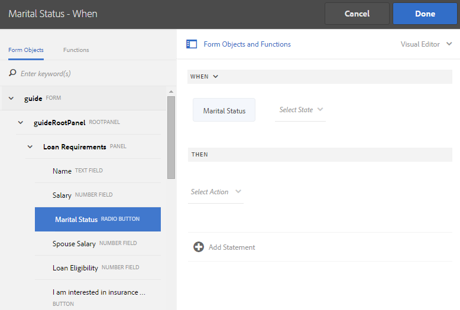

# Adicionar regras a um Formulário adaptável {#adaptive-forms-rule-editor}

>[!NOTE]
>
> A Adobe recomenda usar os [Componentes principais](https://experienceleague.adobe.com/docs/experience-manager-core-components/using/adaptive-forms/introduction.html?lang=pt-BR) de captura de dados moderna e extensível para [criar um novo Forms Adaptável](/help/forms/creating-adaptive-form-core-components.md) ou [adicionar o Forms Adaptável às páginas do AEM Sites](/help/forms/create-or-add-an-adaptive-form-to-aem-sites-page.md). Esses componentes representam um avanço significativo na criação do Forms adaptável, garantindo experiências de usuário impressionantes. Este artigo descreve a abordagem mais antiga para criar o Forms adaptável usando componentes de base.

| Versão | Link do artigo |
| -------- | ---------------------------- |
| AEM as a Cloud Service (Componentes de base) | Este artigo |
| AEM as a Cloud Service (Componentes principais) | [Clique aqui](/help/forms/rule-editor-core-components.md) |
| AEM 6.5 | [Clique aqui](https://experienceleague.adobe.com/docs/experience-manager-65/forms/adaptive-forms-advanced-authoring/rule-editor.html) |

## Visão geral {#overview}

O recurso do editor de regras permite que usuários e desenvolvedores de negócios de formulários gravem regras em objetos de Formulário adaptável. Essas regras definem as ações a serem acionadas nos objetos de formulário com base nas condições predefinidas, entradas do usuário e ações do usuário no formulário. Isso ajuda a simplificar ainda mais a experiência de preenchimento de formulário, garantindo precisão e velocidade.

O editor de regras fornece uma interface de usuário intuitiva e simplificada para escrever regras. O editor de regras oferece um editor visual para todos os usuários.<!-- In addition, only for forms power users, rule editor provides a code editor to write rules and scripts. --> Algumas das ações-chave que você pode executar em objetos de Formulário adaptável usando regras são:

* Mostrar ou ocultar um objeto
* Habilitar ou desabilitar um objeto
* Definir um valor para um objeto
* Validar o valor de um objeto
* Executar funções para calcular o valor de um objeto
* Chamar um serviço de modelo de dados de formulário e executar uma operação
* Definir a propriedade de um objeto

<!-- Rule editor replaces the scripting capabilities in [!DNL Experience Manager 6.1 Forms] and earlier releases. However, your existing scripts are preserved in the new rule editor. For more information about working with existing scripts in the rule editor, see [Impact of rule editor on existing scripts](rule-editor.md#p-impact-of-rule-editor-on-existing-scripts-p). -->

Os usuários adicionados ao grupo forms-power-users podem criar scripts e editar os existentes. Os usuários do grupo [!DNL forms-users] podem usar os scripts, mas não podem criá-los ou editá-los.

## Diferença entre o Editor de regras nos Componentes principais e o Editor de regras nos Componentes de base

{{rule-editor-diff}}

## Noções básicas sobre uma regra {#understanding-a-rule}

Uma regra é uma combinação de ações e condições. No editor de regras, as ações incluem atividades como ocultar, mostrar, habilitar, desabilitar ou calcular o valor de um objeto em um formulário. As condições são expressões booleanas que são avaliadas executando verificações e operações no estado, valor ou propriedade de um objeto de formulário. As ações são executadas com base no valor ( `True` ou `False`) retornado pela avaliação de uma condição.

O editor de regras fornece um conjunto de tipos de regras predefinidos, como Quando, Mostrar, Ocultar, Ativar, Desativar, Definir valor de e Validar, para ajudá-lo a escrever regras. Cada tipo de regra permite definir condições e ações em uma regra. O documento explica detalhadamente cada tipo de regra.

Uma regra normalmente segue uma das seguintes construções:

**Condition-Action** Nesta construção, uma regra primeiro define uma condição seguida por uma ação a ser acionada. A construção é comparável à instrução if-then em linguagens de programação.

No editor de regras, o tipo de regra **When** impõe a construção de condição-ação.

**Condição-ação** Nesta construção, uma regra primeiro define uma ação a ser acionada seguida por condições para avaliação. Outra variação dessa construção é ação-condição-ação alternativa, que também define uma ação alternativa a ser acionada se a condição retornar Falso.

Os tipos de regras Mostrar, Ocultar, Ativar, Desativar, Definir valor de e Validar no editor de regras impõem a construção de regra de condição de ação. Por padrão, a ação alternativa para Mostrar é Ocultar, e para Habilitar é Desabilitar e o oposto. Não é possível alterar a ação alternativa padrão.

>[!NOTE]
>
>Os tipos de regras disponíveis, incluindo condições e ações definidas no editor de regras, também dependem do tipo de objeto de formulário no qual você está criando uma regra. O editor de regras exibe somente tipos de regras válidos e opções para gravar instruções de condição e ação para um determinado tipo de objeto de formulário. Por exemplo, você não vê os tipos de regras Validar, Definir valor de, Ativar e Desativar para um objeto de painel.

Para obter mais informações sobre tipos de regras disponíveis no editor de regras, consulte [Tipos de regras disponíveis no editor de regras](rule-editor.md#p-available-rule-types-in-rule-editor-p).

### Diretrizes para a escolha de uma construção de regra {#guidelines-for-choosing-a-rule-construct}

Embora seja possível obter a maioria dos casos de uso usando qualquer construção de regra, veja a seguir algumas diretrizes para escolher uma construção em vez de outra. Para obter mais informações sobre as regras disponíveis no editor de regras, consulte [Tipos de regras disponíveis no editor de regras](rule-editor.md#p-available-rule-types-in-rule-editor-p).

* Uma regra prática comum ao criar uma regra é pensar nela no contexto do objeto no qual você está escrevendo uma regra. Considere que deseja ocultar ou mostrar o campo B com base no valor especificado por um usuário no campo A. Nesse caso, você está avaliando uma condição no campo A e, com base no valor retornado, aciona uma ação no campo B.

  Portanto, se estiver gravando uma regra no campo B (o objeto no qual você está avaliando uma condição), use a construção de condição-ação ou o tipo de regra When. Da mesma forma, use a construção action-condition ou o tipo de regra Mostrar ou Ocultar no campo A.

* Às vezes, você deve executar várias ações com base em uma condição. Nesses casos, é recomendável usar a construção condição-ação. Nesta construção, você pode avaliar uma condição uma vez e especificar várias instruções de ação.

  Por exemplo, para ocultar os campos B, C e D com base na condição que verifica o valor especificado por um usuário no campo A, grave uma regra com construção de condição-ação ou Quando tipo de regra no campo A e especifique ações para controlar a visibilidade dos campos B, C e D. Caso contrário, você precisará de três regras separadas nos campos B, C e D, em que cada regra verifica a condição e mostra ou oculta o respectivo campo. Neste exemplo, é mais eficiente escrever o tipo de regra Quando em um objeto do que Mostrar ou Ocultar em três objetos.

* Para acionar uma ação com base em várias condições, é recomendável usar a construção action-condition. Por exemplo, para mostrar e ocultar o campo A avaliando as condições nos campos B, C e D, use Mostrar ou Ocultar tipo de regra no campo A.
* Use a construção de condição-ação ou condição de ação se a regra contiver uma ação para uma condição.
* Se uma regra verificar uma condição e executar uma ação imediatamente ao fornecer um valor em um campo ou ao sair de um campo, é recomendável gravar uma regra com construção de condição-ação ou o tipo de regra Quando no campo em que a condição é avaliada.
* A condição na regra Quando é avaliada quando um usuário altera o valor do objeto no qual a regra Quando é aplicada. No entanto, se você quiser que a ação seja acionada quando o valor for alterado no lado do servidor, como para preencher previamente o valor, é recomendável gravar uma regra When que aciona a ação quando o campo é inicializado.
* Ao escrever regras para objetos de menus suspensos, botões de opção ou caixas de seleção, as opções ou os valores desses objetos de formulário no formulário são preenchidos previamente no editor de regras.

## Tipos de operadores e eventos disponíveis no editor de regras {#available-operator-types-and-events-in-rule-editor}

O editor de regras fornece os seguintes operadores lógicos e eventos com os quais você pode criar regras.

* **É Igual A**
* **Não É Igual A**
* **Começa com**
* **Termina com**
* **Contém**
* **Está Vazio**
* **Não Está Vazio**
* **Selecionado:** Retorna verdadeiro quando o usuário seleciona uma opção específica para uma caixa de seleção, lista suspensa, botão de opção.
* **Inicializado (evento):** Retorna verdadeiro quando um objeto de formulário é renderizado no navegador.
* **Está Alterado (evento):** Retorna verdadeiro quando o usuário altera o valor inserido ou a opção selecionada para um objeto de formulário.
* **Navegação(evento):** Retorna verdadeiro quando o usuário clica em um objeto de navegação. Os objetos de navegação são usados para se mover entre painéis.
* **Conclusão de etapa(evento):** Retorna verdadeiro quando uma etapa de uma regra é concluída.
* **Envio com Êxito(evento):** Retorna verdadeiro quando os dados são enviados com êxito para um modelo de dados de formulário.
* **Erro no Envio(evento):** Retorna verdadeiro no envio malsucedido de dados para um modelo de dados de formulário.

## Tipos de regras disponíveis no editor de regras {#available-rule-types-in-rule-editor}

O editor de regras fornece um conjunto de tipos de regras predefinidos que você pode usar para escrever regras. Vamos analisar cada tipo de regra detalhadamente. Para obter mais informações sobre como gravar regras no editor de regras, consulte [Regras de gravação](rule-editor.md#p-write-rules-p).

### [!UICONTROL Quando] {#whenruletype}

O tipo de regra **[!UICONTROL When]** segue a construção de regra **ação-condição-ação-alternativa**, ou, às vezes, apenas a construção **ação-condição**. Nesse tipo de regra, primeiro especifique uma condição para avaliação seguida por uma ação para acionar se a condição for atendida ( `True`). Ao usar o tipo de regra When, você pode usar vários operadores AND e OR para criar [expressões aninhadas](#nestedexpressions).

Usando o tipo de regra Quando, é possível avaliar uma condição em um objeto de formulário e executar ações em um ou mais objetos.

Em palavras simples, uma regra When típica é estruturada da seguinte maneira:

`When on Object A:`

`(Condition 1 AND Condition 2 OR Condition 3) is TRUE;`

`Then, do the following:`

Ação 2 sobre o objeto B;
E
Ação 3 sobre o objeto C;

_

Quando você tem um componente de vários valores, como botões de opção ou lista, ao criar uma regra para esse componente, as opções são automaticamente recuperadas e disponibilizadas para o criador da regra. Não é necessário digitar os valores da opção novamente.

Por exemplo, uma lista tem quatro opções: Vermelho, Azul, Verde e Amarelo. Ao criar a regra, as opções (botões de opção) são recuperadas automaticamente e disponibilizadas ao criador da regra da seguinte maneira:


Ao escrever uma regra Quando, é possível acionar a ação Limpar valor de. Limpar valor da ação limpa o valor do objeto especificado. Ter o valor claro de como uma opção na instrução When permite criar condições complexas com vários campos.


**[!UICONTROL Ocultar]** oculta o objeto especificado.

**[!UICONTROL Mostrar]** Mostra o objeto especificado.

**[!UICONTROL Habilitar]** Habilita o objeto especificado.

**[!UICONTROL Desabilitar]** Desabilita o objeto especificado.

**[!UICONTROL Chamar serviço]** Chama um serviço configurado em um modelo de dados de formulário (FDM). Quando você escolhe a operação Chamar Serviço, um campo é exibido. Ao tocar no campo, ele exibe todos os serviços configurados em todos os modelos de dados de formulário (FDM) na instância [!DNL Experience Manager]. Ao escolher um serviço de Modelo de dados de formulário (FDM), mais campos são exibidos onde você pode mapear objetos de formulário com parâmetros de entrada e saída para o serviço especificado. Consulte exemplo de regra para chamar serviços de Modelo de dados de formulário.

Além do serviço de modelo de dados de formulário, você pode especificar um URL WSDL direto para chamar um serviço Web. No entanto, um serviço de modelo de dados de formulário tem muitos benefícios e a abordagem recomendada para chamar um serviço.

Para obter mais informações sobre como configurar serviços no modelo de dados de formulário (FDM), consulte [[!DNL Experience Manager Forms] Integração de Dados](data-integration.md).

**[!UICONTROL Defina o valor de]** Computes e defina o valor do objeto especificado. Você pode definir o valor do objeto como uma string, o valor de outro objeto, o valor calculado usando a expressão matemática ou a função, o valor de uma propriedade de um objeto ou o valor de saída de um serviço de Modelo de Dados de Formulário configurado. Quando você escolhe a opção de serviço Web, ela exibe todos os serviços configurados em todos os modelos de dados de formulário (FDM) na sua instância [!DNL Experience Manager]. Ao escolher um serviço de modelo de dados de formulário, mais campos são exibidos onde você pode mapear objetos de formulário com parâmetros de entrada e saída para o serviço especificado.

Para obter mais informações sobre como configurar serviços no modelo de dados de formulário (FDM), consulte [[!DNL Experience Manager Forms] Integração de Dados](data-integration.md).

O tipo de regra **[!UICONTROL Definir Propriedade]** permite que você defina o valor de uma propriedade do objeto especificado com base em uma ação de condição. Você pode definir a propriedade como uma das seguintes opções:

* visível (Booleano)
* dorExclusion (Booleano)
* chartType (String)
* título (String)
* ativado (Booleano)
* obrigatório (booleano)
* validationsDisabled (Booleano)
* validateExpMessage (String)
* value (Número, String, Data)
* itens (Lista)
* válido (Booleano)
* errorMessage (String)

Por exemplo, permite definir regras para adicionar caixas de seleção dinamicamente ao Formulário adaptável. Você pode usar uma função personalizada, um objeto de formulário ou uma propriedade de objeto para definir uma regra.


Para definir uma regra com base em uma função personalizada, selecione **[!UICONTROL Saída da Função]** na lista suspensa e arraste e solte uma função personalizada na guia **[!UICONTROL Funções]**. Se a ação de condição for atendida, o número de caixas de seleção definidas na função personalizada será adicionado ao Formulário adaptável.

Para definir uma regra baseada em um objeto de formulário, selecione **[!UICONTROL Objeto de formulário]** na lista suspensa e arraste e solte um objeto de formulário da guia **[!UICONTROL Objetos de formulário]**. Se a ação de condição for atendida, o número de caixas de seleção definidas no objeto de formulário será adicionado ao Formulário adaptável.

Uma regra Definir propriedade com base em uma propriedade de objeto permite adicionar o número de caixas de seleção em um Formulário adaptável com base em outra propriedade de objeto incluída no Formulário adaptável.

A figura a seguir mostra um exemplo de adição dinâmica de caixas de seleção com base no número de listas suspensas no Formulário adaptável:


**[!UICONTROL Limpar Valor de]** Limpa o valor do objeto especificado.

**[!UICONTROL Definir Foco]** Define o foco no objeto especificado.

**[!UICONTROL Salvar formulário]** Salva o formulário.

**[!UICONTROL Enviar Forms]** Envia o formulário.

**[!UICONTROL Redefinir formulário]** Redefine o formulário.

**[!UICONTROL Validar formulário]** Valida o formulário.

**[!UICONTROL Adicionar instância]** Adiciona uma instância do painel ou linha de tabela repetível especificado.

**[!UICONTROL Remover instância]** Remove uma instância do painel ou linha de tabela repetível especificado.

**[!UICONTROL Navegar até]** Navega até outro <!--Interactive Communications,--> Forms Adaptive, outros ativos, como imagens ou fragmentos de documentos, ou uma URL externa. <!-- For more information, see [Add button to the Interactive Communication](create-interactive-communication.md#addbuttontothewebchannel). -->

### [!UICONTROL Definir valor de] {#set-value-of}

O tipo de regra **[!UICONTROL Definir Valor de]** permite que você defina o valor de um objeto de formulário, dependendo se a condição especificada é atendida ou não. O valor pode ser definido como um valor de outro objeto, uma sequência literal, um valor derivado de uma expressão matemática ou de uma função, um valor de uma propriedade de outro objeto ou a saída de um serviço de modelo de dados de formulário. Da mesma forma, você pode verificar uma condição em um componente, string, propriedade ou valores derivados de uma função ou expressão matemática.

O tipo de regra **Definir Valor de** não está disponível para todos os objetos de formulário, como painéis e botões da barra de ferramentas. Uma regra padrão Definir valor de tem a seguinte estrutura:

Defina o valor do Objeto A como:

(cadeia de caracteres ABC) OU
(propriedade de objeto X do Objeto C) OU
(valor de uma função) OR
(valor de uma expressão matemática) OR
(valor de saída de um serviço de modelo de dados ou serviço Web);

Quando (opcional):

(Condição 1 E Condição 2 E Condição 3) é VERDADEIRO;

O exemplo a seguir pega o valor no campo `dependentid` como entrada e define o valor do campo `Relation` como a saída do argumento `Relation` do serviço de Modelo de Dados de Formulário `getDependent`.


Exemplo de regra Definir valor usando o serviço de Modelo de dados de formulário

>[!NOTE]
>
>Além disso, você pode usar Definir valor da regra para preencher todos os valores em um componente de lista suspensa a partir da saída de um serviço de modelo de dados de formulário ou de um serviço Web. No entanto, verifique se o argumento de saída escolhido é de um tipo de matriz. Todos os valores retornados em uma matriz ficam disponíveis na lista suspensa especificada.

### [!UICONTROL Programa] {#show}

Usando o tipo de regra **[!UICONTROL Mostrar]**, você pode escrever uma regra para mostrar ou ocultar um objeto de formulário com base no fato de uma condição ser atendida ou não. O tipo de regra Mostrar também aciona a ação Ocultar caso a condição não seja atendida ou retorne `False`.

Uma regra típica de exibição está estruturada da seguinte maneira:

`Show Object A;`

`When:`

`(Condition 1 OR Condition 2 OR Condition 3) is TRUE;`

`Else:`

`Hide Object A;`

### [!UICONTROL Ocultar] {#hide}

Semelhante ao tipo de regra Mostrar, você pode usar o tipo de regra **[!UICONTROL Ocultar]** para mostrar ou ocultar um objeto de formulário com base no fato de uma condição ser atendida ou não. O tipo de regra Ocultar também aciona a ação Mostrar caso a condição não seja atendida ou retorne `False`.

Uma regra típica de Ocultar está estruturada da seguinte maneira:

`Hide Object A;`

`When:`

`(Condition 1 AND Condition 2 AND Condition 3) is TRUE;`

`Else:`

`Show Object A;`

### [!UICONTROL Habilitar] {#enable}

O tipo de regra **[!UICONTROL Habilitar]** permite habilitar ou desabilitar um objeto de formulário com base no fato de uma condição ser atendida ou não. O tipo de regra Habilitar também aciona a ação Desabilitar caso a condição não seja atendida ou retorne `False`.

Uma regra Enable típica é estruturada da seguinte maneira:

`Enable Object A;`

`When:`

`(Condition 1 AND Condition 2 AND Condition 3) is TRUE;`

`Else:`

`Disable Object A;`

### [!UICONTROL Desabilitar] {#disable}

Semelhante ao tipo de regra Habilitar, o tipo de regra **[!UICONTROL Desabilitar]** permite habilitar ou desabilitar um objeto de formulário com base no fato de uma condição ser atendida ou não. O tipo de regra Desativar também aciona a ação Ativar caso a condição não seja atendida ou retorne `False`.

Uma regra típica de Desativação está estruturada da seguinte maneira:

`Disable Object A;`

`When:`

`(Condition 1 OR Condition 2 OR Condition 3) is TRUE;`

`Else:`

`Enable Object A;`

### [!UICONTROL Validar] {#validate}

O tipo de regra **[!UICONTROL Validar]** valida o valor em um campo usando uma expressão. Por exemplo, você pode escrever uma expressão para verificar se a caixa de texto para especificar o nome não contém caracteres especiais ou números.

Uma regra Validate típica é estruturada da seguinte maneira:

`Validate Object A;`

`Using:`

`(Expression 1 AND Expression 2 AND Expression 3) is TRUE;`

>[!NOTE]
>
>Se o valor especificado não estiver em conformidade com a regra Validar, você poderá exibir uma mensagem de validação para o usuário. Você pode especificar a mensagem no campo **[!UICONTROL Mensagem de validação de script]** nas propriedades do componente na barra lateral.


### [!UICONTROL Definir Opções De] {#setoptionsof}

O tipo de regra **[!UICONTROL Definir Opções de]** permite que você defina regras para adicionar caixas de seleção dinamicamente ao Formulário adaptável. Você pode usar um Modelo de dados de formulário (FDM) ou uma função personalizada para definir a regra.

Para definir uma regra com base em uma função personalizada, selecione **[!UICONTROL Saída da Função]** na lista suspensa e arraste e solte uma função personalizada na guia **[!UICONTROL Funções]**. O número de caixas de seleção definidas na função personalizada é adicionado ao Formulário adaptável.


Para criar uma função personalizada, consulte [funções personalizadas no editor de regras](#custom-functions).

Para definir uma regra com base em um modelo de dados de formulário (FDM):

1. Selecione **[!UICONTROL Saída de Serviço]** na lista suspensa.
1. Selecione o objeto de modelo de dados.
1. Selecione uma propriedade de objeto de modelo de dados na lista suspensa **[!UICONTROL Valor de Exibição]**. O número de caixas de seleção no Formulário adaptável é derivado do número de instâncias definidas para essa propriedade no banco de dados.
1. Selecione uma propriedade de objeto de modelo de dados na lista suspensa **[!UICONTROL Salvar Valor]**.


## Noções básicas sobre a interface do usuário do editor de regras {#understanding-the-rule-editor-user-interface}

O Editor de regras fornece uma interface de usuário abrangente, mas simples, para gravar e gerenciar regras. É possível iniciar a interface do usuário do editor de regras em um Formulário adaptável no modo de criação.

Para iniciar a interface do usuário do editor de regras:

1. Abra um Formulário adaptável no modo de criação.
1. Selecione o objeto de formulário para o qual deseja gravar uma regra e, na Barra de Ferramentas do Componente, selecione . A interface do usuário do editor de regras é exibida.

   

   Todas as regras existentes nos objetos de formulário selecionados são listadas nessa exibição. Para obter informações sobre como gerenciar regras existentes, consulte [Gerenciar regras](rule-editor.md#p-manage-rules-p).

1. Selecione **[!UICONTROL Criar]** para escrever uma nova regra. O editor visual da interface do usuário do editor de regras é aberto por padrão quando você inicia o editor de regras pela primeira vez.

   

Vamos analisar cada componente da interface do editor de regras em detalhes.

### A. Exibição de componente-regra {#a-component-rule-display}

Exibe o título do objeto de Formulário adaptável pelo qual você iniciou o editor de regras e o tipo de regra selecionado no momento. No exemplo acima, o editor de regras é iniciado a partir de um objeto de Formulário adaptável chamado Salário, e o tipo de regra selecionado é Quando.

### B. Funções e objetos de formulário {#b-form-objects-and-functions-br}

O painel à esquerda na interface do usuário do editor de regras inclui duas guias: **[!UICONTROL Objetos do Forms]** e **[!UICONTROL Funções]**.

A guia Objetos de formulário mostra uma exibição hierárquica de todos os objetos contidos no formulário adaptável. Ele exibe o título e o tipo dos objetos. Ao escrever uma regra, você pode arrastar e soltar objetos de formulário no editor de regras. Ao criar ou editar uma regra ao arrastar e soltar um objeto ou função em um espaço reservado, o espaço reservado automaticamente assume o tipo de valor apropriado.

Os objetos de formulário que têm uma ou mais regras válidas aplicadas são marcados com um ponto verde. Se alguma das regras aplicadas a um objeto de formulário for inválida, o objeto de formulário será marcado com um ponto amarelo.

A guia Funções inclui um conjunto de funções incorporadas, como Soma de, Mín de, Máx de, Média de, Número de e Validar formulário. Você pode usar essas funções para calcular valores em painéis e linhas de tabela repetíveis e usá-los em declarações de ação e condição ao escrever regras. Entretanto, você também pode criar [funções personalizadas](#custom-functions).


>[!NOTE]
>
>Você pode executar a pesquisa de texto em nomes de objetos e funções e títulos nas guias Objetos e Funções do Forms.

Na árvore esquerda dos objetos de formulário, você pode selecionar os objetos de formulário para exibir as regras aplicadas a cada um dos objetos. Você não só pode navegar pelas regras dos vários objetos de formulário, como também pode copiar e colar regras entre os objetos de formulário. Para obter mais informações, consulte [Copiar-colar regras](rule-editor.md#p-copy-paste-rules-p).

### C. Alternância entre objetos e funções de formulário {#c-form-objects-and-functions-toggle-br}

O botão de alternância, quando tocado, alterna o painel de funções e objetos de formulário.

### D. Editor visual de regras {#visual-rule-editor}

Editor visual de regras é a área no modo editor visual da interface do usuário do editor de regras em que você escreve regras. Ele permite selecionar um tipo de regra e definir adequadamente condições e ações. Ao definir condições e ações em uma regra, você pode arrastar e soltar objetos e funções de formulário do painel Objetos de formulário e Funções.

Para obter mais informações sobre como usar o editor visual de regras, consulte [Regras de gravação](rule-editor.md#p-write-rules-p).
<!-- 
### E. Visual-code editors switcher {#e-visual-code-editors-switcher}

Users in the forms-power-users group can access code editor. For other users, code editor is not available. If you have the rights, you can switch from visual editor mode to code editor mode of the rule editor, and conversely, using the switcher right above the rule editor. When you launch rule editor the first time, it opens in the visual editor mode. You can write rules in the visual editor mode or switch to the code editor mode to write a rule script. However, note that if you modify a rule or write a rule in code editor, you cannot switch back to the visual editor for that rule unless you clear the code editor.

[!DNL Experience Manager Forms] tracks the rule editor mode you used last to write a rule. When you launch the rule editor next time, it opens in that mode. However, you can also configure a default mode to open the rule editor in the specified mode. To do so:

1. Go to [!DNL Experience Manager] web console at `https://[host]:[port]/system/console/configMgr`.
1. Click to edit **[!UICONTROL Adaptive Form Configuration Service]**.
1. choose **[!UICONTROL Visual Editor]** or **[!UICONTROL Code Editor]** from the **[!UICONTROL Default Mode for Rule Editor]** drop-down

1. Click **[!UICONTROL Save]**.
-->

### E. Botões Concluído e Cancelar {#done-and-cancel-buttons}

O botão **[!UICONTROL Concluído]** é usado para salvar uma regra. Você pode salvar uma regra incompleta. No entanto, incompletos são inválidos e não são executados. As regras salvas em um objeto de formulário são listadas na próxima vez que você iniciar o editor de regras a partir do mesmo objeto de formulário. Você pode gerenciar as regras existentes nessa visualização. Para obter mais informações, consulte [Gerenciar regras](rule-editor.md#p-manage-rules-p).

O botão **[!UICONTROL Cancelar]** descarta todas as alterações feitas em uma regra e fecha o editor de regras.

## Regras de gravação {#write-rules}

Você pode escrever regras usando o editor visual de regras.

Primeiro, vamos analisar como escrever regras usando o editor visual.

### Uso do editor visual {#using-visual-editor}

Vamos entender como criar uma regra no editor visual usando o seguinte formulário de exemplo.


A seção Requisitos de Empréstimo no formulário de solicitação de empréstimo de exemplo exige que os candidatos especifiquem seu estado civil, salário e, se forem casados, o salário de seus cônjuges. Com base nas entradas do usuário, a regra calcula o valor de qualificação de empréstimo e é exibida no campo Elegibilidade do empréstimo. Aplique as seguintes regras para implementar o cenário:

* O campo Salário do Cônjuge é exibido somente quando o Estado Civil é Casado.
* O valor de qualificação de empréstimo é de 50% do salário total.

Para gravar regras, execute as seguintes etapas:

1. Primeiro, escreva a regra para controlar a visibilidade do campo Salário do Cônjuge com base na opção que o usuário seleciona para o botão de opção Estado Civil.

   Abra o formulário de solicitação de empréstimo no modo de criação. Selecione o componente **[!UICONTROL Estado civil]** e selecione . Em seguida, selecione **[!UICONTROL Criar]** para iniciar o editor de regras.

   

   Ao iniciar o editor de regras, a regra Quando é selecionada por padrão. Além disso, o objeto de formulário (nesse caso, Estado civil) de onde você iniciou o editor de regras é especificado na instrução When.

   Embora não seja possível alterar ou modificar o objeto selecionado, você poderá usar o menu suspenso de regras, como mostrado abaixo, para selecionar outro tipo de regra. Se quiser criar uma regra em outro objeto, selecione Cancelar para sair do editor de regras e iniciá-lo novamente a partir do objeto de formulário desejado.

1. Selecione o menu suspenso **[!UICONTROL Selecionar estado]** e selecione **[!UICONTROL é igual a]**. O campo **[!UICONTROL Inserir uma cadeia de caracteres]** é exibido.

   

   No botão de opção Estado Civil, as opções **[!UICONTROL Casado]** e **[!UICONTROL Único]** recebem os valores **0** e **1**, respectivamente. Você pode verificar os valores atribuídos na guia Título da caixa de diálogo Editar botão de opção, conforme mostrado abaixo.

   

1. No campo **[!UICONTROL Inserir uma Cadeia de Caracteres]** na regra, especifique **0**.

   

   Você definiu a condição como `When Marital Status is equal to Married`. Em seguida, defina a ação a ser executada se essa condição for True.

1. Na instrução Then, selecione **[!UICONTROL Mostrar]** no menu suspenso **[!UICONTROL Selecionar Ação]**.

   

1. Arraste e solte o campo **[!UICONTROL Salário do Cônjuge]** da guia Objetos de Formulário no campo **[!UICONTROL Soltar objeto ou selecionar aqui]**. Como alternativa, selecione o campo **[!UICONTROL Soltar objeto ou selecione aqui]** e selecione o campo **[!UICONTROL Salário do Cônjuge]** no menu pop-up, que lista todos os objetos de formulário no formulário.

   

   A regra é exibida da seguinte maneira no editor de regras.

   

1. Selecione **[!UICONTROL Concluído]** para salvar a regra.

1. Repita as etapas de 1 a 5 para definir outra regra para ocultar o campo Salário do Cônjuge se o estado civil for Simples. A regra é exibida da seguinte maneira no editor de regras.

   

   >[!NOTE]
   >
   >Como alternativa, você pode escrever uma regra Mostrar no campo Salário do Cônjuge, em vez de duas regras Quando no campo Estado Civil, para implementar o mesmo comportamento.

   

1. Em seguida, escreva uma regra para calcular o valor de qualificação de empréstimo, que é 50% do salário total, e exiba-o no campo Elegibilidade do empréstimo. Para obter este resultado, crie **[!UICONTROL Definir valor de]** regras no campo Qualificação de empréstimo.

   No modo de criação, selecione o campo **[!UICONTROL Qualificação para empréstimo]** e selecione . Em seguida, selecione **[!UICONTROL Criar]** para iniciar o editor de regras.

1. Selecione a regra **[!UICONTROL Definir Valor de]** no menu suspenso de regras.

   

1. Selecione **[!UICONTROL Selecionar Opção]** e selecione **[!UICONTROL Expressão Matemática]**. Um campo para escrever expressão matemática é aberto.

   

1. No campo de expressão:

   * Selecione ou arraste e solte da guia Objeto do Forms o campo **[!UICONTROL Salário]** no primeiro campo **[!UICONTROL Soltar objeto ou selecione aqui]**.

   * Selecione **[!UICONTROL Plus]** no campo **[!UICONTROL Selecionar Operador]**.

   * Selecione ou arraste e solte na guia Objeto do Forms o campo **[!UICONTROL Salário do Cônjuge]** no outro objeto **[!UICONTROL Solte ou selecione aqui]**.

   

1. Em seguida, selecione na área destacada ao redor do campo de expressão e selecione **[!UICONTROL Estender expressão]**.

   

   No campo de expressão estendida, selecione **[!UICONTROL dividido por]** no campo **[!UICONTROL Selecionar Operador]** e **[!UICONTROL Número]** no campo **[!UICONTROL Selecionar Opção]**. Em seguida, especifique **[!UICONTROL 2]** no campo de número.

   

   >[!NOTE]
   >
   >Você pode criar expressões complexas usando componentes, funções, expressões matemáticas e valores de propriedade no campo Selecionar opção.

   Em seguida, crie uma condição, que quando retorna True, a expressão é executada.

1. Selecione **[!UICONTROL Adicionar Condição]** para adicionar uma instrução When.

   

   Na instrução When:

   * Selecione ou arraste e solte na guia Objeto do Forms o campo **[!UICONTROL Estado civil]** no primeiro campo **[!UICONTROL Soltar objeto ou selecione aqui]**.

   * Selecione **[!UICONTROL é igual a]** no campo **[!UICONTROL Selecionar Operador]**.

   * Selecione a string no outro objeto **[!UICONTROL Soltar ou selecione aqui]** e especifique **[!UICONTROL Casado]** no campo **[!UICONTROL Inserir uma string]**.

   A regra finalmente aparece da seguinte maneira no editor de regras.  

1. Selecione **[!UICONTROL Concluído]**. Ele salva a regra.

1. Repita as etapas 7 a 14 para definir outra regra para calcular a elegibilidade do empréstimo se o estado civil for Simples. A regra é exibida da seguinte maneira no editor de regras.

   

>[!NOTE]
>
>Como alternativa, você pode usar a regra Definir Valor de para calcular a elegibilidade do empréstimo na regra Quando criada para mostrar/ocultar o campo Salário do Cônjuge. A regra combinada resultante quando o estado civil é Simples é exibida da seguinte maneira no editor de regras.
>
>Da mesma forma, você pode escrever uma regra combinada para controlar a visibilidade do campo Salário do Cônjuge e calcular a elegibilidade para empréstimo quando o estado civil é Casado.


<!-- ### Using code editor {#using-code-editor}

Users added to the forms-power-users group can use code editor. The rule editor auto generates the JavaScript code for any rule you create using visual editor. You can switch from visual editor to the code editor to view the generated code. However, if you modify the rule code in the code editor, you cannot switch back to the visual editor. If you prefer writing rules in code editor rather than visual editor, you can write rules afresh in the code editor. The visual-code editors switcher helps you switch between the two modes.

The code editor JavaScript is the expression language of Adaptive Forms. All the expressions are valid JavaScript expressions and use Adaptive Forms scripting model APIs. These expressions return values of certain types. For the complete list of Adaptive Forms classes, events, objects, and public APIs, see [JavaScript Library API reference for Adaptive Forms](https://helpx.adobe.com/experience-manager/6-5/forms/javascript-api/index.html).

For more information about guidelines to write rules in the code editor, see [Adaptive Form Expressions](adaptive-form-expressions.md).

While writing JavaScript code in the rule editor, the following visual cues help you with the structure and syntax:

* Syntax highlights

* Auto Indentation

* Hints and suggestions for Form objects, functions, and their properties

* Auto completion of form component names and common JavaScript functions


-->

#### Funções personalizadas no editor de regras {#custom-functions}

Além das funções prontas para uso como *Soma de* que estão listadas em Saída de funções, você pode gravar funções personalizadas das quais precisa com frequência. Certifique-se de que a função que você grava esteja acompanhada pelo `jsdoc` acima dela.

O acompanhamento de `jsdoc` é obrigatório:

* Se desejar configuração e descrição personalizadas
* Como há várias maneiras de declarar uma função em `JavaScript,`, os comentários permitem que você acompanhe as funções.

O editor de regras é compatível com a sintaxe do JavaScript ES5 para scripts e funções personalizadas.
Para obter mais informações, consulte [jsdoc.app](https://jsdoc.app/).

`jsdoc` marcas com suporte:

* **Particular**
Sintaxe: `@private`
Uma função privada não está incluída como uma função personalizada.

* **Nome**
Sintaxe: `@name funcName <Function Name>`
Alternativamente, o `,` é possível usar o `@function funcName <Function Name>` **ou o** `@func` `funcName <Function Name>`.
  `funcName` é o nome da função (nenhum espaço é permitido).
  `<Function Name>` é o nome para exibição da função.

* **Membro**
Sintaxe: `@memberof namespace`
Anexa um namespace à função.

* **Parâmetro**
Sintaxe: `@param {type} name <Parameter Description>`
Como alternativa, você pode usar: `@argument` `{type} name <Parameter Description>` **ou** `@arg` `{type}` `name <Parameter Description>`.
Mostra os parâmetros usados pela função. Uma função pode ter várias tags de parâmetro, uma tag para cada parâmetro na ordem de ocorrência.
  `{type}` representa o tipo de parâmetro. Os tipos de parâmetros permitidos são:

   1. string
   1. número
   1. booleano
   1. escopo

  O escopo se refere aos campos de um formulário adaptável. Quando um formulário usa carregamento lento, você pode usar `scope` para acessar seus campos. Você pode acessar campos quando eles forem carregados ou se estiverem marcados como globais.

  Todos os tipos de parâmetros são categorizados em um dos acima. Nenhum não é compatível. Selecione um dos tipos acima. Os tipos não diferenciam maiúsculas de minúsculas. Não são permitidos espaços no parâmetro `name`. `<Parameter Descrption>` `<parameter>  can have multiple words. </parameter>`

* **Tipo de Retorno**
Sintaxe: `@return {type}`
Como alternativa, você pode usar `@returns {type}`.
Adiciona informações sobre a função, como seu objetivo.
  {type} representa o tipo de retorno da função. Os tipos de retorno permitidos são:

   1. string
   1. número
   1. booleano

  Todos os outros tipos de retorno são categorizados em um dos itens acima. Nenhum não é compatível. Selecione um dos tipos acima. Os tipos de retorno não diferenciam maiúsculas de minúsculas.

   * **Isto**
Sintaxe: `@this currentComponent`

  Use @this para se referir ao componente de Formulário adaptável no qual a regra é gravada.

  O exemplo a seguir é baseado no valor do campo. No exemplo a seguir, a regra oculta um campo no formulário. A parte `this` de `this.value` refere-se ao componente de Formulário adaptável subjacente, no qual a regra é gravada.

  ```
     /**
     * @function myTestFunction
     * @this currentComponent
     * @param {scope} scope in which code inside function is run.
     */
     myTestFunction = function (scope) {
        if(this.value == "O"){
              scope.age.visible = true;
        } else {
           scope.age.visible = false;
        }
     }
  ```

  >[!NOTE]
  >
  >Comentários antes da função personalizada são usados para resumo. O resumo pode ser estendido para várias linhas até que uma tag seja encontrada. Limite o tamanho a um único para obter uma descrição concisa no construtor de regras.

**Adicionando uma função personalizada**

Por exemplo, você deseja adicionar uma função personalizada que calcula a área de um quadrado. O comprimento do lado é a entrada do usuário na função personalizada, que é aceita usando uma caixa numérica no formulário. A saída calculada é exibida em outra caixa numérica no formulário. Para adicionar uma função personalizada, primeiro crie uma biblioteca do cliente e, em seguida, adicione-a ao repositório do CRX.

Para criar uma biblioteca do cliente e adicioná-la ao repositório do CRX, execute as seguintes etapas:

1. Crie uma biblioteca do cliente. Para obter mais informações, consulte [Usando bibliotecas do lado do cliente](https://experienceleague.adobe.com/docs/experience-manager-cloud-service/implementing/developing/full-stack/clientlibs.html#developing).
1. No CRXDE, adicione uma propriedade `categories` com o valor de tipo de cadeia de caracteres como `customfunction` à pasta `clientlib`.

   >[!NOTE]
   >
   >`customfunction`é uma categoria de exemplo. Você pode escolher qualquer nome para a categoria que criar na pasta `clientlib`.

Depois de ter adicionado a biblioteca do cliente ao repositório do CRX, use-a no Formulário adaptável. Ela permite usar sua função personalizada como uma regra em seu formulário. Para adicionar a biblioteca do cliente no formulário adaptável, execute as seguintes etapas:

1. Abra o formulário no modo de edição.
Para abrir um formulário no modo de edição, selecione um formulário e selecione **[!UICONTROL Abrir]**.
1. No modo de edição, selecione um componente e, em seguida, selecione  > **[!UICONTROL Contêiner de formulário adaptável]** e selecione .
1. Na barra lateral, em Nome da biblioteca do cliente, adicione a biblioteca do cliente. ( `customfunction` no exemplo.)

   

1. Selecione a caixa numérica de entrada e selecione  para abrir o editor de regras.
1. Selecione **[!UICONTROL Criar Regra]**. Usando as opções mostradas abaixo, crie uma regra para salvar o valor quadrado da entrada no campo Output do formulário.

   [](assets/add-custom-rule.png)

1. Selecione **[!UICONTROL Concluído]**. Sua função personalizada é adicionada.

   >[!NOTE]
   >
   > Para invocar um modelo de dados de formulário (FDM) do editor de regras usando funções personalizadas, [veja aqui](/help/forms/using-form-data-model.md#invoke-services-in-adaptive-forms-using-rules-invoke-services).

#### Tipos suportados de declaração de função {#function-declaration-supported-types}

**Instrução da Função**

```javascript
function area(len) {
    return len*len;
}
```

Esta função está incluída sem `jsdoc` comentários.

**Expressão de função**

```javascript
var area;
//Some codes later
/** */
area = function(len) {
    return len*len;
};
```

**Expressão e Instrução da Função**

```javascript
var b={};
/** */
b.area = function(len) {
    return len*len;
}
```

**Declaração de função como variável**

```javascript
/** */
var x1,
    area = function(len) {
        return len*len;
    },
    x2 =5, x3 =true;
```

Limitação: a função personalizada escolhe somente a primeira declaração de função da lista de variáveis, se estiver junto. Você pode usar a expressão de função para cada função declarada.

**Declaração de Função como Objeto**

```javascript
var c = {
    b : {
        /** */
        area : function(len) {
            return len*len;
        }
    }
};
```

>[!NOTE]
>
>Certifique-se de usar `jsdoc` para cada função personalizada. Embora seja recomendável usar `jsdoc`comentários, inclua um `jsdoc`comentário vazio para marcar sua função como uma função personalizada. Ela permite o tratamento padrão da função personalizada.

### Suporte a funções personalizadas em expressões de validação {#supporting-custom-functions-in-validation-expressions-br}

Às vezes, se houver **regras de validação complexas**, o script de validação exato residirá em funções personalizadas e o autor chamará essas funções personalizadas da expressão de validação de campo. Para tornar esta biblioteca de funções personalizada conhecida e disponível durante a execução de validações no lado do servidor, o autor do formulário pode configurar o nome da biblioteca do cliente AEM na guia **[!UICONTROL Básico]** das propriedades do Contêiner de formulário adaptável, conforme mostrado abaixo.


Suporte a funções personalizadas em expressões de validação

O autor pode configurar a biblioteca JavaScript personalizada por formulário adaptável. Na biblioteca, mantenha somente as funções reutilizáveis, que dependem de bibliotecas de terceiros de jquery e underscore.js.

## Tratamento de erros na ação enviar {#error-handling-on-submit-action}

Como parte das diretrizes de segurança e proteção do AEM, configure páginas de erro personalizadas como 400.jsp, 404.jsp e 500.jsp. Esses manipuladores são chamados quando ao enviar um formulário 400, 404 ou 500 erros são exibidos. Os manipuladores também são chamados quando esses códigos de erro são acionados no nó Publicar. Você também pode criar páginas JSP para outros códigos de erro HTTP.

Quando você preenche um modelo de dados de formulário (FDM) ou um formulário adaptável baseado em esquema com reclamação de dados XML ou JSON para um esquema cujos dados não contêm as tags `<afData>`, `<afBoundData>` e `</afUnboundData>`, os dados de campos não vinculados do formulário adaptável são perdidos. O esquema pode ser um esquema XML, esquema JSON ou um Modelo de dados de formulário (FDM). Campos não limitados são campos de Formulário adaptável sem a propriedade `bindref`.

## Gerenciar regras {#manage-rules}

Todas as regras existentes em um objeto de formulário são listadas ao selecionar o objeto e selecionar . É possível exibir o título e uma pré-visualização do resumo da regra. Além disso, a interface do permite expandir e exibir o resumo completo da regra, alterar a ordem das regras, editar regras e excluir regras.


Você pode executar as seguintes ações nas regras:

* **Expandir/Recolher**: a coluna Conteúdo da lista de regras exibe o conteúdo da regra. Se o conteúdo inteiro da regra não estiver visível no modo de exibição padrão, selecione  para expandi-lo.

* **Reordenar**: qualquer nova regra criada é empilhada na parte inferior da lista de regras. As regras são executadas de cima para baixo. A regra na parte superior é executada primeiro, seguida por outras regras do mesmo tipo. Por exemplo, se você tiver as regras When, Show, Enable e When na primeira, segunda, terceira e quarta posições acima, respectivamente, a regra When na parte superior será executada primeiro, seguida pela regra When na quarta posição. Em seguida, as regras Show e Enable são executadas.
Você pode alterar a ordem de uma regra tocando em  ou arrastando-a e soltando-a na ordem desejada na lista.

* **Editar**: para editar uma regra, marque a caixa de seleção ao lado do título da regra. São exibidas opções para editar e excluir a regra. Selecione **[!UICONTROL Editar]** para abrir a regra selecionada no editor de regras <!-- in visual  or code editor mode depending on the mode used to create the rule -->.

* **Excluir**: para excluir uma regra, selecione a regra e selecione **[!UICONTROL Excluir]**.

* **Habilitar/Desabilitar**: quando é necessário suspender temporariamente o uso de uma regra, você pode selecionar uma ou mais regras e selecionar **[!UICONTROL Desabilitar]** na barra de ferramentas Ações para desabilitá-las. Se uma regra estiver desativada, ela não será executada no tempo de execução. Para habilitar uma regra que esteja desabilitada, você pode selecioná-la e selecionar Habilitar na barra de ferramentas de ações. A coluna de status da regra exibe se a regra está ativada ou desativada.


## Copiar e colar regras {#copy-paste-rules}

É possível copiar e colar uma regra de um campo para outros campos semelhantes para economizar tempo.

Para copiar e colar regras, faça o seguinte:

1. Selecione o objeto de formulário do qual deseja copiar uma regra e, na barra de ferramentas do componente, selecione . A interface do usuário do editor de regras é exibida com o objeto de formulário selecionado e as regras existentes são exibidas.

   

   Para obter informações sobre como gerenciar regras existentes, consulte [Gerenciar regras](rule-editor.md#p-manage-rules-p).

1. Marque a caixa de seleção ao lado do título da regra. As opções para gerenciar a regra são exibidas. Selecione **[!UICONTROL Copiar]**.

   

1. Selecione outro objeto de formulário no qual você deseja colar a regra e selecione **[!UICONTROL Colar]**. Além disso, você pode editar a regra para alterá-la.

   >[!NOTE]
   >
   >Você só poderá colar uma regra em outro objeto de formulário se esse objeto der suporte ao evento da regra copiada. Por exemplo, um botão oferece suporte ao evento click. É possível colar uma regra com um evento de clique em um botão, mas não em uma caixa de seleção.

1. Selecione **[!UICONTROL Concluído]** para salvar a regra.

## Expressões aninhadas {#nestedexpressions}

O editor de regras permite usar vários operadores AND e OR para criar regras aninhadas. Você pode misturar vários operadores AND e OR em regras.

Veja a seguir um exemplo de uma regra aninhada que exibe uma mensagem ao usuário sobre a elegibilidade para a custódia de uma criança quando as condições necessárias são atendidas.


Também é possível arrastar e soltar condições em uma regra para editá-la. Selecione e passe o mouse sobre o identificador ( ) antes de uma condição. Depois que o ponteiro se transformar no símbolo da mão, como mostrado abaixo, arraste e solte a condição em qualquer lugar dentro da regra. A estrutura da regra muda.


## Condições de expressão de data {#dateexpression}

O editor de regras permite usar comparações de datas para criar condições.

A seguir está um exemplo de condição que exibe um objeto de texto estático se a hipoteca da casa já estiver sendo feita, o que o usuário significa preenchendo o campo de data.

Quando a data de hipoteca do imóvel conforme preenchido pelo usuário estiver no passado, o Formulário adaptável exibirá uma nota sobre o cálculo de renda. A regra a seguir compara a data preenchida pelo usuário com a data atual e, se a data preenchida pelo usuário for anterior à data atual, o formulário exibirá a mensagem de texto (chamada de Receita).


Quando a data de preenchimento for anterior à data atual, o formulário exibirá a mensagem de texto (Receita) como a seguir:


## Condições de comparação de número {#number-comparison-conditions}

O editor de regras permite criar condições que comparam dois números.

A seguir, há uma condição de exemplo que exibe um objeto de texto estático se o número de meses em que um candidato está hospedado no endereço atual for inferior a 36.


Quando o usuário indica que está morando no endereço residencial atual por menos de 36 meses, o formulário exibe uma notificação de que mais prova de residência pode ser solicitada.


<!-- ## Impact of rule editor on existing scripts {#impact-of-rule-editor-on-existing-scripts}

In [!DNL Experience Manager Forms] versions prior to [!DNL Experience Manager 6.1 Forms] feature pack 1, form authors and developers used to write expressions in the Scripts tab of the Edit component dialog to add dynamic behavior to Adaptive Forms. The Scripts tab is now replaced by the rule editor.

Any scripts or expressions that you must have written in the Scripts tab are available in the rule editor. While you cannot view or edit them in visual editor, if you are a part of the forms-power-users group you can edit scripts in code editor. -->

## Exemplo de regras {#example}

### Invocar serviço de modelo de dados de formulário {#invoke}

Considere um serviço Web `GetInterestRates` que obtém o valor do empréstimo, a estabilidade e a pontuação de crédito do candidato como entrada e retorna um plano de empréstimo incluindo o valor da IME e a taxa de juros. Você cria um Modelo de dados de formulário (FDM) usando o serviço Web como uma fonte de dados. Você adiciona objetos de modelo de dados e um serviço `get` ao modelo de formulário. O serviço aparece na guia Serviços do modelo de dados de formulário (FDM). Em seguida, crie um Formulário adaptável que inclua campos de objetos de modelo de dados para capturar as entradas do usuário para valor do empréstimo, estabilidade e pontuação de crédito. Adicione um botão que aciona o serviço Web para buscar detalhes do plano. A saída é preenchida nos campos apropriados.

A regra a seguir mostra como configurar a ação Chamar serviço para realizar o cenário de exemplo.


>[!NOTE]
>
>Se a entrada for do tipo matriz, os campos compatíveis com matrizes estarão visíveis na seção suspensa Saída.

### Acionamento de várias ações usando a regra Quando {#triggering-multiple-actions-using-the-when-rule}

Em um formulário de solicitação de empréstimo, você deseja registrar se o candidato ao empréstimo é um cliente existente ou não. Com base nas informações fornecidas pelo usuário, o campo ID do cliente deve mostrar ou ocultar. Além disso, é possível definir o foco no campo ID do cliente se o usuário for um cliente existente. O formulário de pedido de empréstimo tem os seguintes componentes:

* Um botão de opção, **[!UICONTROL Você já é cliente do Geometrixx?]**, que fornece as opções [!UICONTROL Sim] e [!UICONTROL Não]. O valor de Sim é **0** e Não é **1**.

* Um campo de texto, **[!UICONTROL ID do cliente do Geometrixx]**, para especificar a ID do cliente.

Quando você escreve uma regra Quando no botão de opção para implementar esse comportamento, a regra é exibida da seguinte maneira no editor visual de regras.


Regra no editor visual

Na regra de exemplo, a instrução na seção When é a condição, que quando retorna True, executa as ações especificadas na seção Then.

<!-- The rule appears as follows in the code editor.

 

Rule in the code editor -->

### Uso de uma saída de função em uma regra {#using-a-function-output-in-a-rule}

Em um formulário de ordem de compra, você tem a tabela a seguir, na qual os usuários preenchem seus pedidos. Nesta tabela:

* A primeira linha pode ser repetida, para que os usuários possam solicitar vários produtos e especificar quantidades diferentes. Seu nome de elemento é `Row1`.
* O título da célula na coluna Quantidade do Produto da linha repetível é Quantidade. O nome do elemento desta célula é `productquantity`.
* A segunda linha da tabela não pode ser repetida e o título da célula na coluna Quantidade do Produto nesta linha é Quantidade Total.


**A.** Linha1 **B.** Quantidade **C.** Quantidade Total

Agora, você deseja adicionar quantidades especificadas na coluna Quantidade do Produto para todos os produtos e exibir a soma na célula Quantidade Total. Você pode obter essa soma gravando uma regra Definir Valor de na célula Quantidade total, como mostrado abaixo.


Regra no editor visual

<!-- he rule appears as follows in the code editor.


Rule in the code editor -->

### Validação de um valor de campo usando expressão {#validating-a-field-value-using-expression}

No form ordem de compra explicado no exemplo anterior, você deseja impedir que o usuário faça pedidos de mais de uma quantidade de qualquer produto com preço superior a 10000. Para fazer essa validação, você pode gravar uma regra Validate como mostrado abaixo.


Regra no editor visual

<!-- The rule appears as follows in the code editor.


Rule in the code editor -->