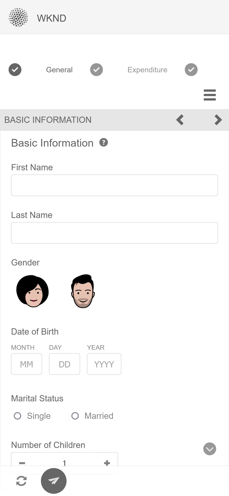

# Temas de amostra, modelos e modelos de dados de formulário nos Componentes principais {#sample-themes-templates-and-data-models}

O AEM Forms as a Cloud Service fornece exemplos de temas de referência, modelos de dados de formulário e modelos para ajudar você a começar rapidamente a criar o Forms adaptável com componentes principais. Você pode [ativar os Componentes principais adaptáveis do Forms](https://experienceleague.adobe.com/docs/experience-manager-cloud-service/content/forms/setup-configure-migrate/enable-adaptive-forms-core-components.html?lang=pt-BR) no ambiente de desenvolvimento as a Cloud Service e local do AEM Forms para obter modelos de OOTB de amostra e [usar e personalizar temas de amostra](https://experienceleague.adobe.com/docs/experience-manager-cloud-service/content/forms/adaptive-forms-authoring/authoring-adaptive-forms-core-components/create-an-adaptive-form-on-forms-cs/using-themes-in-core-components.html) in [!DNL AEM Forms].

Os exemplos de temas, modelos e modelos de dados de formulário incluídos no pacote de conteúdo de referência são:

| Modelos | Temas | Modelos de dados de formulário |
---------|----------|---------
| Básico | Tela | Microsoft® Dynamics 365 |
| Em branco | WKND | Salesforce |
| Entre em contato | Cavalete |  |
| Atualização dos detalhes de contato |   |   |
| Formulário de consentimento | |  |
| Registrar solicitação de serviço |  |  |
| Fornecer feedback |  |  |
| Inscrição em benefícios |  |   |
| Resumo de benefícios do funcionário |   |   |
| Solicitação de demonstrativo da conta |   |   |
| Formulário de inspeção de segurança |   |   |
| Inspeção de controle de qualidade |   |   |
| Solicitação de compra |  |  |

## Temas de exemplo {#Sample-Themes}

Temas de amostra de referência ajudam os autores a definir e personalizar o estilo para formulários, os autores com até mesmo um conhecimento básico de CSS podem personalizar o tema de acordo com os requisitos. Autores do formulário [ativar os Componentes principais adaptáveis do Forms](https://experienceleague.adobe.com/docs/experience-manager-cloud-service/content/forms/setup-configure-migrate/enable-adaptive-forms-core-components.html?lang=pt-BR) no ambiente de desenvolvimento as a Cloud Service e local do AEM Forms para obter esses temas descritos da seguinte maneira:

### Tela {#Canvas}

O tema da tela de desenho é o tema padrão para formulários e enfatiza o uso de cores básicas, transparência e ícones planos. Na captura de tela abaixo, você pode ver a aparência do tema da Tela.

### WKND {#WKND}

O tema da WKND incorpora um design animado, imaginativo e envolvente para mostrar uma aparência elegante para seus formulários. O tema é baseado na aparência e estilo de [Site da WKND](https://wknd.site/us/en.html) que é um site de viagem e aventura criado na [Componentes principais do Adobe Experience Manager](https://experienceleague.adobe.com/docs/experience-manager-core-components/using/introduction).

### Cavalete {#Easel}

O tema de cavalete ajuda a criar uma aparência de formulário atraente e fácil de configurar, ele é personalizado para simplicidade e facilidade de uso. O tema do cavalete é baseado no conceito em que um suporte portátil usado por artistas para suportar uma tela enquanto trabalham em suas pinturas.

## Modelos de amostra {#Sample-templates}

Os modelos definem a estrutura do formulário inicial, o conteúdo e as ações a serem replicadas no formulário ou usam uma estrutura de modelo semelhante ao formulário, por exemplo, o formulário de Consentimento, o formulário de inscrição em Benefícios e muito mais. Você pode obter os seguintes modelos ao [ativação dos Componentes principais adaptáveis do Forms](https://experienceleague.adobe.com/docs/experience-manager-cloud-service/content/forms/setup-configure-migrate/enable-adaptive-forms-core-components.html?lang=pt-BR) no ambiente de desenvolvimento as a Cloud Service ou local do AEM Forms. Os modelos de amostra nos Componentes principais do Adaptive Forms são:

### Básico {#Basic}

O modelo básico ajuda a criar rapidamente um formulário de experiência de inscrição. Também é possível usá-lo para visualizar a funcionalidade do [Componentes principais adaptáveis do Forms](https://experienceleague.adobe.com/docs/experience-manager-core-components/using/adaptive-forms/introduction). Ele fornece um layout de assistente para a apresentação de dados seção a seção.

>[!BEGINTABS]

>[!TAB Desktop]

>[!TAB Telefone]

>[!TAB Tablet]

>[!ENDTABS]

### Em branco {#Blank}

Um modelo de tela em branco é usado para criar uma estrutura de formulário adaptável, conteúdo e regras do zero. Nenhum componente de formulário é pré-incorporado no modelo em branco.

### Entre em contato {#Contact-Us}

O modelo de formulário Fale conosco é usado para criar um formulário para facilitar a comunicação entre visitantes e administradores do site. Os usuários podem enviar consultas, feedback ou solicitações de suporte por meio do formulário.

### Atualização de detalhes de contato {#Contact-Details-Update}

Os autores do modelo de atualização de detalhes de contato ajudam a criar um formulário para atualização de endereço e detalhes de contato dos clientes. O formulário também auxilia os clientes na atualização de informações pessoais relacionadas a assinaturas ou benefícios para garantir comunicação contínua e acesso ininterrupto aos serviços ou benefícios.

### Formulário de consentimento {#Consent-Form}

O modelo de formulário de consentimento é usado para criar um formulário para obter um documento legal dos participantes que participam de uma atividade específica, estudo de pesquisa, procedimento médico ou qualquer situação em que suas informações pessoais ou direitos possam estar envolvidos. O formulário garante a transparência, protege os direitos do participante e estabelece uma compreensão clara do que o indivíduo está concordando.

### Solicitação de serviço de log {#Log-Service-Request}

O modelo de solicitação de serviço de log ajuda a criar um formulário que solicita serviços de log específicos de um provedor de serviços. O formulário serve como uma solicitação formal para criar um ticket para que determinados eventos, atividades ou dados sejam registrados para status de monitoramento ou rastreamento.

### Fornecer Feedback {#Give-Feedback}

Fornecer o modelo de formulário de feedback ajuda a criar um formulário para fornecer feedback construtivo a outra pessoa ou equipe. O formulário ajuda a garantir que o feedback seja claro, específico e acionável, promovendo a comunicação aberta e o aprimoramento.

### Inscrição em Benefícios {#Benefits-Enrollment}

O modelo de formulário de inscrição de benefícios é usado para criar um formulário para coletar informações essenciais de seus funcionários sobre seus benefícios preferidos e opções de cobertura. Normalmente, acompanha o período anual de inscrição de benefícios.

### Resumo dos Benefícios do Funcionário {#Employee-Benefits-Summary}

O modelo de formulário de resumo de benefícios do funcionário é usado para criar um formulário para reunir detalhes essenciais sobre os benefícios de um indivíduo. Ele ajuda a avaliar a cobertura de forma rápida e precisa, fornecendo uma visão geral abrangente para assistência e suporte eficientes.

### Solicitação de Extrato de Conta {#Request-for-Account-Statement}

O modelo de solicitação de demonstrativo de conta ajuda a criar um formulário que inicia o processo de obtenção de um demonstrativo preciso e atualizado dos clientes. O demonstrativo fornece um registro detalhado de transações financeiras, atividades ou outras informações relevantes sobre clientes que usam este formulário.

### Inspeção de segurança {#Safety-Inspection}

O modelo de formulário de inspeção de segurança ajuda a criar um formulário para inserir detalhes de um ambiente de trabalho seguro. Através da realização de inspeções regulares utilizando esta forma, podem ser identificados potenciais perigos. O formulário abrange vários aspectos, como saídas de emergência, segurança contra incêndio, segurança elétrica, materiais perigosos, equipamento de proteção individual, ergonomia de estação de trabalho para a segurança e o bem-estar de funcionários, visitantes e clientes.

### Inspeção de Controle de Qualidade {#Quality-Control-Inspection}

O modelo de formulário de inspeção de controle de qualidade é usado para criar um formulário para avaliar e documentar a aparência visual, as dimensões, a funcionalidade, a documentação, os resultados de testes e a qualidade geral de um produto ou item. Ajuda a identificar defeitos, não-conformidades e ações corretivas necessárias para garantir a adesão aos padrões de qualidade.

### Solicitação de compra {#Purchase-Request}

O modelo de formulário de solicitação de compra ajuda a criar um formulário para iniciar o processo de aquisição e permite que os funcionários solicitem formalmente a compra de mercadorias ou serviços necessários para seu trabalho. O formulário captura detalhes essenciais como descrição do item, quantidade, fornecedor preferido (se aplicável), alocação de orçamento, justificativa para compra, informações de distribuição e aprovações necessárias.

## Modelos de dados do formulário de referência {#reference-models}

Depois de criar uma [Formulário adaptável](https://experienceleague.adobe.com/docs/experience-manager-core-components/using/adaptive-forms/introduction.html?lang=en#adaptive-forms-core-components) baseado em [Componente principal](https://experienceleague.adobe.com/docs/experience-manager-core-components/using/adaptive-forms/introduction.html?lang=en#adaptive-forms-core-components), você pode conectar o back-end do seu formulário com os servidores de banco de dados Microsoft® Dynamics 365 e Salesforce para habilitar fluxos de trabalho de negócios. Por exemplo:

* Grave dados no Microsoft® Dynamics 365 e Salesforce no envio do Formulário adaptável.
* Grave dados no Microsoft® Dynamics 365 e Salesforce por meio de entidades personalizadas definidas no Modelo de dados de formulário e vice-versa.
* Consulte o servidor Microsoft® Dynamics 365 e Salesforce para obter dados e preencher previamente o Forms adaptável.
* Ler dados do servidor Microsoft® Dynamics 365 e Salesforce.

Você pode obter os seguintes Modelos de dados de formulário instalando o [Pacote de conteúdo de referência](https://experience.adobe.com/#/downloads/content/software-distribution/en/aemcloud.html?package=/content/software-distribution/en/details.html/content/dam/aemcloud/public/aem-forms-reference-content.ui.content-2.1.0.zip):

* Microsoft® Dynamics 365
* Salesforce

Para obter informações sobre como usar esses modelos, consulte [Configurar os serviços em nuvem do Microsoft® Dynamics 365 e Salesforce](https://experienceleague.adobe.com/docs/experience-manager-cloud-service/content/forms/integrate/use-form-data-model/configure-msdynamics-salesforce.html?lang=en#configure-dynamics-cloud-service)
