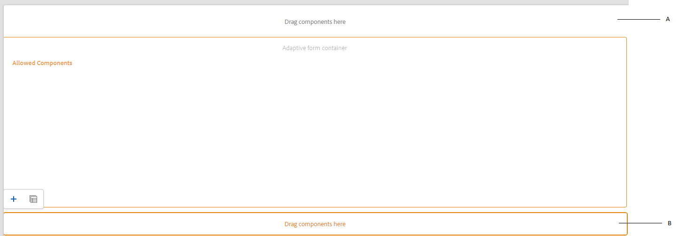

# Criar um modelo de formulário adaptável {#adaptive-form-templates}

>[!NOTE]
>
> A Adobe recomenda usar os [Componentes principais](https://experienceleague.adobe.com/docs/experience-manager-core-components/using/adaptive-forms/introduction.html?lang=pt-BR) de captura de dados moderna e extensível para [criar um novo Forms Adaptável](/help/forms/creating-adaptive-form-core-components.md) ou [adicionar o Forms Adaptável às páginas do AEM Sites](/help/forms/create-or-add-an-adaptive-form-to-aem-sites-page.md). Esses componentes representam um avanço significativo na criação do Forms adaptável, garantindo experiências de usuário impressionantes. Este artigo descreve a abordagem mais antiga para criar o Forms adaptável usando componentes de base.

| Versão | Link do artigo |
| -------- | ---------------------------- |
| AEM 6.5 | [Clique aqui](https://experienceleague.adobe.com/docs/experience-manager-65/forms/adaptive-forms-advanced-authoring/template-editor.html) |
| AEM as a Cloud Service | Este artigo |

Ao criar um formulário, você adiciona campos e componentes para definir a estrutura do formulário, o conteúdo e as ações no editor. Você adiciona campos e componentes no `guideRootPanel` do contêiner de formulário. Com o Editor de modelos, você pode criar um modelo que contenha estrutura básica e conteúdo inicial que os autores possam usar para criar formulários.

Por exemplo, você deseja que todos os autores de formulários tenham determinadas caixas de texto, botões de navegação e um botão de envio em um formulário de inscrição. Você pode criar um modelo com os componentes que os autores podem usar para criar um formulário consistente com outros formulários de inscrição. Quando os autores usam o modelo para criar um Formulário adaptável, o novo formulário herda a estrutura e os componentes especificados no modelo. O Editor de modelos permite:

* Adicione componentes de cabeçalho e rodapé de um formulário na camada da estrutura.
* Forneça o conteúdo inicial para o formulário.
* Especifique um tema, Enviar ações.

Você pode baixar e instalar o pacote de conteúdo de referência [!DNL AEM Forms] do portal [Distribuição de Software](https://experience.adobe.com/#/downloads/content/software-distribution/en/aemcloud.html) para importar temas de referência e modelos para o seu ambiente.

## Trabalhar com modelos {#working-with-templates}

Você pode acessar o editor de modelos no menu Ferramentas navegando até **[!UICONTROL Adobe Experience Manager]** > **[!UICONTROL Ferramentas]** > **[!UICONTROL Geral]** > **[!UICONTROL Modelos]**. Aqui, os modelos são organizados em pastas ativadas para modelos editáveis.

O Experience Manager fornece uma pasta global para organizar modelos. No entanto, não está ativado por padrão. Você pode solicitar que o administrador ative a pasta global ou crie uma pasta para modelos. Para obter mais informações sobre como criar pastas, consulte [Pastas de Modelo](https://experienceleague.adobe.com/docs/experience-manager-cloud-service/sites/authoring/features/templates.html#editing-templates-template-authors).

### Criação de um modelo {#create-template}

Após criar uma pasta, abra-a e execute as seguintes etapas para criar um template:

1. Selecione **[!UICONTROL Criar]** dentro da pasta que você criou.
1. Na seção Escolha um tipo de modelo, selecione **[!UICONTROL Modelo de formulário adaptável]** e selecione **[!UICONTROL Avançar]**.

1. Na seção Detalhes do Modelo, forneça um Título de Modelo e selecione **[!UICONTROL Criar]**.
Você também pode fornecer uma descrição.

1. Selecione **[!UICONTROL Concluído]** para retornar ao console ou **[!UICONTROL Abrir]** para abrir o modelo no editor.

### Interface do editor de modelos {#template-editor-ui}

Ao abrir um modelo para edição, você pode ver os seguintes componentes do Editor do AEM:

* **Barra de ferramentas da página**
Contém as seguintes opções:

   * **Alternar Painel Lateral**: Permite mostrar ou ocultar a barra lateral.
   * **Informações da página**: permite especificar informações como hora de publicação/cancelamento de publicação, miniaturas, bibliotecas do lado do cliente, política da página e biblioteca do lado do cliente de design da página.
     <!-- * **Emulator**: Lets you simulate and customize the look for different devices.-->
   * **Seletor de modo:** permite alterar o modo. Você pode escolher o modo **[!UICONTROL Estrutura]**, **[!UICONTROL Conteúdo Inicial]**, **[!UICONTROL Controle de Layout]**. O modo Estrutura permite adicionar e personalizar o cabeçalho e o rodapé. O modo Conteúdo inicial permite personalizar o conteúdo do formulário.
   * **Visualizar:** permite que você visualize a aparência do modelo ao publicá-lo. Você pode usar o Seletor de camada e a Visualização para alternar entre os modos de edição e visualização.
* **Barra Lateral:** fornece os navegadores de Conteúdo, Propriedades, Assets e Componentes.
* **Barra de ferramentas do componente:** ao selecionar um componente, você verá uma barra de ferramentas que permite personalizar o componente.
* **Página**: a área onde você adiciona conteúdo para criar o modelo.

<!-- See [Introduction to authoring Adaptive Forms](introduction-forms-authoring.md) to understand the Touch UI editor. -->

### Edição de um modelo {#editing-a-template}

Um modelo de formulário adaptável é criado usando duas camadas:

* Estrutura
* Conteúdo inicial

O seletor de camadas está disponível ao lado da opção Visualizar, no canto superior direito da tela.

### Estrutura {#structure}

Ao selecionar a camada de estrutura no Editor de modelo, você pode ver os contêineres de layout acima e abaixo do Contêiner de formulário adaptável. Os autores podem usar esses containers de layout para cabeçalho e rodapé. É possível adicionar, editar ou personalizar o cabeçalho e o rodapé. Arraste e solte o componente Cabeçalho do formulário adaptável no contêiner de layout acima do Contêiner de formulário adaptável para personalizar o cabeçalho do modelo. Arraste e solte o componente Rodapé do formulário adaptável no contêiner de layout abaixo do Contêiner de formulário adaptável para personalizar o rodapé do modelo.

Contêineres de layout na camada da estrutura

**A.** Contêiner de layout do componente de cabeçalho **B.** Contêiner de layout do componente de rodapé

Arraste e solte o componente Cabeçalho do formulário adaptável no contêiner de layout acima do Contêiner de formulário adaptável. Após adicionar o componente, é possível especificar suas propriedades, que permitem adicionar um logotipo e fornecer seu título.

Da mesma forma, ao arrastar e soltar o componente de rodapé no contêiner de layout abaixo do Contêiner de formulário adaptável, você pode fornecer as informações de direitos autorais e os detalhes da empresa.

Cabeçalho e rodapé adicionados à camada Estrutura

#### Bloquear/desbloquear componentes na camada da estrutura {#locking-unlocking-components-in-the-structure-layer}

Ao editar o modelo com a camada de estrutura selecionada, é possível desbloquear o cabeçalho e o rodapé do modelo. Se um componente estiver desbloqueado no modelo, os autores do formulário poderão editar o componente no Formulário adaptável que usa o modelo. Bloquear um componente impede que os autores do formulário o editem no Formulário adaptável. A opção Bloquear está disponível na barra de ferramentas do componente.

Por exemplo, você adiciona o componente de cabeçalho no modelo. Ao selecionar o componente, você pode ver uma opção de bloqueio na barra de ferramentas do componente. Normalmente, o cabeçalho inclui o nome da empresa e o logotipo, e você não deseja que os autores de formulários alterem o logotipo e o cabeçalho em um modelo. Em um formulário adaptável criado usando o modelo com o componente de cabeçalho bloqueado, os autores de formulário não podem alterar o logotipo e o nome da empresa.

>[!NOTE]
>
>Não é recomendado bloquear ou desbloquear a imagem ou o logotipo no componente de cabeçalho, individualmente. Você pode desbloquear o componente de cabeçalho.

### Conteúdo inicial {#initial-content}

Quando a opção Conteúdo inicial estiver selecionada, o Contêiner de formulário adaptável do modelo será aberto como um Formulário adaptável para edição. Assim como a criação de um Formulário adaptável, você pode especificar configurações iniciais, como selecionar um tema e Enviar ações.

Os autores de formulários o usam como base para criar um formulário. A estrutura do fluxo de conteúdo é especificada na camada Conteúdo inicial do modelo. Para alternar para a edição do conteúdo inicial do modelo de formulário, antes de Visualizar na barra de ferramentas da página, selecione  **>** **[!UICONTROL Conteúdo inicial]**.

Na camada Conteúdo inicial, crie o modelo de Formulário adaptável que seus autores usam como base. A criação de um modelo é semelhante à criação de um formulário. As opções disponíveis na Barra lateral são usadas. A barra lateral fornece conteúdo, propriedades, ativos e componentes nos navegadores.

<!-- See [Sidebar](introduction-forms-authoring.md#sidebar). -->

>[!NOTE]
>
>Ao selecionar Armazenar conteúdo ou Armazenar PDF como a Ação enviar, você obtém uma opção para especificar o Caminho de armazenamento. Se você especificar o caminho no modelo, todos os formulários criados a partir dele terão o mesmo caminho. Você pode especificar o caminho de armazenamento correto ou garantir que os autores do formulário o atualizem para impedir que os dados de cada formulário sejam armazenados no mesmo local.

#### Criação de um modelo de formulário adaptável com guias e painéis {#creating-an-adaptive-form-template-with-tabs-and-panels-nbsp}

Por exemplo, você deseja criar um modelo com as seguintes guias:

* Informações gerais
* Informações profissionais

Você adicionou um logotipo, forneceu um título e adicionou um rodapé na camada da estrutura. Bloqueie o cabeçalho e o rodapé para impedir que os autores dos formulários o editem quando usarem o modelo para criar formulários.

Altere a camada de Estrutura para Conteúdo inicial e comece a adicionar conteúdo ao formulário. Para criar uma estrutura com guias, adicione um Painel filho no guideRootPanel do contêiner de Formulário adaptável. Para adicionar um painel:

* Você pode adicionar um painel tocando no botão **[!UICONTROL +]** ao selecionar a opção **[!UICONTROL Arraste componentes aqui]**.

* Você pode arrastar e soltar o componente Painel do navegador de componentes na barra lateral.
* Você pode adicionar um painel filho de `guideRootPanel` na barra de ferramentas do componente.

Para criar as guias Informações Gerais e Informações Profissionais, adicione dois painéis no painel filho do `guideRootPanel`. Selecione os painéis e selecione  para abrir as propriedades na barra lateral. Altere os nomes dos elementos como `general-info` e `professional-info`, e os títulos como Informações Gerais e Informações Profissionais, respectivamente. Na barra lateral, selecione conteúdo para abrir o navegador de conteúdo. Na guia Objetos de Formulário, selecione `guideRootPanel`. No editor, o guideRootPanel é selecionado. Selecione  na barra de ferramentas do componente para abrir suas propriedades. No campo Layout do Painel, selecione **[!UICONTROL Guias na Parte Superior]** e selecione **[!UICONTROL Concluído]**. A estrutura do modelo com guias é aplicada.

#### Adição de conteúdo em guias {#adding-content-in-tabs}

Depois de adicionar painéis e estruturá-los como guias, é possível adicionar campos dentro das guias. Ao selecionar uma guia no editor, você pode ver a opção **[!UICONTROL Arraste componentes aqui]**. Você pode arrastar e soltar componentes como caixas de texto, itens de lista e botões. Você pode arrastar e soltar componentes do navegador de componentes na barra lateral.

Cada componente tem propriedades que aprimoram a captura e a manipulação de dados. Por exemplo, você pode habilitar a propriedade **[!UICONTROL Campo obrigatório]** de um componente. Os autores podem especificar uma mensagem que os clientes veem quando ignoram o preenchimento de um campo obrigatório. Especifique a mensagem na propriedade **[!UICONTROL Mensagem de Campo Necessária]**.

No modelo de exemplo, os campos Name, Phone number e Date of birth são adicionados na guia General Information. Na guia Informações Profissionais, Atualmente empregado, são adicionados os campos Tipo de emprego, Qualificação educacional.

Após adicionar campos, é possível adicionar botões como Enviar e Redefinir.

### Habilitação do modelo {#enabling-the-template}

Ao criar um modelo, ele é adicionado como um rascunho. Ative o modelo para usá-lo na criação do Forms adaptável. Para ativar um modelo:

1. Navegue até **[!UICONTROL Adobe Experience Manager]** > **[!UICONTROL Ferramentas]** > **[!UICONTROL Modelos]** e abra a pasta na qual você criou o modelo.

1. O modelo criado está marcado como Rascunho.
1. Selecione o modelo e selecione **[!UICONTROL Habilitar]** na barra de ferramentas.
Ao criar um Formulário adaptável, você pode ver o modelo listado quando é solicitado a escolher um modelo.

## Importação ou exportação de um template {#importing-or-exporting-a-template}

Um formulário funciona com seu modelo. Ao baixar um Formulário adaptável criado usando um modelo personalizado, o modelo não é baixado. Quando você importa o formulário em uma instância do [!DNL AEM Forms] diferente, ele é importado sem seu modelo. Se um formulário for importado, mas seu template não estiver disponível, o formulário não será renderizado. Você pode empacotar o modelo personalizado do nó `/conf` em `https://<server>:<port>/crx/packmgr` e colocá-lo na porta na instância [!DNL AEM Forms] para onde deseja carregar o formulário. Você também pode [Criar um modelo usando o AEM Architect e implantá-lo na sua instância do Cloud Services](https://experienceleague.adobe.com/docs/experience-manager-learn/getting-started-wknd-tutorial-develop/pages-templates.html#prerequisites).

>[!NOTE]
>
> * Você também pode configurar o modelo [!UICONTROL Documento de registro] diretamente do Construtor de formulários adaptáveis ou do Construtor de modelos de formulários adaptáveis. Para obter mais informações, consulte [Gerar documento de registro para Forms adaptável](/help/forms/generate-document-of-record-for-non-xfa-based-adaptive-forms.md#document-of-record-support-in-adaptive-form-editor-dor-support-in-adaptiveform).

## Associar um esquema do modelo de dados de formulário a um modelo {#associating-form-data-model-schema-in-template}

Os autores podem associar um [!UICONTROL Esquema de modelo de dados de formulário] a um modelo de formulário adaptável no editor de modelos. Ele permite que os autores selecionem um esquema no editor de modelos. Quando você associa um esquema a um modelo e um autor de formulário cria um formulário com base no modelo, o esquema é pré-selecionado para o formulário. Ele ajuda os autores de formulários a regular o uso do esquema e também economiza tempo para o autor de formulários. Para selecionar um esquema de modelo de dados de formulário no editor de modelo:

1. Selecione o **[!UICONTROL Navegador de Conteúdo]**, localizado no lado esquerdo.
1. Vá para o contêiner de formulário **[!UICONTROL Configuração]**.
1. Selecione **[!UICONTROL Modelo de Dados]**.
1. Escolha seu modelo de dados de formulário por meio de **[!UICONTROL Selecione Modelo de Dados de Formulário]** e salve a configuração.

## Criação de um formulário adaptável usando o modelo {#creating-an-adaptive-form-using-the-template}

Depois de criar e ativar um modelo, ele fica disponível no gerenciador de formulários quando você cria um Formulário adaptável. Para usar um modelo e criar um Formulário adaptável, consulte [Criando um Formulário adaptável](creating-adaptive-form.md).

<!--
## Change display option of out of the box templates  {#change-display-option-of-out-of-the-box-templates}

You can create custom templates for Adaptive Forms to define basic structure and initial content. [!DNL AEM Forms] also provides a set of out of the box template for Adaptive Forms. You can choose to show or hide the templates.

Perform the following steps to show and hide templates:

1. Log in to [!DNL AEM Forms] author instance and navigate to **[!UICONTROL Tools]** &gt; **[!UICONTROL Operations]** &gt; **[!UICONTROL Web Console]**.

   >[!NOTE]
   >
   >The URL of AEM web console is https://'[server]:[port]'/system/console/configMgr

1. Locate and open the **FormsManager Configuration** settings:

    * To show or hide out of the box Adaptive Forms template, check or uncheck the **Include Out of the box AF and AD Templates** option.
    * To show or hide out of the box Adaptive Form templates that were added in AEM 6.0 Forms or AEM 6.1 Forms releases but are now deprecated, check or uncheck the **Include AEM 6.0 AF Templates** option. If this option is checked, and you want it to take effect, it requires the **Include Out of the box AF and AD Templates** configuration to be enabled.

1. Click **Save**. The display options for the out of the box templates are changed. -->

## Salvar um formulário adaptável como modelo {#saving-adaptive-form-as-template}

Você também pode salvar um Formulário adaptável como um modelo para uso futuro. Para salvar um formulário adaptável como modelo:

1. Selecione um formulário adaptável para salvá-lo como modelo.
1. Clique em **[!UICONTROL Salvar como Modelo]**. Uma caixa de diálogo é exibida.
1. Especifique **[!UICONTROL Título]** (campo obrigatório), **[!UICONTROL Local]** (campo obrigatório) e **[!UICONTROL Descrição]** (campo opcional) para o modelo.
1. Clique em **[!UICONTROL Criar]**.

   

>[!NOTE]
>
>Para usar a mesma política de contêiner do formulário adaptável de origem, é recomendável salvar o modelo na mesma pasta do formulário adaptável de origem. Caso o modelo seja salvo em qualquer outra pasta, o modelo criado usará uma política de contêiner padrão.

## Recomendações {#recommendations}

* Ao modificar as propriedades do formulário no editor de modelo, não use a propriedade BindReference.
* Caso queira adicionar um ponto de interrupção, crie-o ao criar um modelo de formulário adaptável.
Para obter mais informações sobre pontos de interrupção, consulte [Layout responsivo](https://experienceleague.adobe.com/docs/experience-manager-cloud-service/sites/authoring/features/responsive-layout.html#authoring).

## Consulte também {#see-also}

{{see-also}}
